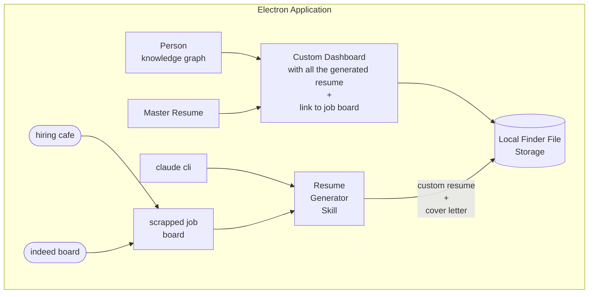

# Huntgry

## Initial Idea

Architecture converted from [`initial-idea.excalidraw`](./initial-idea.excalidraw).

```mermaid
flowchart LR
    subgraph electron["Electron Application"]
        direction LR

        kg["Person<br/>knowledge graph"]
        dashboard["Custom Dashboard<br/>with all the generated resume<br/>+<br/>link to job board"]
        master["Master Resume"]
        storage[("Local Finder File<br/>Storage")]

        cli["claude cli"]
        skill["Resume<br/>Generator<br/>Skill"]
        scraped["scrapped job<br/>board"]

        hiringcafe(["hiring cafe"])
        indeed(["indeed board"])

        kg --> dashboard
        dashboard --> storage
        master --> dashboard

        cli --> skill
        hiringcafe --> scraped
        indeed --> scraped
        scraped --> skill
        skill -- "custom resume<br/>+<br/>cover letter" --> storage
    end
```
