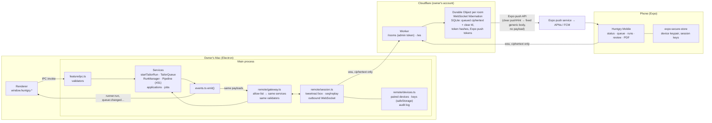
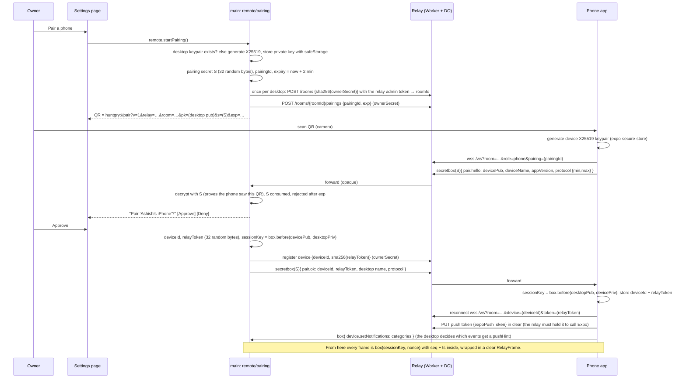
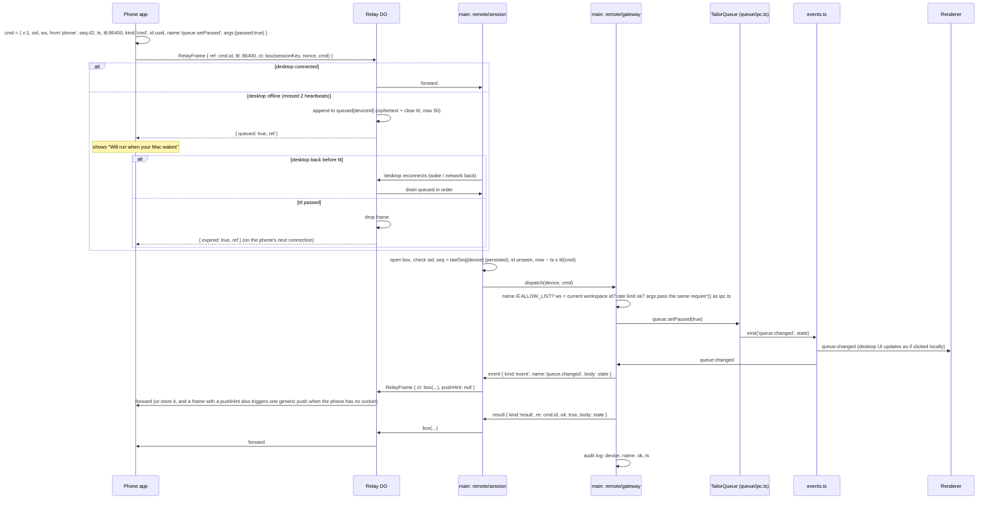

# ADR-0001: Mobile remote control through an end-to-end encrypted relay

Status: **Proposed** · Date: 2026-09-30 · Related: #31 (unattended pipeline), #21, #22, #24

**Decision outcome:** option B, a self-hosted Cloudflare Worker + Durable Object relay that
forwards and queues ciphertext, an Expo (React Native) app, and a remote gateway in Electron
main that maps a closed, versioned command list onto the existing services with the existing
validators. Pairing by QR with a one-time secret confirmed on the desktop; per-device
`tweetnacl` keys; push through Expo with generic bodies. Details in [Decision](#decision).

**Not in scope:** auto-apply or anything in the in-app browser from the phone (and nothing
remote can ever submit an application); a remote shell, free-form agent prompts or any
command that takes a path, flag or command line; multi-user or shared relays; editing the
master profile from the phone; App Store distribution.

## Context

Huntgry is a local-first Electron app. Everything that matters lives on the owner's Mac: the
workspace (`master-profile.md`, the generated `<role>/<company>/<job-id>/` folders with
`resume.pdf` / `cover.pdf`), the run history in `.huntgry/runs`, the tailoring queue in
`.huntgry/queue.json`, and the agent CLIs (`claude`, `codex`, `agy`) with their credentials.
There is no server and no account.

The owner wants to control Huntgry from their phone. With #31 the app will run tens of
tailoring jobs for hours with nobody present; the phone is where the owner will **start** a
pipeline, **watch** it (running / waiting for a usage limit / done), **answer** a run that
stopped with a question, **approve or re-run** an *Unreviewed* result, **add** a job they saw
on the go, and **glance at a PDF**. The desktop must send the phone status, "needs your
reply", "usage limit, paused until 14:05", "pipeline finished" and "needs review", as push
notifications when the app is in the background.

Three facts about the existing code shape the design:

- **Every feature already has one entry point in main.** The renderer calls
  `window.huntgry.<feature>.*` (typed in `src/shared/<feature>-types.ts`, built in
  `src/preload/<feature>.ts`), and `src/main/<feature>/ipc.ts` validates the arguments and
  calls a service (`startTailorRun`, `TailorQueue`, `RunManager`, `ApplyService`). Main
  builds every path and command; the renderer sends ids and form fields. Main → renderer
  events are typed in `src/shared/events.ts` and allow-listed in preload. A phone must be a
  **second caller of the same services with the same validators**, never a new back door.
- **Safety rules are enforced in main, not in the UI.** Runs are sandboxed with no network
  (#8), the queue caps concurrency (#21), and #24 has a hard rule with a guard test:
  *Huntgry never submits an application*. A remote client must not be able to widen any of
  this.
- **The laptop sleeps.** #31 keeps the Mac awake with `powerSaveBlocker` only while a
  pipeline has work; the rest of the time the lid is closed and the app is unreachable. The
  phone app, in turn, is suspended by iOS seconds after it goes to the background, so it
  cannot hold a socket open; only a push notification reaches it then.

### Prior art (what we reuse, what we build)

| Product | Model | Reuse | Do not reuse |
| --- | --- | --- | --- |
| [Happy](https://happy.engineering/) ([repo](https://github.com/slopus/happy), MIT) | A CLI wraps `claude`/`codex`; a relay server passes **encrypted blobs**; an Expo app decrypts. Keys are created on the phone; NaCl secretbox, newer records AES-256-GCM per record; push through Expo. | The three-part shape (desktop ↔ relay of ciphertext ↔ Expo app), "the server protects its infra, not your data", Expo push. Two published flaws are lessons: [#1829](https://github.com/slopus/happy/issues/1829) (the QR's public key was treated as an authenticator, so anyone who saw the QR got a permanent token: the fix is a short-lived pairing secret, single use, and an approval step on the desktop) and [#680](https://github.com/slopus/happy/discussions/680) (API keys were only server-side encrypted while the product claimed E2E: everything we relay must be E2E, no exceptions). | `happy-server` itself: it models Claude Code sessions, accounts, machines and S3 attachments. Our domain is queue items, runs and applications; a purpose-built relay is a few hundred lines. |
| [Claude Code Remote Control](https://code.claude.com/docs/en/remote-control) | `claude --remote-control` / `claude remote-control` registers an **interactive** session with claude.ai; the Claude app is a window into it; only messages flow through an encrypted bridge; the machine must stay on; it reconnects after sleep. Pro/Max/Team/Enterprise only, no API keys, no `-p`. | The product model and its wording: the phone is a window, the laptop stays the source of truth, sessions reconnect after sleep. | The transport. It controls a Claude *conversation*, not Huntgry's queue, pipeline, review screen or PDFs, and Huntgry runs agents headless (`claude -p --setting-sources ""`, Codex, agy), which Remote Control does not cover. |
| [Orca](https://www.onorca.dev/docs/mobile) mobile companion, [remote servers](https://www.onorca.dev/docs/remote-servers), `orca serve --mobile-pairing` (checked locally, v1.4.x) | Desktop shows a one-time pairing code / QR (expires in minutes); each phone gets its own revocable device token; the desktop is the source of truth; transports: Orca Relay (sign-in), LAN, Tailscale. Docs warn never to forward the runtime port to the public internet. | The pairing UX (QR, minutes-long expiry, per-device revocable token, approve on desktop), push mirroring desktop notifications, "desktop is the source of truth". | The client: it is Orca-specific (worktrees, terminals, git). Three transports is more than a one-owner app needs. |
| [VS Code Remote Tunnels](https://code.visualstudio.com/docs/remote/tunnels) / dev tunnels | The machine makes an **outbound** connection to a relay, opens no listener; both ends authenticate with the same GitHub/Microsoft account. Dev tunnels are also a documented ["accidental C2"](https://specterops.io/blog/2026/05/06/dev-tunnels-the-accidental-c2/) vector. | Outbound-only from the laptop. | Account-based auth (we have no accounts) and the "anything over the tunnel" model: our relay carries an allow-listed command set, never a shell. |
| [Omnara](https://pypi.org/project/omnara/) | API server + Postgres store agent messages in clear; push/email/SMS; "headless" and "server" modes. | Nothing. | Plaintext on a server. |

## Decision drivers

1. **Nothing sensitive leaves the laptop in clear.** The master profile and the PDFs are
   personal data. Profile content leaves only encrypted, and only inside things the owner
   asks the phone for (a run's transcript, a PDF); the raw `master-profile.md`, workspace
   paths and agent credentials never leave. The relay must see only ciphertext, sizes,
   timing and the minimum it needs to push. The owner should be able to run the relay in
   their own account.
2. **Works when the laptop is asleep and when the phone is in the background.** "Desktop
   offline" must be visible, commands sent meanwhile must not be lost, and events must reach
   the phone as push notifications.
3. **Same rules as the desktop UI.** A remote command maps onto an existing service call with
   the existing validation; the command set is a closed list; #24's "never submit" and #8's
   run sandbox are untouched.
4. **Cheap and low-ops for one person.** Target $0/month for the relay, one deploy command,
   no database to babysit.
5. **Code sharing with the TypeScript/React codebase**: the message schema and validators
   are written once, in `src/shared`, and used by main, the phone and the relay.
6. **Pairing that survives a leaked QR.** A screenshot of the QR must not be enough to take
   over the desktop later.

## Considered options

### Connectivity

| Option | Sleep / offline | Push to a backgrounded phone | E2E possible | Cost | Ops | Verdict |
| --- | --- | --- | --- | --- | --- | --- |
| **A. LAN server in main + QR pairing** (Bonjour) | Nothing while asleep; nothing away from home | No (no server to send APNs) | Yes | $0 | None | Not enough alone: the owner wants to check from anywhere. Possible later as a fast path (open question 5). |
| **B. Self-hosted relay: Cloudflare Worker + Durable Object** (one DO per pairing, WebSocket Hibernation, SQLite storage) | Relay stores queued commands/events while either side is offline | Yes: the DO calls the Expo push API | Yes (relay forwards opaque bytes) | Workers Free: 100k requests/day, hibernated DOs are not billed for duration; Paid $5/mo if ever exceeded ([DO pricing](https://developers.cloudflare.com/durable-objects/platform/pricing), [Workers pricing](https://developers.cloudflare.com/workers/platform/pricing/)) | `wrangler deploy`, no server, no DB | **Recommended.** |
| **C. Small Node relay on Fly / Render** | Same as B (in-process store + SQLite file) | Yes | Yes | ≈ $2/mo for the smallest Fly Machine ([Fly pricing](https://docs.fly.io/about/pricing/)) plus a volume | Always-on process, restarts, TLS host | Fallback if the owner prefers plain Node; same protocol, so it can replace B without touching the clients. |
| **D. Tunnels: Tailscale Serve, Cloudflare Tunnel, ngrok** in front of a WebSocket server in main | The laptop *is* the server: asleep = connection refused, no queueing | No (no server-side push sender) | Yes | Tailscale Personal is free ([plan](https://tailscale.com/kb/1311/personal-plan)); Cloudflare Tunnel is free but needs a domain on Cloudflare; ngrok Free is 1 GB/month and 20k requests ([limits](https://ngrok.com/docs/pricing-limits/free-plan-limits)) | A VPN app on the phone (Tailscale) or a daemon on the Mac | Strong identity and no relay code, but no store-and-forward and no push. Rejected for MVP; Tailscale remains a good *transport* for option A. |
| **E. Managed realtime: Supabase Realtime, Firebase RTDB/Firestore, Ably, Pusher** | Needs a store next to the pub/sub (their DB) | Needs their functions or a server to call APNs | Yes, but every SDK, key and rule set is one more thing to reason about | Free tiers are ample (Supabase 200 conns / 2M msgs, Ably 6M msgs, Pusher 200k msgs/day, Firebase RTDB 100 conns) but Supabase free projects **pause after a week idle** ([Supabase](https://www.jetadmin.io/blog/supabase-pricing-2026-guide-to-plans-limits-and-real-world-costs/), [Ably](https://ably.com/docs/pricing), [Pusher](https://ably.com/compare/ably-vs-pusher/pricing), [Firebase](https://firebase.google.com/pricing)) | Account, project, auth rules | Rejected: more moving parts than B for the same result, and vendor auth models fight the "no accounts" goal. |
| **F. WebRTC data channel + signaling** | Peer link dies with either side; still needs a signaling server, plus TURN for the 15–20 % of NATs that cannot connect directly ([overview](https://blogs.videosdk.live/webrtc-react-native)) | No | Yes (DTLS) | Signaling + TURN | Native module (`react-native-webrtc`, dev client) | Rejected: everything B needs plus NAT traversal, for a link iOS drops in the background anyway. |

### Mobile app

| Option | Push | Code sharing | Distribution | Verdict |
| --- | --- | --- | --- | --- |
| **React Native + Expo** (dev client, `expo-notifications`) | APNs/FCM through the free Expo push service (600/s per project, no per-message cost; [FAQ](https://docs.expo.dev/push-notifications/faq/)) | TypeScript, React, the shared protocol package; Expo has first-class npm-workspaces monorepo support since SDK 52 ([monorepos](https://docs.expo.dev/guides/monorepos/)) | Local `expo run:ios --device` with a free Apple ID works for development without push (7-day profiles). **iOS push needs the paid $99/yr Developer Program**: Expo's [setup guide](https://docs.expo.dev/push-notifications/push-notifications-setup/) requires a paid Apple Developer account to create the APNs credentials the Expo push service uses, and a free Apple ID cannot provision the push entitlement. TestFlight and Ad Hoc need the program too. EAS Build Free gives 15 iOS + 15 Android builds/month ([EAS pricing](https://expo.dev/pricing)) | **Recommended**, with the Developer Program as a prerequisite for the push part of the MVP (Phase 2). |
| **PWA** | iOS Web Push only for a Home Screen-installed app, no install prompt, subscriptions reported to vanish ([iOS PWA limits](https://www.magicbell.com/blog/pwa-ios-limitations-safari-support-complete-guide)) | Same React code | No store, no signing | Fallback if the owner refuses the $99/yr. Push reliability is the risk. |
| **Native Swift** | APNs directly | None | Same as Expo | Rejected: no sharing with a TypeScript codebase. |

### Crypto library

`tweetnacl` (pure JS, audited, used by Happy; runs in Node, Electron main and Expo Go
without native modules) on both ends for the MVP. `libsodium` (`sodium-native` in main,
[`react-native-libsodium`](https://github.com/serenity-kit/react-native-libsodium) in the app,
dev client required) is the upgrade if message volume ever makes JS crypto a cost. Both expose
the same primitives (X25519 + XSalsa20-Poly1305 `box`, `secretbox`), so the protocol does not
change.

## Decision

**Build a small self-hosted relay (Cloudflare Worker + Durable Object) that forwards and
queues opaque ciphertext between the desktop and each paired phone, an Expo (React Native)
app, and a "remote gateway" in Electron main that translates an allow-listed, versioned
command set onto the existing feature services.** The desktop makes only outbound
connections. Pairing is a QR with a one-time secret, confirmed on the desktop. Every message
is end-to-end encrypted per device with `tweetnacl` boxes; the relay sees only ciphertext,
sizes, timing, the phone's Expo push token, and a clear notification category on the event
frames that should wake the phone. Push notifications carry no job or company names unless
the owner turns that on. Auto-apply and Settings-level actions (installs, workspace
switch, profile edits) are not remote-controllable, and nothing remote can submit an
application.

Why B over C and D: the DO gives store-and-forward, per-pairing isolation and a push sender
for $0 with no process to keep alive; a Node relay is the same protocol with more ops; tunnels
give neither queueing nor push. Why a purpose-built relay over Happy's server: our messages
are queue states, run summaries and review decisions, not Claude sessions, and the relay is
under 500 lines when it only moves bytes.

## Architecture

### Components



The gateway is a second consumer of the same `emit()` stream the renderer gets
(`src/main/events.ts` grows an `onEvent(listener)` next to `emit`), and a second caller of the
same functions `ipc.ts` files call. It lives in `src/main/remote/` and follows the per-feature
pattern: `src/shared/remote-types.ts` (`RemoteApi` for the Settings page: start/cancel
pairing, list devices, revoke, relay URL, notification detail toggle), `src/preload/remote.ts`,
`src/main/remote/ipc.ts`, plus `remote:state` in `EVENT_CHANNELS`.

### Pairing



Design points that answer Happy #1829: the QR carries a **secret** that is consumed by the
first `pair.hello`, expires in two minutes, and the desktop still asks the owner to approve
the named device. A screenshot of the QR taken after pairing is worthless; one taken before
gives an attacker at most a pairing prompt the owner declines.

### One command round trip (phone pauses the queue)



### Repository layout

```
huntgry/                      # root package.json gains "workspaces"; pnpm-workspace.yaml gains "packages:"
├── src/shared/remote/        # protocol.ts (schema, versions), guards.ts (runtime checks),
│   │                         # crypto.ts (box/secretbox helpers over tweetnacl), package.json
│   │                         # ("@huntgry/remote-protocol") so Metro resolves it as a workspace package
│   └── …                     # standalone: imports only files in this folder and `tweetnacl` (guard test, like #24's);
│                             # every wire type is defined here, the desktop maps its own types onto them
├── src/shared/remote-types.ts   # RemoteApi + channels for the Settings page (Electron only)
├── src/main/remote/          # gateway.ts, session.ts, pairing.ts, devices.ts, audit.ts, ipc.ts
├── src/preload/remote.ts
├── relay/                    # Cloudflare Worker + Durable Object, wrangler.toml, its own tests
└── mobile/                   # Expo app (expo-router, expo-notifications, expo-secure-store, expo-camera)
```

**Package managers.** The repo tracks both `package-lock.json` and `pnpm-lock.yaml`, and a
`pnpm-workspace.yaml` that today only holds `allowBuilds`. Workspaces are therefore declared
twice and kept in sync: `"workspaces": ["src/shared/remote", "relay", "mobile"]` in the root
`package.json` (npm, and what Expo's Metro reads) and the same list under `packages:` in
`pnpm-workspace.yaml`. Every dependency change regenerates both lockfiles (`npm install` and
`pnpm install --lockfile-only`). The repo has no CI today, so E1 adds an
`npm run check:lockfiles` script that fails when either lockfile disagrees with the
`package.json` files; it runs with `npm test` locally and is what a CI workflow would run if
one is added later.

**Keeping phone and relay code out of the desktop bundle.** `relay/` and `mobile/` list their
own dependencies; nothing from them is added to the root `dependencies` (only `tweetnacl`,
needed by main, goes there). `electron-builder.yml` already packages only `out/**`,
`resources/icon.png` and `package.json`, and electron-vite bundles main from `src/`, so a
hoisted Expo package in the root `node_modules` is never copied into the app. Two checks make
that stick: a test that the root `dependencies` contain no `expo*`, `react-native*` or
`wrangler` entries, and a `dist` size assertion (the dmg must stay within 10 % of the size
before this work, recorded in the PR).

## Message / event schema

Everything below lives in `src/shared/remote/protocol.ts`, with hand-written `require*`
guards next to it in the style of the existing `ipc.ts` files (the codebase has no schema
library; keep it that way unless the guard file grows past a few hundred lines).

**Package boundary.** `@huntgry/remote-protocol` is consumed by three bundlers (electron-vite
for main, Metro for the phone, wrangler for the relay), so it is a real package: its
`package.json` declares `tweetnacl` as its only dependency, and it imports nothing from the
rest of `src/shared`. Every type that crosses the wire is **defined in the package**, not
imported: `RemoteRun`, `RemoteQueueState`, `RemoteTranscriptItem`, `RemoteEnqueueInput`,
`ReviewDetail`, and the enums the phone may send (`REMOTE_AGENT_IDS`, `REMOTE_DATE_STYLES`,
`REMOTE_MAX_CONCURRENCY`). The desktop keeps its own `RunSummary`, `QueueState`,
`EnqueueInput` and `AGENT_IDS`, and `src/main/remote/project.ts` maps between the two (a
projection for events and responses, a translation for incoming commands). Two tests hold the
boundary: the E1 guard test fails on any import from outside the folder other than
`tweetnacl`, and a desktop test asserts that the package's enums equal `AGENT_IDS`,
`DateStyle` and `MAX_CONCURRENCY`, so a new agent id cannot be added on one side only.

```ts
/**
 * What the relay sees: one frame on the WebSocket. Everything the relay needs to route,
 * queue, expire and push is here in clear; everything else is inside `ct`.
 */
export interface RelayFrame {
  to: 'desktop' | string          // device id when sent by the desktop
  ref: string                     // = Envelope.id for commands; lets the relay report queued / expired
  nonce: string                   // 24 bytes, base64
  ct: string                      // nacl.box ciphertext of an Envelope, base64, ≤ 64 KB
  ttl?: number                    // seconds the relay may hold this frame when the peer is offline
  pushHint?: NotificationCategory // desktop → phone only: send one generic push if the phone has no socket
  pushText?: string               // only when "Show details in notifications" is on; ≤ 80 chars, seen by relay/Expo/Apple/Google
}

/** Relay → client, in clear (the relay generates these). */
export type RelayNotice =
  | { presence: 'online' | 'offline'; since: string; queued: number }
  | { queued: true; ref: string }
  | { expired: true; ref: string }

/** Wire envelope. The whole object is the plaintext of one nacl.box frame (`RelayFrame.ct`). */
export interface Envelope<B = unknown> {
  v: 1                            // protocol major; bump on breaking change
  sid: string                     // session id agreed at pairing (binds frames to this pairing)
  ws?: string                     // workspace id; required on every mutating command, checked by the gateway
  from: 'desktop' | 'phone'
  seq: number                     // per sender, per sid, strictly increasing, persisted on both ends (replay guard)
  ts: string                      // ISO; receiver rejects frames older than `ttl`
  ttl: number                     // seconds; same value as RelayFrame.ttl, so the desktop re-checks what the relay enforced
  kind: 'hello' | 'cmd' | 'result' | 'event' | 'ping' | 'pong'
  id?: string                     // cmd: uuid; result: echoed in `re`
  re?: string
  name?: string                   // cmd / event name
  ok?: boolean                    // result
  error?: { code: 'unsupported' | 'invalid' | 'stale' | 'denied' | 'rate-limited' | 'expired' | 'failed'; message: string }
  body: B
}

/** How long a command may wait for the desktop. Costly ones expire fast (Settings can change the defaults). */
export const COMMAND_TTL_SECONDS = {
  costly: 2 * 60 * 60,            // pipeline.start, queue.enqueue, review.approve, review.rerun, run.reply
  default: 24 * 60 * 60           // reads, pause / resume / cancel / retry / stop / finish
} as const

export const PROTOCOL = { min: 1, max: 1 } as const

/** Phone → desktop. The one list: the gateway dispatches only these. */
export type RemoteCommand =
  | { name: 'status.get' }
  | { name: 'queue.get' }
  | { name: 'queue.setPaused'; args: { paused: boolean } }
  | { name: 'queue.cancel'; args: { itemId: string } }
  | { name: 'queue.retry'; args: { itemId: string } }
  | { name: 'queue.enqueue'; args: RemoteEnqueueInput }         // package-owned mirror of EnqueueInput; ≤ MAX_ENQUEUE, saved job ids only
  | { name: 'pipeline.start'; args: PipelineStartInput }         // #31: jobIds, concurrency 1–4, agent, fallback?, budget?
  | { name: 'pipeline.pause' } | { name: 'pipeline.resume' } | { name: 'pipeline.stop' }
  | { name: 'jobs.list'; args: { filter?: string; limit?: number } }
  | { name: 'jobs.addUrl'; args: { url: string } }               // same public-host check as the desktop
  | { name: 'runs.list' }
  | { name: 'run.get'; args: { runId: string; sinceSeq?: number } } // transcript items, not raw events
  | { name: 'run.reply'; args: { runId: string; text: string } }    // ≤ MAX_TEXT, held by the queue like today
  | { name: 'run.finish'; args: { runId: string } }
  | { name: 'run.stop'; args: { runId: string } }
  | { name: 'review.list' }                                       // #31 Unreviewed results
  | { name: 'review.get'; args: { applicationId: string } }       // → ReviewDetail: what the desktop review screen shows
  | { name: 'review.approve'; args: { applicationId: string; contentHash: string; standingApprovals?: string[] } }
  | { name: 'review.rerun'; args: { runId: string; contentHash: string; answers: string } }
  | { name: 'review.discard'; args: { applicationId: string; contentHash: string } }
  | { name: 'file.get'; args: { applicationId: string; file: 'resume.pdf' | 'cover.pdf'; chunk: number } }
  | { name: 'device.setPushToken'; args: { expoPushToken: string } }
  | { name: 'device.setNotifications'; args: { categories: NotificationCategory[] } }

/** Desktop → phone. Payloads are the projected DTOs below, never the desktop's own types. */
export type RemoteEvent =
  | { name: 'status'; body: StatusSummary }                       // heartbeat every 30 s + on change
  | { name: 'queue.changed'; body: RemoteQueueState }             // projected from 'queue:changed'
  | { name: 'run.changed'; body: RemoteRun }                      // projected from 'runner:run'
  | { name: 'run.transcript'; body: { runId: string; items: RemoteTranscriptItem[]; seq: number } }
  | { name: 'pipeline.changed'; body: PipelineState }             // #31: counts, waitingLimitUntil, eta
  | { name: 'pipeline.finished'; body: PipelineSummary }
  | { name: 'review.needed'; body: { count: number; latest: ReviewItem } }
  | { name: 'applications.changed'; body: { ids: string[] } }
  | { name: 'file.chunk'; body: { applicationId: string; file: string; chunk: number; of: number; data: string } }
  | { name: 'device.revoked'; body: { reason: string } }

export type NotificationCategory = 'needs-reply' | 'usage-limit' | 'pipeline-finished' | 'needs-review' | 'failed'

/** Everything the desktop review screen (#31) shows, so the phone approves what it has seen. */
export interface ReviewDetail {
  applicationId: string
  runId: string
  title: string                   // "Role · Company"
  reviewNotes: string             // review-notes.md
  openGaps: string[]
  proposedReframings: { sourceFact: string; wording: string }[]
  verify: { ok: boolean; report: string }
  contentHash: string             // sha256 over reviewNotes + openGaps + proposedReframings; approval must echo it
}

export interface StatusSummary {
  desktop: { name: string; appVersion: string; workspaceName: string; workspaceId: string }   // never the workspace path
  queue: { active: number; needsReply: number; failed: number; paused: boolean }
  pipeline: { status: 'idle' | 'running' | 'paused' | 'waiting-limit' | 'finished'; until?: string } | null
  review: { unreviewed: number }
  agents: { id: RemoteAgentId; ready: boolean }[]
}

/** Enums the phone may send; a desktop test asserts they equal AGENT_IDS, DateStyle and MAX_CONCURRENCY. */
export const REMOTE_AGENT_IDS = ['claude', 'codex', 'antigravity'] as const
export type RemoteAgentId = (typeof REMOTE_AGENT_IDS)[number]
export const REMOTE_DATE_STYLES = ['inline', 'right'] as const
export const REMOTE_MAX_CONCURRENCY = 4

export interface RemoteEnqueueInput {
  jobIds: string[]                // saved job ids only, ≤ 100
  options: { coverLetter: boolean; dateStyle: (typeof REMOTE_DATE_STYLES)[number]; notes?: string }
  concurrency?: number            // 1..REMOTE_MAX_CONCURRENCY
  agent?: RemoteAgentId
}

/**
 * Phone-safe projections. `src/main/remote/project.ts` builds these from RunSummary,
 * QueueState and TranscriptItem; nothing else is ever serialised to the phone.
 */
export interface RemoteRun {
  id: string
  title: string
  agent: RemoteAgentId
  status: 'running' | 'waiting' | 'finished' | 'failed' | 'stopped'
  job: { company?: string; role?: string; jobId?: string; source?: string }   // from params, minus jobDescription / jobUrl / notes
  options: { coverLetter: boolean; dateStyle: (typeof REMOTE_DATE_STYLES)[number] }
  createdAt: string
  updatedAt: string
  files: ('resume.pdf' | 'cover.pdf')[]   // which outputs exist; never outputFolder or the file list
  costUsd: number
  usage?: { inputTokens: number; outputTokens: number }
  live: boolean
  error?: string                          // ≤ 1 KiB, truncated
}

export interface RemoteQueueItem {
  id: string
  jobId: string
  title: string
  agent: RemoteAgentId
  status: 'queued' | 'preparing' | 'running' | 'needs-reply' | 'done' | 'failed' | 'cancelled'
  runId: string | null
  error?: string                          // ≤ 1 KiB
  attempts: number
  built?: boolean
  hasPendingReply: boolean                // never the held reply text
  notBefore?: string
  createdAt: string
  updatedAt: string
}

export interface RemoteQueueState { items: RemoteQueueItem[]; concurrency: number; paused: boolean }

/** TranscriptItem with bounded text: `output` and `text` are cut at 8 KiB with `truncated: true`. */
export type RemoteTranscriptItem =
  | { kind: 'user' | 'assistant' | 'notice'; id: string; text: string; truncated?: boolean; level?: 'info' | 'error' }
  | { kind: 'tool'; id: string; name: string; summary: string; status: 'running' | 'ok' | 'error'; output?: string; truncated?: boolean }
  | { kind: 'result'; id: string; ok: boolean; text: string; costUsd: number; durationMs: number; denials: string[]; usage?: { inputTokens: number; outputTokens: number } }
```

**DTO rules.** The desktop's `RunSummary` carries `params.jobDescription` (up to `MAX_TEXT`,
200 000 characters), `params.notes`, `params.jobUrl`, `sessionId`, `outputFolder` and
`outputFiles`; `QueueItem` carries the held `pendingReply` text; `runner:run` and
`queue:changed` emit those whole objects. None of that goes to the phone. `project.ts` is the
single place that turns desktop types into `RemoteRun`, `RemoteQueueState` and
`RemoteTranscriptItem`, and it is used for **every** path: the `run.changed` and
`queue.changed` events, and the `runs.list`, `run.get`, `queue.get` and `review.list`
responses. A projection test feeds a `RunSummary` with a marker job description, notes, URL,
session id, output folder and a queue item with a marker `pendingReply` through every
projector and asserts none of the markers appears in the serialised output; it also asserts
every DTO serialises under the plaintext budget with the largest allowed fields.

Versioning rules: `v` is the major; both sides send `protocol: {min, max}` in `hello` and
speak the highest common major; a command the desktop does not know returns
`error.code = 'unsupported'` (the phone greys the button and asks to update Huntgry); new
optional fields are minor changes and need no bump. The wire types mirror the desktop's
shared types field for field where the phone needs the field, so the phone renders the same
data the Tailor page renders, but they are package-owned copies, not imports (see the package
boundary above and the DTO rules below).

**How a push happens.** Events are encrypted, so the relay cannot read them; the desktop
tells it, in clear, which frames deserve a push. For each paired device the desktop keeps the
categories that device asked for (`device.setNotifications`, stored in `devices.json`). When
it sends an event whose category is in that list, it sets `RelayFrame.pushHint` to the
category. The relay stores the phone's Expo push token in clear (the phone registers it over
its authenticated socket, and the relay must hold it to call the Expo API) and, only when that
phone has no live socket, sends one push per hint with a **fixed body per category** from a
table in the relay (`'A run needs your reply'`, `'Paused: usage limit'`, `'Pipeline
finished'`, `'Results need your review'`, `'Something failed'`) and `data: { category }`.
Pushes are coalesced to at most one per category per 5 minutes per device. The phone fetches
the real content over the encrypted channel when opened. With **Show details in
notifications** on (default off), the desktop also sets `pushText` (≤ 80 chars, e.g. the job
title and company); that text is then visible to the relay, the Expo push service and
Apple/Google, and the setting says so.

**Workspace binding.** The desktop generates a random `workspaceId` on first remote use and
stores it in `<workspace>/.huntgry/remote.json`. It is in `hello` and `StatusSummary`, and
every mutating command carries it in `Envelope.ws`. If the owner switched workspace on the
desktop meanwhile, the gateway answers `invalid` ("workspace changed") and the phone reloads;
queued commands for the old workspace never touch the new one.

**Command expiry.** The phone sets `ttl` from `COMMAND_TTL_SECONDS` (both in the clear
`RelayFrame` and inside the envelope). The relay drops a queued frame whose `ttl` has passed
and reports `{ expired, ref }` to the phone, which shows "Expired before your Mac woke up"
instead of running a `pipeline.start` twenty hours late. The desktop applies the same check
on delivery (`now − ts ≤ ttl`), so a lax relay cannot make it run a stale costly command.
The 2 h / 24 h defaults are editable in Settings.

## Security model

**Keys and storage**

- Desktop identity: one X25519 keypair per Mac, private key encrypted with Electron
  `safeStorage` (Keychain on macOS, [docs](https://www.electronjs.org/docs/latest/api/safe-storage))
  in `userData/remote/`. Device records (`deviceId`, name, public key, `relayToken` hash,
  `pairedAt`, `lastSeen`, notification prefs) in `userData/remote/devices.json`.
- Phone identity: one X25519 keypair per device in `expo-secure-store` (Keychain / Keystore),
  plus the `relayToken` and the desktop's public key.
- Session key: `nacl.box.before(theirPublic, myPrivate)`; every frame is
  `nacl.box.after(plaintext, random 24-byte nonce, sessionKey)`. Forward secrecy is not in
  the MVP (open question 4).

**Pairing** (sequence above): a 32-byte secret in the QR, valid 2 minutes, consumed by the
first `pair.hello`, plus an explicit approve on the desktop that shows the device name. The
relay never learns the secret or the keys; it receives a room id and, per device, the hash of
a random relay token.

**Relay deployment and room creation.** The owner deploys the relay into their own Cloudflare
account with `wrangler deploy` and sets one secret, `wrangler secret put ADMIN_TOKEN` (a
random 32-byte string the deploy script prints once). They paste the relay URL and that
token into **Settings → Remote control** once; the desktop stores both with `safeStorage`.
Creating a room (`POST /rooms`) requires `Authorization: Bearer <ADMIN_TOKEN>`; the Worker
rejects a wrong or missing token before touching any Durable Object (no cost) and rate-limits
failures per IP. The desktop generates a random 32-byte `ownerSecret`, sends its SHA-256 in
the room-creation request, and from then on authenticates every desktop call (WebSocket
upgrade, pairing registration, device registration, revocation) with the secret itself. One
desktop creates one room, on first use. The alternative, letting any client create a room by
signing the request with the desktop's public key, was rejected: a public key is not a secret
(Happy #1829 again), and an open creation endpoint invites abuse on the owner's account.

**Relay authentication and isolation**: one Durable Object per room. The desktop
authenticates with `ownerSecret`; each phone with its `relayToken`. The DO checks the token
hash on every WebSocket upgrade, never stores plaintext tokens, and enforces per-connection
rate limits (e.g. 60 frames/min, 64 KB/frame, 50 queued frames per device, each with its
own `ttl`). The relay can learn: room id, device ids, IPs, frame sizes and timing, which
event frames carry a `pushHint` and its category (so, roughly, *when* a run needs a reply or
a pipeline finishes), the Expo push token in clear, and `pushText` when the owner opts in.
It cannot read or forge frames (Poly1305 tags).

**Parties and what each sees**

| Party | Sees | Never sees |
| --- | --- | --- |
| Desktop | Everything (source of truth). | — |
| Phone | Decrypted status, transcripts and PDFs it asked for. | `master-profile.md`, paths, credentials. |
| Relay (owner's Cloudflare account) | Ciphertext, sizes, timing, room and device ids, IPs, push tokens, push categories, `pushText` if enabled. | Plaintext of any frame. |
| Expo push service, then Apple (APNs) / Google (FCM) | Push token, the fixed generic body and the category, `pushText` if enabled, delivery timing. | The encrypted channel. |

**Replay and ordering**: `seq` strictly increasing per sender and session; frames bound to
`sid` so a frame for another pairing cannot be replayed; `id` deduplicated against a ring of
the last 1 000 accepted ids; `now − ts ≤ ttl`. **This state survives restarts**: the desktop
persists, per device, `lastSeq` and the id ring in `userData/remote/devices.json`, and its own
outgoing `seq`, written atomically (temp file + rename, like `settings.ts`) after every
accepted or sent frame; the phone persists its outgoing `seq` and the desktop's `lastSeq` in
`expo-secure-store` next to its keys. A phone whose counter restarts (reinstall, restore from
a backup without Keychain, cleared storage) sends a `seq` at or below the persisted `lastSeq`;
the desktop answers `denied` ("this phone must be paired again") and marks the device
*needs re-pair*; the phone shows **Pair again**, which mints a new device identity and session.
Nothing is ever executed from a rewound counter. On desktop key rotation every device is
re-paired.

**Honesty-critical approvals (#31).** Approving a result from the phone is the step the skill
calls "most worth protecting", because it can turn an *Unreviewed* reframing into a standing
approval reused by every later unattended run. So the phone must have seen what it approves:
`review.get` returns `ReviewDetail`, the same review notes, open gaps, proposed reframings
and verify report the desktop review screen shows, plus a `contentHash` over them.
`review.approve`, `review.rerun` and `review.discard` must echo that hash; the gateway
recomputes it from disk and answers `stale` if the notes changed (a re-run finished, the
owner edited them on the Mac). The phone's review screen renders `ReviewDetail` in full,
with each proposed reframing individually tickable into `standingApprovals`, and never
offers "approve all" without opening the item. Approvals from the phone are logged in the
audit file with the hash.

**Command allow-list and rules**

- The gateway dispatches only `RemoteCommand` names. Arguments pass the **same** `require*`
  validators the `ipc.ts` files use (`requireRunId`, `requireItemId`, `requireEnqueueInput`,
  `MAX_TEXT`, `assertPublicUrl`), factored into the service modules where they are not yet.
- **Never remote**: `apply.*` (the #24 flow needs the owner in front of the page, and nothing
  may submit), `browser.*`, `runner.installClaude/updateClaude/installSkill/linkSkill/
  installPythonDeps/setDefaultAgent`, `workspace.*` (create, import, switch), `profile.save`,
  `applications.openFile/reveal`, raw `runner:event` streams, and anything that takes a path
  or a command line.
- **Text that reaches the agent.** `run.reply.text`, `review.rerun.answers` and enqueue
  `notes` are the owner's words to a run, exactly like the Tailor page's reply box: the same
  `MAX_TEXT` limit, the same validators, delivered to the same sandboxed process (no network,
  allow-listed scripts, `--setting-sources ""` for Claude, #8) or held by the queue like a
  desktop reply (#21). There is no "run this prompt" command, and no remote command changes
  tools, permissions, settings or flags. The phone chooses an agent only from `REMOTE_AGENT_IDS` (tested equal to `AGENT_IDS`)
  and options only from the enums the desktop form allows (`DateStyle`, `coverLetter`,
  concurrency 1–4); there is no model, flag or path argument in any command.
- **Costly commands are rate-limited on the desktop**: `queue.enqueue` and `pipeline.start`
  at most once per 10 s and 100 jobs per request; `run.reply` once per 2 s per run; reads at
  30/min. A guard test in `src/main/remote/` asserts the allow-list contains no `apply`,
  `browser`, `workspace`, `install` or `open` names, in the spirit of #24's `guard.test.ts`.

**Data that may leave the laptop** (always encrypted, only on request or by enabled event):

| Data | Leaves? | Note |
| --- | --- | --- |
| Queue / pipeline / run status, job titles and companies | Yes | Needed for the UI. |
| Transcript items of a run | Yes, on `run.get` | Contains the gap analysis, which quotes master-profile facts (roles, skills, numbers). Toggle **Show transcripts on phone** (default on). |
| Review notes, open gaps, proposed reframings | Yes, on `review.get` | Profile facts again, plus the wording being approved. |
| `resume.pdf` / `cover.pdf` | Yes, only on `file.get`, chunked, relay drops chunks after delivery or 10 min | The tailored resume *is* profile content, rendered. The phone caches it in its sandbox only while the app is open. |
| The raw `master-profile.md` file, `job-description.md` text, run `params.jobDescription` / `notes` / `jobUrl`, `sessionId`, `outputFolder`, held `pendingReply` text, workspace paths, run `events.jsonl`, agent credentials | **Never** | No command or event carries them: every run, queue and transcript payload goes through the `project.ts` DTOs (see the DTO rules), and `StatusSummary` carries the workspace *name* and a random id only. |
| Notification bodies | Generic by default | With details on, ≤ 80 chars of clear text reach the relay, Expo and Apple/Google. |

So "the master profile never leaves the laptop" is true of the file, not of its content:
profile facts leave only encrypted end to end, only inside a transcript, review or PDF the
owner explicitly opened on the phone, and never through the relay in clear.

**Revocation and audit**: Settings lists devices with last-seen; **Revoke** deletes the
device's key locally, deletes its token on the relay, and sends `device.revoked` if it is
connected. **Unpair everything** rotates the desktop keypair and the room. Every remote
command is appended to `<workspace>/.huntgry/remote-audit.jsonl` (`ts`, `deviceId`, `name`,
`ok`, `error`) and shown in Settings; the workspace scan already ignores `.huntgry`.

**What this does not defend against**: a compromised phone (it holds a valid session), a
compromised Mac (it holds everything anyway), and a relay operator who wants to deny service
or observe traffic patterns. Running the relay in the owner's own Cloudflare account removes
the third party.

## Consequences

Positive

- The phone can start, watch, pause, answer and review the #31 pipeline from anywhere, and is
  woken by push when something needs the owner. The desktop stays the source of truth and the
  only place the raw files live; the phone holds decrypted views only while it shows them.
- One command set, one validator set, one event stream: adding a feature to the phone is one
  entry in `RemoteCommand`, one `case` in the gateway that calls an existing service, and a
  screen. The desktop UI and the phone cannot drift on the rules.
- $0/month relay on the Free plan, deployable with one command; no accounts anywhere.
- The relay is replaceable (Node on Fly, or a LAN transport) without touching the protocol.

Negative

- Three new packages to maintain (relay, mobile, protocol) and a new toolchain (Expo, Xcode,
  wrangler). npm workspaces touch the root `package.json`.
- Apple Developer Program at $99/yr for push notifications and TestFlight; local dev builds
  expire every 7 days on a free Apple ID; TestFlight internal builds every 90 days.
- No forward secrecy in the MVP: a stolen phone key plus recorded ciphertext decrypts past
  traffic until the device is revoked and the desktop key rotated.
- Pure-JS crypto (`tweetnacl`) costs CPU per frame; irrelevant at our volume (a few frames
  per second at most), but the PDF chunks should stay ≤ 64 KB.
- While the Mac sleeps nothing happens: the phone can only queue commands. A MacBook cannot
  be woken over the internet; #31's power-save blocker covers the pipeline hours, and the
  owner must accept "asleep = offline" the rest of the time.
- The relay knows when the owner is active (timing metadata) and, from the push hints,
  roughly what kind of thing happened; Expo and Apple/Google see the generic push text.
- A queued costly command can expire unseen (2 h TTL) if the Mac stays asleep; the phone
  reports it, but the owner has to send it again.

## Rollout phases

1. **Phase 1 — protocol + relay + gateway (desktop only, no phone yet).** `src/shared/remote`
   with guards and tests; `relay/` DO with hibernation, token auth, queueing, tests with
   `unstable_dev`/Miniflare; `src/main/remote/` gateway wired to `emit()` and the services,
   pairing UI in Settings (QR, approve, devices, revoke, audit); a throwaway Node test client
   proves a round trip end to end. Ships behind **Settings → Remote control → Enable**.
2. **Phase 2 — MVP phone (iOS first, local build).** Expo app: scan QR, status screen, queue
   list with pause/resume/cancel/retry, run view with transcript and reply, push for
   `needs-reply`, `usage-limit`, `pipeline-finished`, `failed`. Pipeline start/pause/stop as
   soon as #31 lands. Distribution: `expo run:ios --device`. **Prerequisite for push:** the
   owner enrols in the Apple Developer Program ($99/yr) and uploads an APNs key to the EAS
   project before the push work starts; a free Apple ID cannot provision the push
   entitlement ([Expo setup guide](https://docs.expo.dev/push-notifications/push-notifications-setup/)).
   Everything else in Phase 2 works on a free Apple ID, so if the enrolment is delayed the
   phase ships without push and the app polls status while open; push then lands as its own
   follow-up.
3. **Phase 3 — review and files.** Unreviewed list, `review.get`, approve / re-run with
   answers / discard bound to `contentHash`, `file.get` PDF preview, `jobs.addUrl`,
   notification detail toggle, Android build, TestFlight internal.
4. **Later.** LAN fast path (Bonjour + same protocol, relay as fallback); forward secrecy
   (per-connection ephemeral keys, or Noise IK over the same relay); a Node relay image for
   owners without Cloudflare; second desktop (the room model already allows it).

### Epic sub-issues

This ADR seeds a GitHub epic ("Mobile remote control"). One issue per line, in dependency
order; each lands with tests and a `docs/changes/<N>-*.md`.

| # | Issue | Goal | Depends on |
| --- | --- | --- | --- |
| E1 | Remote protocol package | `src/shared/remote/` with `RelayFrame`, `Envelope`, `RemoteCommand`/`RemoteEvent`, the package-owned wire types and enums, guards, `tweetnacl` helpers, TTL table; guard test that the folder imports only itself and `tweetnacl`, desktop test that the wire enums equal `AGENT_IDS` / `DateStyle` / `MAX_CONCURRENCY`; workspaces declared for npm and pnpm, both lockfiles regenerated, `npm run check:lockfiles` script. | — |
| E2 | Relay (Cloudflare Worker + Durable Object) | `relay/`: admin-token room creation, owner/device auth by token hash, WebSocket hibernation, per-device queue with `ttl` and `expired` notices, presence, push hints → Expo API with fixed bodies and coalescing, rate limits; Miniflare tests; deploy script that prints the admin token. | E1 |
| E3 | Desktop gateway and session | `src/main/remote/`: outbound session with reconnect on `powerMonitor` resume, replay state persisted in `devices.json`, workspace id, gateway dispatching the allow-list onto `startTailorRun` / `TailorQueue` / `RunManager` / `jobs` with the shared validators, `project.ts` DTO projections for every event and response with the marker-exclusion and size tests, `onEvent` next to `emit`, audit log, allow-list guard test, root-`dependencies` and `dist`-size checks. | E1 |
| E4 | Pairing and devices in Settings | QR with one-time secret, approve dialog, device list with last-seen, revoke, unpair everything, relay URL + admin token entry, notification detail and TTL settings, `remote:state` event. | E2, E3 |
| E5 | Mobile app MVP (iOS, local build) | `mobile/`: scan QR, status, queue with pause/resume/cancel/retry, run view with transcript and reply, presence and "queued / expired" states. Works on a free Apple ID (no push). | E2, E3, E4 |
| E5b | iOS push | Push registration and categories in the app, APNs key on the EAS project, relay → Expo push verified on a device. **Prerequisite: Apple Developer Program enrolment ($99/yr)**, an owner task tracked in the issue. | E5, Developer Program |
| E6 | Pipeline control from the phone | `pipeline.*` commands and `pipeline.changed` / `pipeline.finished` events wired to #31's pipeline; usage-limit pause shown with its reset time. | #31, E3, E5 |
| E7 | Review from the phone | `review.list` / `review.get` / `review.approve` / `review.rerun` / `review.discard` with `contentHash`, the review screen mirroring the desktop's, standing approvals ticked per reframing. | #31, E6 |
| E8 | Files and jobs from the phone | `file.get` chunked PDF preview, `jobs.addUrl` with the public-host check, `applications.changed`. | E5 |
| E9 | Distribution | Android build, TestFlight internal, README section on deploying the relay and pairing. | E5 |

## Open questions

Each with the default this ADR takes if nobody objects.

1. **Relay hosting**: Cloudflare Worker + DO (default) vs Node on Fly. Default: Cloudflare;
   the protocol keeps Fly possible.
2. **Which push service**: Expo push service (default; no APNs key on the Mac, free) vs the
   relay talking to APNs/FCM directly (needs the APNs `.p8` on Cloudflare). Default: Expo.
3. **Notification content**: generic by default, details opt-in. Default: as stated.
4. **Forward secrecy in MVP**: no; static-static `box` keys per device, revoke + rotate as the
   recovery. Default: no, revisit in Later.
5. **LAN-only mode**: not in MVP; the relay is the one transport. Default: no.
6. **Transcripts on the phone**: on by default with a Settings toggle. Default: on.
7. **PDFs on the phone**: yes, on explicit tap, chunked, not cached beyond the session.
   Default: yes in Phase 3.
8. **Remote `queue.enqueue` from saved jobs only vs pasted text**: saved job ids and
   `jobs.addUrl` only; no pasted descriptions from the phone (they bypass the "bulk runs
   never start from a summary" rule's UI warning). Default: ids + URL.
9. **Multiple phones / desktops**: multiple phones yes (per-device keys); one desktop per
   room in MVP. Default: as stated.
10. **Validation library**: keep hand-written guards (repo convention) vs add `zod`. Default:
    hand-written, shared between main, relay and phone through the protocol package.
11. **Distribution**: local builds now; TestFlight internal when the app stabilises; App Store
    not planned. Default: as stated.
12. **PWA fallback**: only if the owner declines the Developer Program. Default: native Expo.
13. **Queued-command TTLs**: 2 h for costly commands, 24 h for the rest, both editable.
    Default: as stated.
14. **Relay admin token entry**: paste once into Settings (default) vs a `huntgry://relay?…`
    link printed by the deploy script. Default: paste; the link is a convenience for later.

## References

Checked 2026-09-30.

- Happy: [site](https://happy.engineering/), [repo](https://github.com/slopus/happy),
  [server](https://github.com/slopus/happy-server), [Show HN](https://news.ycombinator.com/item?id=44904039),
  pairing flaw [#1829](https://github.com/slopus/happy/issues/1829), API keys not E2E
  [#680](https://github.com/slopus/happy/discussions/680)
- Claude Code Remote Control: [docs](https://code.claude.com/docs/en/remote-control)
- Orca: [mobile companion](https://www.onorca.dev/docs/mobile), [remote servers](https://www.onorca.dev/docs/remote-servers),
  `orca serve --help` / `orca environment add --help` (local CLI)
- VS Code Remote Tunnels: [docs](https://code.visualstudio.com/docs/remote/tunnels),
  [dev tunnels as C2](https://specterops.io/blog/2026/05/06/dev-tunnels-the-accidental-c2/)
- Omnara: [PyPI](https://pypi.org/project/omnara/)
- Cloudflare: [Durable Objects pricing](https://developers.cloudflare.com/durable-objects/platform/pricing),
  [Workers pricing](https://developers.cloudflare.com/workers/platform/pricing/),
  [WebSocket server example](https://developers.cloudflare.com/durable-objects/examples/websocket-server/),
  [WebSocket hibernation](https://developers.cloudflare.com/durable-objects/api/websockets),
  [Cloudflare Tunnel guide](https://flaviocopes.com/cloudflare-tunnel/)
- Fly.io: [pricing](https://docs.fly.io/about/pricing/)
- Tailscale: [Personal plan](https://tailscale.com/kb/1311/personal-plan), [Serve vs Funnel](https://tailscale.com/blog/reintroducing-serve-funnel)
- ngrok: [free plan limits](https://ngrok.com/docs/pricing-limits/free-plan-limits)
- Managed realtime: [Supabase pricing 2026](https://www.jetadmin.io/blog/supabase-pricing-2026-guide-to-plans-limits-and-real-world-costs/),
  [Ably pricing](https://ably.com/docs/pricing), [Pusher vs Ably](https://ably.com/compare/ably-vs-pusher/pricing),
  [Firebase pricing](https://firebase.google.com/pricing)
- WebRTC in React Native: [overview](https://blogs.videosdk.live/webrtc-react-native),
  [react-native-webrtc](https://github.com/react-native-webrtc/react-native-webrtc)
- Expo: [push FAQ](https://docs.expo.dev/push-notifications/faq/), [push setup](https://docs.expo.dev/push-notifications/push-notifications-setup/),
  [EAS pricing](https://expo.dev/pricing), [monorepos](https://docs.expo.dev/guides/monorepos/),
  [local builds](https://docs.expo.dev/guides/local-app-overview/), [TestFlight](https://docs.expo.dev/submit/testflight.md)
- iOS: [background WebSocket limits (Apple forums)](https://developer.apple.com/forums/thread/750136),
  [PWA / Web Push limits](https://www.magicbell.com/blog/pwa-ios-limitations-safari-support-complete-guide),
  [internal TestFlight testers](https://developer.apple.com/help/app-store-connect/test-a-beta-version/add-internal-testers),
  [free vs paid provisioning](https://dev.to/vimaltwit/distribute-ios-mobile-applicationswithout-app-store-1260)
- Crypto: [TweetNaCl.js](https://tweetnacl.js.org/), [libsodium sealed boxes](https://doc.libsodium.org/public-key_cryptography/sealed_boxes),
  [react-native-libsodium](https://github.com/serenity-kit/react-native-libsodium),
  [Waku device pairing with Noise](https://github.com/waku-org/specs/blob/master/standards/application/device-pairing.md)
- Electron: [safeStorage](https://www.electronjs.org/docs/latest/api/safe-storage),
  [powerMonitor](https://electronjs.org/docs/latest/api/power-monitor),
  [powerSaveBlocker](https://www.electronjs.org/docs/latest/api/power-save-blocker)
- LAN discovery: [react-native-zeroconf](https://www.npmjs.com/package/react-native-zeroconf)
- Huntgry: [#31](https://github.com/silentashish/huntgry/issues/31), `docs/changes/8-claude-runner.md`,
  `21-bulk-tailor.md`, `22-multi-agent.md`, `23-embedded-browser.md`, `24-auto-apply.md`
