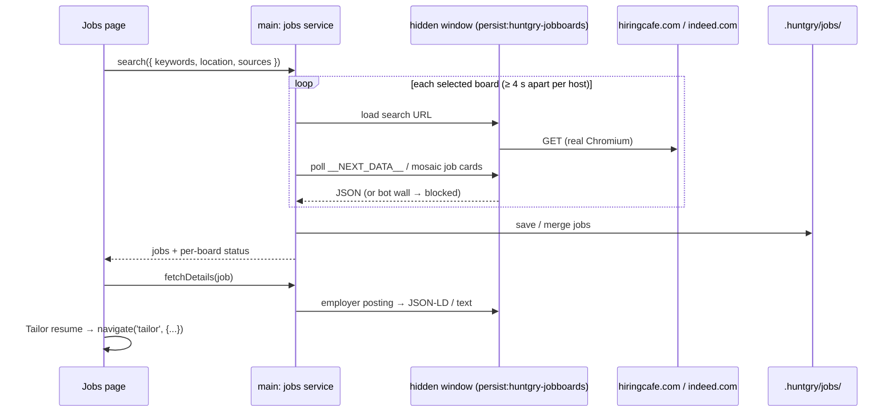
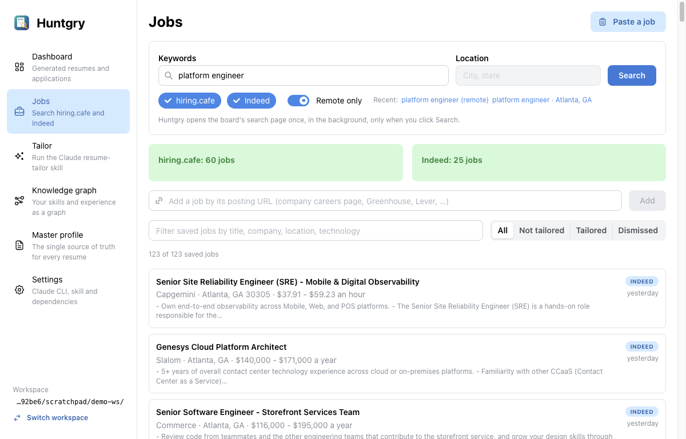
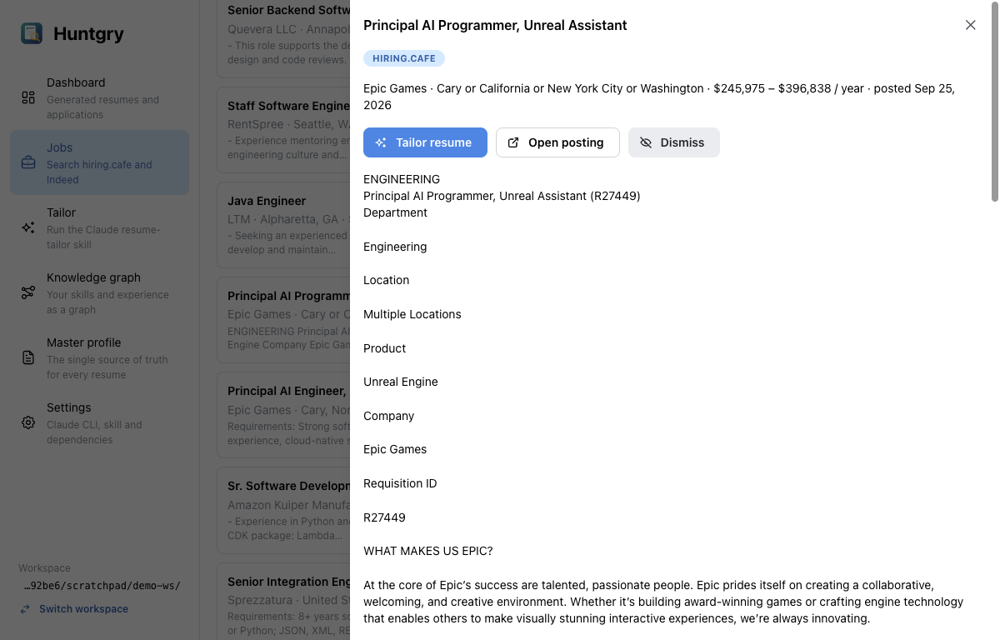
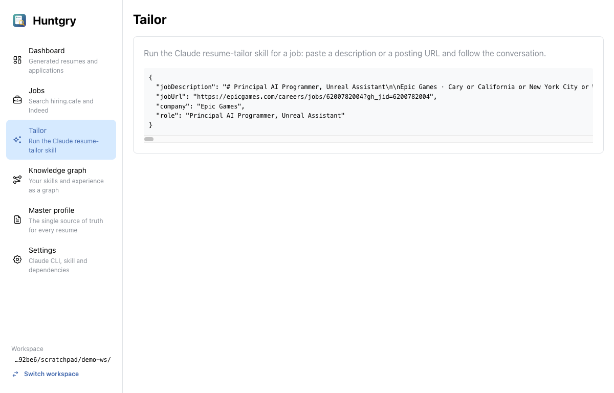

# #10 — Job boards: search hiring.cafe and Indeed, send a job to the resume tailor

Issue: [silentashish/huntgry#10](https://github.com/silentashish/huntgry/issues/10) · Epic: #1 · Follows #7 (works with #8's Tailor form)

## Context & problem

The diagram's **hiring cafe / indeed board → scraped job board → Resume Generator Skill**.
Finding a posting and getting it into the resume tailor meant copying text between the
browser and a terminal. The owner decided: **search on demand only** (when the user
clicks Search, rate-limited, no background crawling), and fall back to adding a job by
URL or pasted text when a board blocks the request.

## What we found about the boards

| Board | Plain HTTP (`fetch`, curl) | In a real Chromium (hidden Electron window) |
| --- | --- | --- |
| hiring.cafe (`hiringcafe.com`) | 403 from Cloudflare | Works. It is a Next.js app, and the search page's own server-rendered data (`window.__NEXT_DATA__.props.pageProps.ssrHits`) holds 80–100 structured jobs: title, company, location, workplace type, pay, publish date, the employer's apply URL, a requirements summary and technical tools. No full description. |
| Indeed | blocked | Search works: the page embeds its job cards as JSON (`window.mosaic.providerData['mosaic-provider-jobcards']`), about 15–40 per page with title, company, location, salary, date and a snippet. Job pages (`/viewjob`) show Cloudflare's "Additional Verification Required", so the full text is not readable. |
| Employer pages (Greenhouse, Lever, Ashby, careers sites) | often fine | Works; most publish schema.org `JobPosting` JSON-LD for Google Jobs. |

So every page is read the way a person would open it: in a hidden, sandboxed browser
window, once per click, one page at a time, at most one load per host every 4 s, in a
separate cookie jar (`persist:huntgry-jobboards`). Private APIs were not reverse-engineered.

## What changed and why

| Area | Files | Why |
| --- | --- | --- |
| Model | `src/shared/jobs-types.ts` | `Job` (id `<source>:<id>`, title, company, location, remote, salary, posted date, URL, description + whether it is complete, tags, tailored/dismissed), `JobQuery`, per-board `SourceResult` (`ok` / `blocked` / `error`), `jobDescriptionFor()`. |
| Loader | `src/main/jobs/loader.ts`, `blocked.ts` | Hidden `BrowserWindow` (sandboxed, no popups/downloads/permissions), polls an extract expression every second, treats an empty list as provisional for 8 s (pages render empty before results arrive), and detects bot walls ("Just a moment…", "Additional Verification Required", captchas, 403/429/503) so the UI says **blocked** instead of "0 results". |
| Local-network guard | `src/main/jobs/loader.ts`, `src/main/cli/public-url.ts` (#8) | A URL added by the user is untrusted: the start URL, every redirect and every request the page makes go through `assertPublicUrl` in the job-board session's `webRequest.onBeforeRequest`, so nothing reaches `localhost` or a private/link-local address (SSRF). Results are cached per host for a minute. Chromium resolves names itself, so unlike the runner's posting fetch this cannot pin the checked address; a DNS answer that changes within that minute is the remaining gap. |
| Job source on applications | `src/main/cli/runner.ts`, `src/shared/runner-types.ts`, `pages/jobs`, `pages/tailor/StartForm.tsx` | **Tailor resume** passes the job's board as `source`; when the run writes an application folder, the runner records `jobUrl` and `source` in its `huntgry.json` (#9's `recordJobSource`), so the Dashboard links the application to its posting. URLs typed on the Tailor page are `manual`. |
| Adapters | `src/main/jobs/sources/{hiringcafe,indeed,posting}.ts`, `text.ts` | Pure parsers from the extracted JSON to `Job`: hiring.cafe hits (salary, remote, summary as description, tools as tags; the location is applied as a city filter because putting it in hiring.cafe's free-text query returns almost nothing), Indeed cards (snippet HTML → text, strict job key check), and any posting page (JSON-LD `JobPosting` incl. `@graph`, else the page's main text). |
| Store | `src/main/jobs/store.ts` | `<workspace>/.huntgry/jobs/<source>-<id>.json` + `searches.json` (last 10). Re-finding a job refreshes board data but keeps the user's state and a full description fetched earlier. `canonicalize()` merges the same job found on different boards (same title, company and city) into one record with `aliases`, deterministically (first saved keeps its id); two records from one board always stay separate. Updates go to every copy. |
| Service / IPC | `src/main/jobs/{service,ipc}.ts`, `src/preload/jobs.ts` | `window.huntgry.jobs.{list, search, fetchDetails, addByUrl, addPasted, update, recentSearches}`. Queries, ids and URLs are validated in main. **Fetch full description**: hiring.cafe → the employer's page; Indeed → explains the human check. |
| Jobs page | `src/renderer/src/pages/jobs/*` | Search (keywords, location, remote, board chips, recent searches), a per-board result card (count / blocked / failed with the reason), add by URL, **Paste a job**, a list filterable by text and by *Last search / All / Not tailored / Tailored / Dismissed*, and a drawer with the description and **Tailor resume**, **Open posting**, **Fetch full description**, **Dismiss**. |
| Hand-off | `pages/jobs/index.tsx` | **Tailor resume** marks the job and calls `navigate('tailor', { jobDescription, jobUrl, company, role })`. A board summary is not passed as the job description; the tailor then gets the URL to fetch instead. |



## Decisions and alternatives rejected

- **Hidden browser window over HTTP scraping.** Both boards reject plain HTTP. A hidden
  Chromium reads exactly what the user would see, with no header spoofing or proxies. It
  is slower (a few seconds per board), which is fine for on-demand search.
- **Page data, not private APIs.** hiring.cafe's JSON endpoints change with each deploy;
  its `__NEXT_DATA__` and Indeed's embedded cards are what the pages themselves render.
- **Indeed full descriptions are not worked around.** The job page asks for a human check;
  the app says so and offers the posting link and Paste instead.
- **Tracking "tailored" on the job itself** (`tailoredAt`), not by matching application
  folders: this branch does not depend on #9. Once #9 is merged, `recordJobSource()`
  can write the job's URL and board into the application's `huntgry.json`.

## How to test

```bash
npm test && npm run typecheck && npm run build
```

Unit tests (`src/main/jobs/jobs.test.ts`, fixtures recorded from the real sites with user and
tracking identifiers removed): hiring.cafe and Indeed parsers, URL builders, location
filter, JSON-LD (with `@graph`, salary, location) and page-text fallback, tracking-parameter
ids, bot-wall detection, HTML → text, store merge and cross-board dedupe, safe file names,
and the service with a stub loader (search saves and dedupes, a blocked board is reported,
details from the employer page, add by URL / blocked URL / non-http URL, paste, mark
tailored/dismissed, Indeed details explained, query validation).

Manual, live, in the built app:

1. *platform engineer*, Atlanta, GA → Indeed 37 jobs (hiring.cafe 1 before the location
   fix). Remote only → hiring.cafe 60, Indeed 25. *backend engineer* → hiring.cafe 60,
   Indeed 39; the list switches to **Last search (99)**.
2. Open a hiring.cafe job (Epic Games) → **Fetch full description** loads the full text from
   epicgames.com.
3. **Tailor resume** → the Tailor page receives the description, the employer URL, the
   company and the role; the job shows **Tailored**.
4. Add `https://jobs.ashbyhq.com/firecrawl/…` by URL → title, company, date and the full
   description from its JSON-LD.





## Follow-ups

- Show "already applied" on a job from the application folders' `huntgry.json` (`jobUrl`
  is now recorded there).
- After #11: include saved jobs in the knowledge graph's gaps overlay (#12 uses them too).
- Pagination (hiring.cafe returns about 100, Indeed about 15–40 per search).
