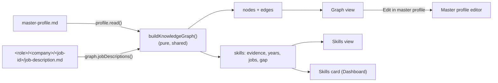
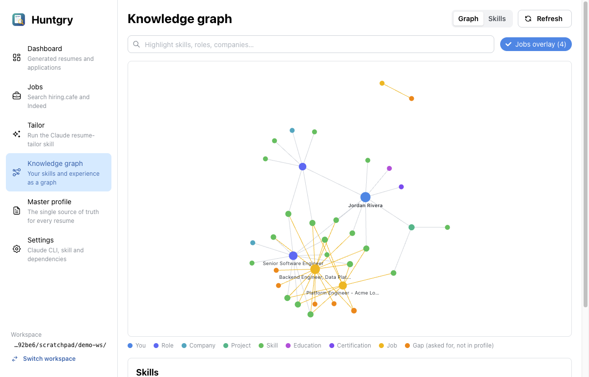
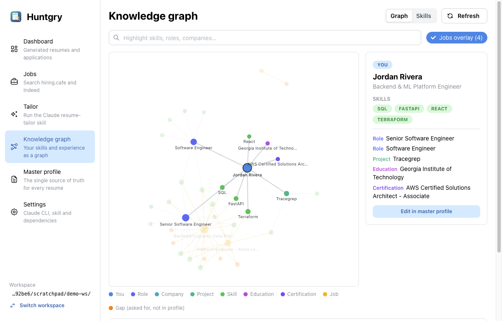
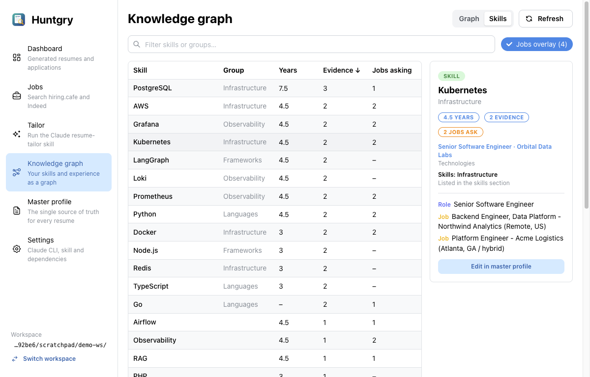
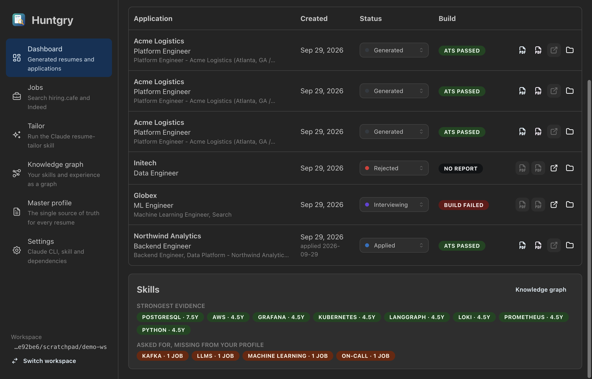

# #11 — Person knowledge graph from the master profile

Issue: [silentashish/huntgry#11](https://github.com/silentashish/huntgry/issues/11) · Epic: #1 · Follows #7

## Context & problem

The diagram's **Person knowledge graph → Custom Dashboard**. The master profile says what
the person did, but as a document: nothing showed which skills rest on real experience,
for how long, and which ones the jobs they apply to ask for but the profile never
mentions.

## What changed and why

| Area | Files | Why |
| --- | --- | --- |
| Skill names | `src/shared/skills.ts` | Normalization and an alias table (`k8s` → Kubernetes, `Postgres` → PostgreSQL, `golang` → Go, `JS`, `Node`, …). Splits technology fields. Mention matching with symbol-aware word boundaries (C++, C#, .NET, Node.js); very short names (`Go`) match case-sensitively, so "go live" is not Go. `TECH_VOCABULARY` lists common technologies for spotting gaps. |
| Graph builder | `src/shared/knowledge-graph.ts` | Pure `buildKnowledgeGraph(profile, jobs?)`. Nodes: person, role (experience), company, project, skill, education, certification, publication, job. Edges: held_role, worked_at, used, built, studied_at, certified, published, has_skill, asks_for. Every skill carries **evidence** (technologies fields, highlights that mention it, the skills list) and **years** (merged date ranges, overlaps counted once). Known technologies the profile writes about without listing them (e.g. "Built RAG pipelines") count as skills, not gaps. |
| Jobs overlay | `src/main/graph/{jobs,ipc}.ts`, `src/preload/graph.ts`, `src/shared/graph-types.ts` | `window.huntgry.graph.jobDescriptions()` reads `job-description.md` from every `<role>/<company>/<job-id>/` folder (bounded, hidden folders skipped). The builder marks which skills each posting asks for; a technology a posting names that the profile lacks is a **gap**. |
| Page | `src/renderer/src/pages/graph/index.tsx`, `components/graph/*` | Force-directed graph (colour by kind, size by connections, labels on zoom, weak gravity so separate components stay in view), search highlight, jobs-overlay toggle, legend. Clicking a node highlights its neighbours and opens a panel: a skill's years, evidence (click through to the role or project) and the jobs asking for it; for other nodes, their skills and links. **Edit in master profile** opens the right tab. A **Skills** view is a sortable table (years, evidence, jobs asking). Empty state for a sparse profile. |
| Dashboard card | `components/graph/SkillsSummaryCard.tsx` | "Strongest evidence / asked for, missing" card, shown at the bottom of the Dashboard (#9) and under the graph. |
| Navigation | `src/renderer/src/App.tsx` | The graph page receives its `{ nodeId }` param. |



## Decisions and alternatives rejected

- **Computed on every visit, nothing stored.** The profile is small, and building the graph
  takes milliseconds. A cache would be one more thing to invalidate when the file is
  edited by hand or by Claude.
- **Keyword matching, no LLM**, as the ticket asks. It is deterministic, instant and free,
  and the alias table plus vocabulary covers the common cases. A posting's
  paraphrases ("container orchestration") are not recognised; the resume-tailor skill's
  gap analysis remains the place for that.
- **`react-force-graph-2d`** (+ `d3-force-3d`, its own force engine, for the gravity forces).
  Canvas rendering stays smooth with hundreds of nodes, and the API is a React component.
  Cytoscape was the alternative: heavier, and aimed at graph editing we do not need.
- **Job descriptions read by a small main-process reader** instead of #9's applications
  scanner, so this PR does not depend on #9. Once both are merged, `graph.jobDescriptions`
  can reuse `scanApplications` (follow-up).

## How to test

```bash
npm test && npm run typecheck && npm run build
```

Unit tests: `src/main/graph/knowledge-graph.test.ts` (aliases, splitting, mention boundaries,
dates, merged years, graph structure and evidence, jobs overlay with hits and gaps,
technologies from highlights not being gaps, an empty profile, and the skill's own
`master_profile.example.md` as a fixture), `src/main/graph/jobs.test.ts` (job description reader).

Manual, as done for this PR, on the demo workspace (fictional profile, four application
folders from earlier runs):

1. **Knowledge graph** draws the person, both roles, companies, the project, education,
   the certification, skills, and the four jobs with their asks_for links. The gaps are
   Kafka, Machine Learning, On-call and Streaming, all absent from the profile.
2. Clicking **Jordan Rivera** highlights their direct links and shows them in the panel.
3. **Skills** view → Kubernetes: 4.5 years, evidence "Senior Software Engineer · Orbital
   (Technologies)" + "Skills: Infrastructure", 2 jobs ask.
4. Adding `Rust` to the profile on disk, then leaving and reopening the page → Rust is listed.





## Follow-ups

- Include saved jobs from the Jobs board (#10) in the overlay.
- #12 uses the gaps to drive master profile updates.


