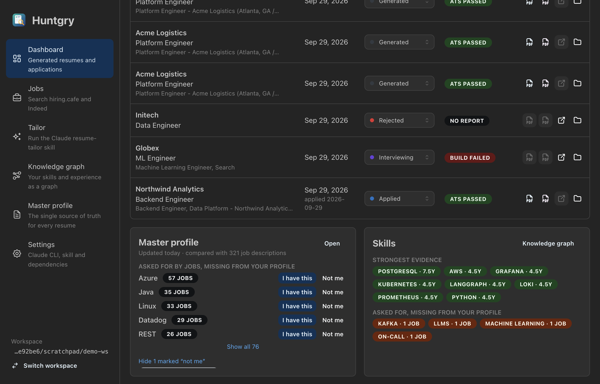
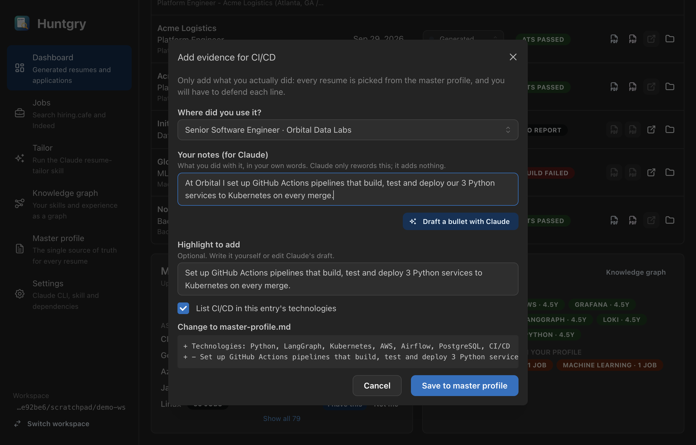

# #12 — Master resume update loop: gap insights back into the master profile

Issue: [silentashish/huntgry#12](https://github.com/silentashish/huntgry/issues/12) · Epic: #1 · Builds on #8, #9, #10, #11

## Context & problem

The diagram's last arrows are **Custom Dashboard → Master Resume Update → Local Finder File
Storage**. After #8–#11 the app could find jobs, tailor resumes and show the knowledge graph,
but what it learned from job descriptions never flowed back: a skill that twenty postings ask
for and the profile never mentions stayed invisible, and adding it meant finding the right
entry in the editor by hand. The resume-tailor skill's honesty rule applies here too: nothing
may be added that the person did not do, so every change needs their explicit confirmation.

## What changed and why

| Area | Files | Why |
| --- | --- | --- |
| Gap ranking | `src/shared/profile-insights.ts` (`computeGaps`) | Runs the knowledge graph (#11) over every job description and keeps its `gap` skills, most-asked first, each with the jobs asking for it. Gaps the profile's *Gaps & notes* already names are reported separately ("already noted"), dismissed ones are left out. |
| Job descriptions | `src/main/insights/jobs.ts` | Applications' `job-description.md` (#9) plus saved jobs (#10) that are not dismissed and have no application yet (same posting URL, compared without tracking parameters), so a tailored job counts once. A failing source is skipped, not fatal. |
| Dismissals | `src/main/insights/store.ts` | "Not me" goes to `<workspace>/.huntgry/profile-insights.json` (atomic writes, one at a time). Restorable from the card. |
| Adding evidence | `src/shared/profile-insights.ts` (`applyEvidence`), `pages/dashboard/EvidenceModal.tsx` | "I have this": pick the experience or project (or just the skills list), optionally a highlight, optionally list it as a technology (no duplicate under another spelling, e.g. `k8s`). The modal shows the exact lines that will be added, then saves through the existing version-checked `profile.save`; a file changed on disk in between is refused. |
| Claude draft | `src/main/insights/draft.ts`, `ipc.ts` | *Draft a bullet with Claude* sends the user's notes to a one-shot `claude -p` with **no tools**, no settings or MCP servers, no saved session, in an empty temp folder, constrained to a JSON schema. The system prompt forbids adding facts; `unsupportedNumbers` flags any number in the draft that the notes do not contain (a trial run with a weaker model invented "40+" from notes without numbers). The draft only fills the text box; nothing is written until the user saves. |
| Dashboard | `pages/dashboard/ProfileInsightsCard.tsx`, `index.tsx` | A **Master profile** card beside the skills card: last update, empty sections (click opens that tab), top 5 gaps with job counts (hover lists the jobs), *I have this* / *Not me*, dismissed list with *restore*. Refreshes on focus and `applications:changed`; a save also refreshes the skills card. |
| Profile page | `pages/profile/index.tsx` | Re-reads `master-profile.md` when opened (unless it shows an import draft), since the Dashboard can now save it too; otherwise the editor would start from the copy loaded at startup and its save would hit the version check. |
| API | `src/shared/insights-types.ts`, `src/preload/insights.ts`, `api.ts`, `main/ipc.ts` | `window.huntgry.insights.{get, dismiss, restore, draft}` (per-feature pattern from #7). IPC input is validated; the renderer never sends paths. |

```mermaid
flowchart LR
    apps["applications<br/>job-description.md"] --> texts
    saved[".huntgry/jobs<br/>(not dismissed, not applied)"] --> texts["job texts"]
    profile["master-profile.md"] --> graph["knowledge graph<br/>(gap skills)"]
    texts --> graph
    graph --> gaps["gaps, most-asked first"]
    dismissed[".huntgry/profile-insights.json"] -. "hide" .-> gaps
    gaps --> card["Dashboard card"]
    card -- "Not me" --> dismissed
    card -- "I have this" --> modal["Evidence modal"]
    modal -- "notes" --> claude["claude -p<br/>no tools, JSON schema"]
    claude -- "draft bullet" --> modal
    modal -- "preview → Save<br/>(version-checked)" --> profile
```

## Decisions and alternatives rejected

- **No new page.** The card lives on the Dashboard, as the diagram draws it; the full list is
  one click away (*Show all*). A separate page would have duplicated the graph page's skills table.
- **Dismissals are not written into *Gaps & notes*.** "Not me" is a UI decision; writing the
  profile would change what the resume-tailor skill reads without the user wording it. Gaps
  the user did write there are respected (listed as already noted).
- **One-shot draft instead of an interview run.** The issue suggested a Claude run that
  interviews the user. A notes box plus a tool-less single call gives the same result with
  far less surface: no tools, no session, no network beyond the API, and a schema-bound answer.
- **Graph overlay unchanged.** The knowledge graph page still overlays applications only;
  hundreds of saved search results would flood it with job nodes. The insights card uses both.

## How to test

```bash
npm test && npm run typecheck && npm run build
```

1. Open a workspace with applications and saved jobs (search once on **Jobs**).
2. **Dashboard** → *Master profile* card lists gaps with job counts; hover a count for the jobs.
3. *Not me* on one: it disappears and shows under "marked not me"; *restore* brings it back.
4. *I have this* on another: pick an experience, write notes, *Draft a bullet with Claude*,
   check the preview, *Save to master profile*. The gap disappears, the file has the new
   technology and highlight, and **Master profile** shows them without "unsaved changes".

Checked in the built app against a demo workspace (fictional profile, 321 job descriptions):
the Claude draft kept to the notes ("Set up GitHub Actions pipelines that build, test and deploy
3 Python services to Kubernetes on every merge.") and the save added exactly the two previewed lines.




## Follow-ups

- Rank gaps by recency or by jobs the user is actively tracking (applied/interviewing), not
  only by count.
- Let the user edit a highlight's wording for an existing entry from the same modal.
