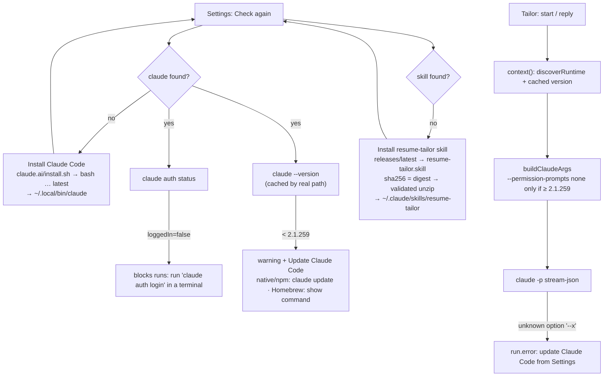
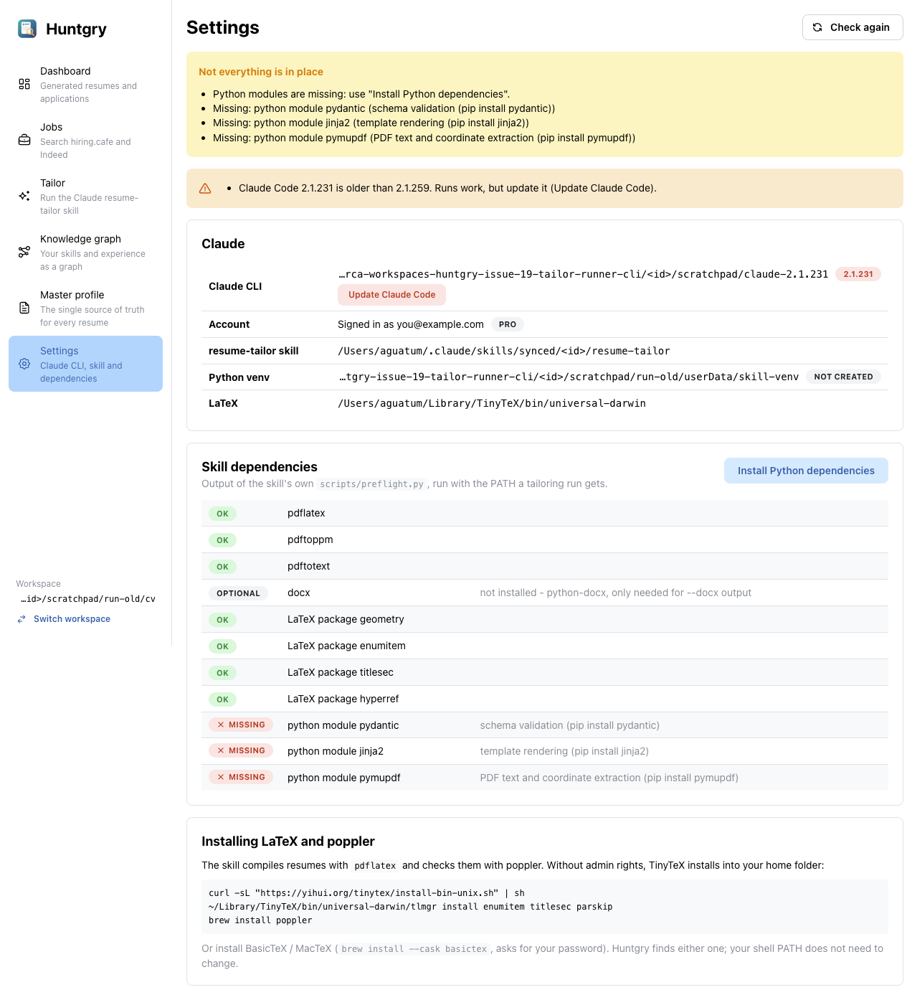
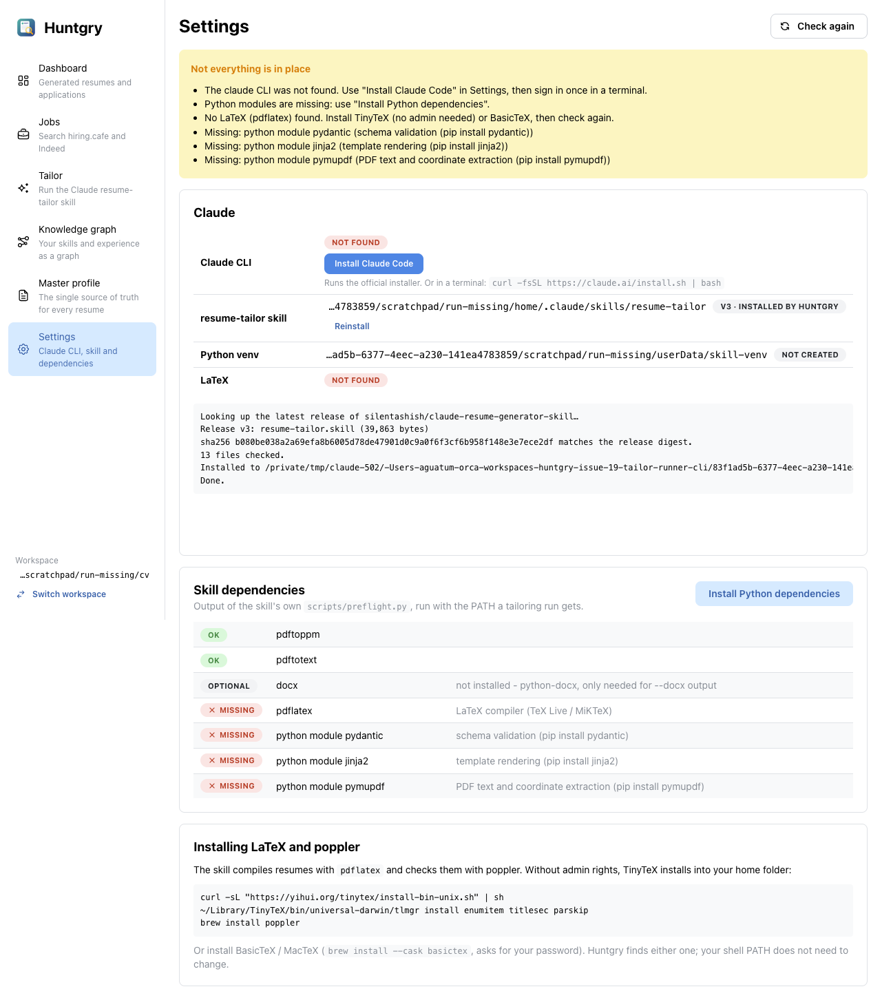
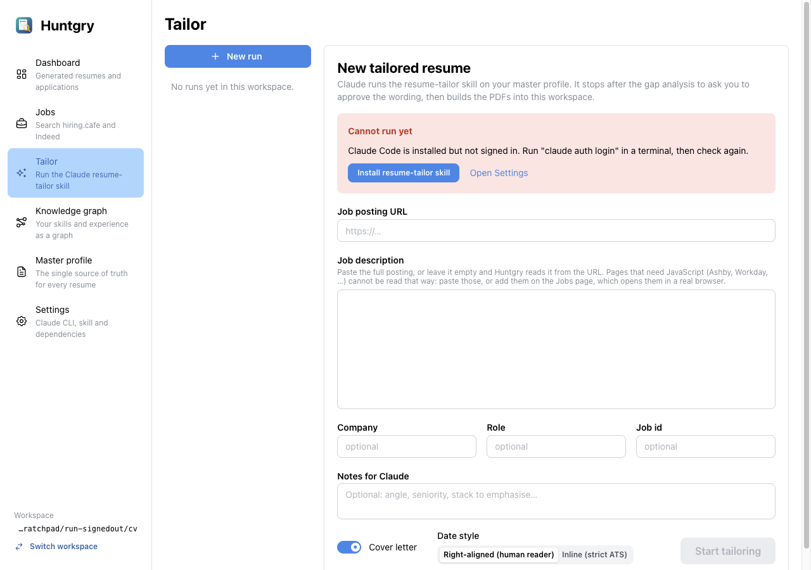

# #19 — Claude not running inside the tailor run; Claude and skill setup from Settings

Issue: [silentashish/huntgry#19](https://github.com/silentashish/huntgry/issues/19) · Builds on #8

## Context & problem

Starting a tailoring run failed right away with `error: unknown option '--permission-prompts'`
("Claude stopped with an error"). The runner (`buildClaudeArgs`) and the insights bullet drafter
(`draftArgs`) passed `--permission-prompts none`, a flag that only exists in **Claude Code
≥ 2.1.259** ([changelog](https://github.com/anthropics/claude-code/blob/main/CHANGELOG.md),
[headless docs](https://code.claude.com/docs/en/headless#turn-off-permission-prompts-in-unattended-runs):
"Earlier versions reject it with an unknown-option error"). Homebrew, npm and WinGet installs do
not auto-update, so many machines run an older `claude`; `findClaude()` picks whichever install
it finds first. Reproduced with the official 2.1.231 binary.

The issue also asked that the app make sure Claude is actually usable (installed, signed in),
offer to install the CLI from Settings, and download the resume-tailor skill from its GitHub
releases when it is missing.

## What changed and why

| Area | Files | Why |
| --- | --- | --- |
| Version gate | `src/main/cli/version.ts` (new), `command.ts`, `runner.ts`, `ipc.ts`, `insights/draft.ts`, `insights/ipc.ts` | `claude --version` once per binary, cached by real path (the native launcher is a symlink into `versions/<v>`, so an update invalidates the cache). `--permission-prompts none` is passed only when the version is ≥ 2.1.259; an unknown version (hung or failing `--version`) gets no flag and never blocks a run. |
| Readable failure | `version.ts` (`explainClaudeError`), `runner.ts`, `pages/tailor/RunView.tsx` | A run that dies with any `unknown option '--x'` says "Your Claude Code (v) does not support --x. Update Claude Code from Settings" above the raw stderr, with an **Open Settings** link. Covers future flag drift too. |
| Environment | `environment.ts`, `install-claude.ts` (`parseAuthStatus`, `installKindOf`), `shared/runner-types.ts` | `RunnerEnvironment` gains `claudeVersionOk`, `claudeInstallKind` (native / homebrew / npm / other, from the real path), `claudeAuth` (from `claude auth status`, JSON; exit 1 = signed out), `skillInstall` and `warnings`. Not signed in **blocks** a run; an old version is a **warning** only (runs work without the flag). |
| Install / update Claude Code | `src/main/cli/install-claude.ts` (new) | **Install** downloads the official `https://claude.ai/install.sh` (15 s timeout, ≤ 1 MB, must start with `#!`) and runs `bash install.sh latest` with a streamed log; the installer verifies the binary's checksum and puts the launcher in `~/.local/bin`, which `wellKnownBinDirs()` checks first, so no PATH change. **Update** runs `claude update` for native/npm installs, a fresh native install for unknown ones, and for Homebrew only shows `brew upgrade claude-code` (the app never runs brew). One installer at a time. |
| Install the skill | `src/main/cli/install-skill.ts` (new), `workspace/constants.ts` | `GET api.github.com/repos/silentashish/claude-resume-generator-skill/releases/latest` → asset `resume-tailor.skill` (download URL must be under that repo's `releases/download/`) → download (≤ 20 MB) → sha256 must equal the asset's `digest` → unzip with `fflate`, checking every entry **before** inflating (only under `resume-tailor/`, no `..`, absolute paths, backslashes or NUL, ≤ 500 entries, ≤ 50 MB inflated) → `SKILL.md` frontmatter must say `name: resume-tailor` → written to a staging dir inside `~/.claude/skills` and moved into place with one `rename`. A record in `<userData>/skill-install.json` lets Settings show "v3 · installed by Huntgry". |
| IPC | `shared/runner-types.ts`, `preload/runner.ts`, `cli/ipc.ts` | `runner.installClaude()`, `runner.updateClaude()`, `runner.installSkill(replace?)`; progress on the existing `runner:install-log` event. |
| Settings UI | `pages/settings/index.tsx` | Claude CLI row: version badge (red when old) + install kind, **Install Claude Code** (with the terminal command as fallback) or **Update Claude Code** / brew command. New **Account** row. Skill row: **Install resume-tailor skill** / **Reinstall**. Warnings alert. One live log under the Claude card. |
| Tailor form | `pages/tailor/StartForm.tsx`, `index.tsx` | Blocks when not signed in; **Install resume-tailor skill** right in the "Cannot run yet" alert, then refreshes the environment. |
| Dev override | `cli/env.ts` (`findClaude`) | `HUNTGRY_CLAUDE_PATH` in the app's own environment (never from the renderer) pins the binary, to test older or missing CLIs. |



## Decisions and alternatives rejected

- **Security model unchanged.** In a `-p` run with no permission host, prompts are denied either
  way (headless docs); `--permission-prompts none` only adds "do not retry" and removes
  `AskUserQuestion`. Every other flag from [#8](8-claude-runner.md) stays: `acceptEdits` +
  allowlist of the skill's scripts, `--setting-sources ""`, the mandatory OS sandbox via
  `--settings`, no network tools, never `--dangerously-skip-permissions`. `dontAsk` was not
  needed. 2.1.231 accepts all of these (checked).
- **No hard minimum version.** 2.1.259 is only "recommended": older versions get a warning and
  an Update button, not a block, because runs work on them.
- **Unknown version = old.** A `claude` whose `--version` hangs (the Homebrew wrapper on the dev
  machine does) gets no new flags. The failure is cached so only the first run waits; **Check
  again** in Settings asks again.
- **Official installer, not our own download.** `install.sh` already resolves the platform,
  verifies the checksum from the release manifest and sets up the launcher. Re-implementing
  that would drift. Homebrew is never run from the app; users see the command.
- **Sign-in is not done in-app.** `claude auth login` needs a browser round trip and, on some
  setups, pasting a code into the terminal. The app detects it and shows the command.
- **`fflate` for the zip** (pure JS, ~30 KB) instead of `/usr/bin/unzip`: every entry name and
  size is checked before anything is inflated or written, and tests run against an in-memory
  zip on any OS.
- **Reinstall backs up outside `~/.claude/skills`** (`<userData>/skill-backups/`), so Claude Code
  never sees two `resume-tailor` skills. The staging folder starts with a dot, which
  `findSkillDir` skips.
- **Personal skills folder.** The skill goes to `~/.claude/skills/resume-tailor`, which wins
  over plugin or synced copies in `findSkillDir` (shallowest first) and is where Claude Code
  looks for personal skills.

## How to test

```bash
npm test && npm run typecheck && npm run build
```

Unit tests: `version.test.ts` (parse/compare, the gate, cache by real path and refresh,
unknown-option message), `cli.test.ts` + `insights.test.ts` (flag present only when supported),
`runner.test.ts` (a fake CLI that rejects `--permission-prompts` → friendly error; without the
flag it runs), `install-skill.test.ts` (release parsing, digest mismatch, zip-slip / foreign /
oversize entries, wrong `SKILL.md`, install + reinstall with backup, rate limit),
`install-claude.test.ts` (install kind, auth status, installer run/refusals, Homebrew,
`checkEnvironment` with a fake old signed-out CLI).

Manual, in the built app driven with Playwright `_electron` (isolated user-data folder,
fictional profile from the skill's `master_profile.example.md`):

1. **Old CLI** — `HUNTGRY_CLAUDE_PATH=<path to the official 2.1.231 binary>`: Settings shows the
   version in red with **Update Claude Code** and a warning. Starting a run gets past startup:
   `system/init` with `claude_code_version: 2.1.231`, `permissionMode: acceptEdits`, and Claude
   replies ([screenshot](assets/19-run-old-cli.png)). Before this change the same run failed
   with `unknown option '--permission-prompts'`.
2. **End to end on 2.1.285** — paste a posting, gap analysis, approve: `resume.pdf` and
   `cover.pdf` built in `software-engineer-ii/ripple/<id>/` ($0.79).
3. **Nothing installed** — `HUNTGRY_CLAUDE_PATH=/nonexistent` and an empty `HOME`: Settings offers
   **Install Claude Code** and **Install resume-tailor skill**
   ([screenshot](assets/19-settings-missing.png)). The skill install downloads v3, reports the
   sha256 match, and the preflight table and **Install Python dependencies** appear
   ([screenshot](assets/19-skill-installed.png)).
4. **Signed out** — native CLI with an empty `HOME`: Account shows **Not signed in**, the Tailor
   form blocks with the `claude auth login` instruction ([screenshot](assets/19-tailor-signed-out.png)).

The **Install Claude Code** button was not run against the real home folder (it would install a
second CLI on the dev machine); its code path is covered by the unit test with a stand-in script.





## Follow-ups

- Windows: run `install.ps1` from the app (today the error shows the PowerShell command).
- Tell the user when a newer skill release exists (today: Reinstall fetches the latest).
- Let the user pick among several `claude` binaries in Settings instead of the env override.
