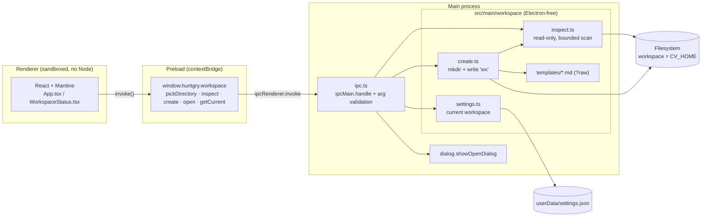
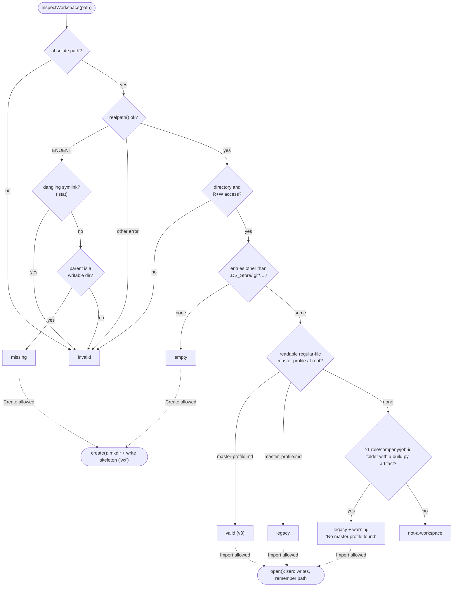

# #2 — Electron workspace shell (create / import)

Issue: [silentashish/huntgry#2](https://github.com/silentashish/huntgry/issues/2) · Epic: #1

## Context & problem

Huntgry will be a local-first Electron dashboard around the Claude
[`resume-tailor` skill](https://github.com/silentashish/claude-resume-generator-skill).
Before any dashboard, scraping or CLI work can happen, the app needs somewhere to
work: the skill's `CV_HOME` directory, called the **workspace** here.

The repo held only a README and the excalidraw sketch. This change adds the first
runnable app. It does one job: create a new workspace or import an existing one,
and show whether the chosen folder is usable.

Constraints from the issue:

- It must stay compatible with the skill's workspace, both the older layout already
  on disk and the newer v3 layout.
- It must not duplicate the skill's logic. There is no LaTeX, no JD parsing and no Python here.
- Filesystem work stays out of the renderer and goes through a small typed IPC/preload API.
- The architecture should be minimal but able to grow into the dashboard, a
  master-profile editor and the `claude` CLI integration.

### What "workspace" means for the skill

The skill's code has no workspace contract except its output tree.
`build.py` writes to `CV_HOME/<role>/<company>/<job-id>/`, where `CV_HOME` comes from
`--cv-home`, then `$CV_HOME`, then `~/cv`. The master profile is a documentation
convention, and the skill versions disagree about it:

| | Installed skill (older) | Skill v3 (`712bee3`) |
| --- | --- | --- |
| Master profile | not pinned; usually `master_profile.md` | `~/cv/master-profile.md` |
| Base cover letter | — | `~/cv/cover-letter.md` (optional) |
| Application folders | `<role>/<company>/<job-id>/` | same |

## What changed and why

| Area | Files | Why |
| --- | --- | --- |
| Tooling | `package.json`, `electron.vite.config.ts`, `tsconfig*.json`, `vitest.config.ts` | electron-vite gives main/preload/renderer one config. Vite is pinned to 7 because electron-vite 5 does not support Vite 8 yet. TypeScript is pinned to 5.9. |
| Shared contract | `src/shared/workspace-types.ts` | `WorkspaceStatus`, `WorkspaceInspection`, `CreateResult`, `HuntgryApi` and the IPC channel names. Types and constants only. |
| Workspace module | `src/main/workspace/{constants,inspect,create,paths,settings}.ts` | All filesystem logic lives here as plain async functions over `node:fs/promises` with no Electron imports, so vitest runs it against `fs.mkdtemp` dirs. |
| Templates | `src/main/workspace/templates/*.md` | Master profile skeleton (v3 sections, placeholders only, credits the skill commit), cover letter stub, and `CLAUDE.md`. |
| IPC | `src/main/ipc.ts` | Five `ipcMain.handle` channels. Arguments are validated in main (non-strings are rejected, `~` is expanded, relative paths come back as `invalid`). Main also remembers the current workspace in `userData/settings.json`. |
| Window | `src/main/index.ts` | `contextIsolation: true`, `sandbox: true`, `nodeIntegration: false`. Navigation and `window.open` are denied. In dev, renderer warnings and errors are echoed to the terminal. |
| Preload | `src/preload/index.ts` | Exposes exactly `window.huntgry.workspace.{pickDirectory, inspect, create, open, getCurrent}`. |
| UI | `src/renderer/**` | React 19 + Mantine 9 on one screen: the two primary actions, an optional typed path with live read-only status, and a status card (path, badge, master profile, application count, warnings/errors). A CSP is set in `index.html`. |
| CLI placeholder | `src/main/cli/README.md` | Reserves the spot for spawning `claude` with `CV_HOME=<workspace>`. No code yet. |
| Docs | `README.md`, this file | Commands, layout, and the statuses. |

### Open questions: defaults applied

- **Q1, master profile filename.** Create writes `master-profile.md`, the name the v3 README uses.
  Import also accepts `master_profile.md`, matched case-insensitively, and reports it as `legacy`.
- **Q2, pointing the skill at a non-`~/cv` workspace.** Create writes a `CLAUDE.md` that
  says this folder is `CV_HOME`, shows the `--cv-home "<path>"` / `CV_HOME=` usage, and
  names the master profile. Claude Code loads this file automatically when it runs in
  the workspace. Import never writes it.

Both need confirmation from the maintainer (see follow-ups).

## Architecture



### Workspace status decision flow



Create and Import behaviour per status:

| Status | Create | Import |
| --- | --- | --- |
| `missing` | `mkdir` and write the skeleton | refused; suggests Create |
| `empty` | write the skeleton; leaves `.DS_Store`/`.git` alone | refused; suggests Create |
| `valid` / `legacy` | refused, writes nothing; "use Import" | accepted, zero writes |
| `not-a-workspace` / `invalid` | refused, writes nothing | refused |

## Design decisions & rejected alternatives

- **Mantine vs shadcn/ui + Tailwind.** Mantine is one dependency with accessible
  components and a single CSS import. There is no Tailwind/PostCSS config and no
  generated component sources to keep in the repo, and AI agents know it well.
  shadcn would bring Tailwind 4 config plus copied component files, which is more
  surface than a one-screen shell needs. Revisit this if a custom design system becomes a goal.
- **electron-vite vs Electron Forge (+ Vite plugin).** electron-vite uses one config for all three
  processes, has HMR, and supports TS with almost no setup. Forge's Vite plugin is still
  marked experimental and adds its own packaging config. Packaging is deferred anyway
  (see follow-ups), so Forge's main advantage does not apply yet.
- **`?raw` templates vs `extraResources`.** The templates are bundled into the main
  process with Vite `?raw` imports. That avoids `extraResources` plus
  `process.resourcesPath` branching between dev and packaged builds, and vitest reads
  the same imports.
- **Refuse rather than merge.** Create never touches a non-empty directory with unknown
  content, and never "tops up" an existing workspace. Every file is written with
  `flag: 'wx'`, so even a race cannot overwrite user data. Nothing is ever deleted.
- **Import is exactly `inspect`.** `openWorkspace` is an alias of `inspectWorkspace`.
  Remembering the current workspace goes to `userData/settings.json`, outside the workspace.
  Tests snapshot mode, size, mtime and content before and after.
- **Symlinks.** A symlinked *root* is resolved with `realpath`, and the target is inspected and
  displayed. A *dangling* root symlink is `invalid`, not `missing`, so Create is never offered
  on a path where `mkdir` would fail. Inside the scan, `Dirent` types are used (lstat
  semantics), so symlinks are never followed.
- **Master profile must be a readable regular file.** A directory, a dangling link or an
  unreadable file named `master-profile.md` is ignored with a warning, and detection falls
  through to `master_profile.md` or application folders. A symlink is resolved explicitly (this
  one well-known file, not a traversal) and accepted only if its target is a readable regular
  file, even one outside the workspace, such as a dotfiles repo. A warning shows where it points.
- **Bounded reads.** Directories are streamed with `opendir()` rather than loaded with
  `readdir()`. One budget of 5,000 entries covers the root listing and the depth-3
  application scan, and reading stops the moment it runs out, so picking `~` or `/` cannot
  hang or allocate a huge array. If the root listing is cut short, the master profile and
  cover letter are looked up by name, and the truncation is reported as a warning.
- **No stale actions in the UI.** Changing the typed path clears the status card at once, and
  results of older in-flight inspections are dropped (generation counter). "Create workspace
  here" and "Import this workspace" therefore always refer to the folder in the input.
- **Typed path input.** macOS folder pickers can only return existing folders (their "New
  Folder" button creates the folder at once). To cover "a new directory that does not yet
  exist", the UI also accepts a typed path with live read-only status and a contextual
  "Create workspace here" button. The two primary actions stay the entry points.
- **Settings in the workspace module.** The "current workspace" JSON file is written by
  `workspace/settings.ts`, with the path injected by `ipc.ts`. That keeps every fs call in
  one tested, Electron-free module.
- **No Playwright yet.** The logic worth testing is the pure workspace module, which has
  33 tests. An Electron smoke test belongs with packaging.

## How to test

```bash
npm install
npm test            # 33 vitest cases, temp dirs, no Electron
npm run typecheck
npm run build
npm run dev         # manual check
```

Manual checks in `npm run dev`:

1. The startup screen shows **Create New Workspace** and **Import Existing Workspace**.
2. Type a path that does not exist, e.g. `~/huntgry-test/ws`. Its parent must exist.
   The status shows `missing`. Click **Create workspace here**. The status becomes `valid`,
   and `master-profile.md`, `cover-letter.md` and `CLAUDE.md` appear in the folder.
3. Click **Import Existing Workspace** and pick a copy of `~/cv`. The status is `legacy`,
   the application count is shown, there is a "No master profile found" warning, and no files change.
4. Pick or type a folder with unrelated files. The status is `not-a-workspace` and nothing is written.
5. Type `relative/path`. The status is `invalid` with "Path must be absolute."

Screenshots from the dev build: [startup](assets/2-startup.png) ·
[created](assets/2-created.png) · [legacy import](assets/2-legacy-imported.png) ·
[not a workspace](assets/2-not-a-workspace.png).

## Follow-ups

- **Confirm Q1/Q2** with the maintainer: the `master-profile.md` name, and `CLAUDE.md` as the
  way to point the skill at a non-`~/cv` workspace.
- **Packaging.** Add `electron-builder` (or Forge), an app icon and signing/notarisation. With
  the `?raw` templates, no resource handling is needed. A future MAS/App Sandbox build would
  need security-scoped bookmarks to reopen the remembered workspace.
- **Playwright `_electron` smoke test** launching the packaged app.
- **CLI integration** (`src/main/cli/`): spawn `claude` with `cwd` = workspace and
  `CV_HOME=<workspace>`, and stream output to the renderer.
- **Dashboard.** List the `<role>/<company>/<job-id>/` folders using the same bounded scan.
- **Master-profile editor**, plus a "migrate `master_profile.md` → `master-profile.md`"
  action for legacy workspaces. It must be explicit and opt-in.
