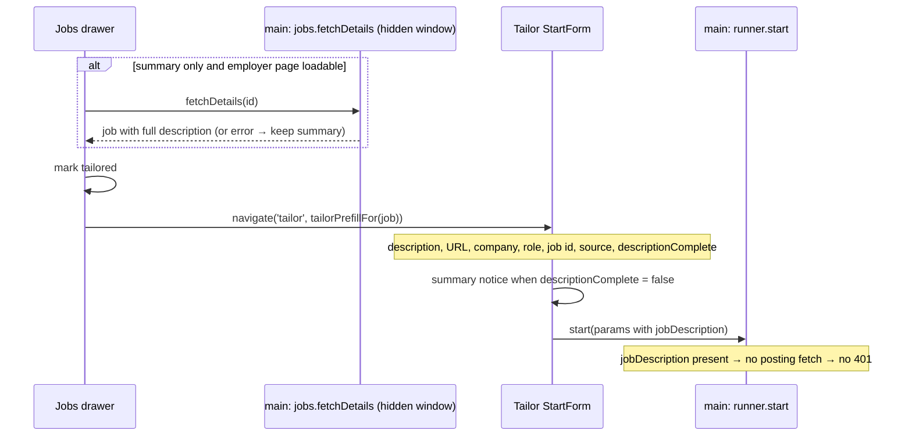
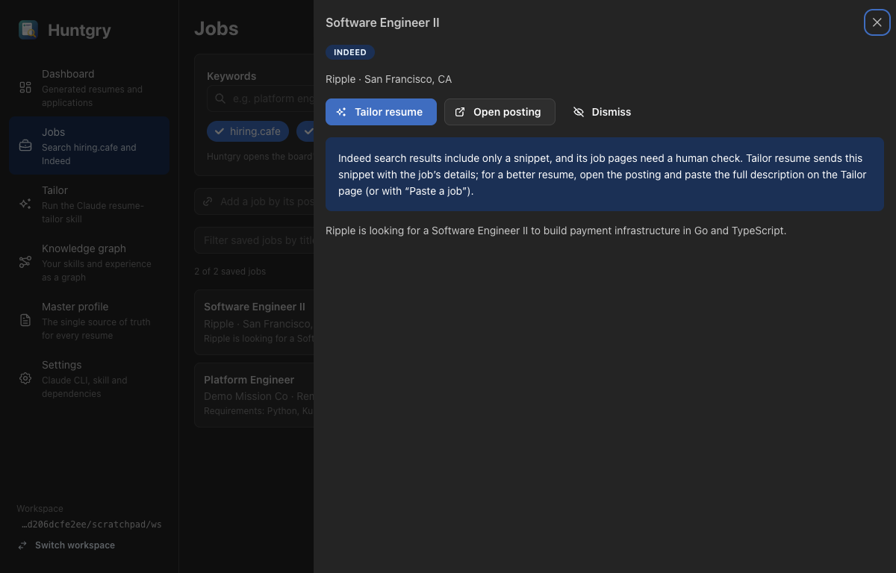
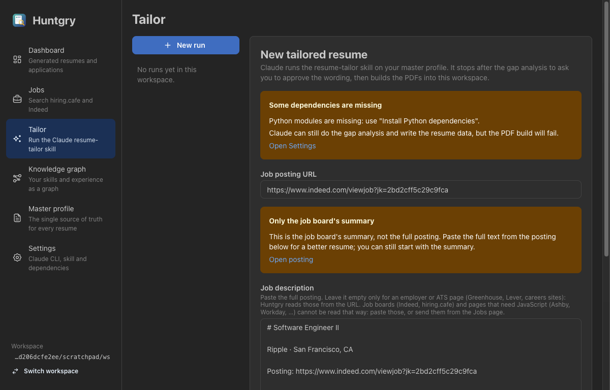

# #20 — Job description and job id prefilled on the Tailor page

Issue: [silentashish/huntgry#20](https://github.com/silentashish/huntgry/issues/20) · Builds on #8, #10

## Context & problem

**Tailor resume** on the Jobs page opened the Tailor form with the URL, company and role, but
an empty **job description** and **job id**, and **Start tailoring** failed at once with
*"The job site answered 401. Paste the job description instead."* Two causes combined:

1. **The handoff dropped the description and never set the job id.** `tailor(job)` passed the
   description only when `descriptionComplete` was true, and every board search result
   (Indeed, hiring.cafe) is saved as a summary (`descriptionComplete: false`). The form
   supported a `jobId` param, but the Jobs page never set it.
2. **The run's URL fallback cannot read job boards.** With no description, `runner.start` fetches
   the posting URL over plain HTTP (by design since #8: Claude has no network, the fetch is
   SSRF-checked and DNS-pinned). Indeed and hiring.cafe answer plain HTTP clients with a
   Cloudflare 401/403, which #10 already documents. The form's help text ("leave it empty and
   Huntgry reads it from the URL") and the drawer's Indeed notice ("tailor from the URL and let
   Claude try to fetch it") promised something that cannot work for those URLs.

## What changed and why

| Area | Files | Why |
| --- | --- | --- |
| Prefill helpers | `src/shared/jobs-types.ts` (`jobIdFor`, `tailorPrefillFor`, `canFetchDetails`) | One pure function turns a saved job into Tailor form values: the saved description (`jobDescriptionFor`, always, even when it is a summary), URL, company, role, source, `descriptionComplete`, and a short folder-safe job id from the board's own id. `canFetchDetails` is the drawer's existing "is there an employer page to load" rule, now shared with the handoff. Bulk tailoring (#21) can reuse them. |
| Handoff | `pages/jobs/index.tsx` (`tailor`) | For a summary whose employer page can be loaded (hiring.cafe, URL copies, Indeed jobs with a copy on another board), fetches the full posting first through the existing hidden-window `jobs.fetchDetails`; on failure it hands off the summary. Then marks the job tailored and navigates with `tailorPrefillFor`. |
| Drawer | `pages/jobs/JobDrawer.tsx` | **Tailor resume** shows a spinner while the posting is fetched (other actions disabled meanwhile). The Indeed and summary notices describe what Tailor resume now does, and no longer suggest the URL can be fetched. |
| Nav params | `src/renderer/src/navigation.ts` | `PageParams['tailor'].descriptionComplete` so the form knows it got a summary. |
| Tailor form | `pages/tailor/StartForm.tsx` | A yellow *Only the job board's summary* notice with **Open posting** when the prefill is a summary; the user can still start. The description help text promises URL reads only for employer/ATS pages. |
| Blocked hosts | `src/main/cli/posting.ts` (`refusedMessage`) | A 401/403 from indeed.com / hiringcafe.com now says *"www.indeed.com does not let Huntgry read job pages directly. Open the job on the Jobs page and click Tailor resume, or paste the job description."*; a Cloudflare bot wall on any other site says it asks for a human check. The fetch, its SSRF checks and the no-network rule for Claude are unchanged. |

Job ids: Indeed `2bd2cff5c29c9fca` → `2bd2cff5c29c9fca`; hiring.cafe
`adp___bf746f1c-…___594192` → `594192` (the employer's requisition number); URL/pasted jobs →
their 16-hex hash. Everything is lowercased, non-alphanumerics become `-`, at most 40 characters.



## Decisions and alternatives rejected

- **Start with a snippet rather than block.** An Indeed job gives Claude only a one or two
  sentence snippet; the run is thin, but the notice says so and the user can paste the full
  text first. A disabled button would be another dead end.
- **Fetch the full posting before handing off**, silently falling back to the summary. It is
  what users expect *Tailor resume* to do, and costs a few seconds only when an employer page
  exists. Errors are not shown in the drawer: the summary notice on the Tailor form covers them.
- **hiring.cafe job id = the last `___` segment** (the employer's requisition number). The full
  id is 60+ characters with underscores and a UUID, a poor folder name.
- **No hidden-window fallback in `runner.start`.** Reading arbitrary manual URLs through the
  browser window would widen what the runner can reach; the plain fetch keeps its SSRF checks.
  Indeed job pages need a human check even in that window (#10), so it would not help there.
- **Match job boards by host, plus Cloudflare headers for everything else**, not by page
  content: the status and headers are enough and do not depend on the challenge page's HTML.

## How to test

```bash
npm test && npm run typecheck && npm run build
```

Unit tests: `src/shared/jobs-types.test.ts` (new: `jobIdFor`, `tailorPrefillFor`,
`canFetchDetails`), `src/main/cli/cli.test.ts` (blocked-host messages),
`src/renderer/src/navigation.test.ts` (prefill carries `jobId` and `descriptionComplete`).

Manual, in the built app against a demo workspace (fictional profile, one Indeed job and one
hiring.cafe job whose employer page does not load):

1. **Jobs** → the Indeed job → **Tailor resume**: the form has the description (with its header),
   URL, company, role, **Job id `2bd2cff5c29c9fca`**, and the summary notice with *Open posting*.
2. The hiring.cafe job → **Tailor resume**: the fetch fails, the summary is handed off with the
   notice, **Job id `594192`**.
3. `runner.start` with only `https://www.indeed.com/viewjob?jk=2bd2cff5c29c9fca`: fails before
   any Claude run with the new *"… does not let Huntgry read job pages directly. Open the job on
   the Jobs page …"* message (Indeed still answers 401).




## Follow-ups

- Fall back from the plain fetch to the hidden-window loader for manual employer URLs that need
  JavaScript (Ashby, Workday), with the same public-host checks.
- Show in the run header when a run was started from a summary, so a thin gap analysis is explained.
