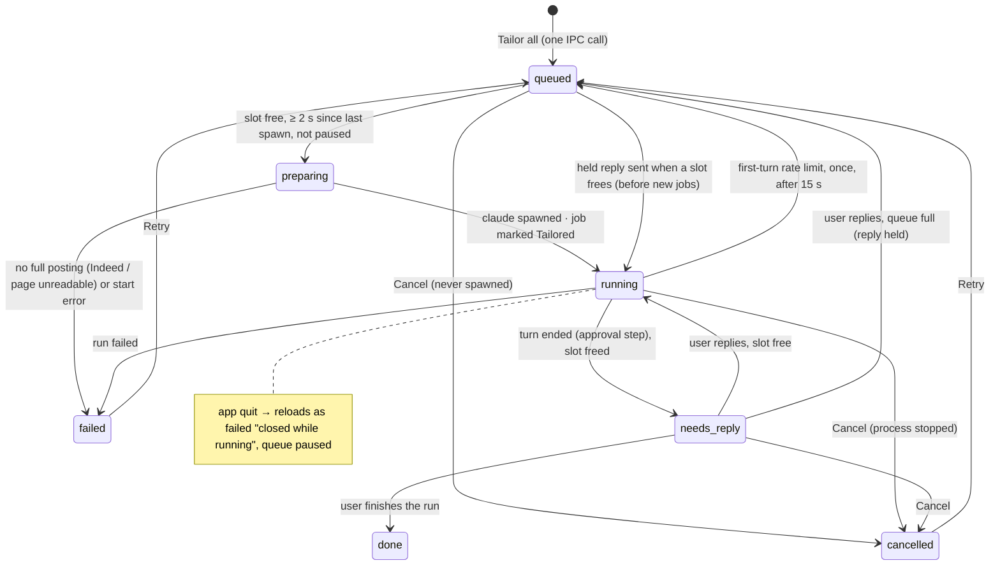
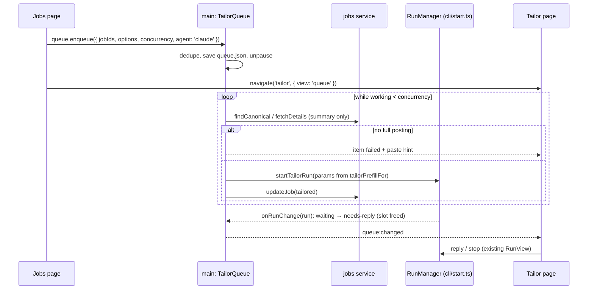
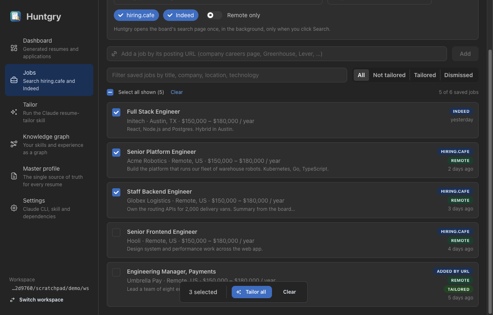
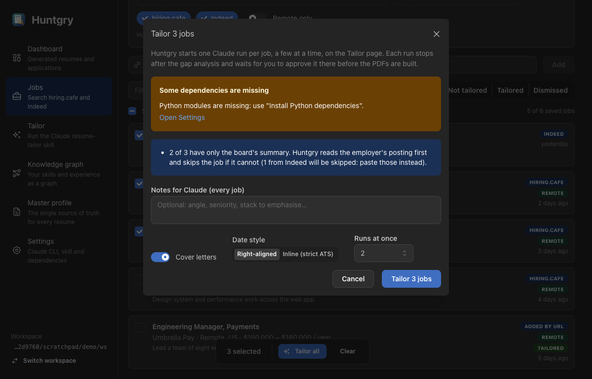
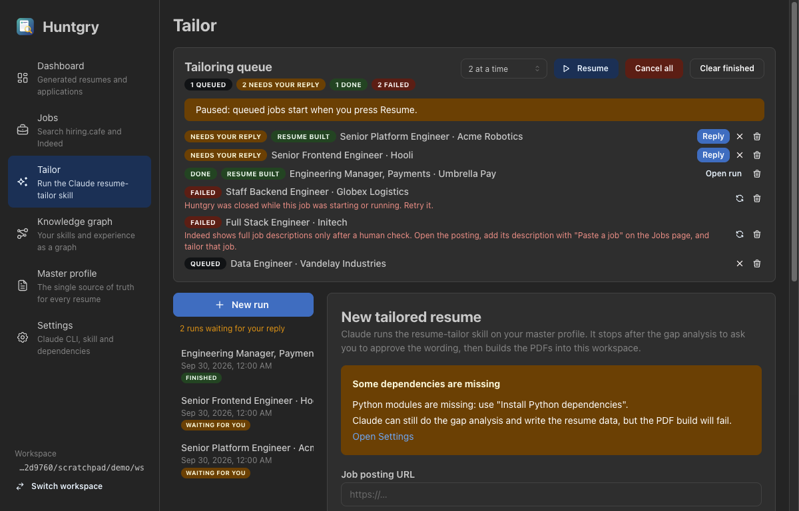

# #21: Bulk tailoring (tick jobs, run a queue in Tailor)

Issue: [silentashish/huntgry#21](https://github.com/silentashish/huntgry/issues/21) · Builds on #8, #10, #20 · Prepares #22

## Context & problem

The Jobs page could send only **one** job to the Tailor form, and the user still had to press
**Start tailoring** for it. The owner wants to tick several jobs and press one **Tailor all**
button, and have Huntgry start the runs itself in the Tailor section.

Three facts shaped the design:

- **Approval stays manual.** The skill's step 3 and Huntgry's system prompt make every run stop
  and wait for the user's approval before the PDFs are built. So bulk tailoring means *bulk
  starting*. A run at the approval step does not need Claude's attention, so it frees its slot
  and shows **Needs your reply**.
- **Claude limits bursts of new sessions.** Starting many `claude -p` processes back to back
  fails after 3 or 4 of them with *"Server is temporarily limiting requests (not your usage
  limit)"* ([anthropics/claude-code#53922](https://github.com/anthropics/claude-code/issues/53922)).
  That is why the queue runs at most 2 at a time by default (4 at most), starts them at least
  2 s apart, and retries once automatically when the first turn hits the limit.
- **A latent bug became real.** `findOutputFolder` returned the newest application folder in
  the whole workspace. That only works while one run builds at a time. With two runs building
  together, run A could record run B's folder and write A's posting URL into B's `huntgry.json`.
  The new runner test for this fails on `main`.

## What changed and why

| Area | Files | Why |
| --- | --- | --- |
| Output attribution | `src/main/cli/runs.ts` (`findOutputFolder`, `folderSlug`), `runner.ts` | The folder whose `<role>/<company>/<job-id>` segments match the run's params wins over a newer one. The job id must be the same slug (`42` does not match `142`) and counts most; company and role only break ties. A folder another live run already owns is never picked, and neither is a folder named after another live run's job id, even before that run records it. With no match, the newest remaining folder wins, as before. |
| Shared start | `src/main/cli/start.ts` (new, moved out of `ipc.ts`) | The one `RunManager`, `context()`, `stopAllRuns`, `onRunChange` and `startTailorRun` (validate, fetch a URL-only posting, start). The Start button and the queue both use it. #22 adds the agent argument here. |
| Queue | `src/main/queue/queue.ts` (new, Electron-free), `queue/ipc.ts`, `src/shared/queue-types.ts`, `src/preload/queue.ts`, registries | `TailorQueue`: enqueue (dedupe by canonical job id, skip dismissed and unknown jobs), `pump()` (concurrency, spawn gap, delayed retry), resolve the full posting, start, mark the job **Tailored** when its run actually starts, and follow the run's status through `onRunChange`. Also cancel, cancel all, retry, remove, clear finished, concurrency and pause. Persisted atomically in `<workspace>/.huntgry/queue.json`. IPC checks job ids (`JOB_ID_PATTERN`, now shared), at most 100 per request, options, concurrency 1–4 and item ids. |
| Quit | `src/main/index.ts` | `stopQueue()` runs before `stopAllRuns()`. The queue stops following its runs first, so a run killed by quitting is saved as *interrupted*, not *cancelled*. |
| Jobs page | `pages/jobs/index.tsx`, `selection.ts` (new, pure + test), `BulkTailorModal.tsx` (new) | A checkbox on every card. Ticking one does not open the drawer, and dismissed jobs cannot be ticked. **Select all shown** and **Clear** act on the filtered list, and a new search or filter clears the selection. Mantine's `ActionBar` shows the count, **Tailor all** and **Clear**. The confirmation offers cover letters, date style, shared notes and runs at once. It also says how many jobs have only a summary (and how many from Indeed will be skipped), how many were tailored before, and shows the existing dependency warning. Cards show the queue status of their job. |
| Replies to queue runs | `queue.ts` (`reply`), `queue/ipc.ts` (`replyThroughQueue`), `cli/ipc.ts`, `RunView.tsx` | An answered run works again, so a reply to a queue run waiting for its answer goes through the queue. With a free slot it is sent at once. When `concurrency` runs are already working, it is held (the item goes back to `queued` with `pendingReply`) and sent as soon as a slot frees, before any new job starts and even while paused. The run view says the reply is held and disables the reply box. Runs outside the queue are unchanged. |
| Tailor page | `pages/tailor/QueuePanel.tsx` (new), `index.tsx`, `RunList.tsx`, `status.ts`, `navigation.ts` | The queue panel sits above the runs whenever the queue has items (or the page is opened with `view: 'queue'`). It shows status counts, runs at once, **Pause/Resume**, **Cancel all** and **Clear finished**. Each row has a status, a *Resume built* badge, the error text, **Reply** / **Open run** (which opens the run in the existing `RunView`), **Cancel**, **Retry** and **Remove**. The run list says how many runs wait for a reply. |
| Test fixture | `src/main/cli/fixtures/fake-claude.mjs` | `WRITE_OUTPUT_AT:<path>`, `SLOW` and `RATE_LIMIT`. |

### Queue item lifecycle





## Decisions and alternatives rejected

- **No automatic approval.** The skill calls step 3 the step most worth protecting. Every bulk
  run stops at **Needs your reply**. An opt-in "approve automatically" toggle can come later.
- **Concurrency 2 by default, 4 at most, 2 s apart, one automatic retry on a rate limit.**
  Claude's burst limiter trips after about 3 or 4 fresh sessions, and each run waiting for a
  reply keeps a live `claude` process.
- **Paused after a restart.** Starting runs costs money, so nothing spawns on launch. Items
  that were starting or running when the app quit become *failed* and can be retried. Items
  waiting for a reply stay answerable, because their session resumes with `--resume`.
- **Replies respect the concurrency limit.** Answering a waiting run makes it work again, so
  with the queue full the answer is held rather than sent. Held answers go first when a slot
  frees, because finishing started jobs matters more than starting new ones. Pause does not
  hold them: it only stops new jobs. The alternative, refusing the reply, would make the user
  come back later for no reason.
- **A start error pauses the queue.** Queue runs go through the same `startTailorRun` /
  `context()` as the Start button, including #19's sign-in and Claude Code version checks.
  When starting fails before any process exists (signed out, CLI missing or too old, no skill),
  the cause is not the job. So the item fails with that message and the queue pauses, and the
  other jobs wait for the fix instead of failing one after another.
- **Enqueueing and Retry resume the queue.** Queuing jobs is the user asking for them to start.
  Only a restart, a workspace switch or the Pause button pauses it.
- **Bulk runs never start from a board summary.** In the single-job flow (#20) the Tailor form
  tells the user they are about to tailor from a snippet. In bulk nobody sees that warning, so a
  job without a full posting fails on its own with a paste hint and the others carry on. The
  employer page is tried first, through the same `fetchDetails` and `canFetchDetails` the drawer
  uses. The run params come from #20's `tailorPrefillFor` / `jobIdFor` (merged code wins over the
  plan's "slug of sourceId"), so single and bulk runs write the same `<role>/<company>/<job-id>`.
- **The item stores options, not run params.** The description is resolved when the job
  starts: it may be fetched only then, and a 200 kB description per item would bloat
  `queue.json`. The run's own `run.json` keeps the exact params.
- **The queue runs in main, not in the renderer.** It survives navigation, and quitting stops
  its processes through the existing `before-quit` path. `TailorQueue` takes its dependencies
  as arguments, so it is unit-tested against the real `RunManager` and the fake claude.
- **No new dependency.** p-queue's ideas (concurrency, pending vs queued, per-item cancel) fit
  in one small class. Mantine 9.6 already ships `ActionBar`.
- **Workspace switch:** the queue reloads the new workspace's `queue.json`, paused. Runs of
  the previous workspace keep their processes, as before this change.
- **`agent: 'claude'` on items and on `EnqueueInput`.** #22 widens the type and passes the
  agent to `startTailorRun`, with no change to the IPC shape.

## How to test

```bash
npm test && npm run typecheck && npm run build
```

Unit tests:

- `src/main/queue/queue.test.ts` (new, against `RunManager` and `fake-claude.mjs`) covers
  concurrency (never more than 2 working, and the third starts after a slot frees), the slot
  freed at the approval step, the spawn gap, and a job without a full posting failing without a
  spawn while the others run (the summary-only hiring.cafe job is fetched first). It also covers
  crash isolation, one automatic rate-limit retry, cancelling queued and running jobs (the
  process is killed), held replies (the queue full: held, then sent before the next job, never
  more than `concurrency` working; a free slot: sent at once; cancel stops the waiting run),
  cancel all / retry / remove / clear finished, dedupe (aliases, dismissed,
  unknown), persistence with a paused reload that marks interrupted items failed, a workspace
  switch, a broken file, and IPC input validation.
- `src/main/cli/runner.test.ts` checks that two runs building at the same time record their own
  folder and job URL, including overlapping job ids (`42` and `142`, same role and company) where
  the other run has not recorded its folder yet. Both tests fail on `main`.
- `src/main/cli/cli.test.ts` covers `findOutputFolder` with `prefer` / `exclude` / `claimedJobIds`.
- `src/renderer/src/pages/jobs/selection.test.ts` covers toggle, select all shown, the dismissed
  exclusion, the summary counts and the queue badges.

Manual, in the built app with a demo workspace (fictional profile and jobs; `userData` pointed
at a scratch folder):

1. **Jobs**: tick three jobs. The drawer does not open, and the action bar shows *3 selected*.
   Typing in the filter clears the selection.
2. **Tailor all** opens *Tailor 3 jobs*: "2 of 3 have only the board's summary … (1 from Indeed
   will be skipped)", with the dependency warning and runs at once = 2.
3. Confirm with the Indeed job and a hiring.cafe job whose employer page does not resolve. The
   Tailor page opens on the queue, and both fail on their own with the paste hint. No `claude`
   process is started.
4. Seed `queue.json` with a job that was running and relaunch. The queue is paused and the job
   shows *"Huntgry was closed while this job was starting or running. Retry it."* **Reply**
   opens the waiting run, and Cancel and Clear finished update the panel. Cards on Jobs show
   *Needs your reply*.





## Follow-ups

- #22: choose the agent per run and per bulk item (`QueueItem.agent` is already there).
- Opt-in automatic approval for bulk runs.
- A dock badge or notification when a run needs a reply.
- Park idle `needs-reply` processes (close stdin, resume on reply) so long queues do not keep
  many `claude` processes alive.
- An option to tailor from a board summary in bulk, for users who accept thinner runs.
