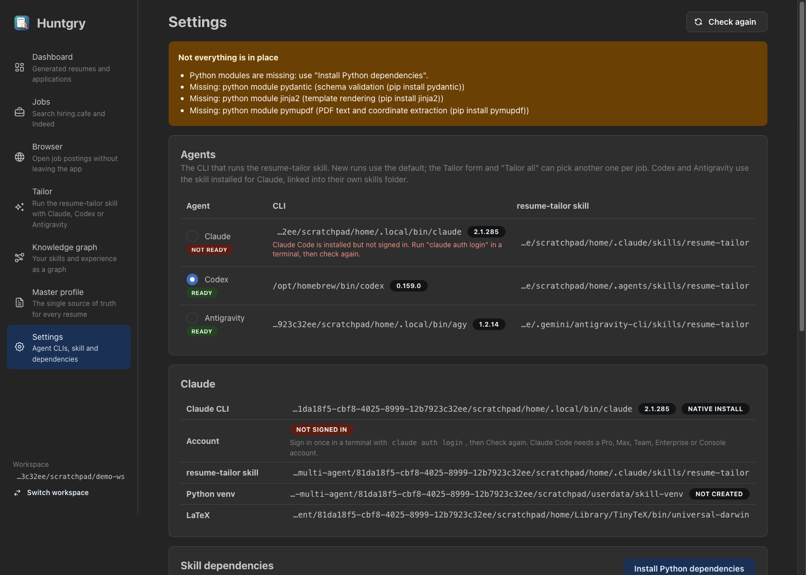
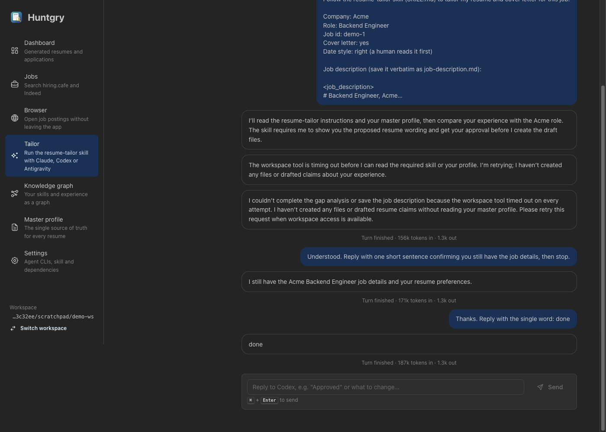
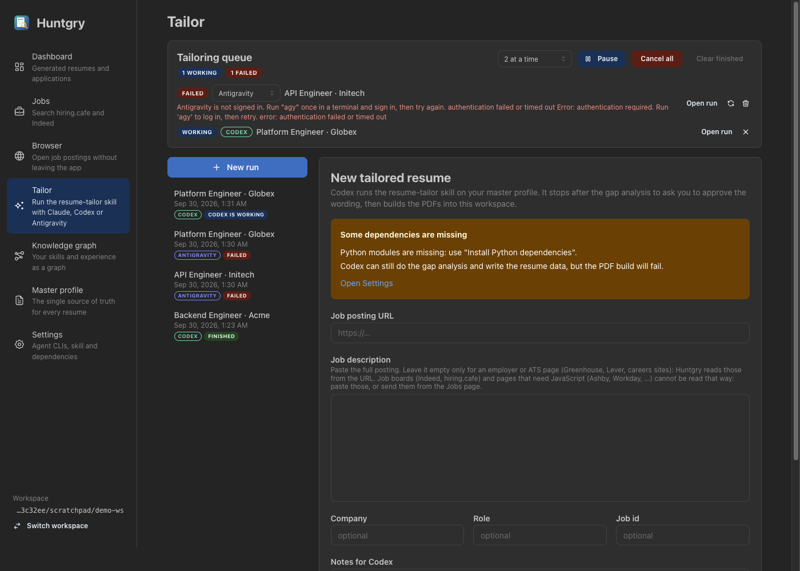

# #22: Choose the agent — Claude, Codex or Antigravity

Issue: [silentashish/huntgry#22](https://github.com/silentashish/huntgry/issues/22) · Builds on #8, #19, #21

## Context & problem

Huntgry ran the resume-tailor skill through exactly one agent, `claude -p`. The owner wants
to pick the agent: a **default** in Settings, a choice **per run** on the Tailor form and
**per job** in the bulk queue (#21), with a check that every agent can see the skill and a way
to make it visible. So one job can go to Claude and the next to Codex.

The three CLIs differ in ways that decide the design (checked on the dev machine on
2026-09-30: Claude Code 2.1.285, Codex CLI 0.159.0, Antigravity CLI 1.2.14):

| | Claude Code | Codex | Antigravity |
| --- | --- | --- | --- |
| Binary | `claude` | `codex` | `agy` |
| Multi-turn | stdin stream-json, one process | **no stdin stream**: one `codex exec --json` process per turn, replies with `codex exec resume <thread_id>` | stdin stream-json, one process, resume with `--conversation <id>` |
| Output | `system/init`, `assistant`, `user`, `result` | `thread.started`, `item.started/completed` (`agent_message`, `command_execution`, `file_change`, `mcp_tool_call`, …), `turn.completed{usage}`, `turn.failed` | `init`, `step_update` (`text_delta`, `tool_info`), `result{status, usage}` |
| Huntgry's context | `--append-system-prompt` | `-c developer_instructions=…` | no flag: prefixed to the first message |
| Cost | USD | tokens | tokens |
| Skills folder it loads | anywhere below `~/.claude/skills` | `~/.agents/skills/<name>` (direct children only) | `~/.gemini/antigravity-cli/skills/<name>` (also `~/.gemini/config/skills`) |
| Errors | `result.is_error`, stderr | `turn.failed`, stderr | `result{status: ERROR}`, `AGY_ERROR: {…}` on stderr, exit 3 |

## What changed and why

| Area | Files | Why |
| --- | --- | --- |
| Agent ids | `src/shared/runner-types.ts` | `AGENT_IDS = ['claude', 'codex', 'antigravity']`, `AGENT_LABEL`, `isAgentId`. The one list: validation, labels, adapters and every picker derive from it. `StartRunParams.agent?`, `RunSummary.agent`, `RunSummary.usage?`, `RunnerEnvironment.{defaultAgent, agents, sharedProblems}`, IPC `runner:set-default-agent`, `runner:link-skill`. |
| Adapters | `src/main/cli/agents/{types,claude,codex,antigravity,index}.ts` (new) | `AgentAdapter`: `turnMode` (`stream` / `exec`), `args()`, `firstMessage()`, `userMessage()`, `signal(event)` (→ `init` / `turn-end` / `keep` / `drop`), `explainFailure(stderr)`, `skillRoots(home)`. Claude's adapter wraps the unchanged `buildClaudeArgs`. Main builds every path and flag; the renderer only sends the agent id. |
| Runner | `src/main/cli/runner.ts` | Uses the run's adapter everywhere. **Exec agents** (Codex): the prompt is written to stdin and stdin closed; a clean exit after the turn leaves the run **waiting** with no process; a reply spawns `exec resume`; a second reply while a turn runs is refused; `endIdle()` ends (End) or stops (queue cancel) a waiting run that has no process. Resuming and ending a run with no process run one at a time per run, after the last process's writes are on disk, so two simultaneous replies cannot both spawn and End right after a turn cannot be overwritten by that turn's final save. `turn-end` with an error (Codex `turn.failed`, agy `status: ERROR`) makes the exit a failure with the agent's reason. So does a Codex turn with zero output tokens and no message, command or edit: otherwise the run would wait for a reply to nothing. Notices say `<Agent> stopped: …`. Token usage adds up in `run.usage`. |
| Run store | `src/main/cli/runs.ts` | `run.json` records `agent`; runs without it read as Claude. Replies always use the run's agent, never the current default (`contextForRun`). |
| Context per agent | `src/main/cli/start.ts`, `env.ts` (`findCli`) | `context(workspace, agent)`: Claude as before (version, sign-in check, sandbox settings, model from `~/.claude/settings.json`); Codex and Antigravity: their CLI, the skill as *they* see it, the same child env (venv, TeX, `CV_HOME`), Codex's `model` from `~/.codex/config.toml`. A start for an agent whose CLI or skill is missing fails before anything is fetched, with a pointer to Settings. `startTailorRun` fills the default agent when none is given. |
| Default agent | `src/main/workspace/settings.ts`, `start.ts` | `defaultAgent` in `userData/settings.json` (next to `currentWorkspace`); unknown values read as Claude. |
| Skill per agent | `src/main/cli/agents/skills.ts` (new) | `skillStatus(agent, home)`; `installAgentSkill` symlinks `<agent root>/resume-tailor` → the Claude copy (one copy to update), copies when a link cannot be made, replaces only its own dangling link, never a folder it did not make, and refuses when Claude's copy is missing. |
| Environment | `src/main/cli/environment.ts` | `agents: AgentStatus[]` (CLI path, `--version`, skill path, problems), `sharedProblems` (venv, LaTeX, preflight). `problems` / `ready` now mean *the default agent* plus the shared dependencies. |
| Transcript | `src/shared/transcript.ts` | `buildTranscript(events, agent)` dispatches to a Claude, Codex or Antigravity fold that all produce the same `TranscriptItem`s: messages, commands/tools with status and output, results with token usage (`formatUsage`), refused actions, errors. |
| Queue (#21) | `src/main/queue/queue.ts`, `queue/ipc.ts`, `src/shared/queue-types.ts`, `src/preload/queue.ts` | `QueueAgent = AgentId`; "Tailor all" sets the agent for the batch (default agent when absent); `queue:set-agent` changes one row until it starts (and before a retry). Cancelling a job stops its run even between Codex turns (`stopAny`: kill the process, or mark the idle run stopped). Older `queue.json` items read as Claude. A used-up quota (agy answers 429) is not retried automatically like Claude's burst limit. |
| UI | `components/AgentPicker.tsx` (new), `pages/tailor/{StartForm,RunView,RunList,QueuePanel,Transcript,status}.tsx`, `pages/jobs/BulkTailorModal.tsx`, `pages/settings/index.tsx`, `navigation.ts` | Settings **Agents** card (CLI + version, skill path or **Install skill**, default radio). Agent picker on the Tailor form and in **Tailor all**. Queue rows: agent select until the job starts, badge afterwards. Run view/list: agent badge, `<Agent> is working`, tokens instead of `$` for Codex/Antigravity, **End** also for a waiting Codex run. `PageParams['tailor'].agent` preselects an agent. |

### How a run reaches each agent

```mermaid
sequenceDiagram
    participant UI as Tailor form / bulk queue
    participant IPC as main: start.ts
    participant A as agents/<adapter>
    participant RM as RunManager
    participant P as claude · codex exec · agy
    UI->>IPC: runner.start({...form, agent}) / queue item {agent}
    IPC->>IPC: requireStartParams (agent ∈ AGENT_IDS, else default from Settings)
    IPC->>IPC: context(agent): CLI + skill as that agent sees it, else error → Settings
    IPC->>RM: start(params, ctx)
    RM->>A: args(), firstMessage() (agy: + Huntgry context)
    RM->>P: spawn in the workspace; stdin: first message (codex: then close stdin)
    P-->>RM: stdout lines → signal(): init · keep · drop · turn-end
    RM-->>UI: runner:event (raw), runner:run (status, agent, cost or tokens)
    UI->>UI: buildTranscript(events, run.agent)
    UI->>RM: reply(id, text)
    alt stream agent (claude, agy)
        RM->>P: one stdin line (or respawn with --resume / --conversation)
    else exec agent (codex)
        RM->>P: spawn `codex exec resume <thread>`, prompt on stdin, close stdin
    end
```

### Command lines

**Claude** — unchanged (`buildClaudeArgs`, see #8 and #19).

**Codex** (one process per turn, prompt on stdin):

```
codex exec --json --skip-git-repo-check --ignore-user-config --ignore-rules
  -C <workspace> -s workspace-write
  -c approval_policy="never" -c sandbox_workspace_write.network_access=false
  -c web_search="disabled" -c shell_environment_policy.inherit="all"
  -c developer_instructions="<Huntgry system prompt>" [-m <model from ~/.codex/config.toml>] -
codex exec resume <thread_id> <same flags, but -c sandbox_mode="workspace-write" instead of -C/-s> -
```

**Antigravity** (one process, NDJSON turns on stdin: `{"event":"user","message":{"content":"…"}}`):

```
agy --input-format stream-json --output-format stream-json --mode accept-edits --sandbox
  --print-timeout 0 --disable-slash-commands
  --add-dir <skill> --add-dir <skill real path> --add-dir <venv> [--add-dir <TeX root>]
  [--conversation <id>] --print=
```

### Isolation compared with the Claude setup

The Claude run allows only the skill's own scripts, reads only the workspace/skill/venv/TeX
and has no network (#8). The other CLIs cannot express all of that:

| | Claude | Codex | Antigravity |
| --- | --- | --- | --- |
| Network | none | none (`network_access=false`, web search off) | none (`--sandbox` default) |
| Writes | workspace (+ temp) | workspace (+ temp) | workspace, **and** the `--add-dir` folders (skill, venv, TeX) through agy's file tools |
| Reads | workspace, skill, venv, TeX only | **anything** the user can read | workspace + `--add-dir` folders for commands; file tools soft-denied outside |
| Commands | only the skill's scripts (allowlist) | **any** command inside the sandbox | any command inside the sandbox; approvals soft-denied headless |
| User config | ignored (`--setting-sources ""`) | ignored (`--ignore-user-config`, `--ignore-rules`) | **used** (agy has no per-run settings flag; permissions live in `~/.gemini/antigravity-cli/settings.json`) |

So a prompt injection in a job posting has more room with Codex and Antigravity than with
Claude: it still cannot send anything over the network, but it can run other commands (Codex)
or edit the linked skill (Antigravity). Settings and the picker do not warn about this today;
see Follow-ups.

## Decisions and alternatives rejected

- **Adapter per agent, not flags in `buildClaudeArgs`.** The CLIs differ in turn model, event
  vocabulary and error reporting, not only in flags. One file per agent keeps Claude's command
  line untouched (#19 edits it) and makes a fourth agent one file + one id.
- **Codex as `exec` per turn, not the app-server protocol.** `codex exec` is the documented
  headless interface and resumes by thread id; the JSON-RPC app server would be a second,
  larger integration for the same result.
- **`--print=` for agy, not `-p`.** Verified live: `-p` takes the prompt as its value, so
  `agy -p --input-format …` makes agy treat `--input-format` as the prompt (it says so and
  exits). An empty `--print=` with `--input-format stream-json` reads the turns from stdin.
  The message shape `{"event":"user","message":{"content":…}}` was also confirmed live (a
  malformed line is rejected with *missing the "event" field*).
- **Link the skill, copy as fallback.** One copy to update (Claude's, which #19 installs from
  GitHub); Codex documents symlinked skill folders. The Claude copy is linked by its real path.
- **Agents that are not ready stay selectable** in the pickers (marked with ⚠ and the reason
  on hover), but Start / Tailor all is blocked for them. Selecting one is how the form shows
  what is missing and offers **Install skill for <Agent>** in place; a disabled option cannot
  show a tooltip.
- **`problems` / `ready` follow the default agent.** Someone who only uses Codex should not see
  "claude CLI was not found" as a blocker. Claude-specific rows stay in the Claude card.
- **Tokens, not an estimated price**, for Codex and Antigravity: neither reports a price and
  their plans are subscription-based.
- **Quota errors are not auto-retried** by the queue: agy's 429 means the quota is used up for
  hours, unlike Claude's burst limiter.
- **Out of scope:** `insights/draft.ts` (bullet drafting) stays on Claude; per-agent model
  pickers; installing or signing in to Codex/agy from the app; the Claude skill download (#19).

## How to test

Automated (`npm test`, no real agent is called):

- `src/main/cli/agents/agents.test.ts`: every adapter's command line (Codex: `--json`,
  `workspace-write`, no network, `approval_policy="never"`, no `--ephemeral` or
  `danger-full-access`, resume without `-C`; agy: stream-json both ways, `--sandbox`,
  `--add-dir` for skill/venv/TeX, `--print=` last, never `--dangerously-skip-permissions`),
  stdin encodings, signals, `AGY_ERROR` parsing, Codex model from `config.toml`, agent status
  wording, skill link/copy/refusals with a temp home, transcripts from fixtures.
- `src/main/cli/runner.test.ts`: `RunManager` against `fixtures/fake-codex.mjs` (turn → waiting
  with no process, reply = `exec resume` in the workspace, double reply refused, finish without
  a process, crash, failed turn, exit without a turn, wrong agent refused) and
  `fixtures/fake-agy.mjs` (context in the first message only, same process between turns,
  resume by conversation, used-up quota, crash); old `run.json` reads as Claude.
- `src/main/queue/queue.test.ts`: per-item agents and the row override, cancelling a Codex job between turns, no automatic retry on
  a used-up quota, old items read as Claude.
- Fixtures: `codex-turn.jsonl` (real probe lines plus doc-shaped command/file items, since the
  shell tool did not run on the dev machine), `agy-quota.jsonl` / `agy-quota.stderr` (captured
  live), `agy-turn.jsonl` (doc-shaped).

Manual, done on 2026-09-30 in the dev app with an isolated `HOME` and `userData` (so nothing
was written to the owner's real skill folders), demo workspace:

1. **Settings → Agents** lists the three CLIs with versions. Codex and Antigravity show *Not
   installed*; **Install skill** creates the links, both turn *Ready*; choosing **Codex** as
   default is saved in `settings.json` ([screenshot](assets/22-settings-agents.png)).
2. **Tailor** preselects *Codex (default)*; Claude is marked (not signed in in that `HOME`)
   ([screenshot](assets/22-tailor-form.png)). A Codex run: the first turn ran, the run went to
   *Waiting for you* with no process and `156k tokens in · 1.3k out`
   ([screenshot](assets/22-codex-run.png)). A reply spawned `codex exec resume <thread>` and
   Codex answered from the same thread. **End → Finish conversation** marked it finished.
3. **Jobs → Tailor all** with two pasted jobs: the modal preselects the default agent
   ([screenshot](assets/22-bulk-modal.png)). With Antigravity chosen, both runs failed with
   *Antigravity is not signed in…* (agy's credentials are not in the isolated `HOME`). One row
   was switched to Codex and retried: the queue then held one failed Antigravity job and one
   working Codex job ([screenshot](assets/22-queue-mixed.png)).

**Verified by fixture only:** a complete Antigravity turn (quota exhausted until ~2026-10-01;
only the init line, the message shape, the flag set and the quota error were seen live), and
Codex command items. On this machine Codex's shell tool fails with *timed out negotiating with
the code-mode host* in every probe, sandboxed or not, so the Codex run above could not read
the skill; that is a Codex problem, not Huntgry's, and the adapter reports whatever Codex says.
**To verify live once possible:** a full Antigravity run (does `pdflatex` work under
`--sandbox` with the TeX root added? If not, drop `--sandbox` and record it here), and a full
Codex build to PDFs.





## Follow-ups

- Live end-to-end with Antigravity (quota) and Codex (code-mode host) — see above.
- Check Codex and Antigravity sign-in in Settings (today only Claude's is checked; a signed-out
  agy shows *Ready* and fails at start with a readable message).
- Say in the picker that Codex and Antigravity run with looser isolation than Claude.
- `findSkillDir` skips a *symlinked* `~/.claude/skills/resume-tailor` (it checks
  `Dirent.isDirectory()`); pre-existing, found while testing.
- Per-agent model choice in Settings.
