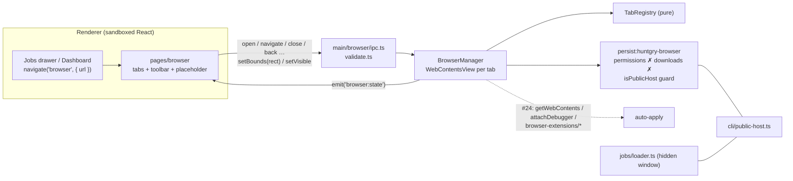

# #23 — Embedded browser: open job postings inside Huntgry

Issue: [silentashish/huntgry#23](https://github.com/silentashish/huntgry/issues/23) · Prepares #24 (auto-apply)

## Context & problem

Every job link (**Open posting** in the Jobs drawer, the posting icon and **Job posting**
on the Dashboard) was an `<a target="_blank">`. The main window's `setWindowOpenHandler`
handed it to `shell.openExternal`, so the user left Huntgry for the OS browser. The
ticket asks for a Chromium browser inside the app (tabs, Back/Forward/Reload, address bar,
an escape hatch to the system browser), built so the app can later drive the page for
auto-apply (#24): fill forms, upload the tailored `resume.pdf`, maybe load an extension.
So the browser must be owned and controllable by the main process from day one.

## What changed and why

| Area | Files | Why |
| --- | --- | --- |
| Shared SSRF guard | `src/main/cli/public-host.ts` (moved out of `jobs/loader.ts`) | The per-request, per-host-cached `isPublicHost` check built on `assertPublicUrl` now protects both the hidden job-board session and the browser session: shared code, not a copy. Resolver and clock are injectable, so the cache is tested. |
| Types / IPC | `src/shared/browser-types.ts`, `api.ts`, `events.ts`, `src/preload/browser.ts`, `src/main/browser/ipc.ts`, `validate.ts` | `window.huntgry.browser.{state, open, close, activate, navigate, back, forward, reload, stop, openExternal, setBounds, setVisible}` plus the `browser:state` event. The renderer sends URLs, tab ids and a rectangle only; main checks the tab id pattern (`tab-<n>`), text length (≤ 2000) and that the rectangle is finite and non-negative. |
| Address rules | `src/main/browser/url.ts` | `normalizeAddress`: `http(s)://` kept, a bare host gets `https://`, every other scheme (`javascript:`, `file:`, `data:`, `chrome:`, `view-source:`…) and non-URL text refused (no search engine). `isAllowedNavigation`: http(s) and `about:blank` only, applied to `will-navigate`, `will-redirect`, `will-frame-navigate` and popups. `loadErrorMessage` hides `ERR_ABORTED` and explains a blocked private address. |
| Tab registry | `src/main/browser/tabs.ts` | Pure tab order, active tab, "close → right neighbour, else left", 20-tab cap, copy-on-read snapshot. |
| Session | `src/main/browser/session.ts` | `persist:huntgry-browser`, separate from the job-board loader's jar. Permission requests and checks denied, downloads refused (the tab shows a notice), the shared public-host guard on every http/ws request. Loads unpacked extensions from `<userData>/browser-extensions/*` at startup (none ship; #24 hook). |
| Manager | `src/main/browser/manager.ts`, `src/main/index.ts` | One `WebContentsView` per tab (`sandbox`, `contextIsolation`, no `nodeIntegration`, no preload) added to the main window's `contentView`. Only the active tab is visible, at the placeholder's bounds, and only while the Browser page is shown. Popups to http(s) become tabs, everything else is denied. Page events (loading, URL, title, history, failures, crashes) patch the registry and emit `browser:state`. A context menu gives Cut/Copy/Paste, link actions, Back/Forward/Reload and "Open Page in System Browser". Views are closed when a tab closes, the window closes, or the app quits. `getWebContents(tabId)` and `attachDebugger(tabId)` are the #24 hooks (unused by the UI). |
| Browser page | `src/renderer/src/pages/browser/*`, `navigation.ts`, `AppLayout.tsx`, `App.tsx` | Full-bleed page (`FULL_BLEED`, no 1040 px wrapper or padding) between Jobs and Tailor: tab strip, toolbar, notice row, and a placeholder measured with `ResizeObserver` → `setBounds`. `setVisible(true)` on mount, `false` on unmount. `navigate('browser', { url })` opens the URL, or activates a tab already showing it. `Cmd/Ctrl+L` / `Cmd/Ctrl+T`. |
| Job links | `pages/jobs/JobDrawer.tsx`, `pages/dashboard/index.tsx`, `pages/dashboard/ApplicationDrawer.tsx` | Open the posting in the Browser page. Claude transcript links (Tailor) stay external. |



## Decisions and alternatives rejected

- **`WebContentsView`, not `<webview>`, `BrowserView` or `<iframe>`.** `WebContentsView` is
  Electron's current API and keeps each page's `webContents` in main, where #24 needs it
  (CDP debugger, `DOM.setFileInputFiles`, `session.extensions.loadExtension`). `BrowserView`
  is deprecated since Electron 30. The `<webview>` tag is officially discouraged and would
  need `webviewTag: true` on the main window. `<iframe>` fails on most job sites
  (`X-Frame-Options` / `frame-ancestors`) and gives no history or CDP.
- **Orca comparison.** Orca (inspected v1.4.216) uses `<webview>` with strict
  `will-attach-webview` hardening, one `persist:` partition per profile, and
  `webContents.debugger` for automation. We copy its *policies* (dedicated partition,
  denied permissions, navigation and popup guards, CDP from main), not the `<webview>`
  mechanism.
- **Trade-off: native views paint above the DOM.** No Mantine menu, tooltip or modal
  may extend over the page area. The Browser page renders none there; notices go in a row
  above the placeholder, and `setVisible(false)` exists for any future overlay.
- **Tab state lives in main.** Pages unmount on navigation, so React state would be lost.
  Main keeps the tabs; the page re-reads `state()` on mount.
- **Defaults for the open questions:** separate cookie jar from the job-board loader;
  downloads refused, with a notice and **Open in browser**; transcript links stay
  external; no search engine; tabs are not restored after a restart.
- **Keyboard:** `Cmd/Ctrl+W` is not bound. On macOS the default app menu owns it (Close
  Window), and focus inside a page does not reach the renderer's key handler anyway.
- `electron-tabs` (`<webview>`-era widget) and `electron-chrome-extensions` (GPL-3) were
  not used; Electron's built-in extension support is enough for a content script in #24.

## How to test

```bash
npm test && npm run typecheck && npm run build
```

Unit tests: `src/main/browser/browser.test.ts` (address normaliser, navigation
allow-list, load errors, tab registry, IPC checks), `src/main/cli/public-host.test.ts`
(guard and per-host cache), `src/renderer/src/navigation.test.ts` (Browser page in `PAGES`,
full-bleed, URL param) and `src/renderer/src/pages/browser/state.test.ts`.

Manual (`npm run dev`):

1. Jobs → a job → **Open posting**: the Browser page opens with the posting in a tab.
   Opening it again reuses that tab. Dashboard posting icon / **Job posting** do the same.
2. Type `example.com` in the address bar: `https://` is added and the page loads.
   `javascript:alert(1)`, `file:///etc/passwd` and `hello world` are refused with a
   message. `http://127.0.0.1:8080` shows "Blocked: … local or private-network address".
3. A link that opens a new window becomes a new in-app tab. **Open in browser** hands the
   page to the system browser.
4. Switch to Dashboard and back: the page is hidden, then returns with the same tabs.
   Resize the window: the page follows the placeholder.
5. Notifications or geolocation requests are denied. A download link shows the
   "Downloads are turned off" notice.
6. Quit with tabs open: no renderer processes are left behind.

## Follow-ups

- #24 auto-apply: drive a tab through `attachDebugger` (fill forms,
  `DOM.setFileInputFiles` with the tailored `resume.pdf`), or ship a content-script
  extension in `browser-extensions/`.
- Maybe later: share cookies with the job-board loader (a human check solved in-app would
  unblock Indeed searches), allow downloads, restore tabs after a restart, find-in-page, zoom.
- Like the loader, the request guard cannot pin DNS (Chromium resolves names itself).
