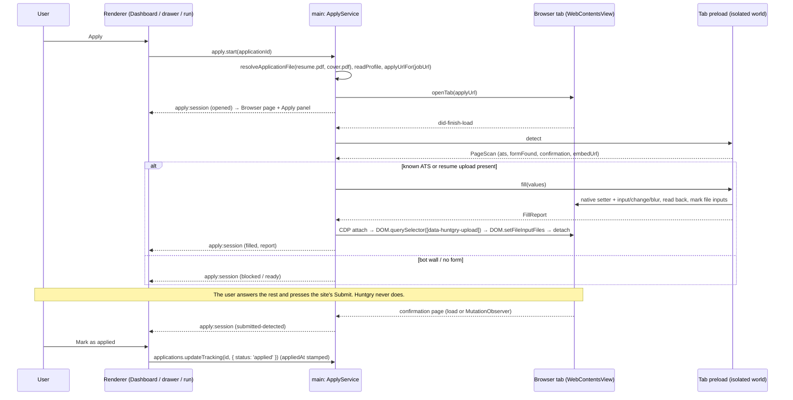
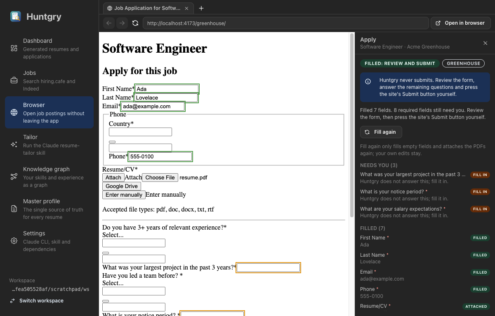
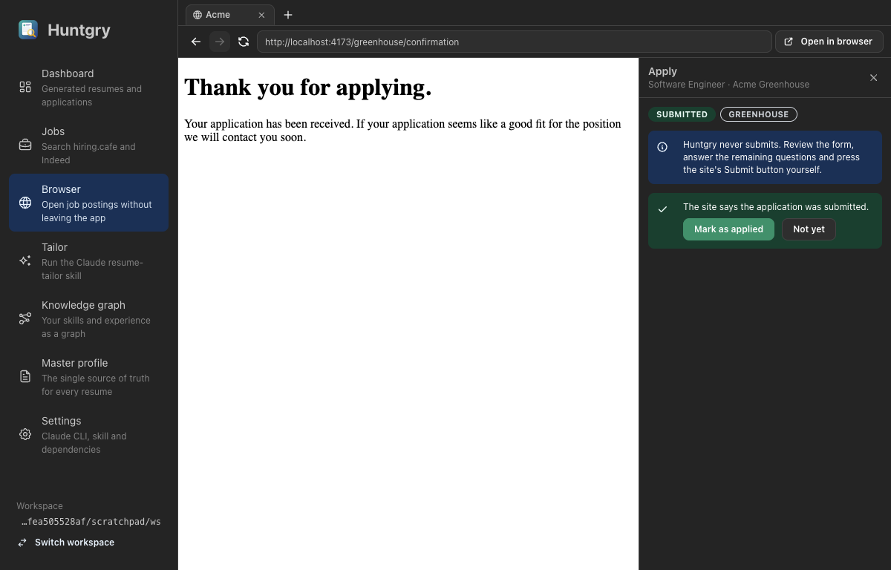
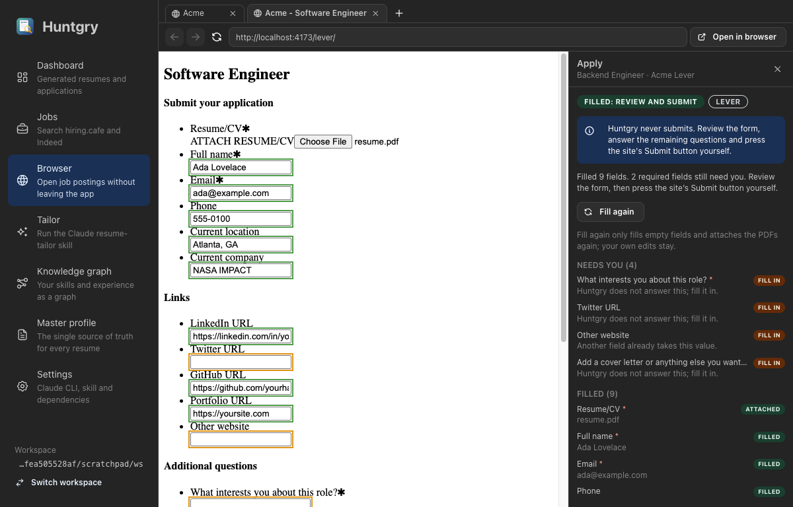
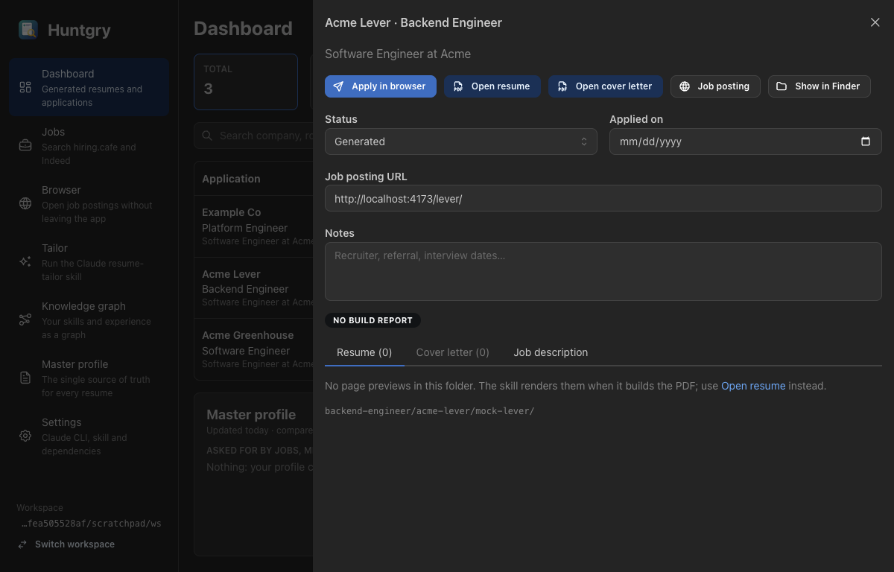
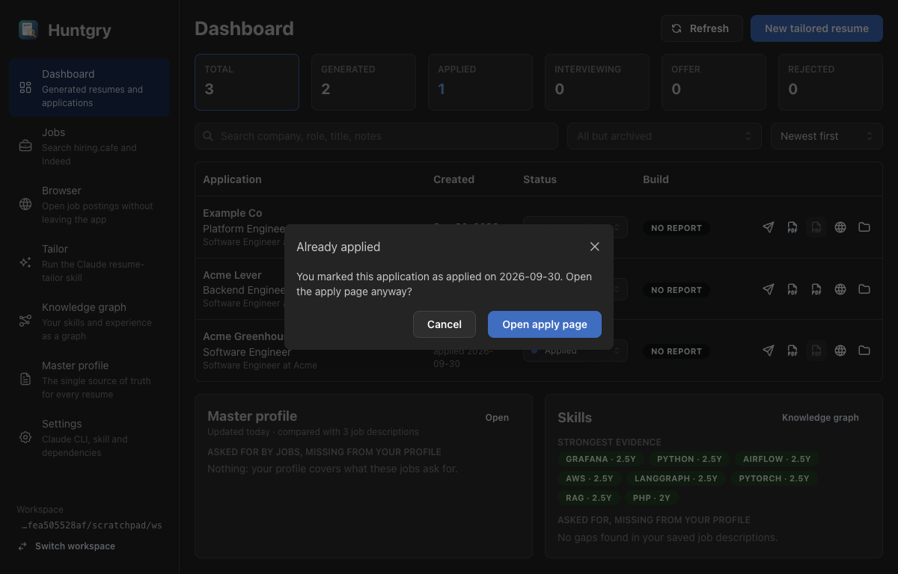

# #24 — Auto-apply: fill the application form in the in-app browser, attach the tailored PDF

Issue: [silentashish/huntgry#24](https://github.com/silentashish/huntgry/issues/24) · Builds on #23 (embedded browser)

> **Updated by #63** ([63-apply-generated-resume.md](63-apply-generated-resume.md)): the page is now filled only
> once it is ready and verified ~1 s later (Greenhouse's React hydration reset early fills), uploads count only
> when the site's widget shows the file, the landing page of the posting URL's redirects is trusted, embedded
> forms, late iframes and popup tabs are followed, and the adapters live in `src/shared/autofill/adapters/*`
> with optional hooks. The table and diagram below describe #24; where they disagree, #63 wins.

## Context & problem

After the resume-tailor skill writes `<role>/<company>/<job-id>/resume.pdf` (+ `cover.pdf`),
applying still meant opening the posting, finding the form, retyping name, email, phone and
links, and uploading the PDF by hand. The ticket asks for an **Apply** action that opens
the posting's apply page inside Huntgry, fills it from the master profile, attaches the
tailored PDF and leaves the user to review and submit.

**Owner decision (hard rule): Huntgry never submits an application.** Nothing may
click, press Enter in, or call `submit()` on an application form. The user reviews and
submits, and the "applied" status changes only when they confirm it. Development and tests
use local mock forms only; no real employer received anything.

Every serious product and open-source filler we looked at (Simplify Copilot, Jobright,
OpenApply, jobops-copilot, 5AM Apply…) also stops at the submit button. None of them offers a
"fill this page" API, so the engine is ours. It is small because it is deterministic.

## What changed and why

| Area | Files | Why |
| --- | --- | --- |
| Autofill engine (DOM only) | `src/shared/autofill/{engine,adapters,match,dom}.ts` (adapters are one file each under `adapters/` since #63) | Runs inside the job page (and in jsdom for tests). **Adapters** for Greenhouse (`#first_name`, `#last_name`, `#email`, `#phone`, `#resume`, `#cover_letter`, verified on a live board 2026-09-29) and Lever (`name`, `email`, `phone`, `org`, `urls[LinkedIn/GitHub/Portfolio]`, `resume`). Sites are recognised by host *or* by markup, so custom domains and the mock pages work. A **generic matcher** handles the rest, in order of trust: `autocomplete` token > `name`/`id` words > label text. A negative word (previous, former, reference, emergency, recruiter, confirm…) in the label, `name`/`id` *or* placeholder rules a field out, so `<label>Company <input name=previous_employer>` stays empty. Long labels count as questions, and when two fields tie for one value both are left to the user. **Writes** go through the prototype's native `value` setter, then `input`/`change`/blur, then a read-back (phones compare digits). A field the user already filled is kept. **File inputs** are only marked (`data-huntgry-upload="resume\|cover"`), and only when their label, name, id or group heading says resume/CV or cover letter; a portfolio, work-sample or unnamed upload is left to the user. **Never touched**: selects, comboboxes (react-select), checkboxes, radios, consent, EEO, passwords. **Confirmation page** detection per adapter plus a generic "thank you for applying / application submitted" heading on a page without a form. |
| Pure helpers | `src/shared/apply-url.ts`, `apply-values.ts`, `apply-types.ts`, `autofill-channels.ts` | `applyUrlFor`: Lever `+/apply`, Ashby `+/application`, others unchanged (idempotent, query kept, non-http refused). `fillValuesFrom(profile)`: contact block, name split (particles such as "van", "de la" stay in the last name), profile links turned into URLs, current employer from an experience entry that has not ended. |
| Tab preload | `src/preload/browser-page.ts`, `electron.vite.config.ts`, `src/main/browser/manager.ts` | A second preload entry loaded by every in-app tab: isolated world, **no `contextBridge`**, so the page's scripts cannot see or call it. It answers only main's `detect` and `fill` messages. After a detect it watches the page (`MutationObserver`, `popstate`) and reports a single-page "submitted" view once. It runs in the top frame only; `nodeIntegrationInSubFrames` stays off. |
| Apply service | `src/main/apply/{service,upload,validate,ipc}.ts` | One session at a time. `start(applicationId)` resolves `resume.pdf` / `cover.pdf` with `resolveApplicationFile` (confined, symlinks refused), reads the profile, opens `applyUrlFor(jobUrl)` in a new tab (`BrowserManager.openTab`), and on each load asks the page to scan itself. Known ATS forms, and other pages that have a resume upload, fill automatically once per URL, but only on the posting's own origin or an https Greenhouse / Lever host (`isTrustedApplyPage`; since #63 also where the posting URL's own redirects landed). Markup alone is not trusted, so on a page the user reaches on another site the panel names the host and waits for **Fill form**. One `start()` at a time: a second one while the first is still opening is refused. The marked inputs then get the PDFs through CDP (`attach` → `DOM.getDocument` → `DOM.querySelector` → `DOM.setFileInputFiles` → `detach` in `finally`, 10 s timeout), text first and files last because Lever's parser overwrites empty fields. Bot walls use the loader's `isBlockedPage` and show as **blocked**. A Greenhouse `/embed/job_app` iframe is opened directly in the tab. The confirmation page sets **submitted-detected** without touching tracking. Each fill is tied to the page it started on: if the page navigates or confirms submission meanwhile, the remaining uploads (checked before every CDP command) and the final status are dropped, so a stale fill can never overwrite *submitted* or touch the next document. Page replies are shape-checked, so a page cannot claim an upload or ask to upload into a non-file field. |
| IPC / events | `src/shared/api.ts`, `events.ts`, `src/preload/apply.ts`, `src/main/ipc.ts`, `src/main/index.ts` | `window.huntgry.apply.{start, fill, cancel, current}` and `apply:session`. The renderer sends an application id or a session id only. Values, paths and pages stay in main. Quit ends the session before the tabs close. |
| Dev-only local URLs | `src/main/cli/dev-urls.ts`, `browser/session.ts`, `browser/url.ts` | With `HUNTGRY_ALLOW_LOCAL_URLS=1` in an unpackaged build, **loopback** URLs pass the public-host guard so the mock ATS opens. Packaged builds ignore the variable, and private networks (10/8, 192.168/16…) stay refused. |
| UI | `components/apply/*`, `pages/browser/{ApplyPanel,apply-report}.tsx/ts`, `pages/browser/index.tsx`, Dashboard row, `ApplicationDrawer.tsx`, `tailor/RunView.tsx` | **Apply** (row icon), **Apply in browser** (drawer), **Apply** (finished run). Disabled with the reason when `resume.pdf` or the posting URL is missing, with a confirm step when the application is already marked applied (the Tailor run looks its tracking up by id). While one Apply is starting, the others wait. The **Apply panel** sits to the right of the page view, never over it, because native views paint above the DOM. It shows status, the ATS, the "Huntgry never submits" notice, Fill form / Fill again, and the report grouped into *Needs you* / *Filled* / *Your choice*. Once the site confirms, it shows **Mark as applied** / Not yet; after the tab closes, **Open again**. |
| Mock ATS | `scripts/mock-ats.mjs`, `src/shared/autofill/fixtures/*.html` | Local copies of the forms: Greenhouse and Lever are refreshed from live captures (2026-10-03, #63) and the mock replays their hydration, upload widget and résumé parser (`scripts/mock-ats/sites/`); generic is built by hand. Pressing a mock's own Submit records field names, values and file names to `<tmp>/huntgry-mock-ats/last-submission.json` and shows its confirmation page. |
| Typecheck | `tsconfig.page.json`, `tsconfig.node.json`, `package.json` | The in-page code needs the DOM lib. It gets its own `typecheck:page`, so main still compiles without DOM types. |









(Screenshots from the local mock ATS with a demo workspace; the page area is composited from
the tab's own capture because native views are not part of the window's DOM screenshot.)

## Decisions and alternatives

- **A preload on the tab, not a Chrome extension or `executeJavaScript`.** Electron
  supports extensions only partly (unpacked, limited MV3), and #23's `browser-extensions/`
  hook is not needed. Injecting a script with `executeJavaScript` would need a separately
  bundled engine string and runs in the page's main world, where the page can tamper with
  prototypes. A sandboxed isolated-world preload has the same DOM access as a content script,
  pristine prototypes, and typed IPC on `webContents.ipc`, which is scoped to that tab.
- **CDP for files.** A page cannot put a local file into `<input type=file>`.
  `DOM.setFileInputFiles` (Puppeteer's `uploadFile`) can, and the path never reaches the
  page. The debugger is attached for three commands and always detached, so DevTools
  conflicts are brief.
- **Greenhouse iframes are opened directly** rather than running the preload in subframes.
  Cross-origin iframes are separate CDP targets, which would need `Target.setAutoAttach`
  sessions, and `nodeIntegrationInSubFrames` would put the preload into every ad frame.
- **Two preload entries without `isolatedEntries`.** Sandboxed preloads cannot load shared
  chunks. electron-vite's `isolatedEntries` crashes when stdout is not a TTY (CI, agents), so
  the entries share no runtime module instead: channel constants live in
  `autofill-channels.ts`, and a guard test checks the imports.
- **Defaults for the ticket's open questions:** (1) fill automatically once a Greenhouse or
  Lever form (or any page with a resume upload) is detected, with **Fill again**; on other
  pages the panel waits for **Fill form**. (2) No automatic "applied": a one-click **Mark as
  applied** (detection can misfire; **Not yet** brings Fill form back). (3) `cover.pdf` is
  attached only where the form has a cover-letter *file* field; no pasting into text areas.
  (4) Custom, EEO and demographic questions stay with the user. (5) The panel is on the right
  of the Browser page and appears only during a session.
- **Fill again never overwrites** a non-empty field that differs from the profile (reported
  as *Kept yours*). The user's edits win.
- **The owner's safety rule is enforced by a test** (`guard.test.ts`): the engine, the tab
  preload, the service and the upload helper may not contain `.submit(`, `requestSubmit`,
  `.click(`, synthetic keyboard/mouse/pointer/submit events, `sendInputEvent` or CDP
  `Input.dispatch*`.

## How to test

```bash
npm test && npm run typecheck && npm run build
```

Unit tests:

- `src/shared/autofill/autofill.test.ts` (jsdom). Greenhouse, Lever and generic fixtures:
  what is filled, kept, skipped, ambiguous or unmatched; the `#resume` / `resume` / "Upload your
  CV" inputs are marked but portfolio, work-sample and unnamed uploads are not
  (`generic-portfolio.html` is not treated as an application); labels that contradict a
  negative name or placeholder are left empty; `submit`, `requestSubmit`, `click` and key/mouse events
  are spied and must stay silent. Also confirmation pages vs forms ("thanks for your
  interest" does not count), the embed URL, and the native-setter cases (React-style
  shadowed `value`, rejected value, reformatted phone).
- `src/shared/apply.test.ts`: `applyUrlFor`, `atsForHost`, embed URL check, `splitName`,
  `asUrl`, current employer, empty profile.
- `src/shared/autofill/guard.test.ts`: the no-submit guard, and that the two preload entries
  share no runtime module.
- `src/main/apply/apply.test.ts`: the service against a fake tab running the real engine on
  jsdom. Covers refusals (no URL, no `resume.pdf`, symlinked `resume.pdf`, ids outside the
  workspace); the full Greenhouse flow with the exact CDP sequence and path, detached also on
  failure; a delayed fill overtaken by the confirmation page, and an upload held mid-way while the
  page confirms submission (both dropped, status stays *submitted*); confirmation without touching `huntgry.json`; Lever `/apply`; the Greenhouse
  embed; blocked / ready pages; no auto-fill on a generic page without an upload; cancel,
  second start and tab close; the upload timeout; page-reply validation; and the dev-only
  loopback rule.
- `src/renderer/src/components/apply/blocker.test.ts`, `pages/browser/apply-report.test.ts`.

Manual (the PR lists which steps were run for it):

1. `node scripts/mock-ats.mjs`, then `HUNTGRY_ALLOW_LOCAL_URLS=1 npm run dev`. Use a workspace
   with a built application whose posting URL is `http://localhost:4173/greenhouse/` (also
   `/lever/`, `/generic/`).
2. Dashboard → **Apply**: the Browser page opens the form in a new tab, and the panel shows
   *Greenhouse* and *Filled: review and submit*. First/last name, email, phone and the
   location question are outlined green; `resume.pdf` shows next to Attach. Country and the
   yes/no questions are listed under *Your choice*, the free-text questions under *Needs
   you*. Nothing was posted (the mock logs nothing).
3. Press the mock's own **Submit application** (or open `/greenhouse/confirmation`): the
   panel shows **Mark as applied**. `huntgry.json` is unchanged until you click it; then the
   status is *Applied* with today's date.
4. Apply again on that row: "Already applied on …, open the apply page anyway?"
5. Lever: name, email, phone, company and links are filled (the location autocomplete is left to you), and
   *Other website* / *Twitter* / the textarea are left; no radio, select or checkbox is
   changed. Generic: the two *Phone* fields are left (*Unsure*); *Previous employer* and
   *Emergency contact phone* are not filled.
6. Close the apply tab: the panel says *Tab closed* with **Open again**. Quit with a session
   open: no processes left.
7. Optionally, on a real public Greenhouse or Lever posting: fill only, look, **do not
   submit**, close the tab.

## Follow-ups

- **Phase 2:** Ashby adapter (`_systemfield_*` ids, `/application` URLs are already
  resolved), SmartRecruiters and Workable. Single-value comboboxes (country, "How did you
  hear about us") by choosing the option that equals the value. Remembered answers to
  repeated custom questions (`.huntgry/apply-answers.json`).
- **Phase 3:** Workday page by page (My Information only, no account creation);
  Claude-drafted answers to custom questions, previewed and tool-less like
  `insights/draft.ts`; cover-letter text from `cover_data.json` for textarea-only forms.
- ~~The Lever fixture is built from documented markup.~~ Refreshed from a live page in #63.
- Greenhouse's embed is opened in place of the company page. Filling inside the iframe would
  need CDP target sessions (`Target.setAutoAttach`, flattened).
- **Never:** clicking Submit, solving captchas, LinkedIn Easy Apply or Indeed Apply
  automation, bulk applying.
