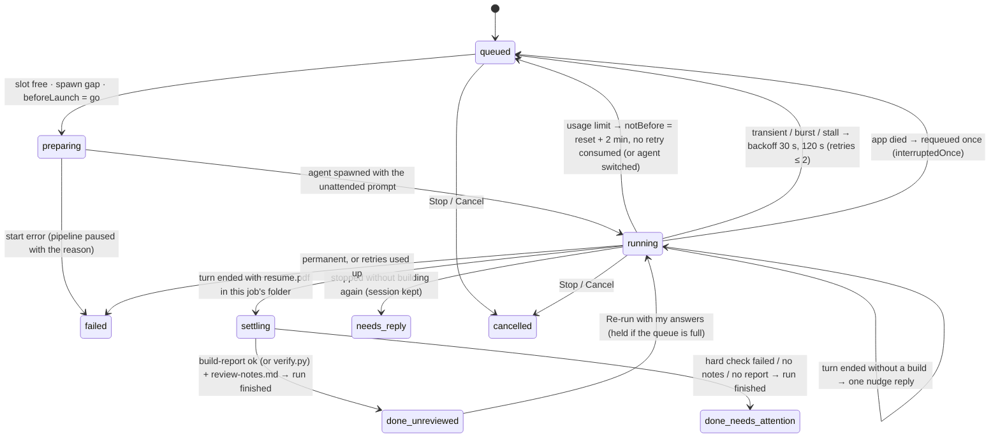
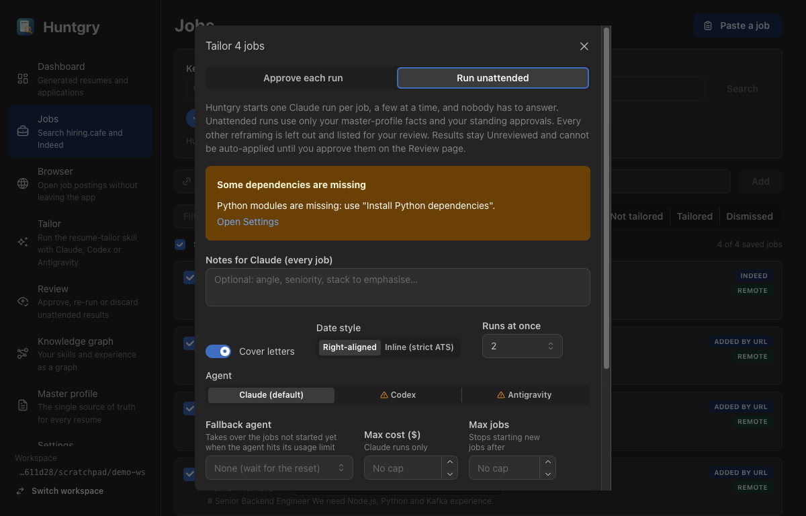
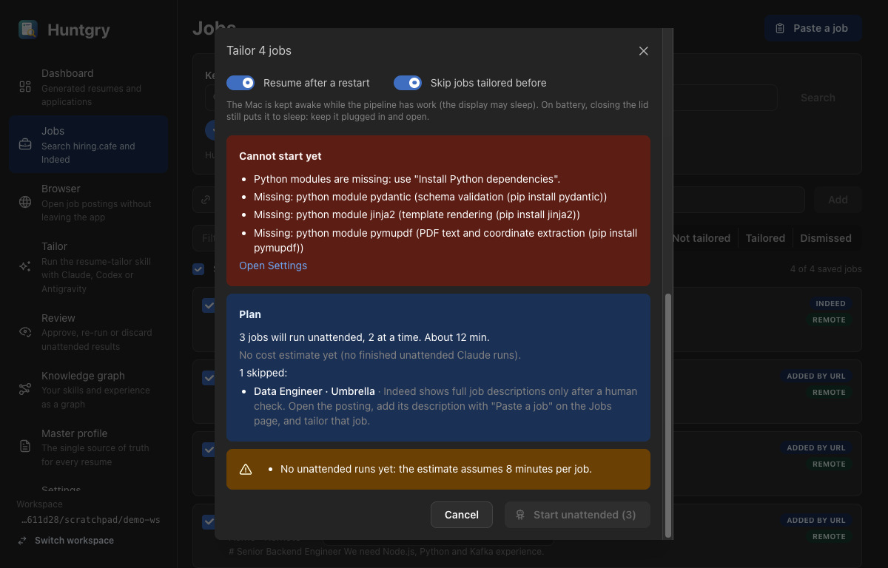
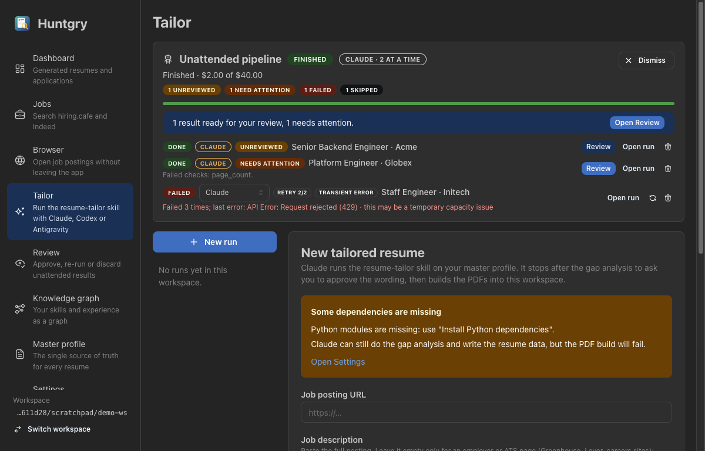
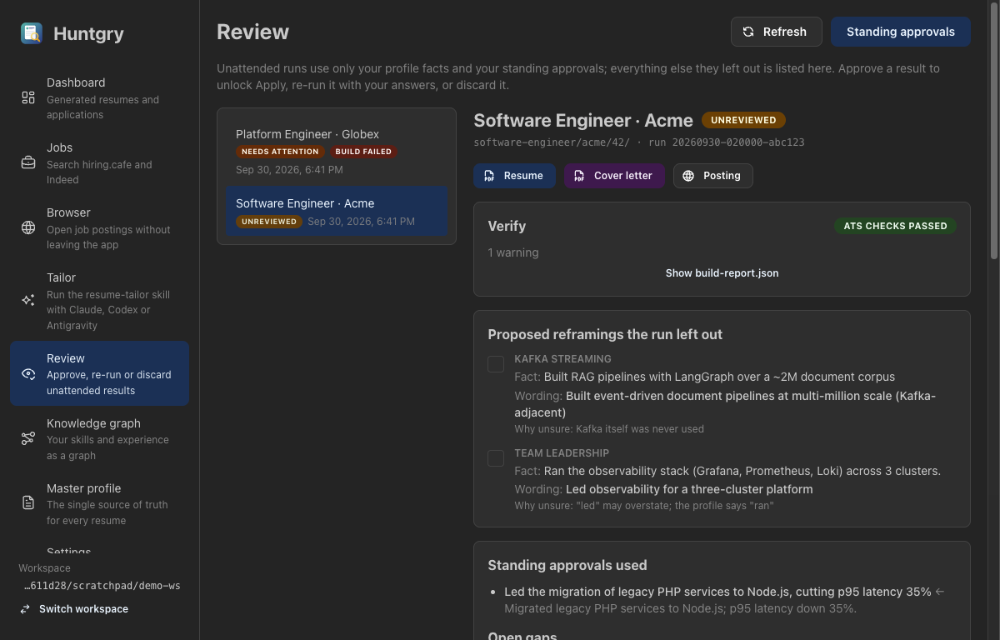
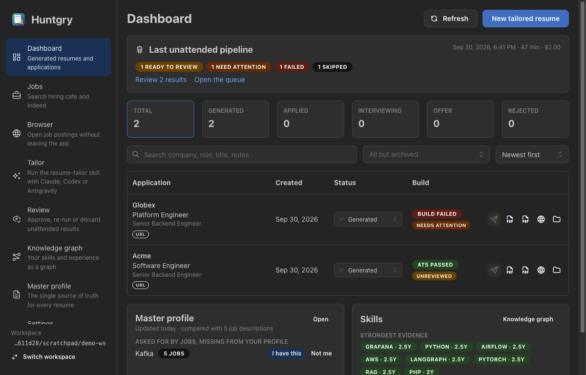

# #31: Unattended bulk tailoring pipeline

Issue: [silentashish/huntgry#31](https://github.com/silentashish/huntgry/issues/31) · Builds on #21, #22, #24 · Implements the `pipeline.*` / `review.*` services of ADR-0001 for #41 and #42

## Context & problem

**Tailor all** (#21) only *starts* runs. Every run stops at the skill's step 3 ("Stop and get
approval") and waits as **Needs your reply**; a used-up quota fails the item; the queue reloads
paused after a restart; nothing keeps the Mac awake. The owner wants to tick up to 100 jobs,
press one button, walk away for hours, and come back to a summary: what is ready, what needs a
look, what failed.

The hard part is honesty. The skill's rule ("never invent", "when unsure whether a reframing is
honest, ask the user") assumes a human. Unattended runs replace the human with two rules: **use
only master-profile facts and standing approvals; leave anything else out and write it down.**
Every unattended result is **Unreviewed** until the user approves it on the new Review page, and
auto-apply (#24) is blocked until then. Approvals of reframings become **standing approvals**
that later unattended runs may reuse.

Everything else is plumbing for hours-long, nobody-watching operation: usage-limit detection with
a parsed reset time, transient-error backoff, a stall watchdog, keep-awake and wake handling,
crash recovery, an optional budget, a verify gate, notifications and a summary.

## What changed and why

| Area | Files | Why |
| --- | --- | --- |
| Unattended prompt | `src/main/cli/command.ts` (`unattendedBlock`, `ATTENDED_APPROVAL_LINE`), `start.ts` | `buildSystemPrompt({ unattended })` replaces the one step-3 sentence with the user's standing decision: never ask; use only direct hits and the listed standing approvals; leave everything else out; write `review-notes.md` in a fixed format before the build; build and verify in the same turn. The attended prompt is byte for byte what it was. `context()` loads the workspace's approvals (newest first, capped at 150 entries / 32 KB) when `params.unattended` is set; `contextForRun` reads `run.unattended`, so replies and re-runs keep the variant. The skill is unchanged. |
| Review notes | `src/main/review/notes.ts` | Tolerant parser (heading case and order, `-`/`*` bullets, missing sections, wrapped lines). Reframing ids are `sha256(sourceFact + "\n" + wording)` after whitespace normalisation, so the desktop and the phone (#42) agree. An unparsable file yields no reframings and a `parseWarning`; the raw notes are still shown, but nothing can be saved as a standing approval from it. |
| Standing approvals | `src/main/review/approvals.ts`, `<workspace>/.huntgry/approved-reframings.json` | `load`, `add` (dedupe by id, atomic temp+rename, serialised per workspace), `remove`, `removeAll`, `approvalsForPrompt` (the cap). Only the review service writes it, and only with source-fact → wording pairs read from disk for ids in the shown revision; never free text from a client. |
| Review state | `src/shared/review-types.ts`, `applications/tracking.ts` (`normalizeReview`), `scan.ts` (`review-notes.md` is a known file) | `huntgry.json.review = { state: unreviewed \| needs-attention \| approved \| discarded, runId, at, reason?, reviewedAt?, via? }`. |
| Apply gate | `apply/service.ts` `open()`, `components/apply/blocker.ts` | Main refuses Apply for unreviewed, needs-attention and discarded results with the same message the UI shows (`reviewBlocker`, shared). The #24 guard tests are untouched. |
| Review service | `src/main/review/service.ts`, `ipc.ts`, `src/preload/review.ts` | `listReviews`, `reviewDetail` (notes, gaps, reframing ids, verify report, artifact hashes, page previews, `revision = sha256(notes ‖ gaps ‖ ids ‖ report ‖ artifact hashes)`), `approveReview`, `rerunReview` (the decisions go to the run's own session through the queue; the result is Unreviewed again), `discardReview` (archived, files kept). Stale revisions and ids outside the revision are refused without writing. Every decision is appended to `.huntgry/review-audit.jsonl`. Validators live here so #42's gateway shares them. |
| Runner | `cli/agents/claude.ts`, `agents/types.ts`, `cli/runner.ts` | Claude's `rate_limit_event` is no longer dropped: a `rate-limit` signal is kept on `run.rateLimit` (not in the transcript). A `result` with `is_error` ends the turn with its text as the error, so a usage-limit run fails with the reason. `lastOutputAt` is stamped on every stdout line (the watchdog reads it). `abort(id, reason)` kills a run and fails it with that reason (not `stopped`, which the queue reads as cancelled). **Fix:** the run reads as `waiting` only once the output folder is recorded, so no summary says the turn ended without carrying the folder (a summary queued earlier, for the session id, used to leak `waiting` + no folder). |
| Failure classification | `src/main/pipeline/failures.ts` | `classifyFailure` → `usage-limit` (Claude session/weekly/model limit with the `rate_limit_event` epoch preferred over text; Codex usage limit; Antigravity `RESOURCE_EXHAUSTED`), `spend-limit`, `burst-limit`, `transient`, `stall`, `permanent`. `parseResetTime` reads `resets 3:45pm` / `resets Mon 12:00am` (local time, a zone suffix is ignored), `try again at Sep 24th, 2026 7:24 AM`, `Resets in 34h23m28s`; a past time rolls over, > 8 days reads as unparsed. Unparsed limits wait 60 min, 2 h, 4 h. Backoff 30 s then 120 s, ±20 % jitter. |
| Queue | `src/main/queue/queue.ts`, `src/shared/queue-types.ts` | One executor stays. Items gain `unattended`, `pipelineId`, `retries`, `lastFailure`, `outcome`, `applicationId`, `interruptedOnce`, `nudged`, `startedAt`. The policy comes from the pipeline through `UnattendedHooks` (`beforeLaunch`, `settle`, `onFailure`, `onStartError`, `onChange`, `onLoad`). A `waiting` turn is settled (verify gate, nudge, needs-reply) instead of freeing the slot; a failure is retried or failed as decided; a failed run that already built goes to the verify gate. `reply()` accepts a done unattended item (re-run). The pipeline record is persisted under `pipeline` in `queue.json`. On load, interrupted unattended items are requeued once (`interruptedOnce`; a second time fails them) and, when the pipeline asked to resume after a restart, the queue reloads unpaused (nothing pumps until `pipeline.init()`). |
| Pipeline | `src/main/pipeline/pipeline.ts`, `service.ts`, `verify.ts`, `ipc.ts`, `power.ts`, `notify.ts`, `src/shared/pipeline-types.ts`, `src/preload/pipeline.ts` | `Pipeline` (Electron-free, deps injected): `plan` (agent, fallback, shared dependencies, ≥ 500 MB free disk; per job saved / not dismissed / not queued / not tailored before / full posting fetched up front, 3 at a time; estimate from the median of the last 20 unattended runs, 8 min without history; cost estimate for Claude), `start`, `pause`, `resume({ budget })`, `stop`, `state`, `lastSummary`, `dismiss`, `onRun`, `wake`, `init`. Usage limit → wait until reset + 2 min (status `waiting-limit`, `notBefore` on the items, keep-awake while the wait is under 6 h) or switch the not-started jobs to the fallback agent. A rejected `rate_limit_event` holds new launches before the failure arrives. Budget (`maxJobs` all agents, `maxCostUsd` Claude only) is checked before each spawn → `stopped-budget`. A 60 s tick aborts runs silent for `stallMinutes` (default 20), clears passed limits and re-pumps. `finished` when no item is queued, preparing or running: `pipeline-summary.json`, a notification, the dock badge (unreviewed + needs attention), `pipeline:finished`. `power.ts` wraps `powerSaveBlocker('prevent-app-suspension')` and `powerMonitor` (resume → `wake()`, battery → warning); `notify.ts` wraps `Notification` and `app.dock.setBadge` (never throw). |
| App lifecycle | `src/main/index.ts` | `initPipeline()` after the window (5 s grace in packaged builds, 2 s in dev); `before-quit` releases keep-awake, then stops the queue, then the runs. |
| UI | `pages/jobs/BulkTailorModal.tsx`, `pipeline-plan.ts`, `pages/tailor/PipelinePanel.tsx`, `QueuePanel.tsx` (`QueueRow`), `pages/review/*`, `pages/dashboard/{ReviewBadge,LastPipelineCard}.tsx`, `pages/settings/StandingApprovalsCard.tsx`, `navigation.ts`, `AppLayout.tsx` | Mode switch *Approve each run* / *Run unattended* with fallback agent, cost and job caps, stall threshold, resume-after-restart, skip-tailored, the honesty explanation; **Continue** shows the plan, **Start unattended** starts. The Tailor page shows the pipeline panel (progress, status line, counts, ETA, cost of budget, keep-awake and battery badges, Pause / Resume / Stop / Dismiss, raise budget) with the pipeline's rows (retry and failure chips, countdowns, outcome badges, **Review**); other queue items keep the queue panel. The **Review** page lists Unreviewed / Needs attention results: notes (Markdown), tickable reframings, used approvals, gaps, verify report, page previews; **Approve** (ticked reframings become standing approvals), **Re-run with my answers**, **Discard**; a stale revision asks to reload. Dashboard rows and the drawer show the review badge, Apply is disabled with the reason, and a **Last unattended pipeline** card links to Review. Settings gets the **Standing approvals** card (remove one or all, cap notice). |
| Fixtures | `fake-claude.mjs`, `fake-codex.mjs`, `fake-agy.mjs` | `USAGE_LIMIT[:epoch]`, `RATE_WARN`, `STALL`, `ASK`, `WRITE_NOTES`, `VERIFY_FAIL`, `NO_NOTES`; the output folder now follows the prompt's job id; `SECOND:` marks a reply's mode words. |

## Diagrams

```mermaid
stateDiagram-v2
    direction LR
    [*] --> running: Start unattended (plan OK, ≤ 100 jobs queued as unattended)
    running --> waiting_limit: usage limit or quota, no usable fallback
    waiting_limit --> running: reset + 2 min reached, or wake after it
    running --> running: fallback agent set → not-started jobs switch agent
    running --> paused: Pause · start error · spend limit · restart without resume-after-restart
    paused --> running: Resume
    running --> stopped_budget: job or Claude cost cap reached
    stopped_budget --> running: raise budget + Resume
    running --> stopping: Stop (cancel queued, kill running)
    stopping --> finished
    running --> finished: nothing queued, preparing or running
    finished --> [*]: pipeline-summary.json, notification, dock badge, pipeline:finished
    note right of running: keep-awake on · 60 s tick: watchdog, passed limits · budget check before each spawn
```



```mermaid
sequenceDiagram
    participant Q as TailorQueue
    participant R as RunManager
    participant C as claude -p
    participant P as Pipeline
    participant E as events / notify / power
    Q->>R: start(params{unattended}, ctx{unattended prompt + approvals})
    R->>C: spawn
    C-->>R: rate_limit_event {status: rejected, resetsAt}
    R-->>P: runner:run (rateLimit) → hold new launches
    C-->>R: result is_error "You've hit your session limit · resets 3:45pm", exit 1
    R-->>Q: run waiting + error, then failed
    Q->>P: onFailure → classifyFailure → usage-limit, until = resetsAt + 2 min
    P->>Q: requeue (retries unchanged), notBefore = until; status waiting-limit
    P->>E: pipeline:changed · Notification "paused until 3:47pm" · keep-awake stays on (< 6 h)
    Note over Q,P: other runs hitting the same wall are requeued the same way
    E-->>Q: timer at until (or powerMonitor resume → pipeline.wake)
    Q->>P: beforeLaunch → limit passed → go
    Q->>R: start again
```

## Design decisions

- **One executor.** The pipeline is a record plus policy over the queue, not a second scheduler. Attended and unattended items share the queue, the concurrency and the spawn gap; the pipeline counts only its own items.
- **Policy through hooks.** `UnattendedHooks` keeps the queue a mechanism (slots, persistence, process control) and the pipeline a policy (what a turn's end or a failure means). Both are tested against the real `RunManager` and the fake agents.
- **Strict auto-approve + Unreviewed gate**, as the owner decided: an unattended run never softens or invents; everything it would have asked about is left out and listed. The gate is enforced in main (`ApplyService.open`), not only in the UI.
- **Ids and revisions as in ADR-0001**, so #42's gateway is a `case` per command: `sha256(sourceFact + "\n" + wording)`, `revision` over the whole shown detail, stale and forged ids refused without a write.
- **Limits are pipeline-level.** Items go back to `queued` with `notBefore`; `QueueItemStatus` is unchanged, so `RemoteQueueItem.status` (ADR) is untouched.
- **A run's folder must be its own.** The verify gate only accepts an output folder whose job-id segment matches the job the agent was told to use. `findOutputFolder` prefers that match anyway; the extra check means a folder another run wrote seconds earlier can never be recorded as this job's result (the fakes exposed exactly that).
- **Fallback only on usage limits**, never on other failures; items already started keep their agent and session.
- **Re-run → Unreviewed again** with a new revision (open question 4); the user glances and approves.
- **Notifications are pipeline-level** (finished, limit, budget, cannot continue); the dock badge counts unreviewed + needs attention. Nothing per item.

The 12 open questions of the brief were taken with their recommended defaults (no proactive pause on `allowed_warning`, keep-awake under 6 h, skip tailored-before with a checkbox, Unreviewed after a re-run, one nudge, 150 / 32 KB cap, USD budget counts Claude only, fallback on limits only, shared queue, discard keeps files, 20 min stall editable 5–60, no per-item notifications).

### Alternatives considered

- A separate pipeline scheduler with its own process pool: rejected, two schedulers would fight over Claude's burst limit and the user's concurrency setting.
- A two-phase batch (gap analyses first, one approval screen, then builds): rejected by the owner; the Unreviewed gate gives the same safety with results ready in the morning.
- Pausing on `allowed_warning` (e.g. 96 % of the window used): rejected; the warning is shown in the panel and the hard `rejected` event holds launches.
- Snapshotting the run summary in `touch()` to fix the `waiting`-without-folder race: rejected, a later `touch` could then persist a stale snapshot; setting `waiting` inside the folder step with a `turnEnded` flag for the close handler is the smaller change.

## Screenshots

| | |
| --- | --- |
|  |  |
|  |  |
|  | |

## How to test

Automated (`npm test`, fake agents only):

- `cli/cli.test.ts`: the unattended prompt variant (rule, notes format, approvals JSON, no "wait for the user" line; attended prompt unchanged).
- `cli/runner.test.ts`: `rate_limit_event` → `run.rateLimit`, `lastOutputAt`, error result → failed with the reset epoch, `abort()`, `unattended` persisted.
- `review/notes.test.ts`, `approvals.test.ts`, `service.test.ts`: format and tolerance, stable ids, cap; add/dedupe/remove/atomic/broken file; detail + revision, approve writes only ticked on-disk pairs, forged / cross-application / stale / regenerated-PDF refused without a write, re-run on the real fake session, discard, audit, validators.
- `pipeline/failures.test.ts`: every classification row for the three agents, reset-time parsing, backoff and unparsed waits.
- `pipeline/pipeline.test.ts` (real queue + `RunManager` + fakes, fake clock): concurrency cap with 6 jobs, all Unreviewed with `review-notes.md`; needs attention on a failed check / missing notes; one nudge then needs-reply with the session kept; usage limit → `waiting-limit` with `until` = reset + 2 min, no retry, launches held, resumes after the clock passes; fallback agent switch; crash retried at +30 s / +120 s then failed; stall watchdog; job cap and Claude cost cap with resume; pause / resume / stop; shared concurrency with an attended item; restart recovery (once, then failed; paused with a notice when off); start error pauses with the reason; re-run of a done item; plan skips and blockers; summary, utilisation, dismiss; old queue files; input validation.
- `apply/apply.test.ts`, `components/apply/blocker.test.ts`: the gate for unreviewed / needs-attention / discarded, approved passes.
- `pages/jobs/pipeline-plan.test.ts`: durations, reset times, plan summary, status line, progress.

Manual (done against a seeded demo workspace, the app launched with `--user-data-dir` pointing at a scratch folder; see the screenshots):

1. Jobs → tick jobs → **Tailor all** → **Run unattended** → **Continue**: the plan lists the skipped Indeed job with the paste hint, the estimate and the blockers of the scratch profile (no venv) with the Settings link.
2. Tailor: the pipeline panel shows a finished pipeline with its counts, cost of budget, rows with outcome badges, a failed row with `retry 2/2 · transient error`, and **Review** buttons.
3. Review: list, detail with verify, reframings (tick one → "Approve (+1 standing)"), used approvals, gaps, Markdown notes, re-run box, discard confirmation.
4. Dashboard: review badges, Apply disabled with the reason, the last-pipeline card. Settings: the standing approvals card.

Not exercised by hand (needs a real exhausted window or hours of runs): a live Claude usage limit, keep-awake under `pmset -g assertions`, and a real restart mid-pipeline. All three are covered by the automated tests with fakes and injected power/clock.

## Follow-ups

- #41 / #42: the gateway calls `pipeline.*` on the `Pipeline` instance and `review/service.ts` with `via: 'phone:<id>'`.
- The Codex and Antigravity fakes write no `review-notes.md`, so their unattended results read as Needs attention in tests; real runs get the same prompt and should write it.
- A fallback agent's readiness is checked at plan time only; if its CLI disappears mid-pipeline the switched jobs fail with a start error and the pipeline pauses with the reason.
- `verify.py` as the fallback gate needs the venv; without it a report-less result is Needs attention ("verify.py could not be run"), which is the safe side.
- The proactive hold on a rejected `rate_limit_event` lasts at most 10 min if no failure follows (defensive; a rejected event is always followed by an error result in practice).
