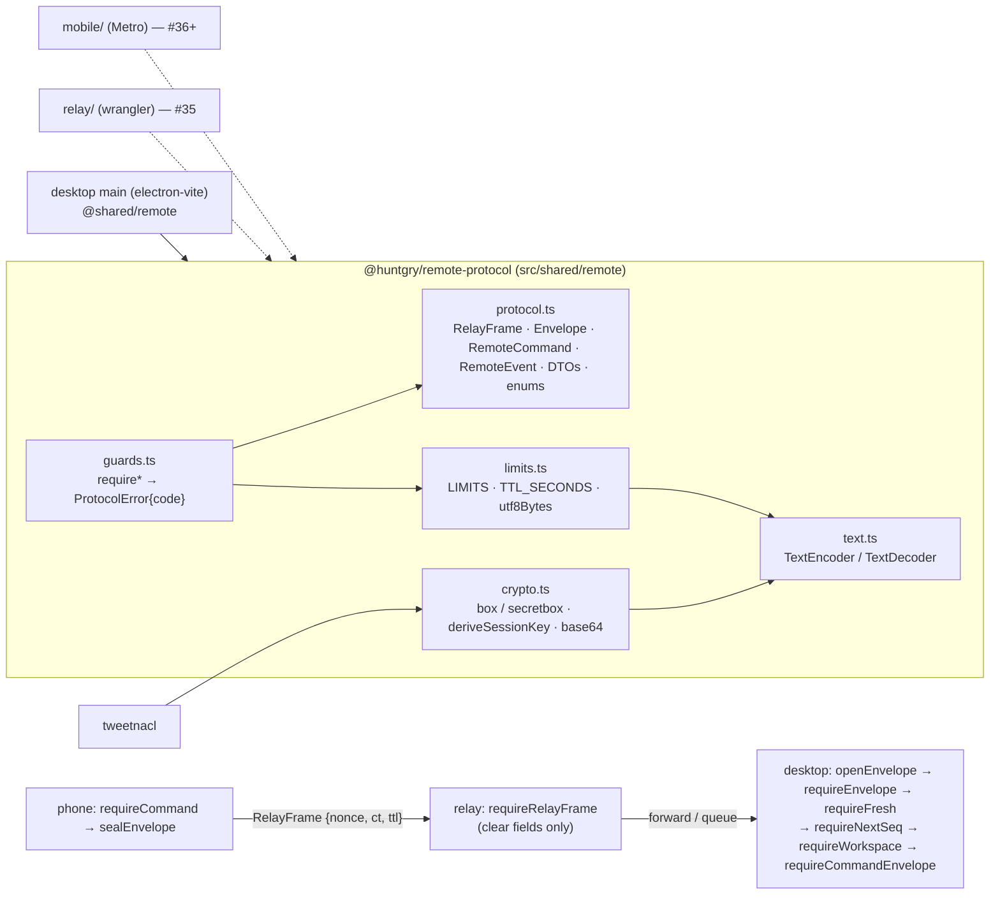

# #34 — Remote protocol package (`@huntgry/remote-protocol`)

Issue: [silentashish/huntgry#34](https://github.com/silentashish/huntgry/issues/34) · Epic #33, E1 · Spec: [ADR-0001](../adr/0001-mobile-remote-control-relay.md) (PR #32)

## Context & problem

ADR-0001 lets a phone control Huntgry through an end-to-end encrypted relay. Three programs
built by three bundlers must agree on one wire contract: the desktop (electron-vite), the
relay (wrangler, Cloudflare Worker + Durable Object) and the phone (Metro, Expo). If each
side kept its own copy of the message types, limits or crypto helpers, they would drift the
first time one of them changed, and the phone would send a frame the Mac refuses or the Mac
an event the phone cannot render.

This ticket creates that contract as a standalone workspace package, `src/shared/remote/`,
and declares the npm + pnpm workspaces the relay (#35) and gateway (#36) tickets build on.
No relay, gateway or app code yet: nothing in main imports the package today.

## What changed and why

| Area | Files | Why |
| --- | --- | --- |
| Wire types | `src/shared/remote/protocol.ts` | Every type from the ADR schema, field for field: `RelayFrame`, `RelayNotice`, `RelayClientFrame`, `Envelope` (with `EnvelopeError`, `HelloBody`), `RemoteCommand` (24 names) and `RemoteEvent` (10 names), the DTOs `RemoteRun`, `RemoteQueueItem`, `RemoteQueueState`, `RemoteTranscriptItem`, `RemoteEnqueueInput`, `ReviewDetail` (`revision`, `artifacts`, reframing `id`s), `ReviewItem`, `StatusSummary`, `FileChunk`, `NotificationCategory`, `RemoteFile`, plus `PROTOCOL`, `COMMAND_TTL_SECONDS` and the package-owned enums `REMOTE_AGENT_IDS`, `REMOTE_DATE_STYLES`, `REMOTE_MAX_CONCURRENCY`, `REMOTE_MAX_JOBS`. The #31 shapes the ADR references but does not spell out (`PipelineStartInput`, `PipelineState`, `PipelineSummary`, `ReviewItem`) are defined from the #31 issue text. Name lists (`REMOTE_COMMAND_NAMES`, `COSTLY_COMMANDS`, `READ_COMMANDS`, `WORKSPACE_FREE_COMMANDS`, `REMOTE_EVENT_NAMES`) are `satisfies`-checked against the unions, so the allow-list and the types cannot disagree. |
| Limits | `limits.ts` | `LIMITS` exactly as the ADR (64 KiB frame, 40 KiB plaintext, 32 KiB text, 24 KiB chunk, 8 KiB transcript item, 20 items / page, 50 jobs / page, 16 KiB inline notes) plus the DTO bounds the frame-size test needed (`queueItems`, id / title / cursor lengths, `errorBytes`, `pushTextChars`), `TTL_SECONDS` bounds, `MAX_CLOCK_SKEW_SECONDS`, and `utf8Bytes` / `truncateUtf8` (code-point safe). |
| Guards | `guards.ts` | Hand-written `require*` functions, no schema library (ADR open question 10). `requireEnvelope` (shape, `v` / `PROTOCOL` → `unsupported`, `sid` / `from` binding → `denied`, ttl bounds, plaintext budget), `requireFresh` (`now − ts ≤ ttl` → `expired`), `requireNextSeq` (strictly increasing → `denied`, "pair again"), `requireWorkspace` (`ws` on every command but `status.get` / `device.*`), `requireCommand` (allow-list → `unsupported` for unknown names, arguments → `invalid`, extra fields refused, a fresh object with only known fields returned), `requireEvent` / `requireFileChunk`, `requireRelayFrame` / `requireRelayClientFrame` / `requireRelayNotice` for the relay, `negotiateProtocol`, `ttlFor`. Every failure is a `ProtocolError` whose `code` is the `Envelope.error.code` to answer with; `errorOf(e)` maps anything else to `failed`. |
| Crypto | `crypto.ts`, `crypto.fixture.json` | `tweetnacl` only: `generateKeyPair`, `keyPairFromSecretKey`, `deriveSessionKey` (`nacl.box.before`), `sealEnvelope` / `openEnvelope` (`box.after` with a random 24-byte nonce), `sealJson` / `openJson` (`secretbox` for pairing), `randomBytes`, pure-JS base64 / hex (no `Buffer`, no `atob`), `equalBytes`. The fixture pins two trivial keypairs, their session key and the ciphertext of a pinned envelope and pairing frame, so the phone and desktop implementations cannot drift. |
| Host boundary | `text.ts`, `tsconfig.json` | The package type-checks with `lib: ["ES2022"]` and `types: []`, i.e. without Node, DOM or React Native globals, which is what a Worker and Hermes see. `TextEncoder` / `TextDecoder` are the one host API, declared module-locally in `text.ts`. `npm run typecheck:remote` runs it; `typecheck` includes it. |
| Package | `package.json`, `README.md` | `@huntgry/remote-protocol`, `dependencies: { tweetnacl }` only, `exports` the TypeScript source (all three bundlers compile TS; no build step). README documents the public API, the limits table with measured frame sizes, the guard order for the gateway, and how to change the contract. |
| Workspaces | root `package.json`, `pnpm-workspace.yaml`, `package-lock.json`, `pnpm-lock.yaml` | `"workspaces": ["src/shared/remote", "relay", "mobile"]` and the same list under `packages:`; `tweetnacl` in the root `dependencies` (needed by main in E3; electron-vite externalises main's dependencies, so it must be a real root dependency to be packaged). Both lockfiles regenerated. `relay/` and `mobile/` do not exist yet: both package managers accept a workspace path that matches nothing (verified). |
| Lockfile check | `scripts/check-lockfiles.mjs` | `npm run check:lockfiles`, run by `npm test`: replays `npm install --package-lock-only` and `pnpm install --lockfile-only` in a temporary copy of the manifests and fails when either result differs from the tracked lockfile (shows the first differing line). Verified to fail on a stale root and a stale workspace manifest. |
| Desktop tests | `src/main/remote/enums.test.ts`, `deps.test.ts` | `REMOTE_AGENT_IDS` = `AGENT_IDS`, `REMOTE_DATE_STYLES` = `DateStyle` (type-level both ways), `REMOTE_MAX_CONCURRENCY` = `MAX_CONCURRENCY`, `REMOTE_MAX_JOBS` = `MAX_ENQUEUE`; root `dependencies` / `devDependencies` contain no `expo*`, `react-native*`, `wrangler` or `@cloudflare/*`, no `@huntgry/*`; `electron-builder.yml` still packages only `out/**`, the icon and `package.json`. |



## Decisions and alternatives

- **TypeScript source is the package's entry point** (`exports: "./index.ts"`), no `dist/`.
  Every consumer bundles TypeScript itself (electron-vite, Metro, wrangler's esbuild), and a
  build step would be a second thing to keep in sync. The package's own `tsconfig.json`
  proves it compiles in the strictest environment; the root `tsconfig.node.json` /
  `tsconfig.web.json` still include it through `src/shared/**`.
- **Module-local `TextEncoder` declarations instead of a global `.d.ts`.** A global
  declaration would collide with Node's and the DOM's in the root tsconfigs; a module-scoped
  `declare const` shadows the global inside `text.ts` only and lets the package tsconfig stay
  at `lib: ["ES2022"]`, `types: []`.
- **Pure-JS base64.** `Buffer` does not exist in Workers or Hermes and `atob` / `btoa` are
  string-based; 30 lines of table lookup work everywhere and are tested against `Buffer`.
- **DTO bounds the ADR did not set.** Building "every command and event with its largest
  allowed fields" needs a largest value for every field, so `LIMITS` gained `idChars` (128),
  `jobIdChars` (64: `url:` / `pasted:` are 16-hex hashes, Indeed keys ≤ 32 hex), `applicationIdChars`
  (600, the desktop's own limit for `<role>/<company>/<job-id>`), `cursorChars`, `titleChars`
  (200), `queueItems` (20) and `applicationsChangedIds` (50). With those, the largest frame
  is `queue.enqueue` with 100 job ids and 32 KiB of notes at 53.9 KB, under 64 KiB.
- **`RemoteQueueState.items` is capped at 20 with `more`** (a new optional field). A queue of
  100 jobs with 1 KiB errors and 200-character titles is ≈ 190 KB; it cannot be one frame.
  The projector (E3) sends active items first and the count of the rest; the phone shows
  "and N more". A cursor-paged `queue.get` can come later without a protocol bump.
- **Transcript pages are bounded by bytes as well as by count.** The ADR says 20 items per
  page and 8 KiB per item, which is 160 KiB. The test asserts that a full page does not fit
  and the README states the rule for E3: stop at 20 items *or* the plaintext budget, set
  `nextSeq`. `requireEnvelope` is the backstop on both sides.
- **`TTL_SECONDS.max` = 7 days.** The ADR makes the 2 h / 24 h defaults editable in Settings
  but sets no ceiling; the guard needs one so a relay is never asked to hold a frame forever.
- **Unknown command *and* event names are `unsupported`**, wrong arguments `invalid`. The
  ADR only specifies commands; the same rule for events lets an older phone ignore what a
  newer desktop sends.
- **Both lockfiles are checked by replaying the install** in a temporary directory rather
  than by parsing lockfile formats: it is exactly what a developer runs, catches workspace
  manifests too, and writes nothing into the repo. It needs `pnpm` on the machine (it is,
  and `pnpm-lock.yaml` is tracked, so anyone regenerating it has it).
- **Not done here:** `src/main/remote/project.ts`, the gateway, the relay, the phone; a
  Metro or wrangler project to type-check against (neither package exists yet, E2 / E5 add
  them; the package tsconfig with no Node / DOM types is the stand-in and the boundary test
  keeps host APIs out).

## How to test

```bash
npm test && npm run typecheck && npm run build
```

Unit (`npm test` runs `check:lockfiles` first, then vitest):

- `src/shared/remote/guards.test.ts`: envelope shape and every rejection code, `v` /
  `PROTOCOL` negotiation, session and sender binding, ttl bounds, freshness and clock skew,
  strictly increasing `seq`, `ws` required on every command but `status.get` / `device.*`
  (loops over the allow-list), every allow-listed command with valid arguments, unknown names
  (`apply.start`, `browser.open`, `workspace.switch`, `runner.installClaude`, …) →
  `unsupported`, thirty bad-argument cases, text fields at exactly 32 KiB accepted and one
  byte more refused, file chunks, events, relay frames, client auth frames, notices.
- `src/shared/remote/frame-size.test.ts`: all 24 commands and 10 events with their largest
  fields through `sealEnvelope` → `RelayFrame` → `requireRelayFrame` → `openEnvelope` →
  `requireEnvelope`; each frame < 64 KiB, each plaintext ≤ 40 KiB; a 24 KiB chunk passes and
  24 KiB + 1 is refused; a `review.get` result with 16 KiB inline notes and a 32 KiB reply
  fit; a 20 × 8 KiB transcript page does not. `FRAME_SIZES=<file> npx vitest run
  src/shared/remote/frame-size.test.ts` writes the size table.
- `src/shared/remote/crypto.test.ts`: box round trips between two keypairs with random
  nonces (unique), secretbox round trips, tampered ciphertext / wrong key / wrong nonce /
  non-JSON plaintext → `null`, base64 and hex for every length 0–69 against `Buffer`, the
  pinned fixture (public keys, session key from both sides, envelope ciphertext, pairing
  ciphertext).
- `src/shared/remote/limits.test.ts`, `boundary.test.ts` (imports only `./x` and
  `tweetnacl`; no `Buffer`, `process`, `node:`, `window`, `document`, `electron`, `fetch`,
  `WebSocket`; `package.json` depends on `tweetnacl` only; tsconfig has no `dom` lib and no
  types; workspaces identical in `package.json` and `pnpm-workspace.yaml`).
- `src/main/remote/enums.test.ts`, `src/main/remote/deps.test.ts` (see the table).

Manual (run for this PR):

1. `npm install` and `pnpm install --lockfile-only` leave both lockfiles unchanged;
   `npm run check:lockfiles` passes. Changing a version in the root or the package manifest
   makes it fail with the first differing line of each lockfile.
2. `npm run dist` on `main` and on this branch:

   | Artifact | main | this branch | change |
   | --- | ---: | ---: | ---: |
   | `Huntgry-0.1.0-arm64.dmg` | 143 684 304 B | 143 715 907 B | +0.02 % |
   | `Huntgry-0.1.0-arm64-mac.zip` | 143 155 638 B | 143 196 575 B | +0.03 % |

   The asar contains `node_modules/tweetnacl` (root dependency, 130 KB) and no
   `@huntgry/remote-protocol` (a workspace link is not a dependency of the app).
3. `npx tsc --noEmit -p src/shared/remote/tsconfig.json` passes with `lib: ["ES2022"]`,
   `types: []`.

No UI changed; nothing to screenshot.

## Follow-ups

- **E2 (#35)** relay: `requireRelayFrame` / `requireRelayClientFrame` are written for it; the
  relay only ever sees the clear fields.
- **E3 (#36)** gateway and `project.ts`: the guard order in the README; transcript pages
  bounded by bytes; `RemoteQueueState.more`; `LIMITS.titleChars` / `errorBytes` truncation in
  the projector; `HelloBody.workspace`.
- **#31** may rename fields of `PipelineStartInput` / `PipelineState` / `PipelineSummary` /
  `ReviewItem` once the pipeline lands; they are defined here from the issue text and are
  minor changes as long as fields are only added.
- A Metro and a wrangler type-check of the package become real once `mobile/` and `relay/`
  exist; add them to `npm run typecheck` then.
- `crypto.fixture.json` is regenerated only on a protocol major bump.
