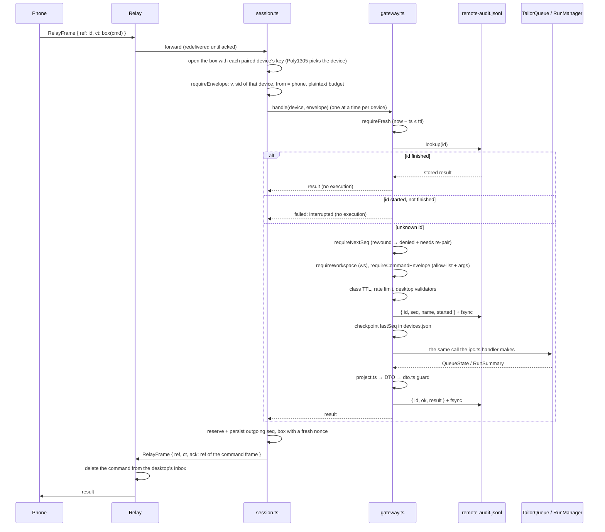
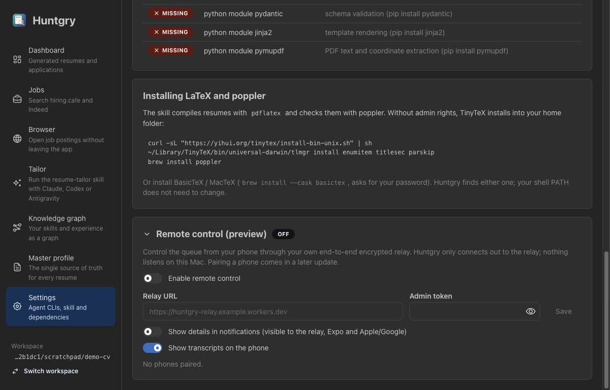
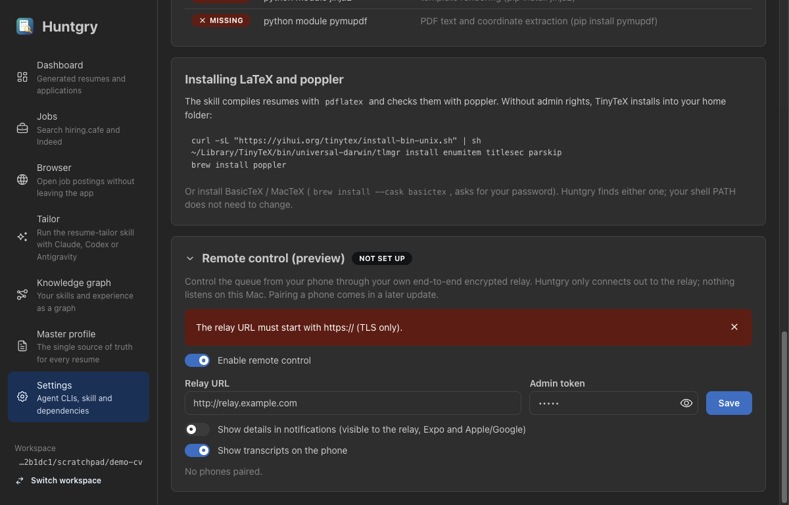

# #36 — Desktop gateway and relay session (remote control, E3)

Issue: [silentashish/huntgry#36](https://github.com/silentashish/huntgry/issues/36) · Epic #33, E3 · Spec: [ADR-0001](../adr/0001-mobile-remote-control-relay.md) · Builds on #34 (`@huntgry/remote-protocol`)

## Context & problem

ADR-0001 lets a phone control Huntgry through an end-to-end encrypted relay. #34 shipped the
wire contract; #35 builds the relay. This ticket is the desktop side: the session that talks
to the relay, and the **gateway** that turns a phone's command into a call to the same
services the renderer's `ipc.ts` handlers call. The phone must be a second caller of those
services, never a new back door. A command must not run twice, must not be lost when the Mac
crashes or sleeps, and must not run from a replayed or rewound counter. Nothing private
(job descriptions, notes, held replies, paths, session ids) may reach the wire.

There is no pairing UI yet (#37), so no real phone can connect. Everything here is tested
against an in-process fake relay and fake phones holding real keys.

## What changed and why

| Area | Files | Why |
| --- | --- | --- |
| Credentials | `src/main/remote/credentials.ts` | Relay URL, admin token, room id and owner secret in **one** `safeStorage`-encrypted blob, `userData/remote/relay.json`, so the desktop authenticates to its room after a restart. The relay URL is accepted with `https://` only (no credentials, query or fragment). The socket URL is derived as `wss://`. `relayRequest` is the only way a relay request is built: bearer header, never a token in the URL, `redirect: 'error'`. A blob that cannot be decrypted reads as `unreadable` and surfaces as `remote:state` "credentials-unreadable". Nothing is guessed. |
| Keys and replay state | `src/main/remote/devices.ts` | The desktop X25519 keypair is generated once, with the secret key under `safeStorage` (`desktop-key.json`). Device records, per-device `lastSeq`, notification categories, `needsRepair` and the desktop's outgoing `seq` live in `devices.json`, written atomically (temp file and rename). `lastSeq` never goes down. The outgoing `seq` is persisted **before** a frame is sent. The session key is `nacl.box.before(devicePub, desktopPriv)` through the package's `deriveSessionKey`. |
| Audit log | `src/main/remote/audit.ts` | `<workspace>/.huntgry/remote-audit.jsonl` is the write-ahead log and the durable commit. `{ id, deviceId, seq, name, started }` is fsynced before a mutating command runs, and `{ id, ok, result \| error }` after it. Reads and rejected frames get only the outcome line. On load it rebuilds the index of the last 10 000 command ids and each device's `lastSeq`. A torn last line from a crash is skipped. |
| Workspace binding | `src/main/remote/workspace.ts` | A random 128-bit `workspaceId` in `<workspace>/.huntgry/remote.json`, minted on first remote use, plus the folder's name. Never the path. |
| Projections | `src/main/remote/project.ts` | The one place desktop types become DTOs: `RemoteRun`, `RemoteQueueState` (20 items, active first, `more`), `RemoteTranscriptItem` (8 KiB per item, `truncated`), `RemoteJob`, `RunPage`, `StatusSummary`. Each projector truncates to the package `LIMITS` and runs the package's own `dto.ts` guard on its output. Transcript pages and cursor pages stop at their item count **or** at the plaintext budget. |
| Gateway | `src/main/remote/gateway.ts` | The commit order from the ADR, the allow-list dispatch, the `ws` check on every workspace-scoped command (reads included), rate limits, the desktop's own TTL check, chunked `file.get`. Details below. |
| Session | `src/main/remote/session.ts` | One **outbound** `wss` socket (no listening port), the owner secret in the first frame, `nacl.box` per device with a fresh 24-byte nonce, `hello` / `ping` answers, a 30 s `status` heartbeat to phones active in the last 5 minutes, push hints, and backoff reconnect (1 s doubling to 60 s, with jitter). Every frame it durably handled is acked: inside the reply frame when there is one, else with the clear `{ ack: ref }` client frame from #35 (phone results, events and pongs, or a reply that cannot be boxed). The socket is injected, so tests use a fake relay. |
| App wiring | `src/main/remote/ipc.ts`, `src/main/index.ts`, `src/main/ipc.ts` | `safeStorage` as the cipher, `userData/remote/` for the files, the services from `queue/ipc.ts`, `cli/ipc.ts`, `jobs/service.ts` and `applications/safe-path.ts`. `onEvent` feeds `queue.changed`, `run.changed`, `status` and `applications.changed` to phones. `powerMonitor` `resume` and `unlock-screen` reconnect at once. `before-quit` stops the queue, then the runs, then the session. The session is off until enabled. Settings calls wait for the session to start; a failed start is logged and reported to Settings instead of rejecting. |
| Shared hooks | `src/main/events.ts`, `src/main/cli/runs.ts`, `src/main/cli/ipc.ts`, `src/main/queue/ipc.ts`, `src/main/applications/scan.ts` | `onEvent(listener)` next to `emit`. `requireRunId` moved next to `RUN_ID_PATTERN` so `cli/ipc.ts` and the gateway use the same function. `runsForRemote` and `queueForRemote` expose the same instances and helpers the handlers use, without open or reveal. `review-notes.md` is now a known application file, so the phone can fetch it through the same safe-path checks. |
| Settings API | `src/shared/remote-types.ts`, `src/preload/remote.ts`, `src/shared/api.ts`, `src/shared/events.ts` | `window.huntgry.remote` (`state`, `setEnabled`, `configure`, `setNotificationDetails`, `setTranscripts`, `revoke`, `unpairAll`) and the `remote:state` event. |
| Settings UI | `src/renderer/src/pages/settings/RemoteCard.tsx` | A collapsed "Remote control (preview)" card at the bottom of Settings: state badge, enable switch, relay URL and admin token, the two toggles, paired phones with Revoke, Unpair everything. |
| Protocol package | `src/shared/remote/relay-http.ts` | **A gap in #34, fixed here.** The package had the socket frames but not the HTTPS calls (create a room, register a device or pairing, revoke). `RELAY_PATHS`, the bearer rule (admin token on `POST /rooms`, owner secret under `/rooms/{id}`) and the request bodies with guards. Secrets cross only as hex SHA-256. #35 should rebase onto this. |

### One command, end to end



### The gateway in detail

- **Allow-list.** Only `RemoteCommand` names reach a `switch` in `execute`, through the
  package's `requireCommandEnvelope`. An unknown name is `unsupported`. Pipeline and review
  commands answer `unsupported` too, because #31 (pipeline, review queue) is not on `main`.
- **Same validators.** `requireRunId`, `requireItemId` and `requireEnqueueInput` (with the
  Settings default agent as fallback) are the functions the `ipc.ts` handlers call.
  `run.reply` keeps the handler's "non-empty, ≤ `MAX_TEXT`" rule after the package's
  `LIMITS.textBytes` cap. `jobs.addUrl` runs `assertPublicUrl` (DNS) after the package's
  shape check, before anything is fetched.
- **Replies go through the queue.** `run.reply` calls `replyThroughQueue` first, exactly like
  the Tailor page, so a bulk run's reply is held until a slot is free. Otherwise it resumes
  the run through `RunManager.reply` with the run's own agent and sandboxed context.
- **Nothing remote changes how a run runs.** No argument is a model, flag, tool, setting, path
  or command line. Agents and options come only from the package enums, which
  `enums.test.ts` (#34) keeps equal to the desktop's.
- **Rate limits per device.** `queue.enqueue` and `pipeline.start` once per 10 s. `run.reply`
  and `review.rerun` once per 2 s per run. Reads 30 per minute. All answer `rate-limited`.
- **Expiry.** `requireFresh` re-checks `now − ts ≤ ttl`. On top of that, a command older than
  its class TTL (`COMMAND_TTL_SECONDS`: 2 h costly, 24 h otherwise) is `expired`, even if
  the relay accepted a longer `ttl`.
- **Errors.** Only `ProtocolError` messages go to the phone. Anything else becomes the
  package's generic `failed` message, and the original is logged on the Mac.

## Decisions and alternatives

- **The `seq` checkpoint follows the write-ahead entry, not the in-memory check.** The ADR
  says `lastSeq` is derived from the log. If the checkpoint were written first, a crash
  between it and the audit entry would make the relay's redelivery look like a replay
  (`denied`) and lose the command. Now a crash before the entry persists nothing and the
  redelivery runs once. Reads and rejected frames checkpoint after their outcome line.
- **When the desktop acks.** A command is acked only after `handle()` resolves, that is after
  the audit outcome and the `lastSeq` checkpoint are on disk; a crash before that leaves the
  frame at the relay for redelivery. The ack rides in the result frame (one relay operation,
  so the phone never loses a result whose command was acked). It is the relay frame's `ref`,
  which the relay deletes by, not the envelope id (equal for a well-formed phone). Frames
  with nothing to send back (phone results, events, pongs) get `{ ack: ref }` alone once
  `lastSeen` is saved. Frames no paired key opens are not acked: they expire at the relay.
- **A redelivered read runs again.** Reads keep no result in the log, and the relay redelivers
  a read exactly when its result frame was lost. Treating that as a replay marked the phone
  for re-pair after a network blip; a finished read id now runs the read again under its old
  `seq`, and a mutating command reusing a read's id is refused.
- **Per-device serialisation in the gateway.** Two frames with the same `seq` arriving
  together could both pass `requireNextSeq` before either is recorded. Handling one device's
  frames in order closes that.
- **Device identification by trial decryption.** `RelayFrame` from a phone says only
  `to: 'desktop'`. The relay knows the socket's device but the frame does not carry it, so
  the session tries each paired device's session key. Poly1305 makes a wrong key fail.
  With a handful of phones this costs microseconds. If #35 adds a clear `from`, the session
  can use it as a hint; the box check stays.
- **One audit log per workspace,** loaded on first use and cached. A workspace switch opens
  the other log, and its `lastSeq` values raise the device checkpoint too.
- **Events are dropped while offline** instead of being queued on the Mac. The relay is the
  queue, and the next `status` heartbeat or `hello` carries the current state. This keeps the
  queue and runs independent of the socket: a relay outage never blocks them.
- **`runs.list` and `jobs.list` pages are bounded by bytes as well as count.** Fifty runs with
  1 KiB errors are ≈ 78 KB of plaintext; a page now stops at the budget and sets
  `nextCursor`. The package's `requireRunsPage` still caps the count at 50.
- **`Collapse`-hidden card instead of a feature flag.** The ticket asks for "no UI beyond a
  hidden Settings toggle". The card is collapsed by default and loads nothing until opened.
- **Not done here (by scope):** pairing (`pair.hello` / `pair.ok`, QR, approve) and the
  "credentials unreadable" recovery flow are #37. Room creation and rotation are wired to the
  relay routes but are only exercised against the fake relay; #35 is not deployed.

## How to test

```bash
npm test && npm run typecheck && npm run build
```

Unit tests (`src/main/remote/`):

- `gateway.test.ts`: status without `ws` and without the path; `ws` missing or mismatched on
  reads and writes → `invalid`; unknown and #31 names → `unsupported`; reads rate-limited at
  30/min; rewound `seq` → `denied`, device marked, nothing runs afterwards; expired frames and
  a 3-hour-old enqueue with a 7-day `ttl` → `expired`; `lastSeq` derived from the log after a
  "restart" with a stale checkpoint; the commit order line by line; redelivery of a finished
  id returns the stored result without re-running; a redelivered read answers again without
  marking the phone for re-pair, and a mutating command cannot reuse a read's id; **a simulated crash at each step**
  (before the entry, after it, after execution, after the outcome) never runs a command
  twice and never loses one; a service error is `failed` with the generic message;
  `queue.enqueue` and `run.reply` through the real `TailorQueue` and `RunManager` with
  `fixtures/fake-claude.mjs` (the reply reaches the agent process; `run.get` pages the
  transcript; the run DTO has no private field); enqueue and reply rate limits; text over
  `LIMITS.textBytes` refused; unknown agent and extra `model` argument refused;
  `jobs.addUrl` refuses names resolving to loopback or private addresses before any fetch;
  `file.get` chunks reassemble with the whole-file SHA-256.
- `session.test.ts` (fake relay): wss only, owner secret in the first frame; a command
  acked in its result frame only once the audit outcome and the `lastSeq` checkpoint are on
  disk, with the relay frame's `ref`; phone results and pongs acked alone with `{ ack }` after
  `lastSeen` is saved; no ack after a crash mid-command, for an unopenable frame or while
  offline (the redelivery is answered from the log); a command
  answered with `ack`, boxed for the phone with a new nonce each time and an increasing
  `seq`; a frame no device can open is dropped; another `sid` is `denied`; `hello` returns
  the workspace name and id and a `status`; `pong`; push hints only for the device's
  categories and `pushText` (80 chars) only with details on; reconnect after a drop, retry
  while the relay refuses, immediate reconnect on resume; a refused authentication reported
  as a credentials error; heartbeat only to recently active phones; `device.revoked`; an
  event over the frame budget is never sent.
- `project.test.ts`: the marker test (`jobDescription`, `notes`, `jobUrl`, `sessionId`,
  `outputFolder`, `outputFiles`, `pendingReply` never serialised), truncation, transcript
  and cursor paging by count and bytes, and every DTO with its largest fields under
  `LIMITS.plaintextBytes`.
- `guard.test.ts`: the allow-list has no `apply`, `browser`, `workspace`, `profile`,
  `install`, `update`, `link`, `open`, `reveal` or `setDefaultAgent` name; no command takes a
  path, command, model, flag, tool or setting argument; the gateway uses the shared
  validators and none of the forbidden services; no listening socket anywhere.
- `audit.test.ts`, `devices.test.ts`, `credentials.test.ts`, `workspace.test.ts`, and
  `src/shared/remote/relay-http.test.ts`.

Manual (done for this PR, built app on an isolated `--user-data-dir`):

1. Settings → expand **Remote control (preview)**: state *Off*, nothing paired.
   
2. Enable with no credentials → *Not set up*. Enter `http://relay.example.com` and Save →
   "The relay URL must start with https:// (TLS only)."; nothing is written to `relay.json`.
   

Not done manually: the round trip against a deployed #35 relay with a Node test client, and
sleep / wake on a real Mac. Both need the relay and pairing (#35, #37).

## Follow-ups

- **#35** rebases onto `relay-http.ts` and implements those routes. The `{ ack }` client frame
  (#35's commit, cherry-picked here) is already sent by the desktop. A clear `from` device id
  on phone frames would let the session skip trial decryption.
- **#37** pairing: `pair.hello` / `pair.ok` over secretbox, approve dialog, device
  registration (`RegisterDeviceRequest`), the "credentials unreadable" recovery, TTL settings,
  and showing the last audit entries in Settings.
- **#31** pipeline and review: replace the `unsupported` cases with calls into the pipeline
  and the review screen, including the `revision` snapshot and served-revision checks.
- `run.transcript` events (live transcript to the phone) are typed and projected but not yet
  emitted; the phone pulls with `run.get` for now.
- Manual end-to-end test with a deployed relay and a Node device client, including Mac sleep.
