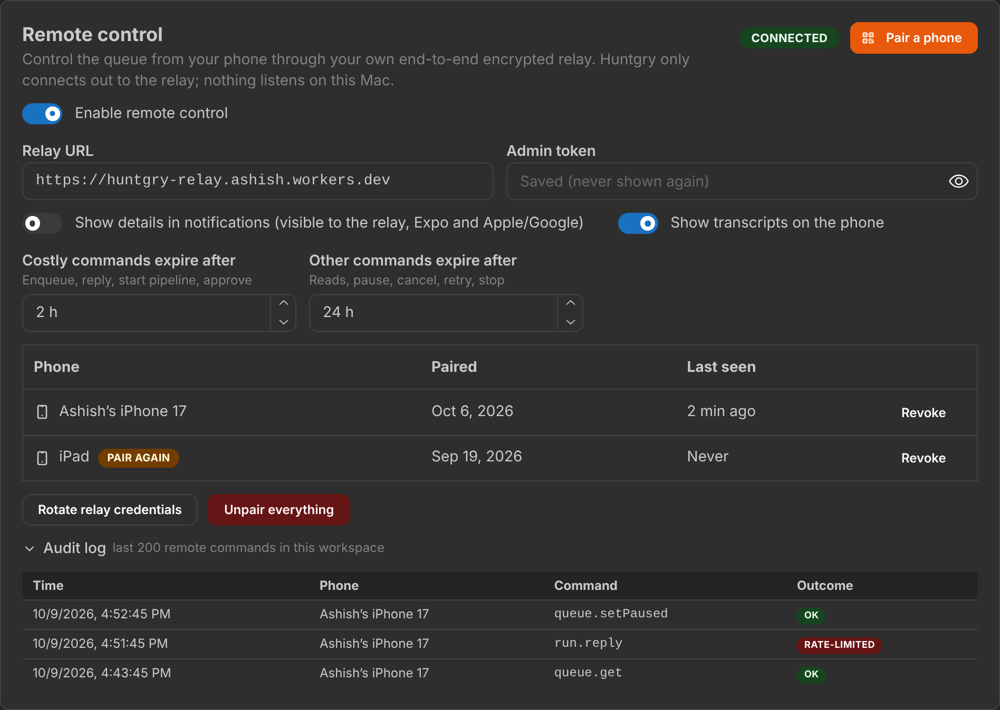
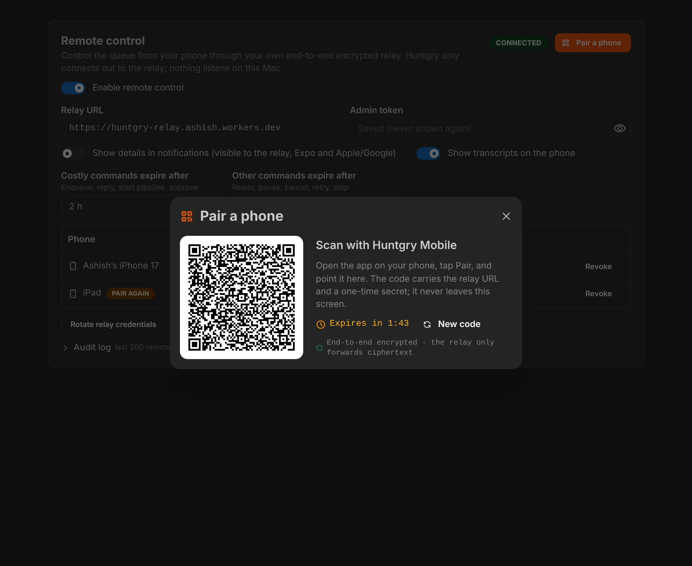
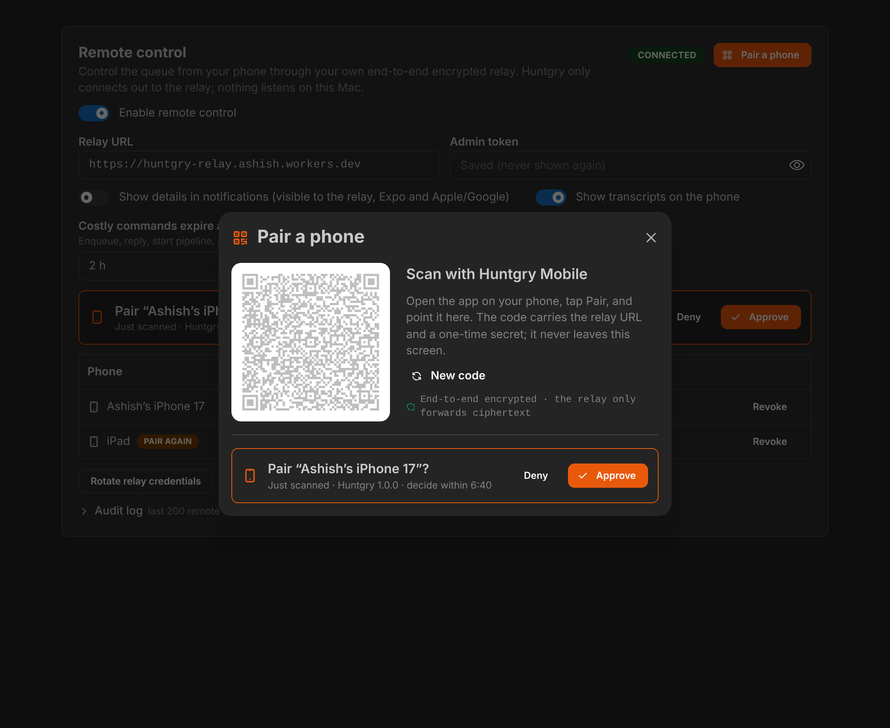
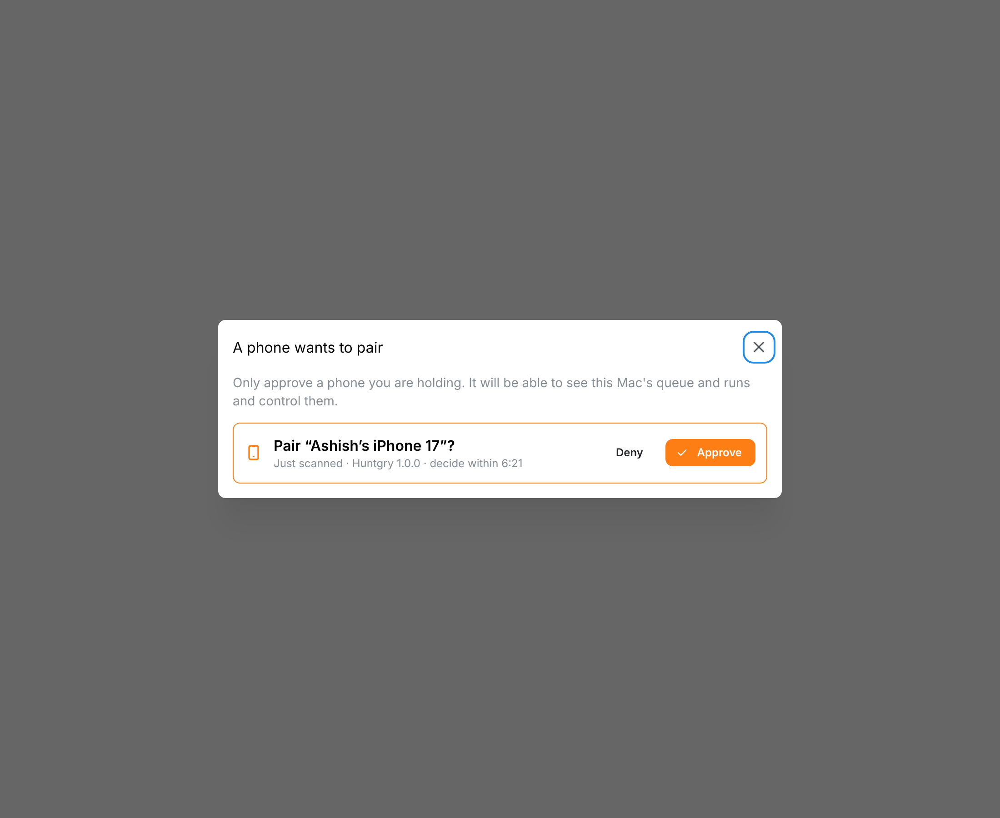

# #37 — Pairing and devices in Settings (remote control, E4)

Issue: [silentashish/huntgry#37](https://github.com/silentashish/huntgry/issues/37) · Epic #33, E4 · Spec: [ADR-0001](../adr/0001-mobile-remote-control-relay.md) · Builds on #34 (protocol), #35 (relay), #36 (gateway and session)

## Context & problem

#36 shipped the desktop's relay session and gateway, but no phone could reach them: there was
no QR, no `pair.hello` handling and no approve dialog, and the Settings card was a collapsed
preview. This ticket is the desktop half of pairing and the owner's controls around it:

- show a one-time QR, take the phone's `pair.hello`, ask the owner, register the phone's relay
  token and tell the phone;
- list, revoke and unpair phones; rotate the relay credentials; recover from credentials the
  Keychain can no longer decrypt;
- the two privacy toggles and the command TTLs, persisted and honoured by the gateway;
- the audit log in Settings.

The wire format of the QR and of the three pairing messages was added to the protocol package
first (commit `ff3358e`, `src/shared/remote/pairing.ts`) so the desktop and the #38 phone app
read and write exactly one format.

## What changed and why

| Area | Files | Why |
| --- | --- | --- |
| Pairing | `src/main/remote/pairing.ts` (new) | `PairingManager`, Electron-free. `start()` makes a 32-byte secret, a `pairingId` and `exp` = now + `PAIRING_TTL_SECONDS` (120 s), registers the pairing on the relay (`POST /rooms/{room}/pairings`) and renders the QR (`pairingUrl`) to an SVG data URL in main. `receive(frame)` tries each open secret, exactly like the session tries each session key; the first `pair.hello` before `exp` consumes the secret and waits for the owner. `approve()` mints `deviceId`, `relayToken` (32 random bytes, 64 hex) and `sid`, registers `{ deviceId, sha256(relayToken) }` on the relay, writes the device record, and only then sends `pair.ok`. `deny()` sends `pair.denied` and keeps nothing. |
| Session | `src/main/remote/session.ts` | A frame no paired device's key opens is offered to `pairing.receive` before it is dropped. `sendFrame()` and `ack()` let pairing answer on the same ordered send chain. |
| Rotation | `src/main/remote/rooms.ts`, `src/main/remote/devices.ts` | **Rotate relay credentials** mints a new owner secret, creates a new room with the saved admin token, deletes the old room and marks every device *needs re-pair* (`markAllNeedsRepair`). The same runs when the relay form replaces a room and for the "credentials unreadable" recovery (no old room to delete there). #36's form rotated the desktop key on every replace; that now happens only on **Unpair everything**. |
| Settings persistence | `src/main/remote/settings.ts` (new), `src/main/workspace/settings.ts` | `remote.{enabled, notificationDetails, transcripts, costlyTtlSeconds, defaultTtlSeconds}` in `userData/settings.json`, next to `defaultAgent`, with defaults (off, details off, transcripts on, 2 h, 24 h) and bounds (1 min … 7 days). |
| Gateway | `src/main/remote/gateway.ts` | `GatewayServices.commandTtl()` replaces the fixed `COMMAND_TTL_SECONDS` in the delivery-time TTL check; it is read on every frame, so a change in Settings applies to the next command. |
| IPC boundary | `src/main/remote/validate.ts` (new), `src/main/remote/state.ts` (new), `src/main/remote/ipc.ts` | Every `RemoteApi` argument is checked: booleans, UUID-like ids, an `https://` URL with the reason otherwise, a one-line admin token, whole-second TTLs, and no extra keys. `buildRemoteState` and `projectAudit` pick fields explicitly, so no admin token, owner secret, pairing secret, public key, token hash, `sid`, result body or path reaches the renderer. Relay 404 on revoke counts as revoked (a phone left over from a rotated room). |
| API | `src/shared/remote-types.ts`, `src/preload/remote.ts` | New `rotate`, `setCommandTtl`, `startPairing`, `cancelPairing`, `approvePairing`, `denyPairing`, `audit`. `RemoteState` gains `commandTtl` and `pairings` (status, expiry, device name and app version from the hello). |
| Settings card | `src/renderer/src/pages/settings/RemoteCard.tsx` | The full card from the Figma redesign (frame `14:2`, Remote control), built with the app's Mantine kit: status badge and **Pair a phone** in the header, relay URL (monospace, `https://` reason inline) and admin token (placeholder "Saved (never shown again)" once stored), the two toggles, the TTL fields, pending requests, the device list (name, paired, last seen, *Pair again*) with Revoke, **Rotate relay credentials** and **Unpair everything** behind an inline confirmation, the unreadable-credentials alert with **Recover**, and a collapsible audit log (time, phone, command, outcome). |
| QR modal | `src/renderer/src/pages/settings/PairPhoneModal.tsx` (new) | Figma frame `17:1342`: the QR image from main, "Scan with Huntgry Mobile", the 2-minute countdown, **New code**, the end-to-end line, and the approve step inline once the phone answers. Closing withdraws a code nobody scanned. |
| Approve dialog | `src/renderer/src/pages/settings/PairingPrompt.tsx` (new), `src/renderer/src/App.tsx` | "Pair '<device name>'?" with Approve / Deny. Mounted once for the whole app shell, so a hello that arrives after the QR modal was closed (or while the owner is on another page) still asks. |
| Dependency | `package.json`, both lockfiles | [`uqr`](https://github.com/unjs/uqr) 0.1.3 (MIT, zero dependencies, ESM + CJS, typed) renders the QR in main. |
| Tests | `pairing.test.ts`, `pairing.e2e.test.ts`, `validate.test.ts`, `settings.test.ts`, `state.test.ts` (new); `rooms.test.ts`, `devices.test.ts`, `gateway.test.ts`, `RemoteCard.test.tsx` | See *How to test*. |
| Screenshots | `docs/changes/assets/37-*.png` | Card, QR modal and approve dialog, dark and light. |

### Pairing on the desktop

```mermaid
sequenceDiagram
    participant U as Owner
    participant S as Settings
    participant M as pairing.ts
    participant X as session.ts
    participant R as Relay
    participant P as Phone
    U->>S: Pair a phone
    S->>M: startPairing()
    M->>R: POST /rooms/{room}/pairings {pairingId, exp: QR exp + 5 min}
    M-->>S: QR image (SVG data URL; the text never leaves main)
    P->>R: { auth: { room, pairing } }, RelayFrame{ to: desktop, secretbox(S){pair: hello} }
    R->>X: forward
    X->>X: no device key opens it
    X->>M: receive(frame): open with each open secret
    M->>R: { ack: ref }
    M-->>S: remote:state, pairing "scanned" (secret consumed)
    S->>U: "Pair 'Test iPhone'?"
    U->>S: Approve
    S->>M: approvePairing(id)
    M->>R: POST /rooms/{room}/devices {deviceId, sha256(relayToken)}
    M->>M: devices.json: id, name, public key, token hash, sid, paired at
    M->>R: RelayFrame{ to: pairingId, secretbox(sessionKey){pair: ok, deviceId, relayToken, sid} }
    R->>P: forward
    P->>R: { ack }, close, reconnect { auth: { room, device, token } }, box(hello)
    R->>X: forward: opens with the new device's session key → hello + status
```

## Decisions and alternatives

- **QR rendered in main.** The QR text holds the pairing secret. `startPairing` returns only
  the rendered image (an SVG data URL shown in an ``), never the text, and the image is
  never part of the `remote:state` broadcast. A renderer QR library would have needed the
  secret as a string in the renderer. The image itself necessarily encodes the secret: that is
  what the phone scans. `uqr` was picked over `qrcode` (pulls `yargs`, `pngjs`, `dijkstrajs`)
  and `qrcode-generator` (no types, older API): no dependencies, typed, SVG output, maintained
  by unjs. Error correction is `L`: a screen is not damaged, and the ~300-character URL then
  needs fewer, larger modules.
- **The relay keeps the pairing 5 minutes longer than the QR.** *Deviates from the ADR*, whose
  sequence registers the pairing with the QR's own expiry. The relay closes a pairing socket at
  its `exp` (4006) and drops frames to an expired pairing, so an owner who takes more than the
  QR's remaining seconds to click Approve would send `pair.ok` into nothing. The desktop
  registers `exp + APPROVAL_SECONDS` (≤ 10 min, the relay's cap) but refuses any hello received
  after the QR's `exp`; a request not decided by the relay's expiry is dropped.
- **Second and late hellos.** The first hello consumes the secret. A second one while the
  owner decides is ignored, so it cannot replace the name being shown; after the decision, or
  after `exp`, a hello is answered `{ pair: 'denied', reason: 'expired' }` until the relay
  forgets the pairing. A hello the desktop opens is acked at once; pending requests live in
  memory only (a restart forgets them, and the phone shows a new code).
- **`pair.ok` is sealed with the phone's session key**, not with the QR secret (*refines the
  ADR*, where every pairing message is `secretbox(S)`). Someone who saw the QR can open a second
  pairing socket with the same `pairingId`, and the relay keeps one socket per identity, so
  `pair.ok` could reach them instead of the phone. Under `deriveSessionKey(devicePub,
  desktopPriv)` only the phone whose hello the owner approved can read the relay token
  (`sealPairReply` / `openPairReply` in the protocol package). `pair.denied` stays under S,
  and the phone refuses a `pair.ok` under S, which anyone with the QR could forge.
- **Approve order.** Relay registration → device record → `pair.ok`. Nothing is written if the
  relay refuses (the request stays open and can be approved again); if `pair.ok` cannot be
  sent (the socket dropped), the record and the token are removed again. Approve is refused
  while the session is offline. After each await the request is checked again (not withdrawn,
  not past the relay's expiry, same room and desktop key); otherwise the token and record are
  rolled back and no `pair.ok` goes out.
- **Re-pairing replaces.** A phone that pairs again with the same key gets a new record and
  `sid`; once `pair.ok` is sent its older records (including ones marked *needs re-pair*) are
  removed and their tokens deleted, since both records' keys would open the same frames.
- **QR carries `pairing`.** *Deviates from the ADR's QR*, which lists `relay`, `room`, `pk`, `s`
  and `exp`: the phone must authenticate with `{ auth: { room, pairing } }`, so the pairing id
  travels in the URL (`ff3358e`).
- **Room creation happens on Save in the relay form, once.** *Deviates from the ADR diagram*,
  which creates the room lazily at the first "Pair a phone". Saving the URL and admin token is
  the moment the owner proves the token works; `roomId` is persisted in `relay.json` and is not
  created again unless the owner replaces or rotates the room.
- **Rotate keeps the desktop key, Unpair everything changes it.** Rotation must leave the phones
  listed as *needs re-pair* (their tokens were in the deleted room); rotating the key would also
  have dropped them from the list. Unpair everything revokes each phone, rotates the key and the
  room, and empties the list (#36's code, unchanged).
- **TTL settings are enforced by the desktop on delivery.** The relay still keeps a frame for the
  `ttl` the phone put on it; a shorter TTL in Settings makes the gateway answer `expired` when
  it finally arrives. Telling the phone the owner's TTLs would need a protocol field; not needed
  for correctness.
- **Audit view.** The log is read from `<workspace>/.huntgry/remote-audit.jsonl` of the open
  workspace (400 lines, collapsed to one row per command, last 200, newest first). Rows carry
  the device's current name ("Removed phone" otherwise), the command, the outcome and the error
  code and message; result bodies stay on disk.
- **Approve dialog app-wide.** The ticket wants the prompt even if the modal was closed; a
  component in the app shell listens to `remote:state` and shows the dialog unless the QR
  modal (which shows the request itself) is open. Dismissing it leaves the request in Settings
  until it expires.
- **Look.** The Figma frames set the card's structure, wording and the modal / dialog layout;
  colours come from Mantine's default theme like the rest of the app (orange only for the
  pairing call to action and the request border, as in the design).

## How to test

```bash
npm test && npm run typecheck && npm run build
```

- `src/main/remote/pairing.test.ts`: the QR's fields and 32-byte secret, exp = now + 2 min, the
  relay registration with the approval window, a new code withdrawing an unscanned one; the
  rendered SVG never contains the secret; a hello consumes the secret and nothing is registered
  or written before Approve; Approve's order (register → record → `pair.ok`) and the record on
  disk (id, name, public key, token hash, sid, paired at; no token); Deny; a second hello while
  waiting is ignored and one after the decision is refused as expired; a hello after expiry is
  refused; an undecided request is dropped at the relay's expiry; a frame sealed with another
  secret is left alone (no ack); a failed registration writes nothing and can be retried; offline
  Approve and a lost `pair.ok` undo everything; a request withdrawn, expired or moved to another
  room while the relay registers the token is rolled back; re-pairing the same phone key
  replaces its old record and token.
- `src/main/remote/pairing.e2e.test.ts`: over an in-process relay with per-identity auth and
  routing, a phone built only from the protocol package (`parsePairingUrl`, `generateKeyPair`,
  `sealPairMessage`, `openPairReply`, `deriveSessionKey`, `sealEnvelope`, `openEnvelope`)
  scans, sends hello, is approved, receives and acks `pair.ok`, reconnects with its relay token
  and gets `hello` (workspace name and id) and a `status` event; and the Deny path.
- `validate.test.ts` (IPC validators), `settings.test.ts` (persistence next to `defaultAgent`,
  defaults, bounds), `state.test.ts` (no secret, key, hash, sid, result or path in `RemoteState`
  or the audit rows; audit collapsing and the 200 cap), `rooms.test.ts` (rotation and recovery
  mark devices for re-pair), `devices.test.ts` (`markAllNeedsRepair` on disk, key kept),
  `gateway.test.ts` (Settings TTLs honoured per frame), `RemoteCard.test.tsx` (busy state,
  `http://` refused with the reason and never sent, TTLs saved as seconds, the QR modal and its
  approve step, the app-wide prompt's Deny sends only the id).
- Screenshots: `docs/changes/assets/37-card-dark.png`, `37-card-light.png`,
  `37-card-unreadable-dark.png`, `37-qr-modal-dark.png`, `37-qr-modal-light.png`,
  `37-qr-approve-dark.png`, `37-approve-dialog-dark.png`, `37-approve-dialog-light.png`. Rendered
  from the real components in Chromium with a stubbed `window.huntgry` (the Electron binary
  cannot be downloaded in the build environment), so the window chrome is missing.
- Manual (needs a deployed relay and the #38 app): pair twice, deny once, revoke, rotate the
  credentials and confirm the phone must pair again.






## Follow-ups

- Show a short fingerprint of the phone's key in the approve dialog (and on the phone) for
  owners who want to compare.
- Pending requests do not survive a restart of the app; the phone shows a new code.
- The manual round trip against a deployed relay and the #38 app.
