# #38 — Mobile app MVP (Expo, iOS, local build)

Issue: [silentashish/huntgry#38](https://github.com/silentashish/huntgry/issues/38) · Epic #33, E5 · Spec: [ADR-0001](../adr/0001-mobile-remote-control-relay.md) · Builds on #34 (protocol), #35 (relay), #36 (gateway), #37 (pairing wire format) · Design: Figma "📱 Mobile" page

## Context & problem

The protocol package, the relay and the desktop gateway exist, and #37 adds the desktop's
pairing QR. Nothing could talk to them from a phone: `mobile/` was a declared but empty
workspace. This ticket is the phone app: pair by QR, then see the Mac's status, the queue and a
run, answer a run that waits, pause or resume the queue, cancel and retry jobs, choose
notification categories, unpair. It must keep the ADR's rules on the phone side too: the token
only in the first frame, one persisted counter, acks only for what was handled and stored,
nothing kept beyond keys, counters and the last status, and a clean "pair again" when the
desktop says the phone's counter or pairing is no longer valid.

## What changed and why

| Area | Files | Why |
| --- | --- | --- |
| Workspace | `mobile/package.json`, `app.config.ts`, `metro.config.js`, `tsconfig.json`, `index.ts`, `assets/` | `@huntgry/mobile`, Expo SDK 57 (React Native 0.86, expo-router 57), trimmed from the SDK 57 default template. Bundle id / package `com.huntgry.remote` (overridable with `HUNTGRY_BUNDLE_ID`), name "Huntgry", scheme `huntgry` so the QR's `huntgry://pair?…` opens the Pair screen. `index.ts` loads `react-native-get-random-values` before anything imports tweetnacl. App icons are rendered from the Figma logo vectors. |
| React in the monorepo | `metro.config.js`, `tsconfig.json`, `app.config.ts` | The root needs React 19.3 (desktop renderer); RN 0.86 needs React 19.2.3 exactly. npm puts 19.2.3 in `mobile/node_modules`; Metro resolves every `react` / `react-dom` request from the app's folder, so hoisted packages (react-native, expo-router, react-native-web) get the same copy. `getDefaultConfig` already handles watch folders and `nodeModulesPaths` for npm workspaces (SDK 52+ monorepo support). Types: `paths` maps `react` to `mobile/node_modules/@types/react`; `experiments.tsconfigPaths: false` keeps Metro from following that path. The web bundle contains only React 19.2.3 (checked). |
| Relay client | `src/remote/relay.ts` | Bare `wss://…/ws`, first frame `{ auth: { room, device, token } }`, nothing else until the relay's presence notice. Every frame is an `Envelope` sealed with the session key (`sealEnvelope`). `seq` is taken from the vault **in the send loop**, so frames leave in `seq` order. Incoming: `openEnvelope`, `requireEnvelope` (sid, from desktop), `requireFresh`, desktop `seq > lastSeq` (gaps allowed), dedupe by `id` / `re`, handler, `lastSeq` stored, then `{ ack: ref }`. Relay notices: presence, `queued`, `expired`, `tooLarge`. Close codes: 4001 / 4002 / 4004 end the pairing, 4000 waits for the app to come back, everything else backs off 1 s … 60 s with jitter (30 s at least after 1008). A `ping` every 2 min keeps the desktop's status heartbeat coming; a ping with no answer in 20 s replaces a half-open socket. |
| Pairing | `src/remote/pairing.ts` | `parsePairingUrl` (https relay only, `expired`), a fresh keypair in the secure store, `{ auth: { room, pairing } }`, `pair.hello` under `secretbox(S)`, waiting (and "your Mac is not connected" while the relay holds the hello), `pair.ok` → ack, close, store; `denied` / `expired` / close 4006. The session key is derived before the hello: `pair.ok` is sealed with it (see Decisions). |
| Commands | `src/remote/commands.ts` | Typed builders over `RemoteCommand`, each through `requireCommand` (a 32 KiB + 1 reply throws on the phone). `envelopeFor` adds `ws` from the last `StatusSummary` (not for `status.get` / `device.*`), `ttl` from `ttlFor`, the uuid `id`. The delivery copy: "Will run when your Mac wakes", "Expired before your Mac woke up". |
| Storage | `src/remote/vault.ts`, `src/state/native.ts` | Keys `huntgry.identity`, `.pairing`, `.seq`, `.lastSeq`, `.status` in expo-secure-store (`AFTER_FIRST_UNLOCK_THIS_DEVICE_ONLY`). `nextSeq()` writes before it returns. A new pairing starts both counters at 0 for its `sid`. `wipe()` deletes everything. |
| State | `src/remote/model.ts`, `src/state/RemoteProvider.tsx` | One store for the screens (`useSyncExternalStore`): presence, status (persisted), workspace, queue, pipeline state, runs and transcripts (memory only), the owner's last commands with their delivery state, a toast. Run transcripts load with `run.get` + `sinceSeq` page by page and refresh from the last item on `run.changed`. A `denied` answer (except `review.*`, which uses `denied` for an unseen revision, #42), `device.revoked` and closes 4001 / 4002 / 4004 wipe the vault and show **Pair again**. |
| Screens | `src/app/`, `src/screens/` | **Pair** (scanner with expo-camera, paste fallback, deep link, waiting with the code's countdown, denied, expired, Pair again). **Home / Status** (presence "Mac online" / "Mac asleep", workspace name, what needs you, pipeline card, queued / working / done today, the usage-limit alert, agent readiness) turning into **Offline** with "Desktop offline since …" and the commands waiting on the relay. **Queue** (status and agent badges, pause / resume, cancel, retry, open run, "and N more", done jobs folded). **Run** (transcript, truncated items marked "open on your Mac for the full output", reply box capped at 32 KiB UTF-8 and disabled while the queue holds a reply, Finish / Stop). **Settings** (the five categories → `device.setNotifications`, the "Show details" note, paired Mac and Unpair, this phone's name). **Review** and **Jobs** tabs say "Coming with the next update" (#42, #40). |
| Design system | `src/ui/` | Scent Trail tokens (light and dark, following the system), the Figma text styles with Bricolage Grotesque, Geist and Geist Mono from `@expo-google-fonts`, Tabler icons (`@tabler/icons-react-native`, deep imports) with Figma's stroke widths, and the Figma components: Card, Badge (soft / outline, live dot), Button (primary / outline / ghost / danger / secondary × sm / md / lg), IconButton, Toggle, Alert, Progress, TabBar, screen header. Motion with Reanimated 4 CSS animations: live dots breathe, cards rise in one after another, the progress bar and the toggle ease, the running tool spins. |
| Demo mode | `src/state/demo.ts` | `EXPO_PUBLIC_DEMO=1`: the Figma sample data, a pretend Mac that answers commands, nothing stored; `?demo=offline|unpaired|waiting|denied|again` on the web. Used for the screenshots below. |
| Root | `package.json`, both lockfiles | `npm test` also runs `npm test -w mobile`; `npm run typecheck` also runs `typecheck:mobile`. No Expo or React Native package in the root manifest. |

## Decisions and alternatives

- **`pair.ok` sealed with the session key, not with S.** Anyone who saw the QR knows S and could
  read the relay token from an `ok` sealed with it. The desktop now seals `ok` with
  `deriveSessionKey(devicePub, desktopPriv)` and `denied` with S (the coordinator's change on
  `feat/37-pairing`, `sealPairReply` / `openPairReply` in the package). This branch is based on
  the earlier wire-format commit, so the phone carries the same rules in a local
  `openPairReply` (`src/remote/pairing.ts`): ok only under the session key, denied only under S,
  anything else ignored. When #37 is merged it can switch to the package's function.
- **`seq` assigned in the send loop, not when a command is queued.** Two commands queued
  together, or one waiting for the rate budget, could otherwise leave out of order, and the
  desktop answers a lower `seq` after a higher one with `denied` and marks the phone for
  re-pairing.
- **Retransmission is byte for byte.** A command that was sent but not answered when the socket
  dropped is sent again after the reconnect, before the new `hello`, with the same `ref`, `seq`
  and ciphertext: the relay drops a duplicate `ref`, and the gateway answers a known id with the
  same `seq` and digest from its audit log (or re-runs a read). A command the relay reported as
  `queued` is not resent. Re-sealing with a new `seq` would turn a lost frame into a rewind.
- **Acks are throttled.** The relay closes a connection at 60 frames a minute, acks included.
  The client keeps a rolling window: at most 50 frames, of which acks may use 40, so a burst of
  redelivered frames never starves the owner's commands. An ack also rides on the next
  outgoing frame (`RelayFrame.ack`) when there is one.
- **Which `denied` means "pair again".** Every `denied` the gateway sends today means the
  phone's pairing or counter is no longer valid. #42 will use `denied` for "you did not fetch
  this revision", so `review.*` answers are excluded.
- **Unpair is local.** There is no command for a phone to revoke itself; Unpair deletes the keys
  and tells the owner to revoke the phone on the Mac too.
- **Notification categories are stored on the phone** with the pairing, so the toggles show what
  was last sent (the desktop has no read command for them). They are sent right after pairing
  (ADR step 12) and after changes, debounced.
- **Status numbers.** Queued counts the queue items plus `more` (the items past the 20-item page);
  Working is preparing + running + needs-reply; Done today counts done items updated today.
  "Runs waiting for your reply" uses the status (whole queue) count.
- **Pipeline and Review stay thin.** The Home pipeline card renders a `PipelineState` when one
  arrives (`pipeline.changed`), else the status's pipeline state, else "No pipeline running".
  Its Pause / Stop send `pipeline.*`; today's gateway answers "not available on this Mac yet",
  shown as a toast. The full Pipeline (`19:224`), Review detail (`19:353`) and Jobs (`19:444`)
  screens belong to #41, #42 and #40; their tabs exist with a placeholder.
- **Where the design and the data differ.** The Figma queue shows "Retry now" on a queued job;
  the desktop only retries failed or cancelled jobs, so a queued job gets the remove (cancel)
  button. The pipeline meta line drops "$3.20 / $10 · Claude 62 %" (not in `PipelineState`) and
  shows done / total, ETA, running and the agent. The "ready to apply" row became "N jobs
  failed" (applying is not a phone feature). The run view adds small Finish / Stop buttons and
  the Home screen an agent readiness row, which the issue asks for and the frames do not show.
- **Animations as Reanimated 4 CSS animations,** not layout animations: they run on the UI thread
  on the phone and as plain CSS on the web, where Reanimated's `entering` animations misplaced
  cards in the static export.
- **Web output `single`** (an SPA) instead of the template's static rendering: the web build is
  only for demo screenshots.

## How to test

Automated:

```sh
npm test -w mobile          # 54 tests: relay client (fake WebSocket), pairing, commands, model, formatters
npm run typecheck -w mobile
npm test                    # root: lockfiles, 1106 desktop tests, relay, mobile
npm run typecheck && npm run build
```

The relay client tests cover first-frame auth (URL without credentials, nothing before
presence), boxing with the pinned fixture session key, `seq` persisted before each send and
continued after a restart, `ws` / `ttl` / ids, ack after store, dedupe by `id` and `re`, desktop
`seq` gaps and replays, unopenable and stale frames, ack throttling and piggybacking, queued /
expired / too-large notices, reconnect with byte-identical retransmission, backoff and the
1008 floor, 4000 replaced, half-open sockets, 4001 / 4002 / 4004, `denied` → pair again (not for
reviews), `device.revoked`. The pairing tests cover the QR, the sealed hello, `ok` under the
session key (and refusing an `ok` under S), denied, expired, 4006, non-https relays and a new
identity per pairing. The model tests cover the persisted status, run paging with `sinceSeq`,
transcripts not stored, the held reply, queued / expired commands, wipe on denied / revoked /
unpair, renaming, categories, and a full pair → connect → hello → `device.setNotifications`.

Visual check (demo data, no relay): `npm run export:web -w mobile`, serve `mobile/dist` with an
SPA fallback and open it at 390 × 844 in both colour schemes; compared with the Figma frames
(Pair `19:2` / `19:672`, Home `19:32` / `19:702`, Queue `19:126` / `19:796`, Run `19:295` /
`19:965`, Notification settings `19:534` / `19:1204`, Offline `19:614` / `19:1284`).

| | Dark | Light |
| --- | --- | --- |
| Pair | 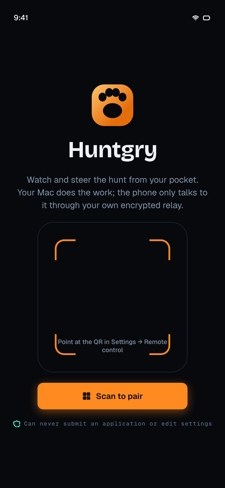 | 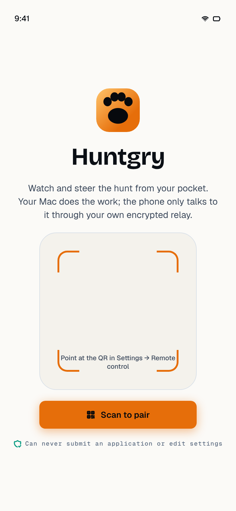 |
| Pair · waiting | 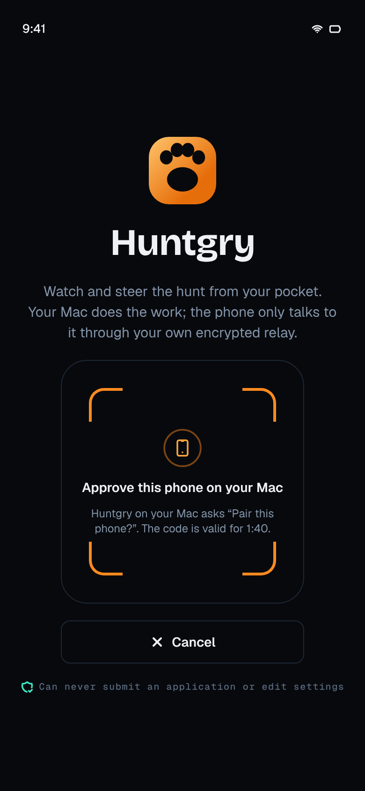 | 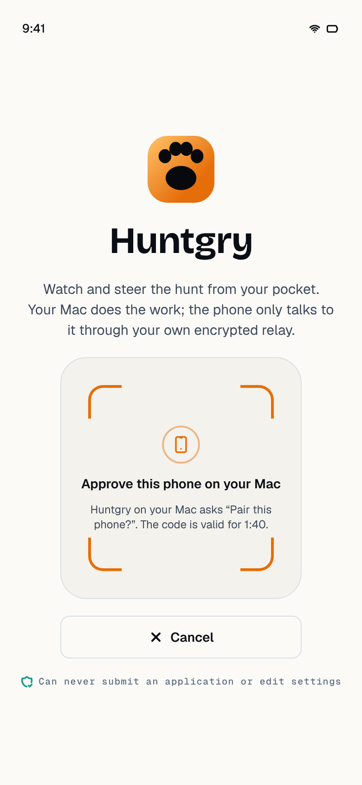 |
| Status | 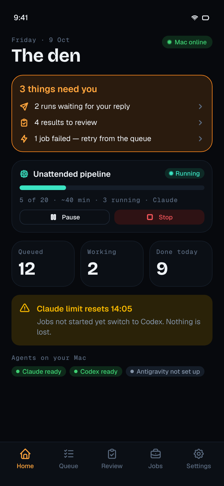 | 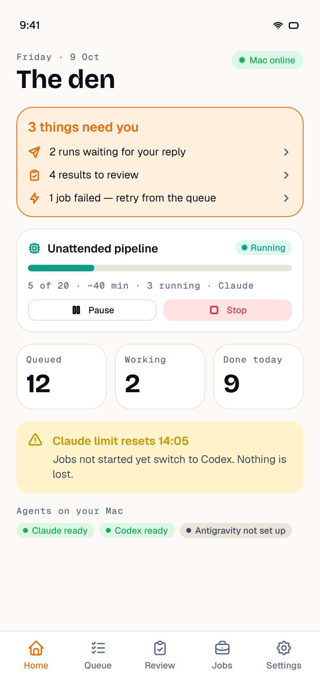 |
| Offline | 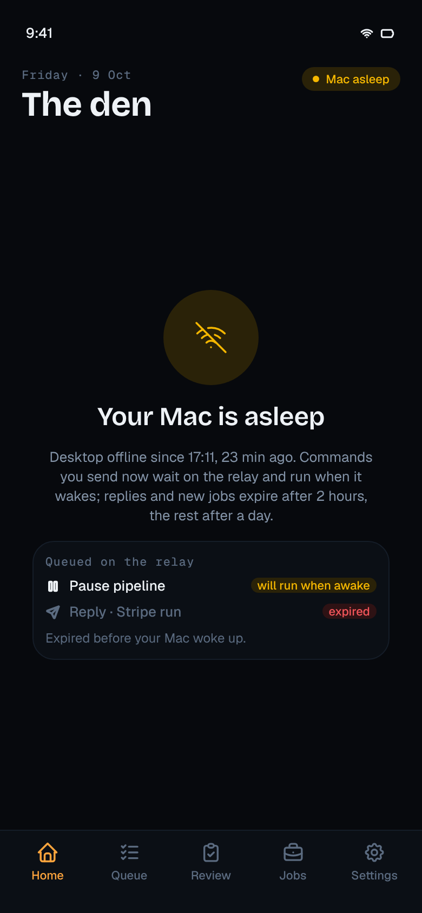 | 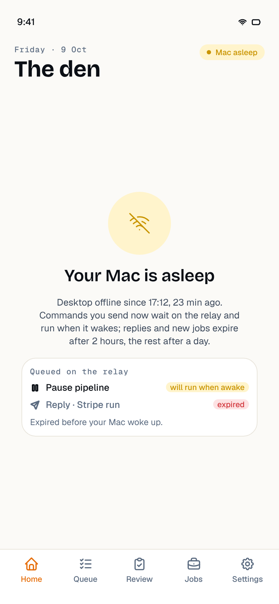 |
| Queue | 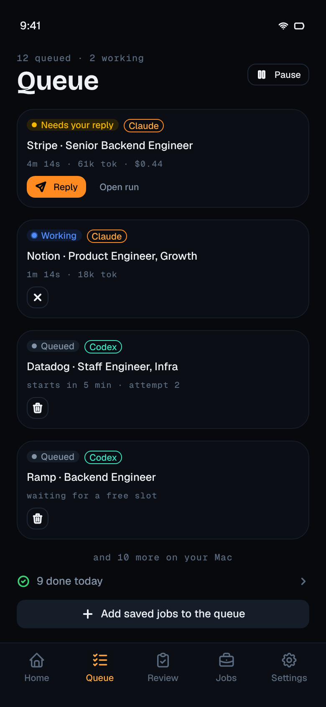 | 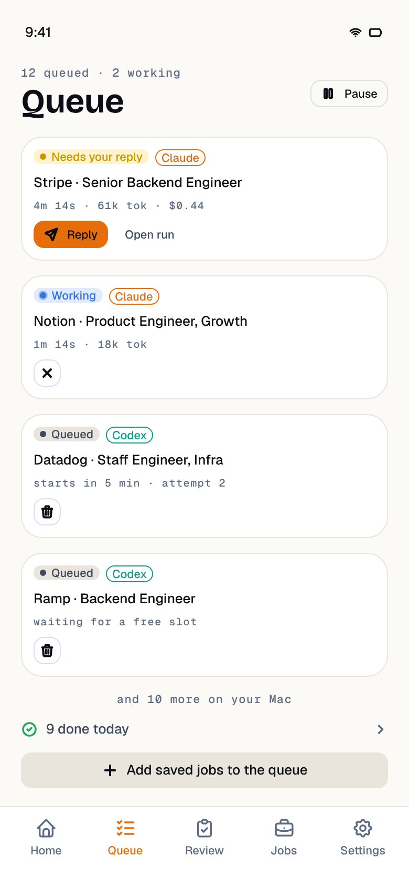 |
| Run | 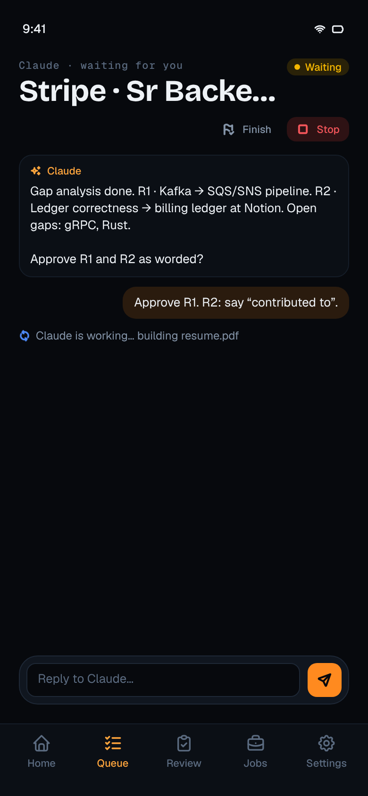 | 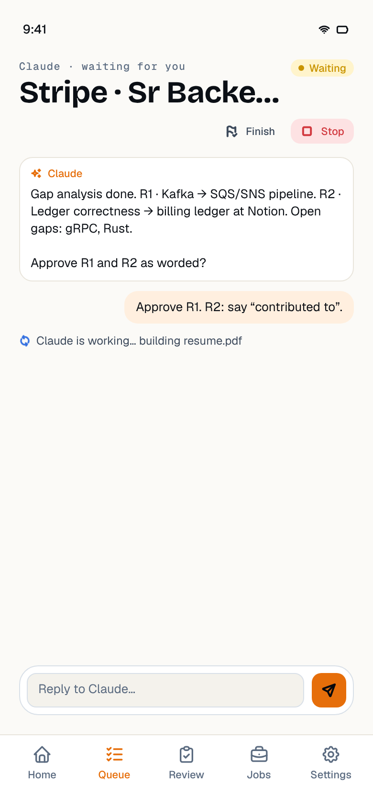 |
| Settings | 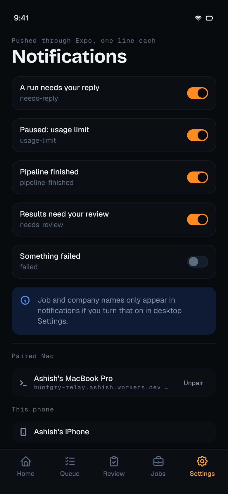 | 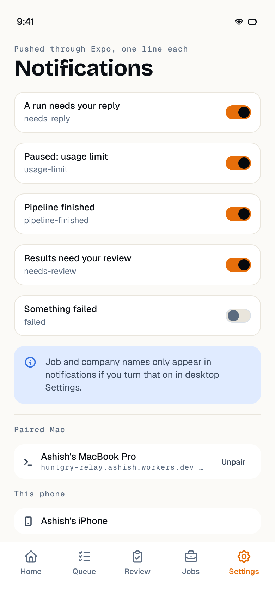 |

Native configuration: `npx expo config --type public` resolves (name, scheme `huntgry`, bundle
id / package `com.huntgry.remote`, camera permission text, no microphone). `npx expo-doctor`:
17 of 21 checks pass; the failures are the two lockfiles (repo policy), the duplicate React
(intended, see above) and two checks that need the network (config schema, React Native
Directory).

On a phone (not possible in this environment, see `mobile/README.md`): `npx expo run:ios
--device` with a free Apple ID; pair with the #37 desktop, pause / resume the queue, reply to a
waiting run, sleep the Mac and check "Will run when your Mac wakes" / "Expired before your Mac
woke up", revoke on the Mac and check the phone is back on Pair with its keys gone.

## Follow-ups

- **#37** merged: use the package's `openPairReply` instead of the local copy; manual pairing
  against the real desktop and a deployed relay.
- **#39** push: `expo-notifications`, the `{ pushToken }` frame after auth and `{ pushToken: null }`
  on unpair; the categories screen is ready and already sends `device.setNotifications`.
- **#41 / #42 / #40**: the Pipeline, Review detail and Jobs screens on the shared components;
  "Add saved jobs to the queue" opens Jobs today.
- `run.transcript` events are handled when the desktop starts sending them; until then the run
  view pulls with `run.get`.
- The relay may drop a desktop result under its 50-frame cap because the desktop's result `ref`
  is a fresh uuid (#35 notes); the phone copes (the command stays "sent" and the next status /
  queue event corrects the screen), but the relay's result detection should be confirmed.
- Not run on a physical device here: no macOS, Xcode or phone in this environment.
