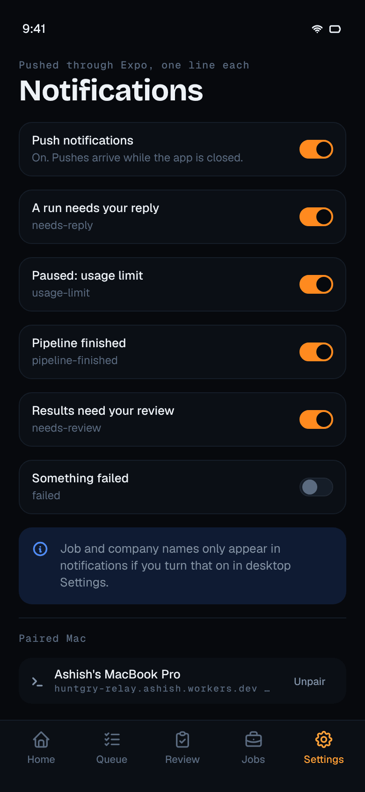
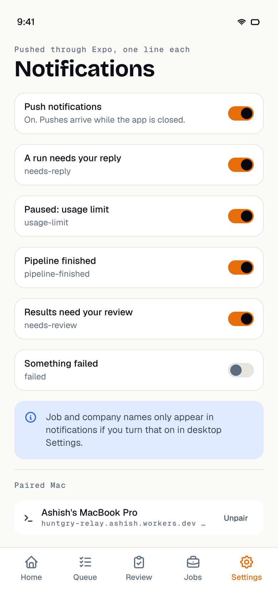

# #39 — Push notifications on the phone (Expo push service)

Issue: [silentashish/huntgry#39](https://github.com/silentashish/huntgry/issues/39) · Epic #33, E5b · Spec: [ADR-0001](../adr/0001-mobile-remote-control-relay.md) ("How a push happens") · Builds on #35 (relay push), #36 (gateway push hints), #38 (the app) · Release steps: [mobile/RELEASE.md](../../mobile/RELEASE.md) (#43)

## Context & problem

The relay already sends one generic Expo push per category when a frame with a `pushHint`
reaches a phone that has no live socket, coalesced to one per category per 5 minutes, and it
clears dead tokens from tickets and receipts (#35). The desktop already sets `pushHint` for the
categories each phone chose with `device.setNotifications` (#36). What was missing is the phone:
no `expo-notifications`, no permission, no Expo push token, so the relay had nothing to push
to. Tapping a push should open the right screen, the categories in Settings should drive the
desktop, and the token must reach the relay only (never the Mac) and be removed when the
owner turns push off or unpairs.

## What changed and why

| Area | Files | Why |
| --- | --- | --- |
| Dependency | `mobile/package.json`, both lockfiles | `expo-notifications` ~57.0.22, the version Expo SDK 57 bundles (`expo/bundledNativeModules.json`). Root manifest unchanged (`deps.test.ts`). |
| Registration | `mobile/src/notifications/push.ts` | `PushRegistrar` over a small `PushPort` (the expo-notifications calls it needs). Never prompts on launch: it asks right after a pairing succeeds or when the owner turns **Push notifications** on in Settings. Granted → `getExpoPushTokenAsync({ projectId })`, checked with the protocol package's `requireRelayClientFrame` guard (the relay closes the socket with 1008 for a token it refuses), handed to the model. Off, a "Don't allow", or the permission withdrawn in the system Settings → `null`. Re-checked when the app comes to the foreground and when the OS reports a new device token; only changes go out. A failed token fetch keeps whatever the relay has and retries on the next foreground. Unavailable (Settings says why) without an EAS project id, on a simulator or on the web. Operations are serialised. |
| The `{ pushToken }` frame | `mobile/src/remote/relay.ts`, `model.ts` | `RelayClient.setPushToken`: the clear frame goes out right after every authentication (before the boxed `hello`, ADR "Pairing" step 12) and again whenever the token changes; never inside an `Envelope`, so the desktop never sees it. `farewell()` sends `{ pushToken: null }` and stops; `RemoteModel.unpair()` calls it first (reconnecting for up to 4 s if the socket is down). A `denied` / `device.revoked` end of the pairing also sends `null` while the socket is still open. |
| Background socket | `mobile/src/remote/relay.ts`, `model.ts`, `mobile/src/state/RemoteProvider.tsx` | The relay pushes only to a phone **without** a live socket, but iOS suspends a backgrounded app without closing its socket, so the relay would keep writing to it and never push. `model.background()` closes the socket (after acks, code 1000) 2 s after the app goes to the background; `wake()` reconnects on the way back, before the grace ends it cancels. Sleeping between reconnect attempts (no socket, a retry pending) cancels the retry too. Unsent and unanswered commands stay in memory and go out after the reconnect. |
| Choice storage | `mobile/src/remote/vault.ts` | `huntgry.push` (`{ enabled }`) in the secure store next to the pairing, so Unpair / Pair again forget it with everything else. |
| Taps | `mobile/src/notifications/taps.ts`, `categories.ts` | `data.category` only (anything else is ignored). needs-reply → the run that waits (newest of the queue and `run.changed`); while the phone does not know it yet the Queue opens and moves on to the run when the queue arrives (15 s at most). needs-review → Review tab. usage-limit, pipeline-finished → Home (pipeline card, usage-limit alert). failed → Queue (Retry). Every tap reconnects and asks for `status.get` / `queue.get`: the content comes over the encrypted channel. A cold-start tap waits for the pairing to load and for the root Stack to mount (the model turns `paired` before React renders it; the provider retries on the navigation container's `state` event), and counts as routed only once navigation succeeded; the same notification is never routed twice. |
| Native glue | `mobile/src/notifications/expo.ts`, `PushProvider.tsx`, `mobile/src/app/_layout.tsx` | The real `PushPort`, the foreground handler, the tap listeners (`addNotificationResponseReceivedListener` + `getLastNotificationResponse` for a cold start), the EAS project id from `extra.eas.projectId`. The provider starts the registrar on launch, calls `onPaired()` after a fresh pairing, resets on unpair, refreshes on foreground. |
| Foreground | `mobile/src/notifications/expo.ts` | A push that arrives while the app is open shows no banner, plays no sound and is not kept in the list (the screens are live); it becomes an in-app info toast and the app reconnects (a push only comes when the relay saw no socket). |
| Android channels | `mobile/src/notifications/categories.ts`, `relay/src/push.ts`, `relay/test/push.test.ts`, `relay/README.md` | One channel per category (Runs waiting for you, Usage limit, Pipeline finished, Results to review, Failures), created before the permission request as Android 13 requires. The relay now sends `channelId: category` so a push lands in its channel (iOS ignores the field); the relay test pins it. |
| Settings | `mobile/src/screens/SettingsScreen.tsx` | A **Push notifications** row with the registrar's state ("On. Pushes arrive while the app is closed.", "Turning on…", blocked → **Open Settings**, not available in this build). The five category toggles still send `device.setNotifications` (debounced); a change made just before leaving the screen is now sent on unmount instead of dropped. `CATEGORY_LABEL` moved to `categories.ts` (re-exported). |
| Send loop fix | `mobile/src/remote/relay.ts` | `pump()` called while a drain was finishing (its `finally` runs a microtask later) was lost, so a reconnect in the same tick as an earlier no-op drain sent nothing until the next event. It now re-runs. Found by the background test. |
| Config | `mobile/app.config.ts` | The `expo-notifications` plugin (paw status-bar icon, ember colour, `aps-environment` production for EAS builds, development for local ones, no `remote-notification` background mode). `HUNTGRY_PUSH=0` drops the push entitlement for a free Apple ID's personal team (#38's local build). Details in [43-distribution.md](43-distribution.md). |
| Docs | `mobile/README.md`, `mobile/RELEASE.md` | When the app asks, what goes where, taps, foreground, Android channels; the owner's Apple / Expo / APNs steps. |

## Decisions and alternatives

- **Ask after pairing, not on launch.** The prompt is one-shot on iOS; right after the owner
  connected the phone to their Mac the reason is obvious. A phone paired with an earlier build
  is not prompted at launch; Settings offers the switch.
- **Token after every authentication, not once.** One small frame per connection keeps the relay
  right after a token rotation, a cleared `DeviceNotRegistered`, or a relay restore, and needs
  no "what did the relay last store" state on the phone. `null` is sent only when there is
  something to remove (push turned off, permission withdrawn, unpair, pair again).
- **Close the socket in the background.** Without it the relay sees a live socket for a
  suspended app and pushes nothing (the ADR's "no live socket" rule). The 2 s grace lets a reply
  typed just before leaving go out. The cost is no live updates in the background, which iOS
  does not allow anyway.
- **Generic body, details only from the desktop.** The phone shows whatever body the relay sent:
  the fixed text per category, or the desktop's `pushText` when "Show details in notifications"
  is on (off by default). Nothing on the phone adds content to a push.
- **Foreground: toast, no banner.** Live screens make a banner redundant; a toast still tells the
  owner why the screen just changed. The alternative (always show the banner) duplicates what
  is on screen.
- **"Needs reply" opens the run when known, else the Queue.** The push carries only the
  category, so the phone decides after it has fresh data. Opening the Queue at once and moving
  on within 15 s avoids a blank wait and never jumps later than that.
- **Unpair waits up to 4 s for a socket** to send `{ pushToken: null }`. If the relay is
  unreachable the token stays until the Mac revokes the phone, which the Unpair note already
  asks for.
- **No badge, no provisional authorisation, no background (silent) pushes.** The app shows its
  own counts; quiet delivery would hide "a run needs your reply"; silent pushes would need the
  `remote-notification` background mode and the ADR keeps content off the push path.
- **No retries on the relay.** Transient Expo failures are #70.

## How to test

Automated:

```sh
npm test -w mobile          # 100 tests; new: push.test.ts, taps.test.ts, categories.test.ts, remote/push-token.test.ts
npm run typecheck -w mobile
npm test -w relay           # the push message now carries channelId
npm test && npm run typecheck && npm run build   # root
cd mobile && npx expo config --type public       # shows the expo-notifications plugin
```

The registrar tests (fake port, no Expo in Node) cover: no prompt on launch, the prompt after
pairing and only once, "Don't allow" → `null` and Open Settings, off / on without a second
prompt, withdrawn and restored permission on foreground, token rotation, a failed fetch kept
and retried, an invalid token never sent, unavailable without project id / on a simulator / on
the web, Android channels before asking, reset on unpair, a toggle during a refresh. The tap
tests cover every category's screen, the Queue → run hand-over, the 15 s limit, a cold start,
duplicates, an unpaired phone and a second tap. The relay-client tests cover the frame after
auth (before `hello`, never boxed), changes, `null`, refused tokens, reconnects, `farewell` on
an open socket / while reconnecting / unreachable, `null` before a "pair again" close, the
background close with acks flushed and the reconnect on wake, and the model's unpair wiping
the push choice.

Settings with push on (demo data, `npm run export:web -w mobile`, 390 × 844):

| Dark | Light |
| --- | --- |
|  |  |

On a device (needs the owner's Apple Developer Program, Expo account and APNs key, see
`mobile/RELEASE.md`; not possible in this environment): install the `preview` build from
TestFlight, pair, allow notifications; background the app and trigger `needs-reply`,
`usage-limit` (fake agent), `pipeline-finished` and `failed`; check the generic bodies with
"Show details in notifications" off and the job / company with it on; tap each and check the
screen; repeat one category within 5 minutes (one push); turn push off in Settings and check
no push arrives; unpair and check no push arrives.

## Follow-ups

- Manual round trip on a real iPhone and Android phone once the owner has the accounts (#43's
  TestFlight build).
- #70: bounded retries for transient Expo failures on the relay.
- `pipeline.changed` / `review.needed` push hints come with #41 / #42; the phone already routes
  their categories (Home, Review).
- When the Review tab gets its list (#42), a needs-review tap could open the newest item rather
  than the list.
