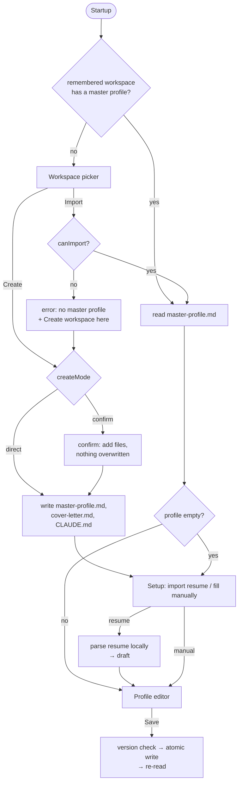

# #4 — Master profile flow: create, import guard, resume import, editor, branding

Issue: [silentashish/huntgry#4](https://github.com/silentashish/huntgry/issues/4) · Epic: #1 · Follows #2

## Context & problem

After #2 the app could create or import a workspace, but the flow stopped there:

- Create wrote a placeholder `master-profile.md` the user had to fill in by hand, and it
  refused any folder that was not empty.
- Import accepted folders with no master profile at all (application folders only).
- There was no way to fill the profile from an existing resume or from the app.
- In `npm run dev` the app showed up as **Electron**, with the Electron icon.

## What changed and why

| Area | Files | Why |
| --- | --- | --- |
| Profile model | `src/shared/master-profile.ts` | Typed `MasterProfile`: contact (name, headline, location, email, phone, LinkedIn, GitHub, website, work authorization, other links), summary, skill groups, experience, projects, education, certifications, publications, gaps, extra sections. Fields follow a real full-stack resume. |
| Markdown format | `src/main/profile/format.ts`, `text.ts` | `parseMasterProfile` / `serializeMasterProfile`. Serialization is stable and round-trips losslessly. The parser also reads hand-written variants (bold keys, `(link: …)`, field aliases, un-bulleted legacy lines) and the #2 placeholder. |
| Store | `src/main/profile/store.ts` | Read + save with a content hash as version: save is refused when the file changed on disk. Writes are atomic (temp + rename in the same folder), keep the file mode, and go through a symlinked profile to its target. |
| Resume import | `src/main/resume/{zip,docx,pdf,extract,parse}.ts` | File → lines → draft profile, all local. `.docx` via a ~60-line ZIP reader + WordprocessingML (tabs, list numbering, hyperlinks, headers). PDF via `unpdf` (pdf.js), rebuilding lines from positions: column gaps become tabs, bullet glyphs or indentation mark items, wrapped bullets are rejoined, link annotations attach to their line. `.txt`/`.md` directly. |
| Workspace rules | `src/main/workspace/create.ts`, `inspect.ts`, `src/shared/workspace-types.ts` | `canImport` = recognised layout **and** a master profile. `createMode` = `direct` (missing/empty), `confirm` (other content, no profile), or refused. Create writes the empty profile via the serializer, reports `skipped` files, and fails if the profile name is taken by something that is not a file. |
| IPC | `src/main/ipc.ts`, `src/preload/index.ts` | New `profile.{read, save, importResume, openInEditor, reveal}`. Main resolves the profile path from the remembered workspace; the renderer never sends a path. Profile payloads are shape-checked. |
| UI | `src/renderer/src/**` | `App` routes picker → setup → editor. `WorkspacePicker` (the old screen) adds the confirmation modal and the "no master profile → Create here" error. `ProfileSetup` offers *Import from a resume* / *Fill it in manually*. `ProfileEditor` is a tabbed form built from field specs, with a sticky Save/Discard bar, conflict handling, parse warnings and an unsaved-changes guard. |
| Branding | `src/main/index.ts`, `resources/*`, `scripts/*`, `package.json`, `electron-builder.yml` | `app.setName('Huntgry')`, `productName`, About panel, window and dev dock icon. `scripts/brand-dev-electron.cjs` renames the dev `Electron.app` in `node_modules` (plist + icon + ad-hoc re-sign) so the menu bar and Dock say Huntgry. `npm run dist` packages a real Huntgry.app. The icon is an SVG rendered with Electron itself (`npm run icons`), no image tooling. |

## Decision: Markdown file vs a database

The master profile stays **only** in `master-profile.md`; there is no database or cache.

- The resume-tailor skill (Claude) reads the Markdown directly, so the file must stay the
  source of truth anyway. A database would be a second copy to keep in sync, with the
  file edited by hand, by Claude and by the app.
- The file is small; parsing it on every read takes well under a millisecond.
- Hand editing stays first class: the parser is tolerant, unknown `##` sections are kept
  verbatim, and anything it cannot place is listed as a warning before the user saves.
- Concurrent edits are caught by the version hash instead of being overwritten.

A database becomes worth it for data that is *not* the profile (application tracking,
scraped jobs). That can live in `userData` later without changing this file's role.

### The format

```markdown
## Experience

### Acme Corp
- Role: Senior Engineer
- Start: Jan 2022
- End: Present
- Location: Austin, TX
- Highlights:
  - Rebuilt the billing API, cutting p95 latency by **40%**.
```

One `## Section` per resume part; each entry is a `### Heading` + `- Field: value`
lines; list fields nest their items. The file header (an HTML comment rewritten on save)
documents every field.

## Decision: heuristic resume parser vs Claude

Parsing is deterministic and local: section headings, date ranges, tab/column layout and
bullets. It is fast, works offline, sends no personal data anywhere, and is unit-tested.
On the maintainer's real `.docx` resume, and a PDF of it, every section came out right.
The result is always a draft the user reviews in the form. A "parse with Claude" option
can be added with the CLI integration (`src/main/cli/`) for unusual layouts.

## Flow



## How to test

```bash
npm install
npm test            # 58 vitest cases: workspace, profile format/store, resume parser
npm run typecheck
npm run build
npm run dev
```

Manual checks in `npm run dev`:

1. The menu bar and Dock show **Huntgry** with the new icon.
2. **Import Existing Workspace** on a folder with no `master-profile.md` → red error with
   **Create workspace here** ([screenshot](assets/4-import-no-profile.png)).
3. Click it → confirmation listing the files to add ([screenshot](assets/4-confirm-non-empty.png))
   → setup step ([screenshot](assets/4-setup.png)). Existing files are unchanged.
4. **Choose resume file…** with a `.docx` or `.pdf` → the form is filled and marked unsaved
   ([contact](assets/4-imported-contact.png), [experience](assets/4-imported-experience.png)).
   Save → `master-profile.md` holds the data as readable Markdown.
5. Edit a field, change the file in a text editor, Save → conflict with **Reload from disk**
   ([screenshot](assets/4-conflict.png)).
6. Quit and relaunch → opens straight into the editor.

The screenshots come from the built app driven with Playwright `_electron`, using a
fictional resume. Native dialogs were stubbed from the main process.

## Follow-ups

- "Parse with Claude" for resumes the heuristics miss (with the CLI integration).
- Code signing / notarisation for `npm run dist`.
- Playwright `_electron` smoke test in the repo, reusing the stubbed-dialog approach.
- Old `.doc` and scanned (image-only) PDFs are not supported; the app says so.
