# #44: Run observability (run time, tokens and estimated cost per run, with Dashboard totals)

Issue: [silentashish/huntgry#44](https://github.com/silentashish/huntgry/issues/44) · Builds on #8, #21, #22, #31 · Feeds the budget guard of #31

## Context & problem

Tailoring runs now start without anyone watching (bulk **Tailor all**, #21, and the unattended
pipeline, #31). Nothing said what a run cost or how long the agent worked:

- `run.json` had `createdAt`/`updatedAt` only. Wall time is misleading anyway: a run can wait at
  the approval step for hours.
- Claude runs kept `costUsd` and no tokens; Codex and Antigravity runs kept input/output tokens
  and dropped the cache and reasoning split, without which no price is right (a cached input
  token costs about a tenth of a normal one).
- The model was not recorded, so nothing could be priced.
- Nothing was aggregated; the transcript footer showed dollars for Claude and tokens for the
  others, which cannot be compared.

**A bug found on the way.** Real `events.jsonl` files in a workspace show that Claude's
`result.total_cost_usd` and `result.modelUsage`, and Codex's `turn.completed.usage`, are the
**session's running totals**, continued by a resume, not the turn's:

| Run (recorded) | Turn | CLI reports | Turn's real share |
| --- | --- | --- | --- |
| Claude, Opus 5.5 | 1 | `total_cost_usd` 0.4776, `modelUsage.outputTokens` 6658 | 0.4776 |
| | 2 | `total_cost_usd` 1.5319, `modelUsage.outputTokens` 27104 (`usage.output_tokens` 20446) | 1.0544 |
| Claude, resumed 10 h later | 2 | the same 0.38163 as turn 1, `usage` all 0 | 0 |
| Codex, gpt-6.1-sol | 1 / 2 / 3 | `output_tokens` 1641 / 4793 / 5034 (turn 3 ran one command) | 1641 / 3152 / 241 |

The old `run.costUsd += total_cost_usd` therefore counted every earlier turn again: the first run
above read $2.01 instead of $1.53, the second $0.76 instead of $0.38. The pipeline's budget
(`runCosts`, #31) read the same field. Claude's `result.usage` *is* per turn (20446 = 27104 −
6658).

## What changed and why

| Area | Files | Why |
| --- | --- | --- |
| Types | `src/shared/runner-types.ts` | `TokenUsage` (uncached input, cache reads, cache writes with the Claude 1-hour part, output incl. reasoning, reasoning), `TurnMetrics`, `RunTotals`, `CliCounters`. `RunSummary` gains `model`, `metrics`, `totals`, `cliCounters`, `backfilled`; `StartRunParams` gains `batchId`. The old `{inputTokens, outputTokens}` is now `TokenCount` (legacy `run.usage`, transcript footers, remote protocol). |
| Adapters | `src/main/cli/agents/{claude,codex,antigravity,types}.ts` | Each `signal()` normalizes its CLI's fields into `TokenUsage` and says whether they are the turn's (`usageScope: 'turn'`) or the session's (`'session'`), so the `RunManager` stays agent-agnostic. Claude also reports the model (`init.model`), per-model running totals (`modelUsage`), `duration_api_ms` and `duration_ms`. `agyModel()` reads the model agy's own settings name. |
| Turn shares | `src/main/cli/metrics.ts` (new) | `turnShare` turns running totals into the turn's share (difference with the counters the previous turn left; a counter that went down means the CLI started again). `turnMetrics`, `legacyFields` and `backfillMetrics` (rebuild old runs from `events.jsonl`) share it, so live and backfilled runs count the same. |
| Runner | `src/main/cli/runner.ts`, `start.ts` | Measures `activeMs` per turn itself, `send()` → turn end, or → process exit for a stopped or crashed turn, which is then recorded with `ok: false` and no tokens. Stores `metrics`, `totals`, the model, and `cliCounters` in `run.json`; `costUsd` is now the sum of the per-turn reported shares (fixes the double count). A run recorded before #44 is backfilled before a resumed turn, so that turn's share is right. `RunContext.expectedModel` carries agy's settings model; the price table comes from the `prices` hook. |
| Prices | `src/shared/pricing.ts` (new) | `MODEL_PRICES` (see below), `normalizeModelId`, `findPrice`, `estimateCost` (`null`, never 0, for an unknown model), `estimateTurn` (per model when Claude split the turn), `runTotals`, `priceRun` (reprice on read), `effectivePrices` (bundled + Settings), `requireModelPrice`. |
| Aggregation | `src/shared/usage.ts`, `usage-types.ts` (new), `src/main/cli/usage.ts` (new), `ipc.ts`, `preload/runner.ts`, `shared/events.ts` | `runner:usage-summary(filter)` scans the workspace's `run.json` files (live runs from memory), backfills old ones from their events (cached in memory by the files' mtime and size), reprices at today's table and sums **turns only**: totals, per agent × model, per day, per batch, per run. `runner:export-usage` saves the per-run rows as CSV (formula-safe). `runner:prices` / `set-price` / `remove-price` / `reset-prices` for Settings; `runner:prices` is also an event. `listRuns`, `getRun` and `runner:run` hand the renderer repriced, backfilled runs. |
| Batches | `src/main/queue/queue.ts`, `src/shared/queue-types.ts`, `command.ts` | Every item of one enqueue (one **Tailor all**, one pipeline) shares a `batchId` (`b-<timestamp>-<hex>`), passed in the run parameters, so `run.json` carries it and a batch can be totalled from the runs alone, even after its queue items are cleared. |
| Tailor page | `components/usage/{format.ts,RunMetrics.tsx}` (new), `pages/tailor/{RunView,Transcript,RunList,QueuePanel,PipelinePanel,status,index}.tsx`, `navigation.ts` | A metrics strip on the run: **Active time · Waiting for you · Model · Tokens · Est. API cost**, the token split, what the CLI reported (Claude), and a per-turn table. Every transcript turn footer reads that turn's metrics (`2m 14s · 18 in · 33.0k cached · 209 out (82 reasoning) · $0.03`); results now carry their `turn` number to find them. Run list, queue and pipeline rows show `2m 14s · 48k tok · $0.31`. The page opens on `{ runId }`. |
| Dashboard | `pages/dashboard/UsageCard.tsx` (new), `index.tsx`, `ApplicationDrawer.tsx` | **Usage** card: Runs · Active time · Tokens · Est. API cost (per run, per built resume, share spent on failed runs), filters (7 days / 30 days / all, agent, model, status, one batch), the agent × model table with unpriced turns, a per-day chart (cost or tokens), the latest bulk requests with their totals, links to the latest runs, **Export CSV**. It reloads (debounced) on `runner:run` and `runner:prices`, so it follows a running batch. The application drawer lists the runs that built the application with their badge, linked to the Tailor page. |
| Settings | `pages/settings/PricingCard.tsx` (new), `src/main/workspace/settings.ts` | **Pricing**: the table in use with source and date per model, edit a model, add one, reset one or all. **Sync prices** fetches current prices on click, with a "Last synced … from …" line and **Clear synced prices**. Stored in the app settings (`pricing.models`, `pricing.synced`), never in the workspace. |
| Price sync | `src/main/cli/price-sync.ts` (new), `usage.ts`, `ipc.ts` (`runner:sync-prices`, `runner:clear-synced-prices`) | Fetches a public price list in main (see "Price sync" below), keeps Anthropic / OpenAI / Gemini models only, checks every figure, stores the result as its own layer. |
| Fakes | `src/main/cli/fixtures/fake-{claude,codex}.mjs`, `e2e/fixtures/fake-agent/agent.mjs` | Report running totals as the real CLIs do (kept in a file between processes, so a resume continues them); fake Claude names Haiku 4.5 with tokens that price to its reported cost. |

### How a turn is measured

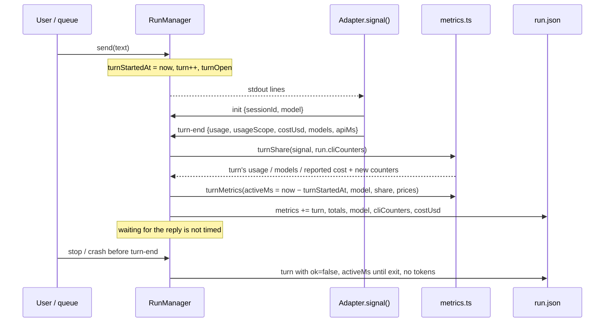

### Data model

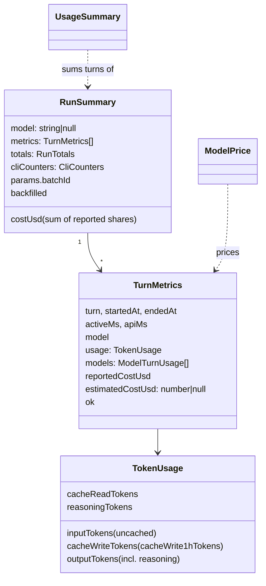

### What each CLI reports, normalized

| | Claude (`result`) | Codex (`turn.completed`) | Antigravity (`result`) |
| --- | --- | --- | --- |
| Scope | `usage` per turn; `total_cost_usd`, `modelUsage` session totals | session totals | per turn (assumed, see below) |
| Uncached input | `input_tokens` | `input_tokens − cached_input_tokens − cache_write_input_tokens` | `input_tokens − cache_read_tokens` |
| Cache read / write | `cache_read_input_tokens` / `cache_creation_input_tokens` (1 h part: `cache_creation.ephemeral_1h_input_tokens`) | `cached_input_tokens` / `cache_write_input_tokens` | `cache_read_tokens` / – |
| Output (billed) | `output_tokens` (thinking inside: the fixture's cost only matches that way) | `output_tokens` (reasoning inside, as in the OpenAI API) | `output_tokens + thinking_tokens` (Gemini API convention) |
| Model | `init.model`, `modelUsage` keys | the `-m` Huntgry passes (`~/.codex/config.toml`), else unknown | `~/.gemini/antigravity-cli/settings.json` → `model` (a display name, e.g. `Claude Opus 4.6 (Thinking)`) |

### Prices (bundled, `asOf` 2026-10-06)

USD per 1M tokens, read on the official pages on 2026-10-06. Models whose price could not be
confirmed there are not in the table (they read "not priced").

| Source | Models |
| --- | --- |
| [platform.claude.com/docs/en/about-claude/pricing](https://platform.claude.com/docs/en/about-claude/pricing) (claude.com/pricing agrees on the current models) | Fable 5.1 ($10 / $0.25 read / $50), Fable 5 ($10 / $1 / $50), Opus 5.5 ($4 / $0.20 / $20), Opus 5, 4.8, 4.7, 4.6, 4.5 ($5 / $0.50 / $25), Opus 4.1 and 4 ($15 / $1.50 / $75), Sonnet 5.5 and 5 ($2 / $0.20 / $10), Sonnet 4.6, 4.5, 4 ($3 / $0.30 / $15), Haiku 4.5 ($1 / $0.10 / $5), Haiku 3.5 ($0.80 / $0.08 / $4). Cache writes 1.25× input (5 min) and 2× (1 h), as the table lists them. |
| [developers.openai.com/api/docs/pricing](https://developers.openai.com/api/docs/pricing) (openai.com/api/pricing answers 403 to a fetch) | gpt-6-astra ($10 / $1 / write $12.50 / $50), gpt-6.1-sol ($2 / $0.10 / $2.50 / $10), gpt-6-sol ($2 / $0.20 / $2.50 / $10), gpt-6-luna ($0.10 / $0.01 / $0.125 / $0.50), gpt-5.6-sol ($4 / $0.40 / $5 / $20), gpt-5.3-codex ($1.75 / $0.175 / $14), gpt-5 ($1.25 / $0.125 / $10), gpt-5-mini ($0.25 / $0.025 / $2), o3 ($2 / $0.50 / $8). |
| [ai.google.dev/gemini-api/docs/pricing](https://ai.google.dev/gemini-api/docs/pricing) | Gemini 3.8 / 3.7 / 3.6 Flash ($0.75 / $0.075 / $3.75, rising to $1.50 / $0.15 / $7.50 on 2027-01-01), 3.5 Flash ($1.50 / $0.15 / $9), 3.5 Flash-Lite, 3.1 Flash-Lite, 3.1 Pro Preview ($2 / $0.20 / $12, alias `gemini-3.1-pro`), 2.5 Pro, 2.5 Flash, 2.5 Flash-Lite. Thinking is billed as output; no per-token cache write (storage is per hour), so writes cost plain input. |

The issue's seed values for Opus ($5) and Sonnet ($3) are the older generations; Opus 5.5 is $4
and Sonnet 5.5 $2. The Claude estimate of the recorded fixture (`read-file-turn.jsonl`, Haiku 4.5
with a 1-hour cache write) equals the CLI's `costUSD` to the 7th decimal (unit test).

### Price sync (owner request)

The estimate is meant as a **rough "what would this cost on the API"**, not billing, so the
bundled table can be refreshed from a community-maintained list instead of being edited by hand.

- **On click only.** Settings → Pricing → **Sync prices** asks main (`runner:sync-prices`); the
  renderer never fetches. No background or startup sync.
- **Sources, in order.**
  1. LiteLLM's [`model_prices_and_context_window.json`](https://raw.githubusercontent.com/BerriAI/litellm/main/model_prices_and_context_window.json):
     `input_cost_per_token`, `output_cost_per_token`, `cache_read_input_token_cost`,
     `cache_creation_input_token_cost` and `cache_creation_input_token_cost_above_1hr`, × 10⁶.
     Only entries whose `litellm_provider` is `anthropic`, `openai` or Google's
     (`gemini`, `vertex_ai-language-models`), in `chat` / `responses` mode, keyed by the model
     itself (`gemini/<id>` included); resellers (Bedrock, Azure, Vertex's Claude …) are skipped.
  2. If that fails: OpenRouter's [`/api/v1/models`](https://openrouter.ai/api/v1/models):
     `pricing.prompt`, `completion`, `input_cache_read`, `input_cache_write`,
     `input_cache_write_1h` (decimal strings), for `anthropic/…`, `openai/…` and `google/…` ids;
     variants (`…:batch`, `…:free`) are skipped.
- **Matching.** Names go through `normalizeModelId` and must look like one of our providers'
  models (`claude-…`, `gpt-…` / `o3…` / `codex-…`, `gemini-…`), not an image, audio, realtime or
  embedding one. A name that means a bundled model (by id or alias) updates that entry; any other
  is added as a new model. Dated and undated keys of one model give one entry (the undated wins).
- **Checks.** Input and output must be present; every figure must be a finite number, ≥ 0 and
  ≤ $1000 per 1M tokens, or the model is dropped; all-zero entries (placeholders) are dropped; a
  missing cache-read price is taken as the input price. 15 s timeout for the whole exchange (body
  included), 20 MB cap on the response; on any error the request is aborted and its body cancelled
  before the next source is tried.
  Settings read back from disk are checked again.
- **Failure.** Offline, HTTP error, bad JSON, no usable model: the card shows the reason for each
  source and nothing changes, in memory or on disk.
- **Precedence.** The user's own edits, then synced prices, then the bundled table, compared by
  the same normalized names the lookup uses: a user's `gpt-x-2026-10-01` replaces a synced `gpt-x`
  (and keeps its own id, so its row still edits and resets). "Reset to
  defaults" clears the user's edits (the sync stays); "Clear synced prices" drops the sync. Runs
  reprice on read, as for any price change.

### Active time and waiting time

- **Active time** is measured by Huntgry for every agent the same way: from the moment the message
  is written to the agent (`send`) to the turn's end signal, or to the process exit when the turn
  never ended (stop, crash, watchdog abort). The time a run waits at the approval step is never in
  it. The CLI's own duration is kept as detail (`apiMs` for Claude).
- **Waiting for you** = wall time since the run started minus active time, measured up to the start
  of the turn that is running (`run.turnStartedAt`, so it stops growing while the agent works), to
  now while the run waits (the strip refreshes every second), or to its last update once it ended.

### Turns that never end

A turn stopped or crashed before its end signal, or whose end reports no usage at all (Codex
`turn.failed`), still records its active time, with
`ok: false` and `usageIncomplete: true`. Its tokens are what the CLI had reported per API request
until then: Claude's `assistant.message.usage`, repeated on every block of the same message and
therefore counted once per message id (sub-agents included). Streamed `output_tokens` are only
what was sent so far, so this is a lower bound; the UI shows such costs as "≥ $x", and a turn
with nothing reported (Codex and agy report no per-request usage) as "usage unknown", never as
free. The Dashboard says how many turns are incomplete. Since the CLI's running totals may report
those requests again at the next turn's end, the tokens given to the interrupted turn are kept in
`cliCounters.interrupted` and subtracted from the next turn's share.

### Model per process

Each process starts from the model of its own invocation: the `-m` Huntgry passes to Codex, the
model agy's settings name when it starts. A resume after a model change is priced with the new
model; Codex with no model passed is unknown, not the last turn's. Only Claude, which names its
model in `init`, keeps the last turn's model until its `init` arrives.
- **Backfilled runs** (recorded before #44): tokens, models and costs are exact (the raw lines
  hold them). Active time is the CLI's own `duration_ms` / `duration_seconds` where it gave one,
  otherwise the time until the next message, capped at one hour, so it is approximate; such runs
  are marked "rebuilt from the run log".

### Estimated API cost: what it is, and what it is not

The figure is what the tokens would cost at the model's **standard API rates** (global, non-batch,
non-fast, short-context tier). It is labelled "Estimated API cost" everywhere. On a Claude
Pro/Max, ChatGPT or Google AI subscription nothing is billed per token; the same holds for agy
running a Claude model on Google's quota: the figure is then the equivalent API price, useful to
compare runs, agents and models. Claude's own `costUSD` is shown next to it as "Claude reported".

## Screenshots

Before (main) / after (this branch), the e2e demo workspace with the fake agents:

| | Before | After |
| --- | --- | --- |
| Tailor run | 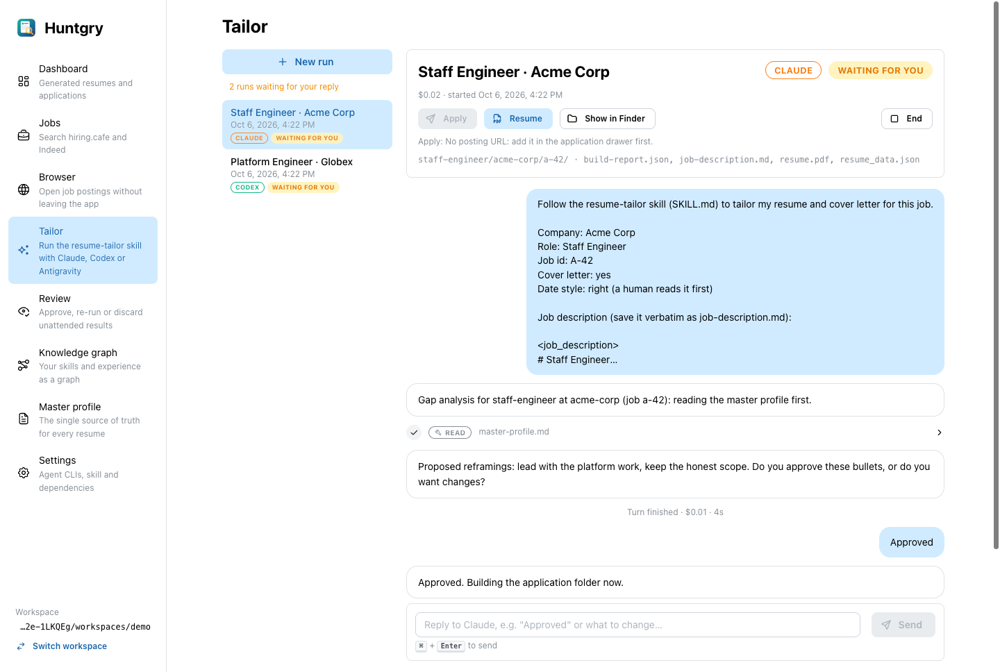 | 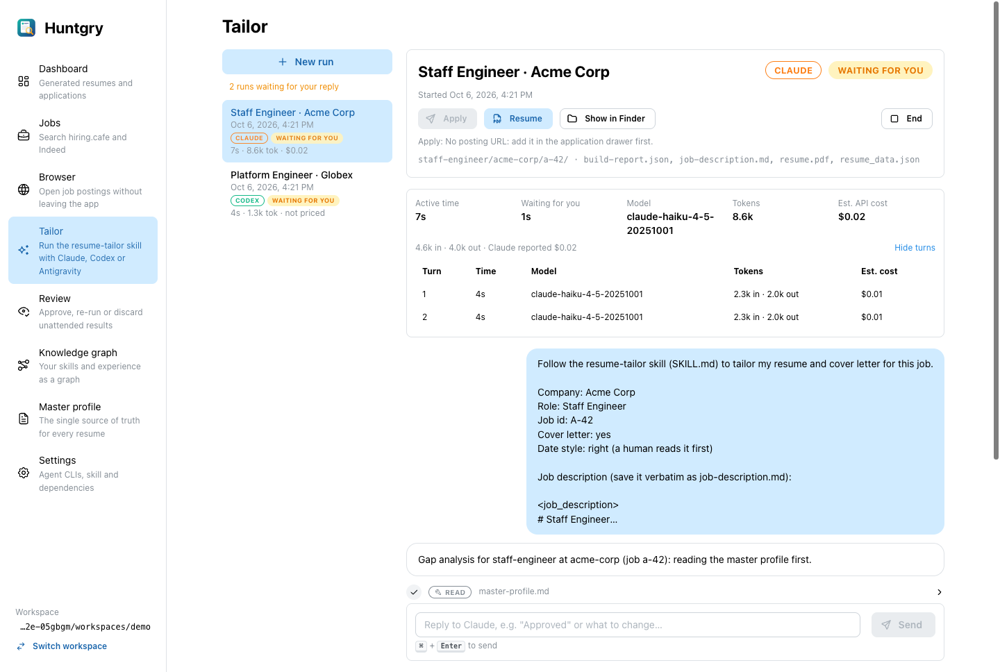 |
| Dashboard | 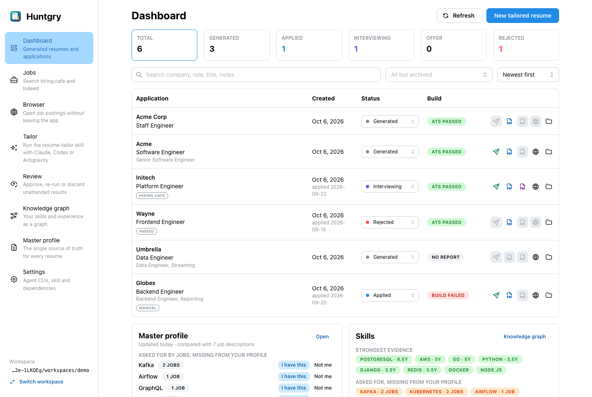 | 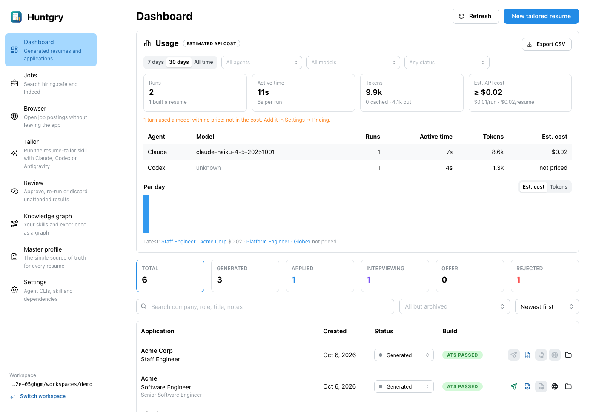 |
| Settings | 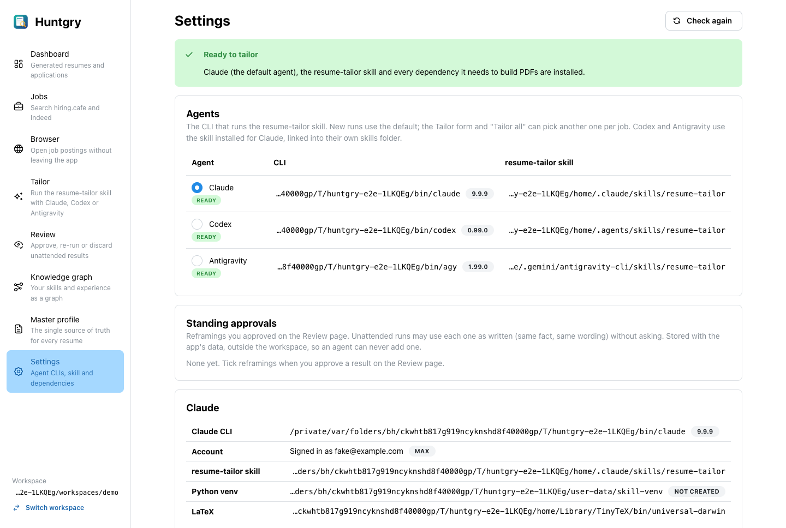 | 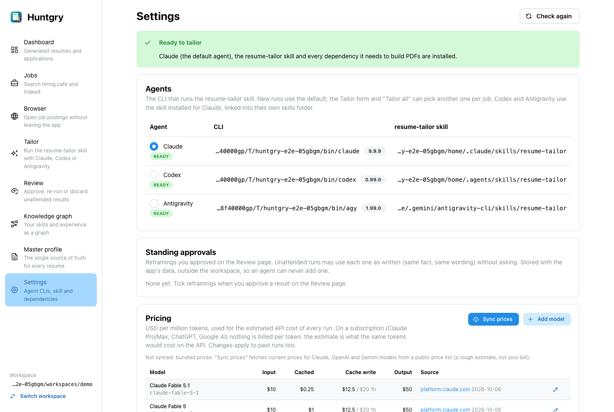 |

Real bulk run (3 jobs by "Tailor all": two on Claude Haiku 4.5, one on Codex gpt-6.1-sol, each
stopped at the approval step), then **Sync prices** against LiteLLM:

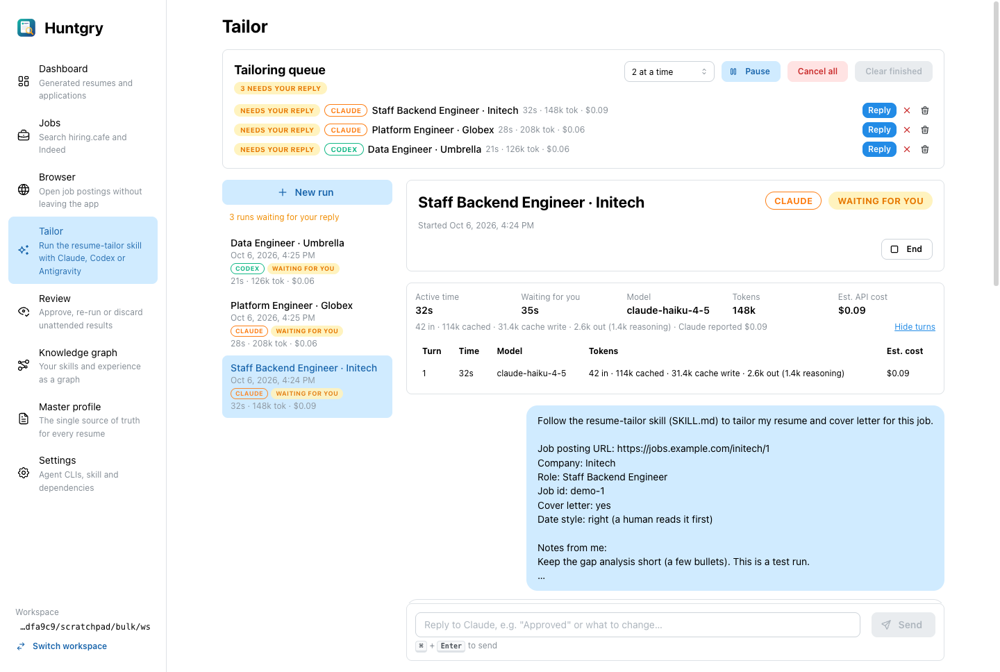
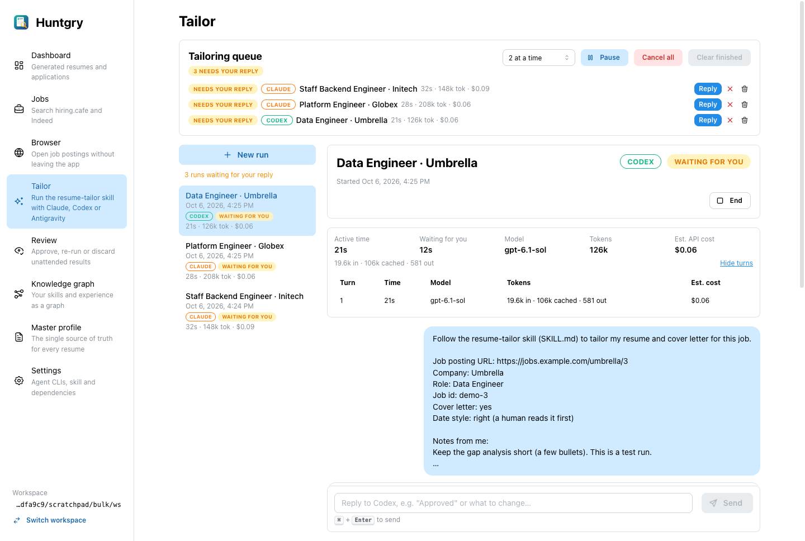
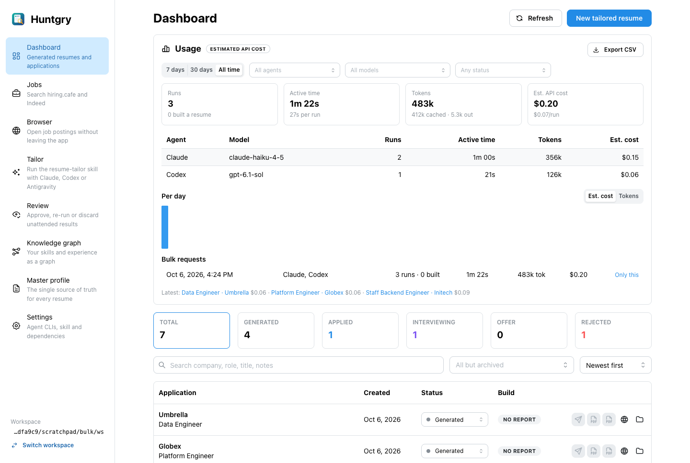
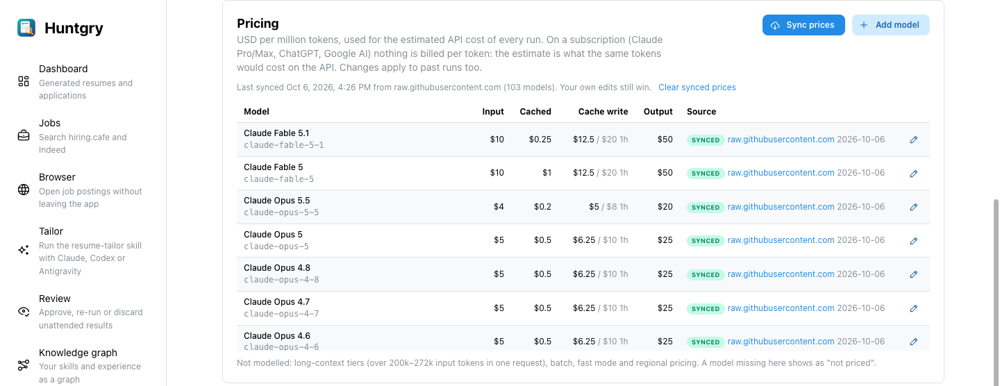

## Decisions and alternatives rejected

- **Estimate from the table for every agent, Claude's figure as a cross-check** (not "show the CLI
  cost for Claude"). The issue suggested showing Claude's `costUSD`; but then a price change in
  Settings would not reprice Claude runs and totals would mix two sources. The table reproduces
  Claude's figure exactly (tested), the CLI's figure is shown next to it, and `costUsd` (the
  pipeline budget) keeps the CLI's own number.
- **Differences of running totals, with a reset rule**, instead of trusting `usage` alone. Claude's
  per-turn `usage` misses sub-agents (only `modelUsage` has them), and Codex has nothing per turn.
  When a counter goes down the CLI started counting again and the new value is the share. If a
  CLI ever restarted its counters *and* the new process outgrew the old totals in its first turn,
  that turn would be undercounted; recorded runs show both CLIs restoring the totals on resume.
- **Estimates stored and recomputed on read.** `run.json` keeps raw tokens; `estimatedCostUsd` is
  stored for whoever reads the file, but `listRuns`, `getRun`, `runner:run` and the summary
  reprice at the current table, so Settings → Pricing applies to past runs at once.
- **Backfill cached in memory, not written back.** Writing old `run.json` files from a summary
  scan could race a resume of the same run. The runner backfills (and saves) a run itself when it
  resumes it. Rejected: a migration on workspace open (slow on big workspaces, same race).
- **Agy's model from its settings, not `--model`.** Passing `--model` would need a Settings choice
  per agent and could change what agy runs; reading `settings.json` prices what it actually runs
  today. A model changed in agy between runs prices the next run correctly.
- **No aliases like `opus`.** The CLIs report full ids (`init.model`); an alias's meaning changes
  over time, so guessing one would misprice. Dated ids, `[1m]`, Bedrock/Vertex spellings (cross-region profiles such as `us.anthropic.…` included) and agy
  display names are normalized; a suffix like `gpt-6-sol-high` maps to its base, but an unknown
  version (`claude-opus-5-6`) never falls back to another one.
- **Long-context tiers not modelled.** The tier depends on each request's size; a turn's tokens are
  a sum over many requests. Noted in Settings; a long-prompt turn on Gemini Pro / GPT-6 is
  underestimated.
- **Turns split by model in the breakdown.** A Claude turn with a sub-agent on another model counts
  in each model's row with that model's tokens and price; its active time goes to the turn's main
  model only (so the rows add up to the total time), and tokens the split does not cover stay with
  that model. The model filter and its choices include sub-agent models; filtering on one selects
  the runs that used it, with their whole totals.
- **An edited bundled price keeps its aliases.** Settings overrides are merged with the bundled
  entry's aliases (agy names models by display name), so editing a price never unprices a run.
- **One card on the Dashboard, not a new page.** The filters, breakdown, chart, batches and export
  fit in one card next to the applications they explain; a page can come when there is more.
- **Test ids for the figures.** The KPI and strip values are bare text next to a label with no
  accessible name; `data-testid`s: `run-metrics`, `metric-{active,waiting,model,tokens,cost}`,
  `turn-metrics`, `run-usage`, `queue-run-usage`, `usage-card`, `usage-{runs,active,tokens,cost}`,
  `usage-breakdown`, `usage-chart`, `usage-batches`, `application-runs`, `pricing-card`,
  `price-<model id>`.

## How to test

```bash
pnpm install
npx vitest run src/main/cli/price-sync.test.ts src/main/cli/metrics.test.ts src/main/cli/runner.test.ts src/main/queue src/renderer/src/components/usage e2e/fixtures/fake-agent
npm test && npm run typecheck && npx electron-vite build
```

- `metrics.test.ts`: the three fixtures normalize as above (Codex's cached-inside-input
  subtraction, agy's thinking), the Claude estimate equals `costUSD`, the recorded Codex and
  Claude running totals become per-turn shares, price normalization and "never guess", Settings
  overrides reprice stored turns, backfill from `events.jsonl`, and the usage summary over the
  fixture workspace `src/main/cli/fixtures/usage-workspace` (four runs with metrics across three
  agents and one batch, one run recorded before #44): **totals equal the sum of the per-run
  numbers**, the agent × model table and the days add up to the totals, filters and batch totals,
  CSV.
- `runner.test.ts` (metrics): waiting for the reply is not active time, the running total is split
  per turn, a stopped turn records its time, a turn stopped mid-way keeps Claude's per-request
  usage once per request, a resumed Codex turn is priced with its new `-m` model, the running
  turn's start is recorded, a failed turn its tokens, Codex per-turn tokens and
  `-m` model, agy's settings model, an unknown model is `null`, an old run is backfilled before a
  resumed turn, the batch id lands in `run.json`.
- `queue.test.ts`: one batch id per request, recorded on the runs.
- `price-sync.test.ts`: both lists parsed from small recorded extracts (`src/main/cli/fixtures/prices/`,
  no network), bad values rejected (negative, > $1000/M, not a number, all-zero), other providers
  and resellers ignored, the OpenRouter fallback on a 403 / bad JSON / offline, both reasons when
  both fail, the size cap, precedence (edits > synced > bundled), Reset and Clear, a failed sync
  leaving prices and the settings file untouched.
- `e2e/tests/usage.spec.ts` (CI): a two-turn Claude run through the app: strip, turn footers, run
  list badge, `run.json`, the Dashboard's totals, a price change in Settings and Reset.
- By hand (after 16:00, coordinator): a bulk run of ≥ 3 jobs across two agents, then compare the
  Dashboard's totals and the batch row with the sum of the runs' strips; check a Claude run's
  "Claude reported" against its estimate; change a price and see the Dashboard follow.

- **Price sync from a community list, on click.** The owner asked for a rough estimate, robustly
  refreshed. LiteLLM's list is maintained per provider and per token type (cache writes and the
  1-hour write included); OpenRouter is a second, independent list. Rejected: scraping the
  providers' pricing pages (HTML changes, OpenAI's page refuses fetches) and a background sync (a
  network call the user did not ask for, and a price that changes under them).

## Follow-ups

- **Budget guard (#31)**: use `estimatedCostUsd` (all agents) instead of `costUsd` (Claude only)
  for the pipeline's "stop after $X".
- **Antigravity semantics**: the fixture has no cache hit and one turn. Confirm on a real
  multi-turn agy run with a cache hit that `input_tokens` include `cache_read_tokens`, that
  `thinking_tokens` come on top of `output_tokens`, and that `result.usage` is per turn (flip
  `usageScope` to `'session'` if not).
- Codex with no `model` in `config.toml` runs the CLI's default, which Huntgry cannot see: such
  runs read "not priced". A Settings choice of model per agent (passed with `-m` / `--model`)
  would fix both.
- The remote protocol (phone) still carries `costUsd` and `usage` only; add the totals when the
  phone shows runs in detail.
- Live subscription quota and usage-limit tracking stay a separate ticket, as the issue says.
