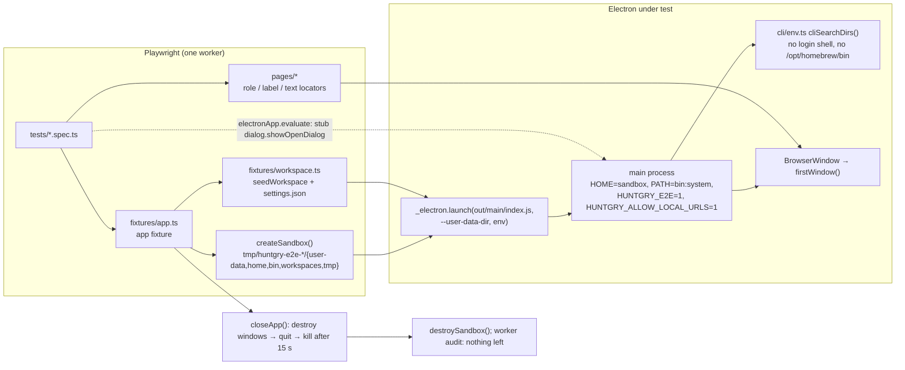
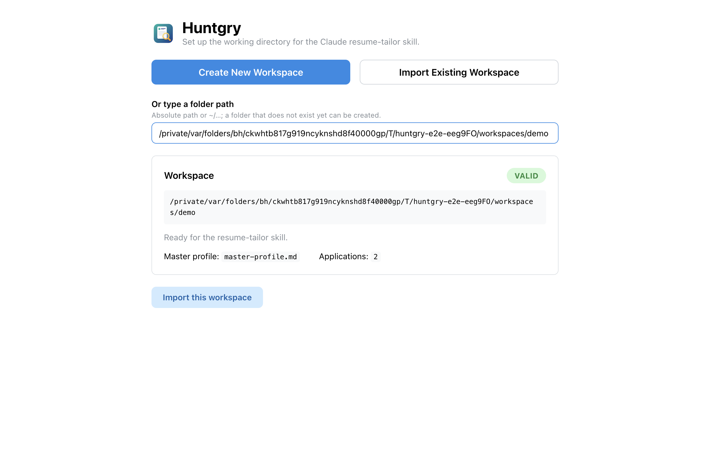
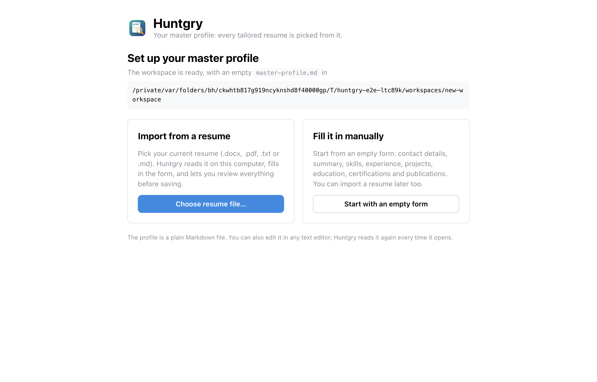
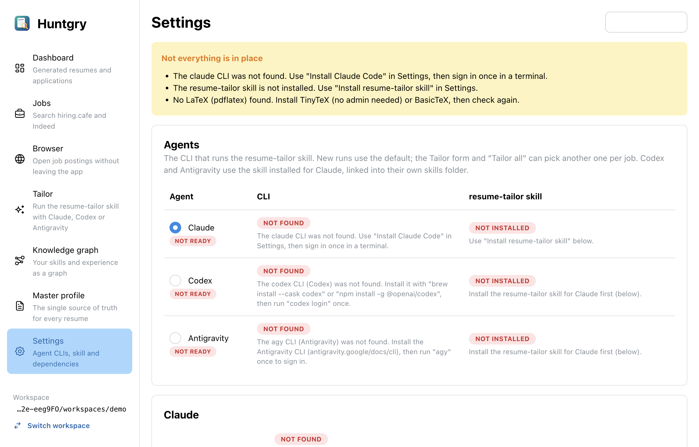

# #46 — Playwright e2e harness, fixtures and workspace/profile-setup flows

Issue: [silentashish/huntgry#46](https://github.com/silentashish/huntgry/issues/46) · Epic: #45 · First of #46–#50

## Context & problem

Huntgry has 399 vitest tests for pure logic and none for what a user actually walks through:
the picker, profile setup, the shell, IPC, the preload bridge, native dialogs. Epic #45 decided
on Playwright against the real Electron app. This ticket puts the harness in place and proves it
on the flows every other test has to get through first, so #47–#49 only add page objects and
specs. Two things made a naive harness unsafe: the app discovers `claude`/`codex`/`agy` through
the login-shell `PATH` and machine-wide folders, and it remembers the workspace in the real
`userData`. A test run must never see the developer's CLIs or touch their settings.

## What changed and why

| Area | Files | Why |
| --- | --- | --- |
| Harness | `e2e/playwright.config.ts`, `e2e/tsconfig.json`, `package.json` (`test:e2e`, `test:e2e:ui`, `typecheck:e2e`), `.gitignore` | `testDir e2e/tests`, one worker, retries only in CI, list + HTML reporters, output under `e2e/.results/`. `@playwright/test` pinned to 1.63.0 (current stable). `npm test` stays vitest only. |
| App fixture | `e2e/fixtures/app.ts` | `createSandbox()` (temp userData, HOME, bin, workspaces, tmp), `launchApp()` with a fresh environment (see docs/testing/e2e.md), the `app` test fixture with the `workspace` option and `relaunch()`, failure screenshot + main-process output, `closeApp()` that destroys windows first and kills after 15 s, and a worker-scoped audit that fails the run if a sandbox is left behind. Fails fast when `out/` is missing. |
| Workspace fixture | `e2e/fixtures/workspace.ts`, `e2e/fixtures/workspaces/*`, `e2e/fixtures/resumes/*`, `e2e/fixtures/generate.mts` | `seedWorkspace`, `rememberWorkspace` (settings.json before launch: the fast path), `stubOpenDialog` / `stubMessageBox` through `electronApp.evaluate`. Fixture workspaces `empty-profile` (real Create output), `demo`, `legacy`, `not-a-workspace`; generated sample resumes (`.docx`, `.pdf`) of a fictional person, reusing the vitest builders in `src/main/resume/test-fixtures.ts`. |
| Page objects | `e2e/pages/{workspace-picker,profile-setup,profile-editor,shell}.ts` | Role/label/text locators only. `Shell.expectActive` checks the navbar's `data-active` and the page heading. |
| Specs | `e2e/tests/{workspace,profile-setup,shell,isolation}.spec.ts` | 19 tests: the picker flows (Create missing / non-empty with confirmation, Import valid / refused with Create offer / legacy, `~`, cancelled dialog), remembered workspace (relaunch, deleted profile notice, switch), profile setup (manual → Contact tab, `.docx` import → review → save → dashboard, `.pdf` import, cancel), every navbar entry, the dashboard listing the demo applications, and the isolation guarantees. |
| CLI discovery | `src/main/cli/env.ts`, `src/main/index.ts`, `src/main/cli/cli.test.ts` | `HUNTGRY_E2E=1` (unpackaged only; main reports `app.isPackaged` once through `setPackagedBuild`) makes `cliSearchDirs` skip the login-shell PATH and `/opt/homebrew/bin`, `/usr/local/bin`, keeping the folders below `HOME` and the app's PATH. `buildChildEnv` applies the same filter to the PATH of agent child processes, and `loginShellPath()` resolves to `''` in that mode, so children do not inherit the user's shell PATH either. Without it the harness could not hide a Homebrew `claude`. Unit-tested. |
| Navbar | `src/renderer/src/components/shell/AppLayout.tsx` | `NavLink` rendered an `<a>` without `href`: no role, no accessible name, not focusable. It is now `component="button" type="button"`, named "<label> <hint>", and the active entry carries `aria-current="page"` (Mantine only sets `data-active`). No `data-testid` was added anywhere. |
| Docs | `docs/testing/e2e.md`, `README.md` | How to run, the isolation model and every variable the harness sets, fixtures, page objects, adding a spec, debugging. README's Development section lists the scripts and links the guide. |



## Decisions and alternatives rejected

- **Unpackaged build, not the `.app`.** `electron-vite build` output is what dev and packaging
  share; packaging is the release's concern. Playwright launches the `node_modules` Electron.
- **A fresh environment instead of a filtered one.** Spreading `process.env` and deleting the
  known-dangerous variables would break the next time one is added (`HUNTGRY_CLAUDE_PATH`,
  `ELECTRON_RENDERER_URL`, `CLAUDECODE`…). The app gets exactly the variables listed in the guide.
- **`HUNTGRY_E2E` escape hatch in `env.ts`.** Alternatives: pin `HUNTGRY_CLAUDE_PATH` to a
  missing file (only covers Claude, and later tickets want real discovery of fakes in the sandbox
  `bin`), or a fake login shell (fragile). The mode is off in packaged builds regardless of the
  environment; the module defaults to "packaged" until main says otherwise.
- **`trace: retain-on-failure` locally, `on-first-retry` in CI.** The issue asked for
  `on-first-retry` and `retries: 0` locally, which together leave no trace for a local failure;
  the acceptance criterion needs one, so the local setting keeps it.
- **Failure screenshot taken in the fixture.** Playwright's `screenshot: 'only-on-failure'` runs
  after the `app` fixture has closed the window; the fixture writes `test-failed-1.png` itself.
- **Destroying windows before quitting.** An editor left dirty (the `.pdf` import test) makes
  `beforeunload` raise the native unsaved-changes dialog on close and races Playwright's own
  dialog handling; `win.destroy()` skips unload events, the `showMessageBoxSync` stub stays as a
  second guard.
- **Navbar entries as buttons rather than a `data-testid`.** The anchor without `href` was an
  accessibility bug (not focusable, no role); fixing it removed the need for a test id.
- **`aria-current="page"` set by the app.** Mantine's `NavLink` only marks the active entry with
  `data-active`, which assistive technology does not announce; the shell sets `aria-current` and
  the page object asserts it (plus `data-active` and the page heading).
- **Isolation baseline before launch, at file level.** The isolation test launches the app
  itself instead of using the `app` fixture, snapshots the real userData and
  `~/.claude/{skills,local}` (path, size, mtime) and `git status --porcelain --ignored` before
  launch, and compares after close. Directory mtimes and plain `git status` would miss a
  modified nested file or an ignored path.

## How to test

```bash
npm install
npm test && npm run typecheck && npm run build
npm run test:e2e
npx playwright test -c e2e/playwright.config.ts e2e/tests/workspace.spec.ts --repeat-each 3
```

1. Break an assertion (e.g. change a heading name in a spec) and run that spec:
   `e2e/.results/test-output/<test>/` holds `test-failed-1.png`, `trace.zip` and
   `error-context.md`; `npx playwright show-report e2e/.results/html-report` opens the report.
2. While the suite runs, `~/Library/Application Support/Huntgry/settings.json` and `~/.claude`
   do not change, and no `huntgry-e2e-*` folder is left in `$TMPDIR` afterwards.
3. `HUNTGRY_E2E=1 npm run dev` → Settings shows the agents as *Not found* unless one is in
   `~/.local/bin` or similar; without the variable, discovery is unchanged.





## Follow-ups

- #47 dashboard, profile editor, graph and insights; #48 tailor and settings with fake agent
  CLIs (`fixtures/fake-agent/`, `HUNTGRY_<NAME>_PATH` through `launchApp(sandbox, env)`); #49
  jobs, browser and apply against `fixtures/servers/` on `127.0.0.1`; #50 the optional CI job.
- `texBinCandidates` still probes machine-wide TeX folders; harmless (read-only) but a later
  ticket could put it behind the same mode for a fully deterministic Settings page.
