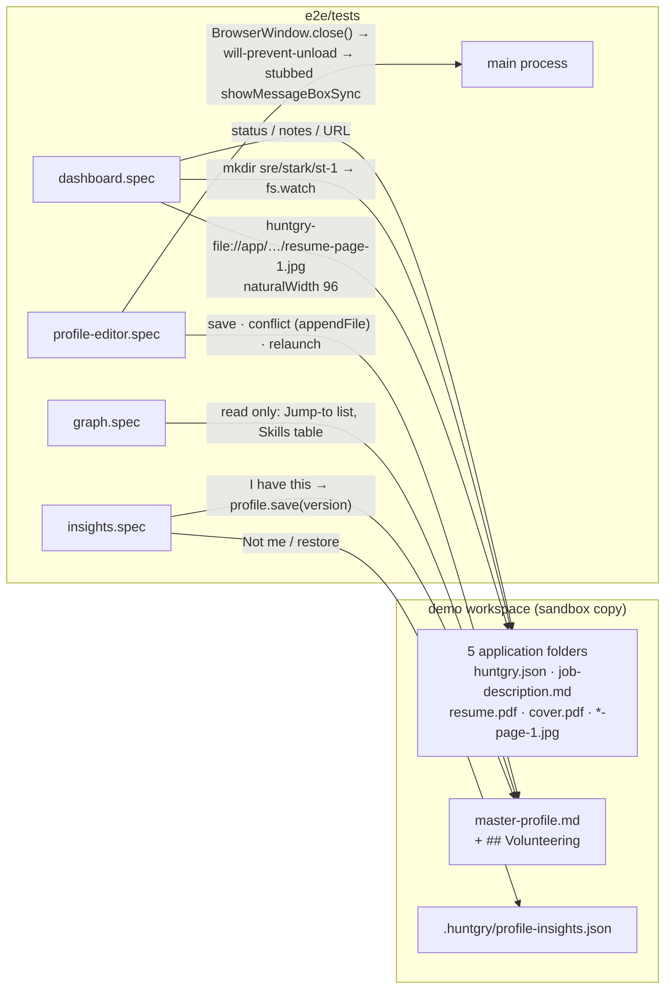
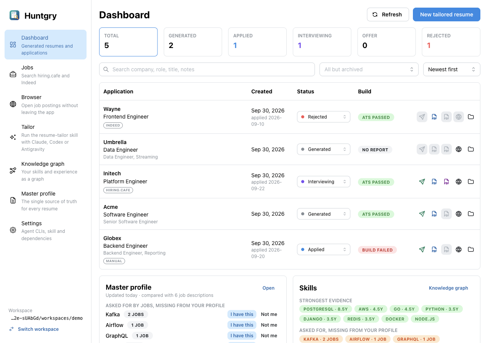
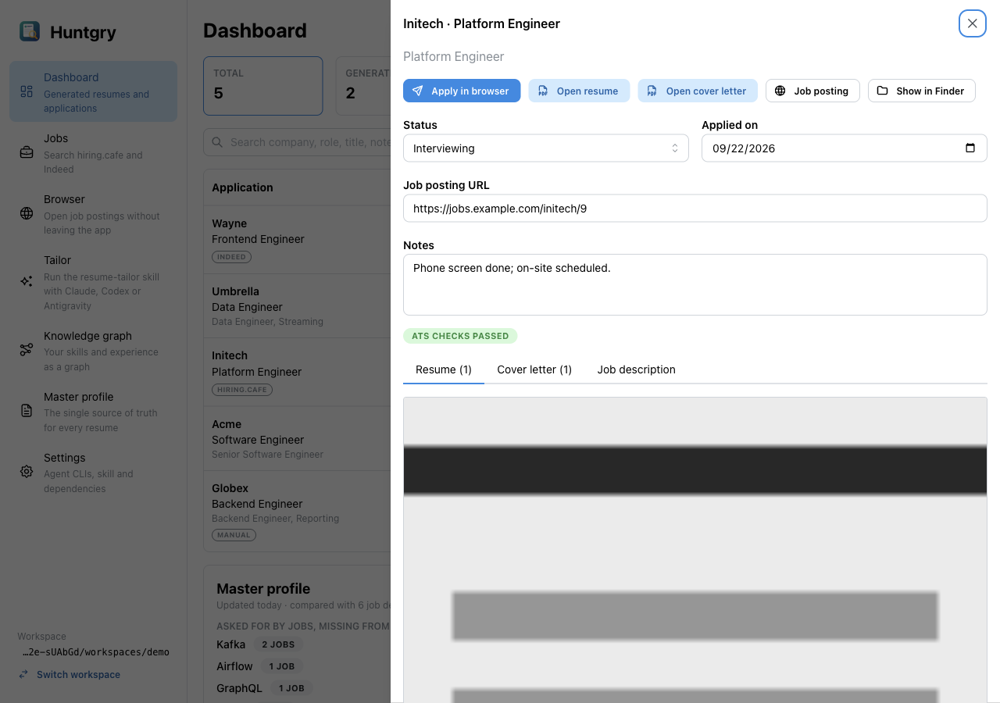
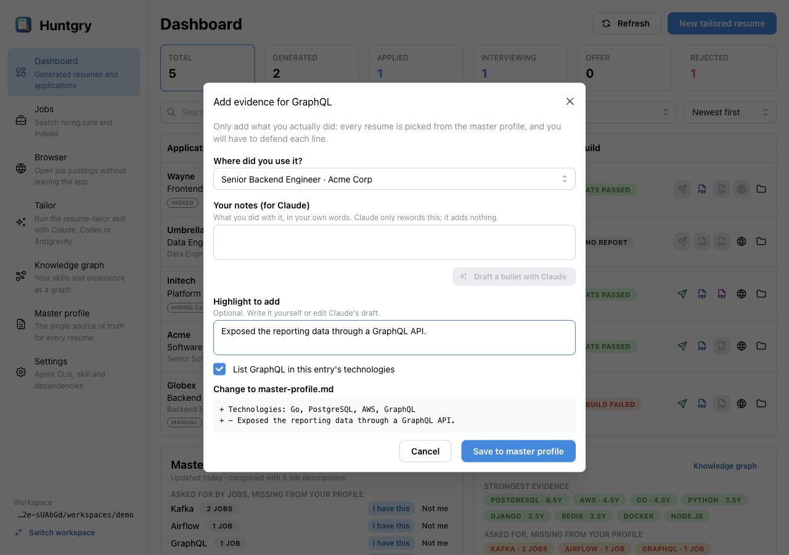
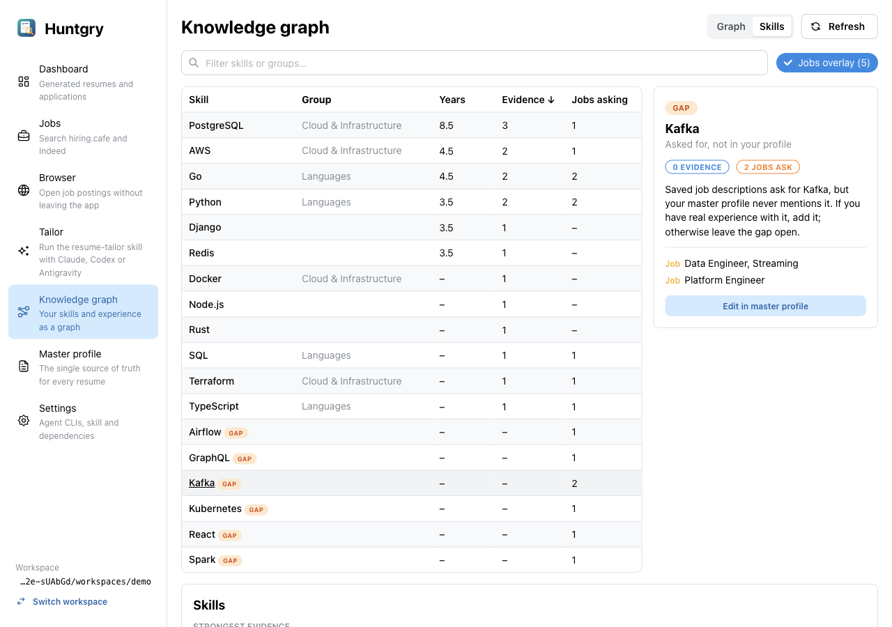

# #47 — e2e: Dashboard, profile editor, knowledge graph and insights flows

Issue: [silentashish/huntgry#47](https://github.com/silentashish/huntgry/issues/47) · Epic: #45 · Builds on #46 (PR #51)

## Context & problem

#46 put the Playwright harness in place and proved it on the picker, profile setup and the shell.
The pages that work purely on workspace files had no end-to-end coverage: the Dashboard
(applications list, tracking, drawer, `huntgry-file://` previews, `fs.watch` refresh), the master
profile editor (edit, save, conflict, leave guard, window close), the Knowledge graph page and
the profile insights card. Their logic is unit-tested, but what a user walks through crosses the
preload bridge, IPC, the filesystem, a custom protocol, a file watcher and a native dialog, and
none of that is exercised by vitest. The `demo` fixture also had too little in it: two
applications, no page previews, no cover letter, and job descriptions that only asked for skills
the profile already has, so the insights card and the graph overlay had nothing to show.

## What changed and why

| Area | Files | Why |
| --- | --- | --- |
| `demo` fixture | `e2e/fixtures/workspaces/demo/{platform-engineer/initech/init-9,data-engineer/umbrella/umb-12,frontend-engineer/wayne/wy-3}/*`, `demo/master-profile.md`, `e2e/fixtures/generate.mts`, `e2e/fixtures/workspaces/README.md` | Three more applications (`interviewing` with `cover.pdf` and `resume-page-1.jpg`/`cover-page-1.jpg`; `generated` without `resume.pdf`; `rejected` without a posting URL), job descriptions that ask for Kafka, Spark, Airflow, React and GraphQL next to skills the profile has, and a `## Volunteering` section the editor does not know. The README lists every application, its files and the expected gaps. The Initech job description avoids "on-call", which the skill vocabulary counts as a gap. |
| JPEG previews | `e2e/fixtures/generate.mts` (`buildJpeg`) | The page previews are real baseline JPEGs built from scratch (grayscale, one flat 8×8 block per cell, custom Huffman tables, 246 bytes), so the `` decodes to a known `naturalWidth`/`naturalHeight` and no encoder dependency or hand-made binary is committed. Both binaries are regenerated by `node e2e/fixtures/generate.mts`, byte for byte. |
| Page objects | `e2e/pages/dashboard.ts`, `e2e/pages/insights-card.ts`, `e2e/pages/graph.ts`, `e2e/pages/profile-editor.ts` | `Dashboard` (rows by company, stat cards, filters, status picking, drawer, tooltips), `InsightsCard` (gap lines, "I have this" / "Not me", empty-section badges), `GraphPage` (view switch, Jump-to node list, jobs overlay chip, Skills table rows, node panel); `ProfileEditor` gains `openTab`, `field` (visible match only), `entry`, `unsavedBadge`/`savedBadge`, `leaveDialog`. Role, label and text locators only; no `data-testid` was added. |
| Dashboard specs | `e2e/tests/dashboard.spec.ts` (7) | Rows show company, role, job title, source, status, applied date, build result and the summary counts; stat cards, the status multi-select and the search narrow the table ("Nothing matches" + Clear filters); status change from the row writes `huntgry.json` and `applied` stamps today's `appliedAt`; the drawer shows the job description, files and tracking, and status/notes edits persist; the `huntgry-file://` previews decode to 96×124; an application folder written on disk appears through `fs.watch` without Refresh (and the insights job count follows); Apply is disabled with its reason (tooltip) when `resume.pdf` or the URL is missing, and adding the URL in the drawer unblocks it. |
| Profile editor specs | `e2e/tests/profile-editor.spec.ts` (5) | Contact, summary and a new experience with highlights saved and asserted in `master-profile.md`, then read back after `relaunch()` (unknown section kept verbatim); remove + Discard + Save; the conflict after an outside edit (refused with the message, Reload shows the disk version, the next save keeps the outside section); the leave guard on navigation and on Switch workspace (Keep editing stays, Discard and leave goes, nothing written); window close with edits through a recording `showMessageBoxSync` stub (Keep Editing keeps the window and the edits, Close Without Saving closes it and writes nothing). |
| Graph specs | `e2e/tests/graph.spec.ts` (3) | Node kinds and counts through the "Jump to…" list (person, 2 roles, 2 companies, project, education, certification, ≥ 12 skills, 5 jobs) and the legend; overlay off removes jobs and gaps; the Skills table (group, years, evidence, jobs asking, `gap` badge, filter); the node panel for a gap and for an evidenced skill, and "Edit in master profile" opening the Summary & skills tab. |
| Insights specs | `e2e/tests/insights.spec.ts` (6) | The gap list (Kafka ×2, then Airflow, GraphQL, React, Spark; Kubernetes noted); "Not me" persisted in `.huntgry/profile-insights.json`, still gone after a relaunch, restored; "I have this" into the Globex experience (preview lines, technologies and highlight on disk, the Skills card and the editor follow) and into a new skills group; the Claude draft with no agent in the sandbox shows *The claude CLI was not found. See Settings.* and writes nothing; an emptied section's badge deep-links into that editor tab. |
| Docs | `docs/testing/e2e.md`, `e2e/fixtures/workspaces/README.md` | Fixture contents, how to extend `demo`, the new page objects, the Mantine locator pitfalls the specs hit. |

Nothing under `src/` changed.



## Decisions and alternatives rejected

- **Canvas never asserted; no `data-*` node count added.** The ticket allowed a `data-*`
  summary on the page container. The page already exposes everything the specs need in
  accessible markup: the "Jump to…" select lists every node as `<Kind>: <label>` (so kinds and
  counts are asserted from it), the Skills view is a plain table with a `gap` badge, and the node
  panel is text. Adding test-only attributes to the renderer for the same information was not
  worth a `src/` change; if the node list ever gets capped below the fixture's size, a `data-*`
  count is the fallback.
- **No `data-testid`, no `src/` change.** Every ambiguous locator had an accessible way out:
  rows are found by company text and the Apply control (the header row has none), stat cards by
  their visible label, Mantine selects by `role=combobox`, the SegmentedControl by its radio
  labels, tooltips by text.
- **Visible-only matching for Mantine.** Select/MultiSelect keep their option lists mounted but
  hidden, tooltips of disabled controls never get a `mouseleave`, Accordion panels stay mounted
  when collapsed, and the "marked not me" list is a hidden `Collapse`. The page objects filter
  with `{ visible: true }` or match by exact text where that matters, and comments say why.
- **Real JPEGs from a 60-line encoder rather than a PNG renamed `.jpg` or a dependency.** The
  scan only checks the file name, and Chromium would sniff and render a PNG, but the acceptance
  criterion is "the image loaded, non-zero natural size", which should hold for what the skill
  actually writes. Standard Huffman tables are ~400 bytes of constants; a table with only the DC
  categories used keeps the file tiny and the code readable.
- **`beforeunload` in Electron.** Electron answers the unload question in main
  (`will-prevent-unload` → `showMessageBoxSync`), so when Playwright learns of the "dialog"
  there is nothing to handle and its default auto-dismiss throws a protocol error. The spec
  registers a `dialog` listener that ignores the event. The stub records the buttons and
  message it was called with, so the assertion is on the real prompt, not just on the outcome.
- **The insights deep link is exercised on an emptied section.** The card only deep-links
  through the "Empty:" badges (the "Open" button carries no section), and `demo` has every
  section filled; the spec removes the only project through the editor, saves, and then follows
  the badge. This keeps `demo` complete for every other spec instead of adding a fixture.
- **Apply readiness stops at "enabled".** Adding the URL in the drawer unblocks Apply; the
  Apply flow itself is #49.
- **`appliedAt` asserted with the UTC date**, the same `toISOString().slice(0, 10)` the app
  uses, so the spec matches the app across time zones.

## How to test

```bash
npm install
npm test && npm run typecheck && npm run build
npm run test:e2e
npx playwright test -c e2e/playwright.config.ts e2e/tests/dashboard.spec.ts e2e/tests/profile-editor.spec.ts -g "added on disk|changed on disk|closing the window" --repeat-each 3
node e2e/fixtures/generate.mts && git status --short e2e/fixtures   # regenerates every binary identically
npx playwright show-report e2e/.results/html-report               # every spec title names its flow
```

1. Open `e2e/fixtures/workspaces/demo` in the dev app (`npm run dev`, Import it): the Dashboard
   shows five applications with the statuses of the README table, Initech's drawer shows the
   page previews, the Master profile card lists Kafka, Airflow, GraphQL, React and Spark.
2. `sips -g pixelWidth -g pixelHeight e2e/fixtures/workspaces/demo/platform-engineer/initech/init-9/resume-page-1.jpg`
   → 96 × 124.
3. No `huntgry-e2e-*` folder is left in `$TMPDIR` after a run.

Captured by the harness itself:






## Follow-ups

- #48 (Tailor and Settings with fake agents) can reuse `Dashboard.row()` to find the application a
  run created; #49 (Apply) starts from `Dashboard.open()` and the enabled "Apply in browser".
- A `data-node-count` on the graph card if the "Jump to…" list is ever limited below the
  fixture's node count (it is capped at 50 options; `demo` has about 30).
- `updateTracking` keeps `appliedAt` when the status leaves `applied`; the spec documents that
  behaviour rather than deciding it.
