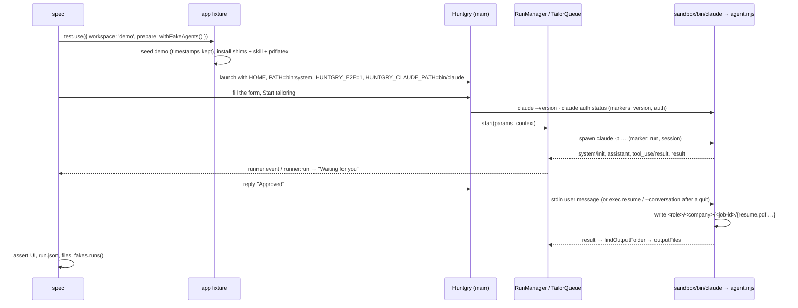

# #48 — e2e: Tailor and Settings flows with fake agent CLIs

Issue: [silentashish/huntgry#48](https://github.com/silentashish/huntgry/issues/48) · Epic: #45 · Builds on #46 (PR #51)

## Context & problem

The Tailor page and Settings are the two places where Huntgry talks to something outside itself:
the `claude`, `codex` and `agy` CLIs. Their run lifecycle (start, streamed transcript, the
approval question, the built files, a crash, a quit mid-run, the bulk queue with its concurrency,
the environment checks) was covered by vitest only where it is pure (`RunManager`, `TailorQueue`,
the adapters) and by nobody end to end: a real agent is slow, costs money, needs sign-in and is
not deterministic. The suite from #46 already forbids the real CLIs (isolated discovery); this
ticket gives it scripted stand-ins so the whole path from the form to the files on disk runs on
every `npm run test:e2e`, with no network and nothing from the machine.

## What changed and why

| Area | Files | Why |
| --- | --- | --- |
| Fake agents | `e2e/fixtures/fake-agent/agent.mjs` | One Node script that speaks all three protocols (`claude -p` stream-json, `codex exec --json`, `agy --print=` stream-json), chosen by the name it is invoked under. It plays the skill's flow (gap analysis + `Read` → question → on "approve" a `Bash` step and `resume.pdf`, `resume_data.json`, `build-report.json`, `job-description.md` under `<CV_HOME>/<role>/<company>/<job-id>/`), reuses the session id it is resumed with, answers `--version` and `claude auth status`, and has `slow` / `fail` / `exit-early` scripts. Every spawn and turn leaves a marker line, so a spec can assert which agent ran, with which arguments and when. |
| Fixture | `e2e/fixtures/fake-agent/index.ts`, `skill/SKILL.md`, `skill/scripts/preflight.py` | `withFakeAgents(opts)`: wrappers in the sandbox `bin`, the fixture skill copied into the agents' skill folders (all, Claude only, or none), a fake `pdflatex`, and `HUNTGRY_CLAUDE_PATH` pinned to the shim. `fakeAgents(app)` reads the markers and switches the script. |
| Shim unit test | `e2e/fixtures/fake-agent/agent.test.ts`, `vitest.config.ts` | Runs the shim as a child process and checks its lines against each adapter's `signal()`, `buildTranscript`, `parseClaudeVersion` / `versionAtLeast`, `parseAuthStatus` and `parsePreflight` (acceptance criterion 1). vitest now includes `e2e/fixtures/**/*.test.ts` and `.test.tsx` files. |
| Harness | `e2e/fixtures/app.ts`, `e2e/fixtures/workspace.ts`, `e2e/fixtures/queue.ts`, `e2e/tsconfig.json` | `test.use({ prepare })`: a `Preparer` runs after seeding and before launch and may return env for every launch (additive; #49 can use it for its servers). `seedWorkspace` keeps fixture timestamps (see Decisions). `seedJobs` / `seedQueue` write what "Tailor all" leaves behind. The e2e tsconfig maps `@shared/*` so the shim test can import the adapters. |
| Page objects | `e2e/pages/tailor.ts`, `e2e/pages/settings.ts` | `TailorPage` (form, agent picker, run list, run view, transcript, reply box, output buttons, queue panel; `stubOpenPath` records what "Resume" would open) and `SettingsPage` (banners, agent rows, the Claude card's rows and buttons, preflight rows; `mainEnv`). |
| Specs | `e2e/tests/tailor.spec.ts` (6), `e2e/tests/tailor-queue.spec.ts` (5), `e2e/tests/settings.spec.ts` (6) | See "How to test". 17 tests, all of them through the app's real runner, queue and environment code. |
| Renderer | `src/renderer/src/pages/tailor/RunList.tsx`, `RunList.test.tsx` | The run list's entries were Mantine `NavLink`s rendered as `<a>` without `href`: no role, no name, not focusable, so a test (or a screen reader) could not open a run by its title. They are `<button type="button">` now, the open one with `aria-current`, like the navbar after #46. Covered by a `renderToStaticMarkup` test. |
| Docs | `docs/testing/e2e.md`, `README.md` | "Fake agents" section (protocols, script, switches, markers, how to extend), the `prepare` option, the new page objects. |



## Decisions and alternatives rejected

- **One script for three CLIs**, selected by the invoked name, rather than three shims: the
  skill's flow is the same, only the wire format differs, so the protocol is a small vocabulary
  (`init`, `text`, `tool`, `result`, `fail`) with three encodings. The vitest fixtures under
  `src/main/cli/fixtures/` stay as they are: they are keyword-driven test doubles for the
  `RunManager` unit tests, while this one must survive the real command line (`--settings`,
  `--allowedTools`, `--print=`, `exec resume`) and produce a believable folder.
- **Approval by content, not by turn count.** A resumed process (after a quit, or every Codex
  turn) cannot know how far the conversation got; the real skill also acts on the user's answer.
  The first message of a fresh session is never an approval, because Antigravity's first message
  carries Huntgry's context, which mentions approving.
- **`HUNTGRY_CLAUDE_PATH` is pinned** by the fixture even though PATH discovery alone finds the
  shim: `~/.local/bin` below the sandbox HOME is checked before PATH, and a decoy planted there
  would win. `settings.spec.ts` proves the pin with such a decoy; without the fakes the variable
  stays unset (the isolation spec asserts that).
- **`preserveTimestamps` when seeding.** The runner picks a run's output folder by mtime among
  folders matching the job; a `demo` application copied a second before a run started was taken
  for its output (seen once: "Resume" appeared before the approval). Keeping the fixtures' own
  timestamps removes the race for every spec, not only this one.
- **The queue is seeded, not driven from the Jobs page.** "Tailor all" and the Jobs UI are #49;
  the queue specs start from its output (`.huntgry/jobs/*.json`, `.huntgry/queue.json`), which
  also is exactly the state after a restart (paused). The board-only job is an Indeed job with a
  snippet, which the queue refuses without any network call; a hiring.cafe snippet would try to
  fetch the posting.
- **Install / Update buttons are only looked at.** With an old shim version (`claudeVersion:
  '2.0.0'`) the warning and the enabled Update button are asserted; pressing it would run the
  official installer against the network. The markers prove no run and no installer happened.
- **"Resume" is pressed with `shell.openPath` stubbed**, so the PDF's path is asserted without
  Preview opening on the machine. The Apply button (#24) is left to #49.
- **`RunList` entries became buttons** (a `src/` change) instead of locating them by text with
  `.first()`: the title also appears as the open run's heading, and an unfocusable list is an
  accessibility bug of its own. A `renderToStaticMarkup` test covers it (vitest gained
  `jsx: 'automatic'` and `.test.tsx` for that).
- **Children that outlive the quit.** A `--version` or `preflight.py` started by the Settings
  check right before the app quits can boot after the fixture removed the sandbox, and recreated
  it (`fake-agent/invocations.jsonl`; the system Python's bytecode cache under `~/Library/Caches`).
  The shim writes nothing once its home is gone and the harness sets `PYTHONDONTWRITEBYTECODE=1`
  for every launch (the isolation spec of #46 plants a skill too, so its check boots Python as
  well); the temp folder is empty after a run again.
- **One class selector** (`mantine-Card-root`) finds the open run's card and the queue panel by
  their headings; Mantine's static class names are stable and the alternative was a `data-testid`.

## How to test

```bash
npm test                                            # 411 (400 + 10 shim + 1 RunList)
npm run typecheck && npm run build
npm run test:e2e                                    # 36 = 19 (#46) + 17
npx playwright test -c e2e/playwright.config.ts e2e/tests/tailor.spec.ts e2e/tests/tailor-queue.spec.ts --repeat-each 3
```

What the 17 specs cover:

- `tailor.spec.ts`: the pre-run check with the fakes (Start enabled, no warning) and without
  (red "Claude cannot run yet", the not-found message, Start disabled, every picker choice marked
  unavailable); a full run (the pasted job as the first message, the agent's text visible while
  it is still *working* and before any *Turn finished*, the `Read` step, the question, *Waiting
  for you*, the reply, the `Bash` step, the output line with the four files, `resume.pdf` on
  disk, "Resume" → `shell.openPath` with that path, End → Finish, `run.json` finished, the
  dashboard row); a failing agent (error alert with the stderr, *Failed* in the list, the run and
  its notice in `.huntgry/runs/`); a quit mid-turn (after relaunch: *Stopped* with its notice,
  the reply box offering to resume, a reply that resumes with `--resume <same session>` and
  builds); agent selection (Settings default → Antigravity started, `view_file` in the
  transcript; Codex picked on the form → `exec --json`, the reply in a new `exec resume` process).
- `tailor-queue.spec.ts`: two queued jobs (paused note, Resume, both *Needs your reply*, "Reply"
  opens the run, the approval marks *Resume built*, `queue.json`); concurrency (three jobs, "2 at
  a time", slow turns: never more than two turns under way, the third starting only after one
  ended, later than the 2 s spawn gap); a board-only job (failed with the Indeed note, no agent
  started for it, the other runs); per-job agent (Select → Codex before start, `queue.json`, the
  badge after start, one `claude` and one `codex` process); relaunch (the working job marked
  interrupted, the queued one still queued, paused, nothing started on its own, Resume starts it,
  Retry starts a new run for the interrupted one).
- `settings.spec.ts`: all present (paths, versions, *Ready*, skill paths per agent, signed in as
  `fake@example.com` with the plan badge, LaTeX path, preflight OK, no install buttons, only
  `--version` / `auth status` invoked, PATH = sandbox bin + system, `HUNTGRY_CLAUDE_PATH` = shim);
  default agent persisting across a relaunch (`settings.json`); an old Claude (warning naming
  both versions, Update enabled, never pressed); a decoy `~/.local/bin/claude` (the shim wins);
  nothing installed (every row *Not found* with its hint, the banner's problems, Install Claude
  Code enabled with the curl line, Install skill enabled, Python deps disabled, no pin); "Install
  skill" for Codex and Antigravity (symlink to the Claude copy inside the sandbox HOME, rows
  update to *Ready*).

Timings on the reference machine (macOS, Node 26.7, real `claude`/`codex`/`agy` installed in
`~/.local/bin` and `/opt/homebrew/bin` and never found) are in the PR.

## Review round 1 (Codex)

- `resume.pdf` had no cross-reference table (`pdfinfo` warned): the shim now writes a
  structurally valid one-page PDF (objects at their recorded offsets, `xref`, a trailer with
  `/Size` and `/Root`, `startxref`) with the name, role and company as text, and the unit test
  parses it with `unpdf` (one page, the text) and with `pdfinfo` when poppler is installed.
- The interrupt spec quit after seeing the session id, which the shim announces before it reads
  the job; a quit in that gap would have made the resumed "Approved" a fresh job. It now waits
  for the `turn-start` marker and the session's job file, and asserts the resumed process built
  the original `<role>/<company>/<job-id>` folder, never the default one.

## Follow-ups

- #49 can reuse `prepare` for its mock servers and `stubOpenPath` for Apply.
- The `exit-early` script is unit-tested but has no e2e spec: a Claude run that exits 0 without a
  result reads as *finished* with nothing built, which the UI shows like any finished run.
- A "Tailor all" spec from the Jobs page (ticking two jobs) belongs with #49's Jobs page object.
- If Mantine changes `mantine-Card-root`, give the run header and the queue panel a `region`
  role with a name instead.
