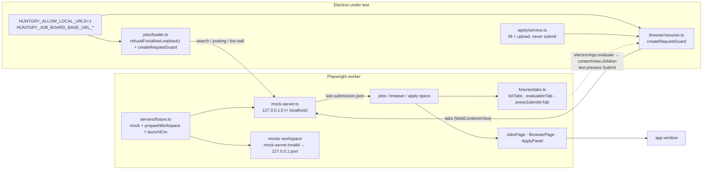

# #49 — e2e: Jobs, Browser and Apply flows against local mock servers

Issue: [silentashish/huntgry#49](https://github.com/silentashish/huntgry/issues/49) · Epic: #45 · Builds on #46 (PR #51)

## Context & problem

The Jobs page reads hiring.cafe and Indeed in a hidden window, the Browser page hosts
`WebContentsView` tabs, and Apply fills ATS forms in those tabs. None of that was covered
end to end, and it cannot be covered against the real sites: a test must never search a
real board, load a real posting or, above all, submit a real application (#24: Huntgry
never submits). Everything the three flows reach has to be a local fake on `127.0.0.1`,
which the app's SSRF guard refuses by design.

## What changed and why

| Area | Files | Why |
| --- | --- | --- |
| Board origin override | `src/main/jobs/board-url.ts` (+ test), `sources/hiringcafe.ts`, `sources/indeed.ts`, `service.ts`, `cli/env.ts` (`isPackagedBuild`) | `HUNTGRY_JOB_BOARD_BASE_URL_HIRINGCAFE` / `…_INDEED` move a board to a loopback origin. Only unpackaged builds, only loopback http(s) (public and private-network values are ignored); the module counts as packaged until main reports otherwise. The search URL builders and Indeed's job links take the origin as a parameter. |
| Loopback-only egress (review) | `src/main/cli/dev-urls.ts` (`loopbackOnly`, + `dev-urls.test.ts`), `browser/url.ts` (`refusalFor(…, loopbackOnly)`), `public-host.ts` (`createRequestGuard(…, loopbackOnly)`), `browser/manager.ts`, `jobs/loader.ts`, `browser/session.ts` | `HUNTGRY_E2E_LOOPBACK_ONLY=1` (unpackaged only, inert when packaged, unit-tested) makes both pre-load checks refuse every non-loopback address before any lookup ("… this test build may only reach loopback addresses."; private literals keep their message) and both session guards cancel such requests. The harness sets it for every test, so the specs can assert a resolvable public URL is refused, which is what "all network goes to 127.0.0.1" needed. |
| Loader loopback allowance | `src/main/jobs/loader.ts`, `src/main/cli/public-host.ts` (`createRequestGuard`, + test), `src/main/browser/session.ts`, `browser.test.ts` | The hidden loader checked `assertPublicUrl` directly and its session guard had no loopback path, so `HUNTGRY_ALLOW_LOCAL_URLS=1` only helped the browser. It now uses the browser's `refusalFor(url, resolve, allowLoopback)` and a shared `createRequestGuard(allowLoopback)` that both sessions install. Loopback passes only with the dev allowance; the private network stays refused (unit-tested at both levels). |
| Mock ATS module | `scripts/mock-ats/server.mjs` (+ `.d.mts`), `scripts/mock-ats.mjs` | The forms, the multipart recorder and the thanks pages moved into an importable module (`createMockAts({ fixturesDir, submissionFile, extraSites })`, `startMockAts`); the CLI is a thin wrapper and behaves exactly as before (`node scripts/mock-ats.mjs`, `PORT`, `<tmp>/huntgry-mock-ats/last-submission.json`). The module has no `import.meta`, so Playwright's transform can load it. |
| Mock server | `e2e/fixtures/servers/{mock-server,pages,fixture}.ts` | One handler per worker on two free `127.0.0.1` ports (the second is the "other origin"): hiring.cafe- and Indeed-shaped search pages, employer / Lever-style / Ashby-style postings, a bot wall, plain pages for history and Stop, a redirect to the second port, and the ATS routes mounted from the module (+ `generic-cover`). `fixture.ts` extends `test` with `mock`, rewrites the workspace placeholders before launch and sets the board overrides. |
| App fixture hooks | `e2e/fixtures/app.ts` | Two additive hooks, no-ops by default: `prepareWorkspace(path)` after seeding, `launchEnv` merged into the app's environment (also on `relaunch()`). `closeApp` now records the app's non-Electron child processes before quitting and waits for them afterwards (review: a preflight `python3` outlived the sandbox). |
| Tab helpers | `e2e/fixtures/tabs.ts` | `listTabs`, `tabWithUrl`, `expectTabLoaded`, `evaluateInTab`, `pressSubmitInTab`, `stubOpenExternal`: the tabs through `electronApp.evaluate` on the window's `contentView.children`. |
| Fixture workspace | `e2e/fixtures/workspaces/mocks/`, `generate.mts`, `workspace.ts` (`FIXTURE_WORKSPACES`) | The demo profile, two saved jobs (one summary-only URL job, one pasted) and six applications with `http://mock-server.invalid/…` posting URLs: Lever, Greenhouse, generic with `cover.pdf`, no `resume.pdf`, already applied, redirect. `demo` is untouched. |
| Page objects | `e2e/pages/jobs.ts`, `e2e/pages/browser.ts` | `JobsPage`, `BrowserPage`, `ApplyPanel`; role/label/text locators, no `data-testid`. |
| Specs | `e2e/tests/{jobs,browser,apply}.spec.ts` | 23 tests: 10 jobs, 6 browser, 7 apply (list below). |
| Docs | `docs/testing/e2e.md`, `README.md`, `e2e/fixtures/workspaces/README.md` | Mock servers, how the app is pointed at them, tabs as `Page`s, the never-submit rule for tests. |



### The specs

- **jobs.spec.ts**: search shows results from both boards and saves them (files, `searches.json`);
  the drawer shows snippet vs summary notes, the source badge, and fetches a hiring.cafe job's full
  posting; results persist across a relaunch; add by URL for a JSON-LD page and a text-only page;
  paste a posting; a bot wall gives the blocked message; private-network URLs are refused by the
  loader with the exact message and a public posting URL by the loopback-only restriction; "Tailor resume" fetches the employer page and prefills Tailor
  (description, company, role, job id, URL); ticking two jobs + "Tailor all" opens the queue view
  with both (a fake `claude` and a skill folder in the sandbox make the agent "ready"; the test then
  waits for both runs to end and for every process the app spawned to exit); "Open
  posting" lands on Browser with the URL.
- **browser.spec.ts**: "Open posting" opens a tab (DOM read through main **and** through the tab's
  Playwright `Page`), the tab survives leaving the page; back / forward / reload / stop; a bare host
  gets `https://`, `javascript:` / `file:` / `data:` / non-URLs / `10.…` / `192.168.…` /
  `169.254.…` / `.local` refused with the exact `url.ts` messages; resolvable public URLs
  (`example.com`, `hiringcafe.com`, `www.indeed.com`) refused before any lookup by the loopback-only
  restriction, from the address bar and from a link inside a mock page; Cmd/Ctrl+T, Cmd/Ctrl+L, close tab; "Open in browser"
  hands the URL to a stubbed `shell.openExternal`; and, launched with
  `HUNTGRY_ALLOW_LOCAL_URLS=0`, the mock server itself is refused (the guard is still active).
- **apply.spec.ts**: Apply from a Dashboard row fills the Lever form (panel groups, filled values,
  attached `resume.pdf`, the page's own field values), the test answers the required question and
  presses Submit, `last-submission.json` holds the values and the file name, the confirmation page
  is detected, "Mark as applied" writes `huntgry.json`; the generic form attaches `resume.pdf` and
  `cover.pdf`, "Not yet" leaves `huntgry.json` unchanged; Greenhouse is recognised and its
  confirmation detected; an already-applied application asks first (Cancel opens nothing, "Open
  apply page" does); a redirect to `localhost` waits for "Fill form"; no `resume.pdf` disables
  Apply with the reason; a second `apply.start` while one is starting is refused.

## Decisions and alternatives rejected

- **Loopback only, for both escape hatches.** The board override could have accepted any URL in
  dev builds; restricting it to loopback keeps the variable from ever sending a search elsewhere,
  and matches `HUNTGRY_ALLOW_LOCAL_URLS`. Likewise the loader reuses the browser's `refusalFor`
  rather than growing its own allowance.
- **No source hook for the BrowserManager.** The tabs are children of the window's `contentView`,
  so `electronApp.evaluate` reaches their `webContents` without exposing anything from `src/`.
  Playwright also lists them as `Page`s; the spec proves both and the guide documents them.
- **The test presses Submit, in the tab.** `pressSubmitInTab` fills what the form still needs and
  clicks the mock's own button through `executeJavaScript`. No IPC, no helper in `src/main/apply`.
- **One handler, two ports.** Two `127.0.0.1` listeners share the handler: the second port is a
  different origin (the redirect case, where `isTrustedApplyPage` refuses to auto-fill) and a
  different `host:port` for the loader's rate limit. The first version used `localhost` for that,
  which the review pointed out depends on how the machine resolves it (`::1` first would miss the
  IPv4-only listener); ports do not.
- **Loopback-only egress instead of arguing about "public URL refused".** The guard accepts public
  hosts by design, so the first version could only show the lookup path. The review asked for a
  test-only restriction; it lives next to `HUNTGRY_ALLOW_LOCAL_URLS`, is decided before any lookup,
  keeps the private-network messages intact, and is inert in packaged builds.
- **Children waited for in `closeApp`.** The environment check behind "Tailor all" runs the skill's
  preflight with `python3`, which on macOS writes caches under `HOME` and outlived the app in one
  of the reviewer's repeat runs, recreating the removed sandbox. The harness now records the app's
  non-Electron children before quitting and waits for (then kills) them after; the test also waits
  for the queued runs to finish.
- **A `mocks` workspace instead of growing `demo`.** #47's dashboard specs count `demo`'s
  applications; the new workspace adds six without touching them. Its URLs are placeholders
  rewritten at seed time, since the port is only known once the worker's server is up.
- **Mock ATS as `.mjs` + `.d.mts`.** A TypeScript module would have made the CLI depend on
  Node's type stripping; plain ESM keeps `node scripts/mock-ats.mjs` working everywhere. The
  fixtures folder is passed in because Playwright's transform cannot evaluate `import.meta`.
- **`generic-cover` served by the e2e server, not by the CLI.** The three committed forms have no
  cover-letter upload; the e2e server derives one from the generic form so `cover.pdf` is covered
  without changing the fixtures the unit tests read or the CLI's documented set.
- **Bare host → `https://`, asserted as such.** The mock speaks plain http, so the bare-host case
  asserts the completed address and the failed load's notice, not a rendered page.

## How to test

```bash
npm install
npm test && npm run typecheck && npm run build
npm run test:e2e
npx playwright test -c e2e/playwright.config.ts e2e/tests/jobs.spec.ts e2e/tests/browser.spec.ts e2e/tests/apply.spec.ts --repeat-each 3
node scripts/mock-ats.mjs      # the CLI still serves http://localhost:4173/{greenhouse,lever,generic}/
```

1. With Wi-Fi off the three specs still pass: every request goes to `127.0.0.1`, and with
   `HUNTGRY_E2E_LOOPBACK_ONLY=1` a public URL is refused before a lookup, so nothing depends on DNS.
2. `HUNTGRY_JOB_BOARD_BASE_URL_HIRINGCAFE=http://127.0.0.1:4173 HUNTGRY_ALLOW_LOCAL_URLS=1 npm run dev`
   sends a hiring.cafe search to the mock ATS index (404 → "did not return job data"); the same variable
   with `https://example.com` is ignored and the real board is used.
3. `npm run dist` then the packaged app: the variables have no effect (`boardOrigin` returns the real
   board; the loader refuses loopback).

## Follow-ups

- #50 runs these specs in CI; the bot-wall test is the slow one (~13 s) because of the loader's
  half-timeout grace; a test-only shorter grace would need another env gate, not worth it yet.
- The Tailor prefill assertions stop at the form; #48 covers the run itself with fake agents.
- `demo`'s saved job and application URLs still point at `jobs.example.com`; if a later spec
  needs them reachable, move them to `mocks` rather than changing `demo`.
