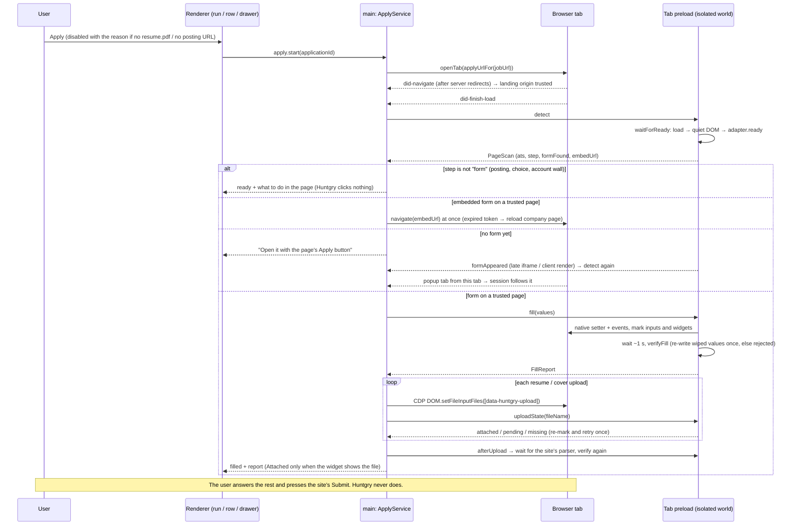
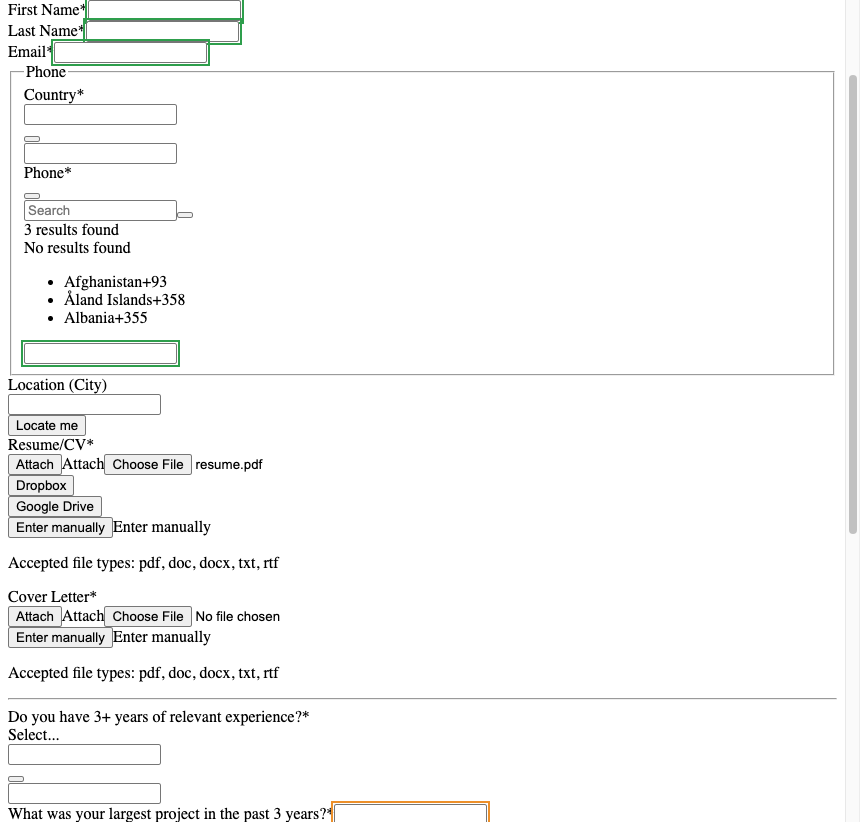
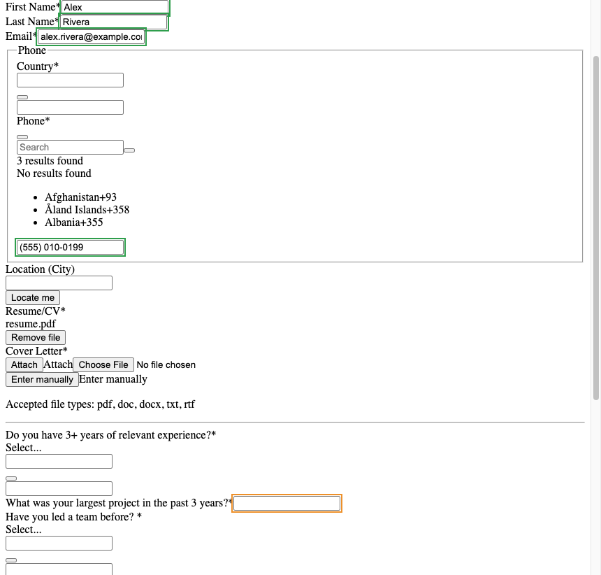
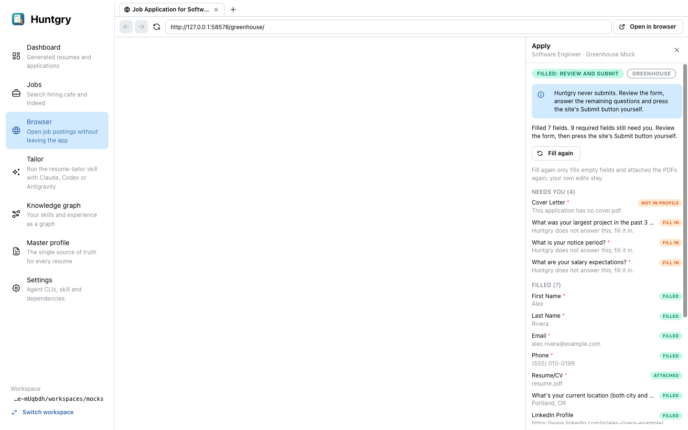
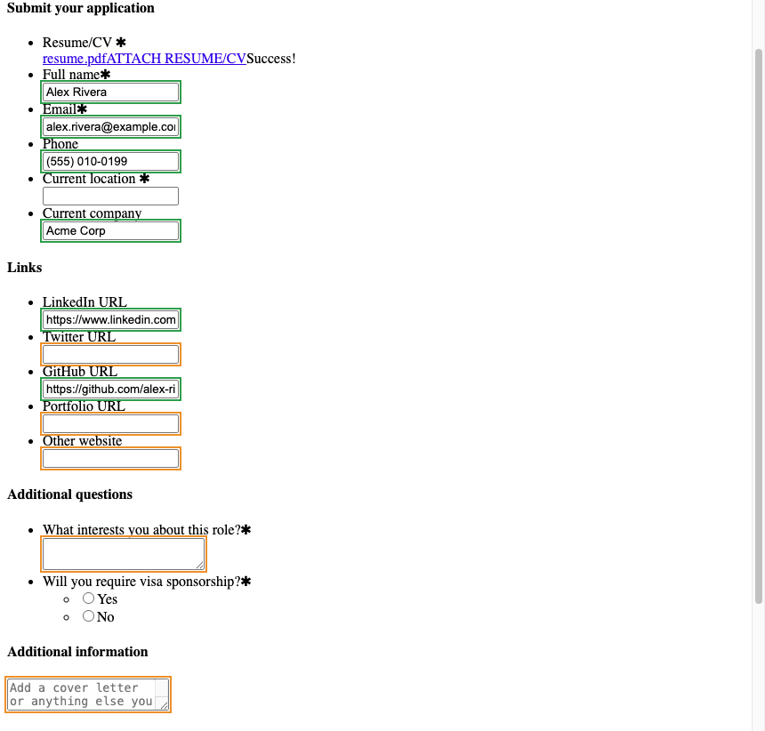

# #63 — Apply with the generated resume: reach the form, attach that resume.pdf, fill it (Greenhouse, Lever)

Issue: [silentashish/huntgry#63](https://github.com/silentashish/huntgry/issues/63) · Epic #62 · Builds on #24
(auto-apply). #64 (Ashby) and #65 (Workday) add adapters on top of the adapter registry introduced here.

## Context and problem

The owner tried Apply on a generated (tailored) resume from all three entry points (Tailor run →
**Apply**, Dashboard row **Apply**, drawer **Apply in browser**) on real postings. Three things went
wrong:

1. Sometimes Apply did nothing, or it never reached the application form.
2. The generated `resume.pdf` was not attached.
3. Name, email, phone and links stayed empty.

The #24 e2e suite still passed, because its mock forms were static HTML on the posting's own origin.
They had no React hydration, no upload widget, no redirect to a company site, no iframe on another
host and no new tab. Research on live pages (2026-10-03, with every write request blocked and only fake
values typed) is in the epic (#62) and the run's `.solve-ticket/context.md`.

**Hard rules kept:** Huntgry never submits, never clicks a site's buttons or links, never fills a
password field or creates an account. The #24 security model is unchanged: the tab preload runs in an
isolated world with no `contextBridge`, values and paths stay in main, the renderer sends ids only, and
files are confined through `resolveApplicationFile`. All development and tests used local mocks.

## Root causes

| # | Cause | Where | Fixed by |
| --- | --- | --- | --- |
| RC1 | Fill and upload ran at `did-finish-load`. Greenhouse's job board is server-rendered React and hydrates ~90 ms after `load`, which reset the values and dropped the file. The panel still said "Filled / Attached", because the engine read the values back right after writing them. | `service.ts` detect at load, `engine.ts` read-back | Readiness wait, verify-and-refill, upload confirmation against the widget |
| RC2 | Greenhouse board URLs often 302 to the company's careers site (Airbnb, Stripe). `isTrustedApplyPage` trusted only the posting's own origin, so the embedded form was detected but never opened. | `apply-url.ts`, `service.ts` | The landing page of the session's first navigation is trusted; the embed is followed at once |
| RC3 | The form is one click away (an "Apply now" link), sometimes in a new tab. Popups became new tabs that the session never followed, and detection gave up after 1 s and 3 s. | `manager.ts` popup handler, `service.ts` retries | Popup tabs take the session over; the preload reports a form that appears later |
| RC4 | The job URL was not the apply URL. HiringCafe hits without `apply_url` fell back to `https://hiring.cafe/`, and applications without a recorded URL used the first link anywhere in the job description. | `hiringcafe.ts`, `scan.ts` | No fallback URL; `postingUrl` prefers the `Posting:` line, then an ATS host |
| RC5 | Embedded forms are out-of-process iframes the preload and CDP cannot reach, and Greenhouse injects them after load with short-lived `validityToken`s. | `engine.ts` (detect-time only) | `formAppeared` signal; embeds opened immediately; an expired embed reloads the company page |
| RC6 | The Tailor run's Apply skipped `applyBlocker`, and its error showed at the end of the transcript, so it read as "does nothing". On Windows the run's folder used `\`. | `RunView.tsx`, `runner.ts` | Same blocker as the Dashboard, reason shown under the buttons; folder normalised to `/` |

**Not causes** (checked): path resolution (`<role>/<company>/<job-id>/resume.pdf` is right), the native
setter fill, and CDP `DOM.setFileInputFiles`. All three widgets react to CDP uploads once the page is
ready.

## What changed and why

| Area | Files | What and why |
| --- | --- | --- |
| Adapter registry | `src/shared/autofill/adapters/{types,index,greenhouse,lever,generic,text}.ts` | One file per ATS and a registry, so #64 and #65 add a file and a registry line. Optional hooks: `ready(doc)` (async-capable readiness predicate), `step(doc)` / `stepTitle(doc)` (posting, choice, account wall, form), `uploadOrder` (`text-first` / `files-first`), `uploadGroup(input)`, `uploadAttached(probe)`, `afterUpload: { waitFor, timeoutMs }` (a site parser), `choices` (text inputs that are really pickers). `ApplyAts` gains `ashby` and `workday`; they are recognised by host and use the generic rules until their adapters land. |
| Embeds | `src/shared/apply-embeds.ts` | DOM-free list of embedded-form rules (iframe selector, https hosts, path), shared by the page engine and main. Another ATS's embed is one entry. A loopback URL is accepted only with `allowLoopback` (dev builds testing the mock). |
| Readiness | `src/shared/autofill/ready.ts` | `waitForReady`: `load`, then a quiet DOM (500 ms with no mutations), then the adapter's `ready` hook, capped at 6 s. The isolated world cannot see React's state, so readiness is observed from the DOM, never a single fixed sleep. Plus `waitUntil`, `isShown`, `anyShown`. |
| Engine | `src/shared/autofill/engine.ts`, `upload-state.ts`, `user-edits.ts`, `session.ts` | `verifyFill` (async): ~1 s after a fill, every `filled` value is checked; a wiped or replaced value is written once more and read back again after `settleMs` (a site that clears it asynchronously makes it `rejected`), and file inputs a re-render replaced are marked again. A field the person edited after the fill (an `input`/`change` Huntgry did not fire; in the tab only trusted events count) is `kept`, never overwritten. `PageSession` holds the preload's per-document logic (fill, upload state, after-upload verify) so jsdom tests drive it; a marker-only pass (upload retry) keeps the text report. `watchForForm` watches DOM changes with no time limit. `fillPage` marks the upload widget (`data-huntgry-upload-group`), honours `step` (a non-form step is never filled) and `uploadOrder`, and scrolls the form into view. `uploadStateOf` asks the adapter (or the default: the input holds a file, or the widget shows the file name; a progress bar is `pending`). |
| Adapters | `adapters/greenhouse.ts`, `adapters/lever.ts` | Neither counts a file in `input.files` (CDP sets it even when the site's handler never took the file): only the widget. Greenhouse confirms against its S3 widget, where the `<input>` is replaced by a progress bar and then the file name, finding the widget by its label id if it was re-rendered. Its `#candidate-location` is a choice. Lever confirms against `.filename` (with "Analyzing resume..." checked first as `pending`), waits for "Success!" / "Couldn't auto-read resume." (`afterUpload`), and its location autocomplete is a choice for the user. |
| Preload | `src/preload/browser-page.ts`, `src/shared/autofill-channels.ts` | Async replies through one `PageSession` per document. `detect` waits for readiness, `fill` fills then verifies, `uploadState` waits for the widget to show the file, and `afterUpload` waits for the site's parser and verifies again. A page with no form is watched (no time limit, re-armed by each detect) and sends `formAppeared` once a form or embed renders. Still no `contextBridge`, and still only the top frame. |
| Service | `src/main/apply/{service,ipc,validate}.ts`, `src/main/browser/manager.ts`, `src/shared/apply-url.ts` | Trusted origins per session: the posting, the landing page of the first navigation (`did-navigate`: its server redirects), and embeds it opened. Later navigations the user makes are not trusted. Every main-frame navigation start or commit invalidates the work still running for the previous document (before its load finishes), and the CDP upload refuses a document whose URL is not the one filled. Embeds are followed immediately and at most 3 times; Greenhouse's `/embed/job_board?error=true` reloads the company page. A popup from the session's tab takes the session over (`onPopupTab`). Uploads are confirmed against the widget, retried once after re-marking a replaced input, never attached twice while `pending`, and otherwise reported `upload-failed` with a reason. Non-form steps get a panel message and are never filled, and a multi-step form fills once per step title. The request timeout is 15 s to cover the readiness wait. |
| Job URLs | `src/main/jobs/sources/hiringcafe.ts`, `src/main/applications/scan.ts` | No `apply_url` means no URL (Apply says "No posting URL"). `postingUrl(jd)` prefers the `Posting:` line, then a Greenhouse/Lever/Ashby/Workday link, then the first link. |
| Tailor run | `src/renderer/src/pages/tailor/RunView.tsx`, `src/main/cli/runner.ts` | Apply reads the application record (re-read when the run's files or status change), is disabled with the Dashboard's reason, and shows its errors right under the buttons. `outputFolder` uses `/`. |
| Fixtures and mocks | `src/shared/autofill/fixtures/{greenhouse,lever}-form.html`, `scripts/mock-ats/{server.mjs,sites/*.js}`, `e2e/fixtures/servers/*` | Fixtures are refreshed from the 2026-10-03 captures (intl-tel-input phone, location combobox, cover-letter widget; Lever's parser labels, location autocomplete, no form action). The mock replays the behaviours that broke production: hydration reset, S3 upload widget, Lever's parser, JavaScript submit, the company redirect with a late `validityToken` iframe (30 s tokens), and popup and same-tab "Apply now" postings. Uploads are recorded with sha256. |

### The apply flow now



## Screenshots

Same realistic Greenhouse mock, same Dashboard **Apply**. *Before* is `origin/main`, *after* is this
branch. The page area is the tab's own `webContents.capturePage()`, because native views are not in
the window's DOM screenshot.

| Before | After |
| --- | --- |
|  |  |
|  |  |

Before, the panel says *Filled 7 fields* and *Attached* while every field on the page is empty and
the widget never uploaded. That is the bug the owner saw. Lever after the parser ran:


## Decisions and alternatives

- **Readiness from the DOM plus verification, not React internals or a fixed delay.** The preload's
  isolated world cannot see `__reactProps$*`, and open-source fillers use a flat 1 s delay. A quiet-DOM
  wait handles the common case, and the verify pass catches a re-render that comes later. Running the
  engine in the page's main world was rejected because it breaks #24's isolation.
- **Keep CDP for uploads** (trusted `input`/`change`, the path never reaches the page). The
  `DataTransfer` and drop-event tricks extensions use are not needed: all three widgets react to CDP
  once the page is ready.
- **"Attached" means the site's widget shows the file.** A `pending` widget (still uploading) is not
  uploaded twice and is reported as a reason. The upload goes to the site when it is attached (S3,
  Lever's parser), as with a manual attach.
- **Trust the redirect landing of the first navigation only** (server redirects of the URL Huntgry
  opened). A page the user navigates to later, or a popup to a third origin, still waits for
  **Fill form**. Recognised Ashby and Workday hosts are not auto-trusted until their adapters are
  verified (`AUTO_TRUSTED_ATS`).
- **Never click the site's Apply.** On a posting without a form, the panel asks the user to press it
  and the session follows the result (same tab, popup, or a late iframe).
- **Embeds are opened in the tab** rather than filling inside the iframe (no `Target.setAutoAttach`
  sessions, no preload in ad frames), as in #24. They are opened immediately, because Greenhouse's
  `validityToken` expires. Embed hosts are checked in main, and loopback is accepted only when local
  URLs are allowed (dev builds).
- **Lever's location** is an autocomplete that clears free text, so it is a choice for the user
  rather than a value that silently disappears.
- **Hook signatures were fixed at the first commit** (`63759bb`), which #64 and #65 branched from.
  Later commits only added fields: `UploadProbe.kind`, `FillReport.uploadOrder` (optional), and
  `PageScan` step data was there from the start.

## How to test

```bash
npm test            # lockfiles + vitest (611 tests)
npm run typecheck
npm run build
npm run test:e2e    # Playwright on the built app (89 tests)
```

Unit tests added or changed:

- `src/shared/autofill/readiness.test.ts`: a simulated hydration reset is re-filled and file inputs
  re-marked (before the fix the page is empty while the report says filled); a value the page keeps
  clearing becomes `rejected`; a parser-replaced value is restored; Greenhouse widget states
  (`missing` → `pending` progress bar → `attached` file name, and a re-rendered widget); Lever
  `.filename` / "Analyzing resume..." / `afterUpload` visibility; `waitForReady` (DOM quiet,
  `ready` hook, cap); the `step` hook (no fill on a sign-in wall), `files-first`, `choices`.
- Review regressions (same file): a file in the input but not taken by the Greenhouse/Lever widget is
  `missing`; a user edit after the fill (and during the upload wait) is kept; a rewrite cleared
  asynchronously is `rejected`; an upload retry keeps the text report the parser check uses; a form that
  appears a minute after load is noticed.
- `src/shared/autofill/adapters/adapters.test.ts`: the registry lists every adapter file once,
  `generic` last.
- `src/main/apply/apply.test.ts`: a pending fill dropped when another document commits before its load
  finishes, or when a navigation starts; an upload refused when CDP finds another document; redirect landing trusted, `validityToken` embed followed, an
  expired embed reloads the company page, a later page on another origin not trusted; loopback embeds
  only with `allowLocalEmbeds`; popup takeover; an upload the widget never shows fails after one
  retry; `pending` is not re-uploaded; a non-form step fills nothing; page-reply validation of the
  new fields.
- `src/shared/apply.test.ts`: `atsForHost` (Ashby, Workday), trusted origins, `embedRuleFor`.
- `src/main/applications/applications.test.ts` (`postingUrl`), `src/main/jobs/jobs.test.ts`
  (HiringCafe without `apply_url`).

E2E (`e2e/tests/apply-generated.spec.ts`, new): Tailor run (fake agent) → Apply on Greenhouse **and**
Lever (filled after hydration / after the parser, the widget shows `resume.pdf`, the mock's upload
sha256 equals the run's `resume.pdf`, and the test-submitted payload has the contact values and the
file); Dashboard row → Lever; drawer → Greenhouse; company redirect + late `validityToken` embed; popup
Apply; same-tab Apply link; a run without a posting URL shows why Apply is disabled. `e2e/tests/apply.spec.ts` was updated for the new behaviour.

Manually with the mock: `node scripts/mock-ats.mjs`, `HUNTGRY_ALLOW_LOCAL_URLS=1 npm run dev`, and an
application whose posting URL is `http://localhost:4173/greenhouse/` (or `/lever/`,
`/greenhouse/redirect-company`, `/company/posting-popup`). Uploads are logged to
`<tmp>/huntgry-mock-ats/uploads.json`.

## Follow-ups

- Verify on a few live Greenhouse and Lever postings in the in-app browser (fill only, never submit),
  especially company-site embeds that need a second click (Stripe `/careers/apply/…`).
- Filling inside a cross-origin iframe without navigating (CDP target sessions) if an embed ever
  refuses to load top-level.
- The `Posting:` line could be written by Tailor for pasted runs with a URL too.
- #64 Ashby (`files-first`, `ready`), #65 Workday (`step`, account wall) build on the hooks above.
