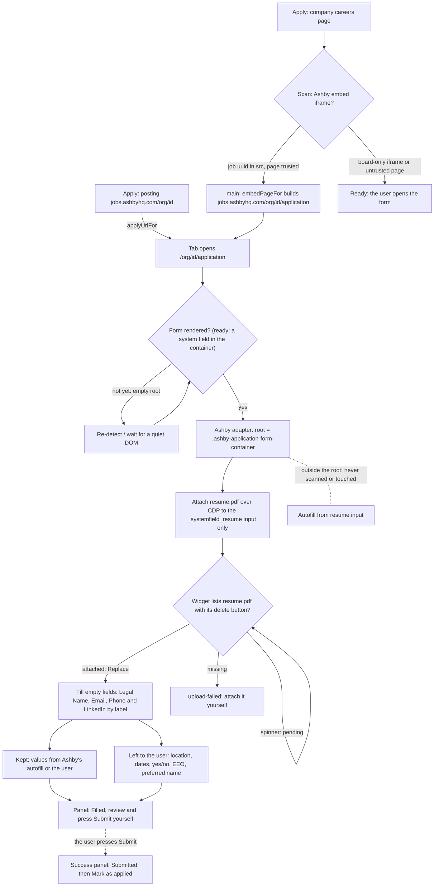

# #64 — Auto-fill on Ashby: the client-rendered form, the real resume field, embedded Ashby

Issue: [silentashish/huntgry#64](https://github.com/silentashish/huntgry/issues/64) · Epic #62 · Builds on the #63
adapter registry (`src/shared/autofill/adapters/*`)

## Problem

Apply on an Ashby posting (`jobs.ashbyhq.com/<org>/<id>`) fell through to the generic rules. It worked by luck: the
generic adapter roots a form-less page at `<body>` when it has a file input, so the panel said "Unknown site (generic
matching)", and the result depended on which upload the matcher found. Ashby has two uploads, and one of them, the
"Autofill from resume" pane, parses the file and **overwrites the form**. A company careers page that embeds an Ashby
job in an iframe was not followed at all (only Greenhouse embeds were). Ashby's own host was not trusted for auto-fill
when it was reached from a company page.

## Ashby specifics (live markup, 2026-10-03)

- **Client-rendered React SPA, no `<form>`.** The page arrives as an empty `#root`. The form appears 0.4–0.7 s after
  `load`, inside `div#form`: the autofill pane, an optional disclosure, then
  `.ashby-application-form-container` with every question and, after it, the Submit button.
- **System fields** have stable ids: `#_systemfield_name` ("Legal Name", sometimes "Name"; a full name),
  `#_systemfield_email`, `#_systemfield_resume`, and `_systemfield_location`. The location question's label points at
  that id, but the input is an id-less `role=combobox` autocomplete.
- **Phone, LinkedIn and every other question are custom questions** whose ids are UUIDs, so they are matched by label
  (`label.ashby-application-form-question-title[for=<uuid>]`).
- **Two file inputs.**
  1. `.ashby-application-form-autofill-uploader input[type=file]`: unlabeled. "Autofill from resume" parses the file
     and fills fields. Huntgry never touches it.
  2. `.ashby-application-form-input-file > input#_systemfield_resume[type=file][tabindex=-1]`: the real resume. On
     `change` (React delegates it to the root), Ashby calls `ApiCreateFileUploadHandle`. Ashby's bundle shows the
     widget then lists the file in `.ashby-application-form-input-file-item` > `…-item-name` with a spinner and no
     delete button while it uploads. Once Ashby holds the file, the item gets `…-item-delete` and the dropzone button
     reads **Replace**. A failed upload shows a toast and lists nothing.
- **Submitted:** `.ashby-application-form-success-container` ("Your application was successfully submitted…") replaces
  the form in place, without a navigation. A failure shows `.ashby-application-form-failure-container`.
- **Embeds:** `jobs.ashbyhq.com/<org>/embed` (Ashby's embed script) injects `iframe#ashby_embed_iframe` with
  `jobs.ashbyhq.com/<org>/<job-uuid>[/application]?embed=js…`. Without a job id the iframe shows the whole board.

## What changed

| Area | Files | What |
| --- | --- | --- |
| Adapter | `src/shared/autofill/adapters/ashby.ts`, `adapters/index.ts` | Recognised by host or markup (container, a system field, or the success panel). The form root is `.ashby-application-form-container`, so the autofill pane above it is never scanned or reported. `known`: name → `fullName`, email, `#_systemfield_resume` → resume. Phone and LinkedIn go through the generic label matcher, and "Preferred Name" is ruled out by its negative word. #63 hooks: `ready` (a system field is rendered inside the container), `uploadOrder: 'files-first'`, `uploadGroup` / `uploadAttached` read from Ashby's widget (`missing` / `pending` / `attached`), `afterUpload` (wait for the item's delete button), and `choices` (the location autocomplete and the date picker). `isConfirmation` is the success panel. |
| Embeds | `src/shared/apply-embeds.ts` | An Ashby `EmbedRule`: https `jobs.ashbyhq.com` only, a `/<org>/<job-uuid>[/application]` path only. A new optional `EmbedRule.page(url)` turns the iframe URL into the page to open: for Ashby, the job's `/application` without the embed parameters. `embedPageFor(value)` checks a URL against the rules and returns `{ ats, url }`. |
| Service | `src/main/apply/service.ts` | Follows any embed rule (it was Greenhouse only), opening `embedPageFor(scan.embedUrl).url`, so main both validates and builds the URL. The panel message names the ATS. |
| Trust | `src/shared/apply-url.ts` | `AUTO_TRUSTED_ATS` gains `ashby`, so the followed `jobs.ashbyhq.com` form fills without **Fill form**, like Greenhouse and Lever. https only, exact host suffix. |
| Mock | `scripts/mock-ats/ashby.mjs` (+ `.d.mts`), `scripts/mock-ats/server.mjs` | `/ashby/` serves an empty `#root` and renders the captured form `renderMs` after `load` (default 500 ms). The resume widget behaves like Ashby's: spinner, then the item with delete and "Replace", and a toast on failure. It uploads to `/ashby/upload` (recorded in `ashby-uploads.json`). The parser pane posts to `/ashby/parse` (recorded) and fills only empty fields; `?parsed=1` renders as if it had been used, and `?failUpload=1` makes the upload fail. Submit posts the answers plus the uploaded file to `/ashby/submit` and swaps in the success panel. `server.mjs` gains an optional per-site `routes()` hook and `sendJson`. |
| Fixtures | `src/shared/autofill/fixtures/ashby-form.html`, `ashby-embed-host.html`, `e2e/fixtures/workspaces/mocks/software-engineer/ashby-mock/as-1` | The live form, anonymised (Acme, fake UUIDs), plus a LinkedIn custom question. A careers page with Ashby's embed iframe. A `mocks` application whose posting is `/ashby/?parsed=1`. |
| Tests | `adapters/ashby.test.ts`, `src/shared/apply.test.ts`, `src/main/apply/apply.test.ts`, `e2e/tests/apply-ashby.spec.ts` | See below. |

### Shared engine changes

Kept to the extension points #63 set up: one registry line, one `EMBED_RULES` entry, and these:

- `EmbedRule.page?` (optional) and `embedPageFor()` in `apply-embeds.ts`.
- `service.ts`: `isGreenhouseEmbedUrl(scan.embedUrl)` → `embedPageFor(scan.embedUrl)`, and the message is now
  "This page embeds the <ATS> application form; opening it directly."
- `AUTO_TRUSTED_ATS` += `ashby`.
- `scripts/mock-ats/server.mjs`: the `ashby` site, an optional `routes()` per site, and `sendJson`.



## Decisions

- **Root the form at the container, not `#form`.** The autofill input then never appears in the report, so it cannot
  get an "attach it yourself" nudge or be matched by a future label rule. The Submit button sits outside the
  container; `hasSubmitButton` still holds (the widget buttons have no `type`), and nothing presses it anyway.
- **`files-first`.** `#_systemfield_resume` does not run Ashby's parser (only the autofill pane does), but attaching
  first and then filling only empty fields is safe whether or not an org's form parses: parser values are `kept`, never
  clobbered. Until the #63 engine reads `uploadOrder`, the current text-first order behaves the same on Ashby, because
  the resume field does not overwrite anything.
- **"Attached" means Ashby's widget lists the file with its delete button.** A file in the `<input>` is not enough,
  since Ashby may still reject or fail the upload (the live capture shows the "failed to upload" toast).
- **Embeds: the job's `/application`, without the query.** Main opens a URL it built from the validated path, not the
  page's string. `embed=js`, `displayMode`, `customCssUrl` and `utm_source` are dropped. A board-only iframe (no job
  uuid) is not followed. *Owner-reviewable:* if keeping `utm_source` matters for attribution, it can be preserved.
- **Trusting `jobs.ashbyhq.com`.** It is needed for the followed embed, and it matches the Greenhouse and Lever policy
  ("an ATS joins when its adapter is verified on live markup"). It is https-only with an exact host suffix.
  `app.ashbyhq.com` is not an embed host.
- **The location combobox is left to the user**, as the AC asks. `choices` names it, and today the engine already
  reports `role=combobox` as *Your choice*.
- **No new readiness or verify code here.** The settle and the re-verify belong to #63's engine, and the Ashby hooks
  (`ready`, `uploadAttached`, `afterUpload`) have no runtime consumer until #63 lands (PR review). Until then:
  - The service's fixed re-detects (load+1 s, then load+4 s) catch a form that renders within about 4 s, so a slower
    Ashby API leaves the page on *Ready to fill*.
  - An upload Ashby rejects is still reported *Attached*, because the service marks it right after the CDP call.
  - A value the page clears after the fill is still reported *Filled*.

  This PR is rebased onto #63 and re-verified with e2e cases for each of these before it merges.

## How to test

```sh
npm test                 # adapters/ashby.test.ts, apply.test.ts (service + embed), apply.test.ts (shared rules)
npm run typecheck
npm run test:e2e         # the whole suite; e2e/tests/apply-ashby.spec.ts for this ticket
node scripts/mock-ats.mjs  # then open http://localhost:4173/ashby/ (or /ashby/?parsed=1) with HUNTGRY_ALLOW_LOCAL_URLS=1 npm run dev
```

- **Unit, on the captured markup:** recognition by host and by markup; not ready while `#root` is empty or only the
  autofill pane is rendered; legal name, email, phone and LinkedIn filled; only `#_systemfield_resume` marked; preferred
  name, location, dates and choices untouched; existing values kept; the widget states (`missing` → `pending` →
  `attached`, another file name is `missing`); success vs failure panel.
- **Service:** an Ashby posting opens `/application`, is `ready` while the shell is empty, and fills and uploads once
  the form renders. An embedded job opens `jobs.ashbyhq.com/<org>/<id>/application` and fills there. A board-only
  iframe or an untrusted page is not followed.
- **e2e:** (1) a fake-agent Tailor run with the posting `…/ashby/` → **Apply** on the run → the late form fills the
  name, email, phone and LinkedIn. The widget shows `resume.pdf` and "Replace". The mock recorded exactly one upload
  with the run's own `resume.pdf` size, and no parse. The autofill input holds no file, and the values are still there
  1.5 s later. The test presses Submit, the mock's payload holds the values and the file, and the panel says
  **Submitted**. (2) `?parsed=1` from the Dashboard: the parser's name and email are **Kept yours**, phone and
  LinkedIn are filled, and resume.pdf is attached.

Screenshots: `docs/changes/assets/64-ashby-filled-page.png`, `64-ashby-filled-panel.png`, `64-ashby-kept-page.png`, `64-ashby-kept-panel.png`
(written by the e2e as test attachments).

## Follow-ups

- Once #63 lands (required before merge): check that the engine reads `ready`, `uploadOrder`, `uploadAttached` and
  `afterUpload` for Ashby. Add e2e cases for a render later than the last fixed retry (`?renderMs=`), an upload the
  mock fails (`?failUpload=1`: a toast, so `upload-failed` and never *Attached*), and a value cleared after the fill
  (re-applied once, else `rejected`).
- An Ashby embed on a company domain cannot be exercised end-to-end: the embed rule requires https on
  `jobs.ashbyhq.com`. It is covered by unit and service tests. A loopback override for embed hosts in dev (as #63 plans
  for Greenhouse) would allow an e2e.
- Board-only embeds (`/<org>?embed=js`): the user picks a job inside the iframe, and the iframe's `src` does not
  change. A follow-up could read `ashby_jid` from the host page URL.
- Verify against a few more live orgs: "Name" vs "Legal Name", forms without a phone question, and multi-file
  questions (`…-input-file` with `multiple`).
