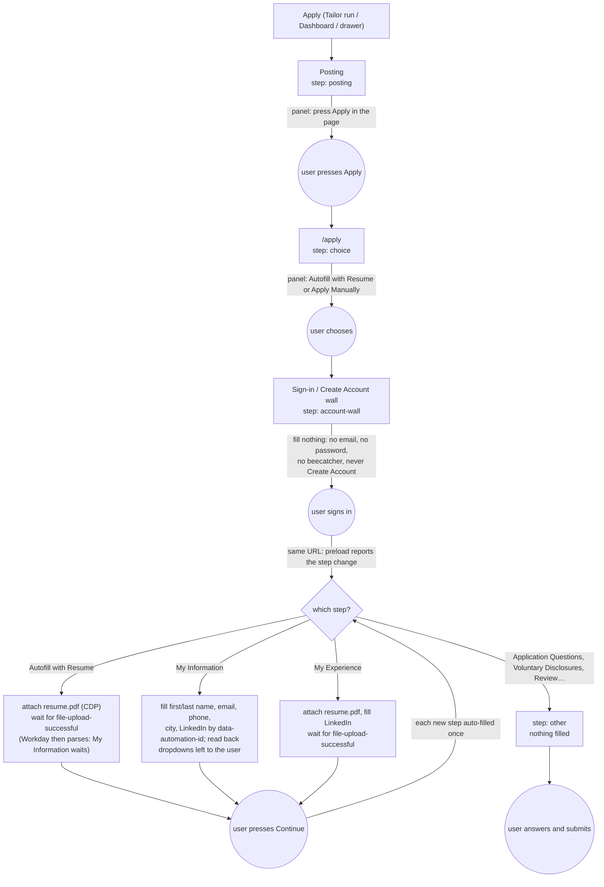
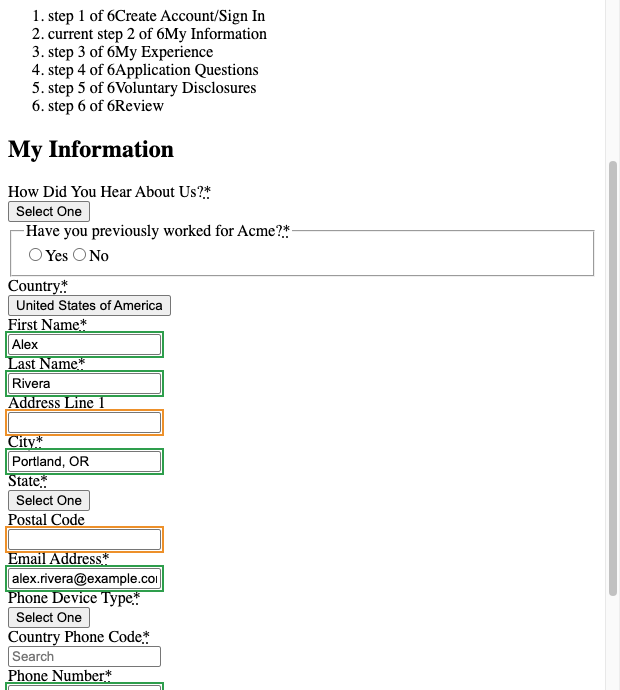
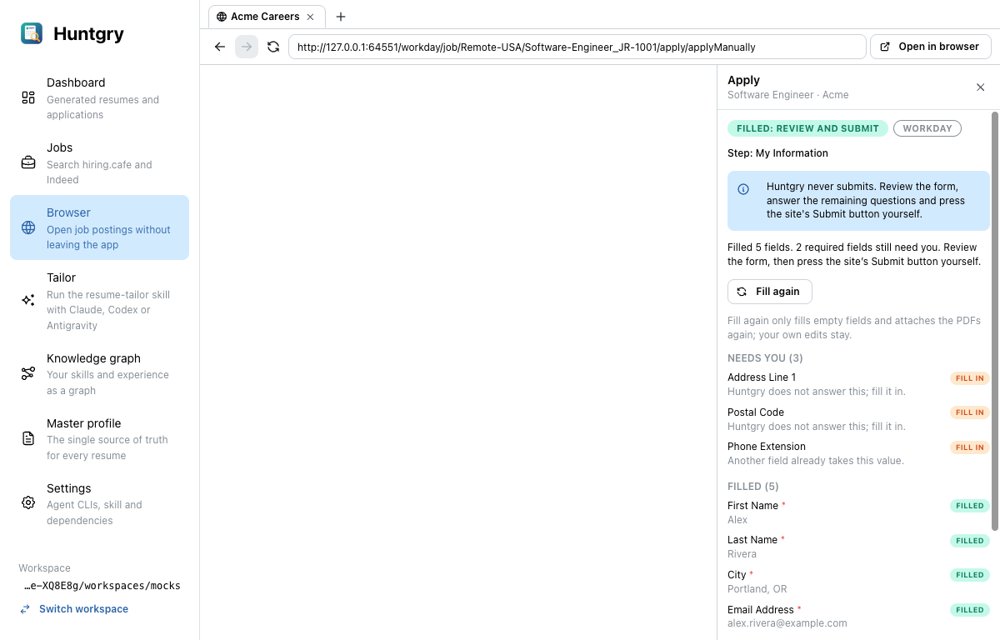
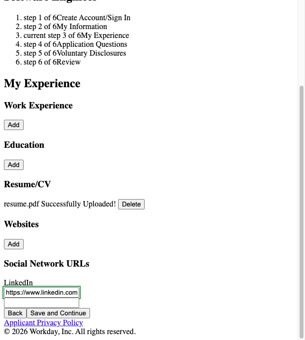
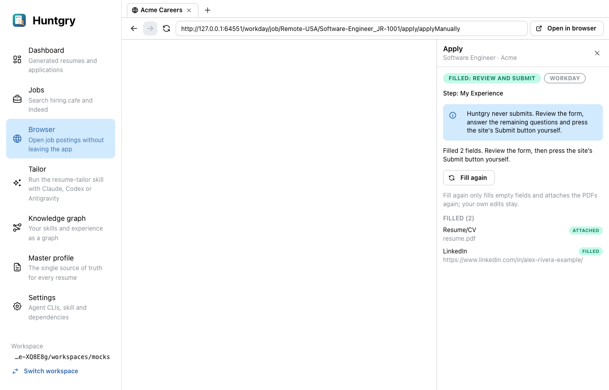

# #65 — Workday adapter: follow the multi-step apply flow, stop at the account wall

Issue: [silentashish/huntgry#65](https://github.com/silentashish/huntgry/issues/65) · Epic #62 · Builds on #63
(adapter registry, readiness wait, verify-after-fill, widget-confirmed uploads, navigation cancellation; see
`docs/changes/63-*.md`)

## Context & problem

Apply on a Workday posting (`<tenant>.wd<N>.myworkdayjobs.com`, `*.myworkdaysite.com`) did nothing useful, and in
one way it was unsafe:

- Workday is a client-rendered app. The posting has no form, only an **Apply** button. Apply leads to a
  choice (**Autofill with Resume** / **Apply Manually**), then to a **sign-in or create-account wall**, and only
  after that to the steps under a progress bar (My Information, My Experience, Application Questions, …). From the
  wall on, the URL usually stays the same while the step changes.
- The generic rules saw the sign-in wall's email box and Workday's hidden `beecatcher` honeypot as a form. **Fill
  form** there would have typed the user's email into the sign-in box and could have filled the honeypot, which
  flags the application as a bot.
- Nothing noticed a step changing without a navigation, so the steps that keep their URL were never filled after the
  first one. A field rendered after a step's first fill stayed empty.
- #63 confirms uploads against the site's widget, but it had no Workday widget to check.

Hard rules (unchanged since #24): Huntgry never submits, never presses Apply, Next, Sign In or Create Account,
never fills a password, never creates an account. Tests use local mocks only.

## What changed and why

| Area | Files | Why |
| --- | --- | --- |
| Workday adapter | `src/shared/autofill/adapters/workday.ts`, registered in `adapters/index.ts` | Recognised by host, or by apply-flow markup (`applyFlowPage`, `applyAdventurePage`, `adventureButton`, `signInContent`, `jobPostingPage`) for mocks and custom domains. **`step`**: `account-wall` (signInContent, signInFormo, a password field, Sign In / Create Account buttons; checked first), `choice` (autofillWithResume / applyManually), `posting` (adventureButton without a progress bar), `form` (My Information markers, or the resume drop zone / its uploaded list, or a progress title like "My Experience"), otherwise `other`. **`stepTitle`**: the active progress step's label without the "current step 2 of 6" counter. **`known`**: first/last name, email, phone number, city, LinkedIn and website by `data-automation-id` on the input or its `formField-*` wrapper, on both tenant generations (`legalNameSection_*` and `formField-legalName--*` / `name--legalName--*` ids). The resume goes to `file-upload-input-ref`. **`uploadAttached`**: looks only inside the resume widget (the `uploadGroup` marked at fill time, which survives Workday replacing the drop zone and input). It returns `attached` once an uploaded item there names exactly the file (not `old-resume.pdf`, not another section's file), `pending` while a progress bar shows, else `missing`. **`ready`**: false while Workday shows `loadingSpinner` or `resumeParsing`. |
| Engine (shared) | `src/shared/autofill/engine.ts`, `dom.ts` | `PageScan` and `FillReport` carry the step, its title and **`stepFields`**: the profile fields a multi-step step shows now (sorted keys), so a field rendered late counts as a change. `PageScan` also carries the adapter's synchronous **`ready`** answer. `pageStep(doc)` is a cheap read of the same for the preload. #63's `fillPage` already leaves non-form steps untouched. Honeypots (`beecatcher`, `*honeypot*`, `bot-trap` in name/id/automation-id/class) are no longer relevant fields, on every site. |
| Types and channels (shared) | `src/shared/apply-types.ts`, `autofill-channels.ts`, `validate.ts` | `ApplyStatus` gains `waiting` (the user's turn in the page). `ApplySession` gains an optional `step: { kind, title }`. New page channel `step`. Replies are shape-checked (`stepFields` keeps known keys only). |
| Tab preload | `src/preload/browser-page.ts` | Next to #63's watches, after a detect it watches for **step changes** (MutationObserver, debounced 400 ms) and reports a change of `{ats, step, stepTitle, stepFields, ready}` to main. It compares with the step it observed itself, not with a detect's, because main drops detects that a newer load overtook (that race left the panel on "How to apply" in an early e2e run). |
| Apply service | `src/main/apply/service.ts`, `validate.ts` | A step that is the user's sets status `waiting`, clears the old report and tells the user what to press. Huntgry fills nothing and presses nothing there, and **Fill form** on such a step gives the same answer. A `step` message from the page re-detects at once, so signing in or pressing Next resumes auto-fill. It only starts a new page generation, cancelling running work, when the page differs from the last accepted detect. A duplicate report of the step being filled is ignored, and so is an in-place change to it (fields added, or Workday replacing the resume input); that change is re-checked when the fill finishes. **Per URL plus step title**, main remembers the fields a *completed* fill handled. It fills again only when the step shows a field not handled yet, fills only the empty ones, and keeps the earlier report lines. A cut-short fill handles nothing and is retried. Workday's `ready` (no `loadingSpinner` / `resumeParsing`) feeds #63's readiness wait, so the detect of a step Workday is still parsing waits up to 6 s. If it is still busy after that, main shows "The site is still working on this step" and fills when the page reports it ready. A busy/ready flip alone never cancels work. Uploads go through #63's confirmation: the Workday widget check runs in the preload's `uploadState` wait, with one re-mark and retry before `upload-failed`. Same-step value resets go through #63's verify-after-fill. |
| Apply panel | `src/renderer/src/pages/browser/{ApplyPanel.tsx,apply-report.ts}` | Shows the step under the badges: "Step: Job posting", "Step: How to apply (Start Your Application)", "Step: Sign in or create account (Create Account/Sign In)", "Step: My Information", "Step: My Experience", "Step: Other step (Application Questions)". New badge "Your turn in the page". |
| Fixtures | `src/shared/autofill/fixtures/workday-*.html` | Posting, choice, sign-in and create-account: the 2026-10-03 live captures, anonymised (Acme), styles stripped. My Information (both generations), Autofill with Resume, My Experience, Application Questions: rebuilt from open-source Workday autofill code. They are behind an account, and their header comment says so. |
| Mock Workday | `scripts/mock-ats/workday.mjs` (+ `.d.mts`), mounted in `server.mjs` | A client-rendered SPA built from those fixtures (see "How to test"). On "Autofill with Resume" it lists the file, then reads it for 3 s under a `resumeParsing` banner, and writes "Alexander", "Rivera" and a parsed email into My Information, overwriting what is there. Uploads are recorded with #63's `recordUpload` to the shared uploads file (site `workday`, with the step, size and sha256). |
| Tests | `adapters/workday.test.ts`, `guard.test.ts`, `autofill.test.ts`, `main/apply/apply.test.ts`, `apply-report.test.ts`, `e2e/tests/apply-workday.spec.ts`, `e2e/fixtures/workspaces/mocks/software-engineer/workday-mock/` | See "How to test". |



## Decisions

Choices that were the owner's to make (the owner was asleep). In each case the safer option was taken:

1. **Workday is not auto-trusted off the posting's origin.** `AUTO_TRUSTED_ATS` stays Greenhouse and Lever. A
   Workday flow stays on the tenant's own host, so the posting's origin covers it. A Workday page reached from some
   other origin waits for **Fill form**.
2. **The account wall fills nothing at all, not even the email.** Pre-filling the email would save a few
   keystrokes, but it would also type into a credential form. Any Workday page with a password field counts as the
   wall.
3. **Only My Information and the resume steps are filled.** Application Questions, Voluntary Disclosures, Self
   Identify and Review are `other` and never filled, even where a field looks like a contact field. They hold legal
   and EEO answers and the final Submit.
4. **Dropdowns stay the user's.** That covers country, state, phone device type, the country phone code picker and
   "How did you hear about us". Workday's dropdowns are buttons with listboxes. Choosing an option means clicking
   it, which Huntgry never does.
5. **The city field gets the profile's location as written** ("Portland, OR"), the same rule the generic matcher
   already uses for "City". Splitting off the city would need a value transform the adapter contract does not have.
   This is a follow-up.
6. **Values already in a field are kept**, as everywhere else. That includes values Workday's resume parser put
   there on the Autofill path.
7. **Honeypot skipping is generic**, not Workday-only. A field named like a bot trap is never filled on any site.
8. **An upload is only "Attached" once Workday's resume widget lists exactly that file**, the same rule #63 applies
   to Greenhouse and Lever. An older `old-resume.pdf`, or a file listed in another section, does not count.
9. **The panel names "Autofill with Resume" and "Apply Manually" only.** "Use My Last Application" and "Apply with
   LinkedIn" are not mentioned, because Huntgry has nothing to fill on those paths.

## Shared engine changes

Rebased onto #63 (merged as #68). These are the additions on top of it, kept generic:

- `engine.ts`: `stepFields` and `ready` in the scan, the step fields in the fill report, and `pageStep`.
- `dom.ts`: honeypot skipping in `isRelevant`.
- `apply-types.ts`: `waiting`, `ApplySession.step`, `PageScan.stepFields` / `ready`, and `FillReport.step` /
  `stepTitle` / `stepFields`.
- `autofill-channels.ts`: the `step` channel.
- `browser-page.ts`: the step watcher.
- `service.ts`:
  - The step channel, deduplicated against the last accepted detect, with a re-check after a fill.
  - Per-step handled fields, which replace #63's `autoFilledUrl`.
  - Step messages: status `waiting`, replacing #63's generic `ready` texts.
  - The "still working" wait.

The adapter hooks (`types.ts`) are unchanged. The Workday adapter uses `ready`, `step`, `stepTitle`, `uploadGroup`,
`uploadAttached` and `afterUpload` as #63 defined them.

## How to test

```bash
npm test                    # unit: adapters/workday.test.ts (step classifier per fixture, both tenant variants,
                            # wall untouched, honeypot, uploadAttached), guard.test.ts (Workday buttons never pressed),
                            # apply.test.ts (service walk posting → … → Application Questions, upload not confirmed,
                            # Fill form on the wall)
npm run typecheck
npm run build
npm run test:e2e            # whole suite; Workday: e2e/tests/apply-workday.spec.ts
npx playwright test -c e2e/playwright.config.ts e2e/tests/apply-workday.spec.ts   # just Workday (after a build)
```

By hand, against the mock:

```bash
node scripts/mock-ats.mjs                     # http://localhost:4173/ → "workday"
HUNTGRY_ALLOW_LOCAL_URLS=1 npm run dev
```

Paste `http://localhost:4173/workday/job/Remote-USA/Software-Engineer_JR-1001` as an application's posting URL and
press Apply. Add `?tenant=legacy` for the older My Information markup. Then:

1. On the posting, the panel says to press Apply.
2. Press Apply in the page. The panel names both choices.
3. Choose one. The panel says to sign in; nothing is typed.
4. Sign in with any email and password. My Information fills; on Autofill with Resume the resume goes in first.
5. Press Save and Continue. My Experience gets the resume and the LinkedIn URL.
6. On the next step, Application Questions, the panel says it is yours.

The mock records uploads to `<tmp>/huntgry-mock-ats/uploads.json` (site `workday`). It has no Submit.

**Before relying on it with a real account:** the post-sign-in markup was not captured live. Try one real Workday
posting with your own account and use **fill only**. Check that My Information and the resume step are recognised
("Step: My Information"), and that nothing on the wall is touched.

## Screenshots

From `e2e/tests/apply-workday.spec.ts` (the built app, mock Workday). The page images are the tab's own pixels
(`webContents.capturePage`). In the app images the page area is blank, because the tab is a native view.

| My Information filled (page) | My Information (Apply panel) |
| --- | --- |
|  |  |

| My Experience: resume.pdf listed by Workday's widget (page) | My Experience (Apply panel) |
| --- | --- |
|  |  |

## Follow-ups

- Verify the post-sign-in selectors (`formField-legalName--*`, `phoneNumber--phoneNumber`, `address--city`,
  `file-upload-successful`, the upload progress markers) on a live tenant, and refresh the fixtures from a capture.
- City vs. location: add a value transform (or a `city` value) so Workday's City gets only the city.
- Workday parses longer than #63's readiness cap (6 s) show "still working" and are filled once the page reports
  it ready. A per-adapter readiness cap could keep the detect waiting instead.
- Workday's "Use My Last Application" path and the LinkedIn apply iframe are not handled. The panel says nothing
  about them.
- Workday's resume parser can put its own values into My Information. They are kept as they are. A "prefer my
  profile" option would need the user's say.
