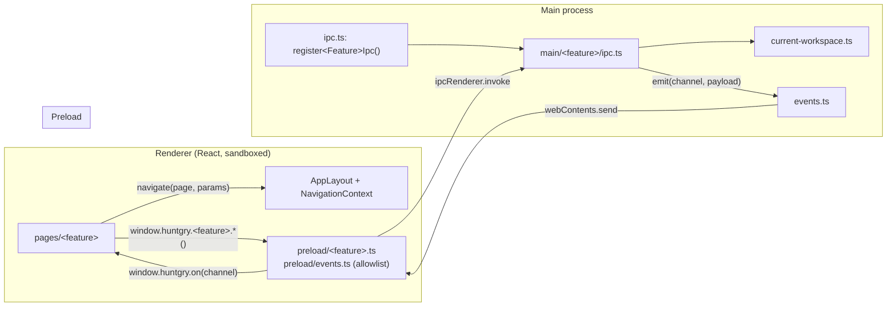
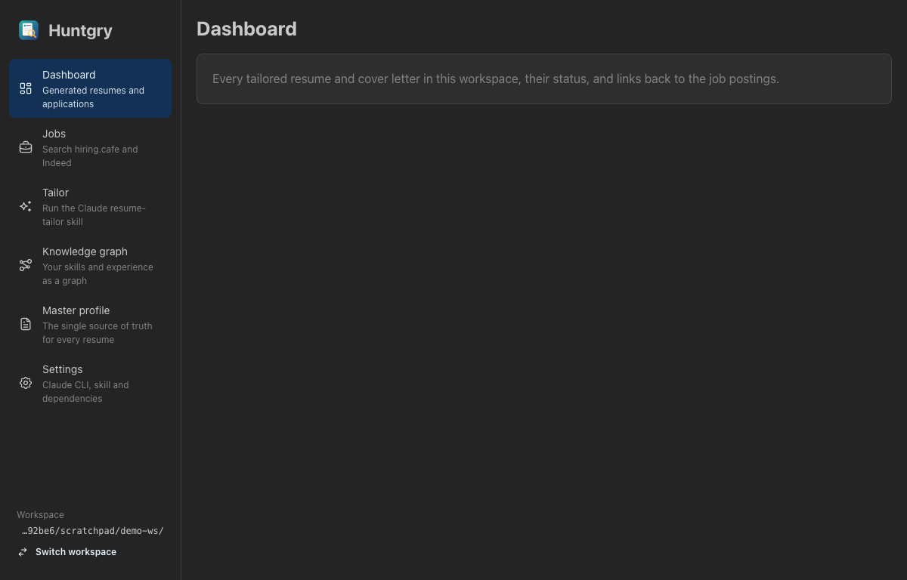
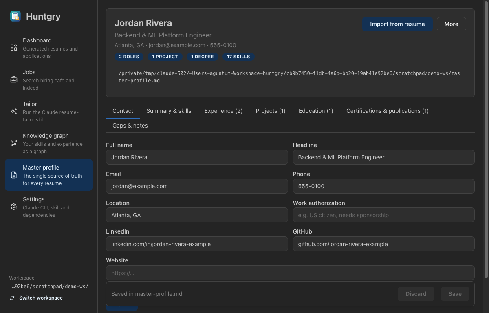
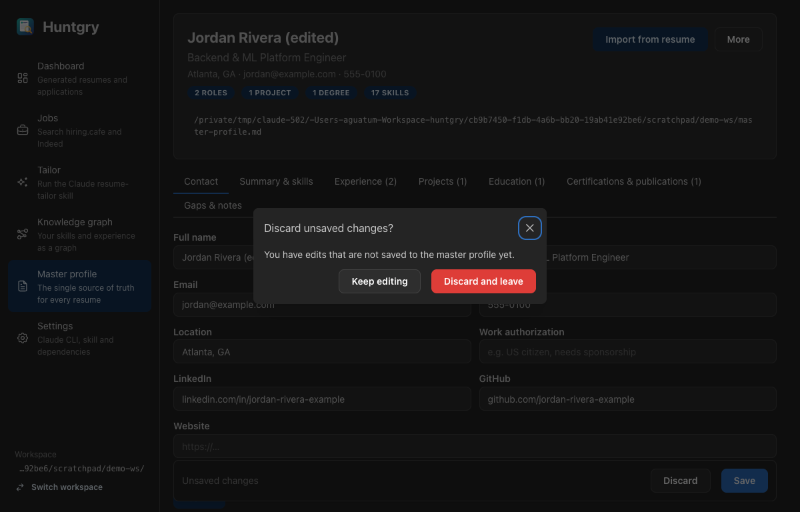

# #7 — App shell: sidebar navigation, page routing and per-feature IPC

Issue: [silentashish/huntgry#7](https://github.com/silentashish/huntgry/issues/7) · Epic: #1 · Follows #4

## Context & problem

After #4 the app was one linear flow: workspace picker → profile setup → profile editor.
Every other box of the architecture diagram (dashboard, job boards, the Claude runner,
the knowledge graph) needs its own screen, and those features are built as separate
tickets, possibly in parallel. With one `App.tsx` state machine, one `ipc.ts`, one preload
object and one `HuntgryApi` interface, every ticket would edit the same four files.

## What changed and why

| Area | Files | Why |
| --- | --- | --- |
| Shell | `src/renderer/src/components/shell/AppLayout.tsx` | Mantine `AppShell` with a navbar (Dashboard, Jobs, Tailor, Knowledge graph, Master profile, Settings), the workspace path and *Switch workspace*. Shown once a workspace is open; the picker and first-run setup stay full-screen. |
| Navigation | `src/renderer/src/navigation.ts` | A page name + typed params (`PageParams`), `navigate(page, params?)` through React context. No router dependency and no URLs: an Electron app with six pages does not need them. `navigate('tailor', { jobUrl, company })` is how the Jobs page will hand a job to the runner. |
| Leave guard | `navigation.ts`, `AppLayout.tsx`, `pages/profile/index.tsx`, `ProfileEditor.tsx` | A page with unsaved work calls `setLeaveGuard(message)`; navigating away or switching workspace then asks first. The profile editor reports `dirty` through a new `onDirtyChange` prop. |
| Pages | `src/renderer/src/pages/<page>/index.tsx` | One folder per page. Placeholders say what each page will do; the profile page wraps the existing editor (which can now open on a given tab via `initialTab`, for deep links like `navigate('profile', { section: 'experience' })`). After first-run setup the shell opens on the profile page. |
| Main IPC | `src/main/ipc.ts`, `src/main/{workspace,profile}/ipc.ts`, `src/main/current-workspace.ts` | `ipc.ts` is now a list of `register<Feature>Ipc()` calls. The handlers moved unchanged into their feature folders. `current-workspace.ts` holds the remembered-workspace logic every feature needs (`requireCurrentWorkspace()`). |
| Events | `src/shared/events.ts`, `src/main/events.ts`, `src/preload/events.ts` | Main → renderer streaming for the runner and job search: `emit(channel, payload)` in main, `window.huntgry.on(channel, cb) → unsubscribe` in the renderer. Channels are typed (`HuntgryEvents`) and preload refuses channels missing from `EVENT_CHANNELS`. |
| API types | `src/shared/api.ts`, `src/shared/workspace-types.ts`, `src/preload/*` | `HuntgryApi` is composed from per-feature interfaces (`WorkspaceApi`, `ProfileApi`, …); preload builds one object per feature. |
| Window | `src/main/index.ts` | Default size 1200×800 (min 900×600) to fit the navbar. |
| Tests | `src/renderer/src/navigation.test.ts`, `vitest.config.ts` | Typed params reach the target page. Vitest now also picks up pure tests under `src/shared` and `src/renderer/src`. |



## Decisions and alternatives rejected

- **No router library** (react-router, TanStack Router). There are no URLs to share or
  restore in a desktop window, and a typed `PageParams` map gives the same type safety
  in ~60 lines. Revisit if pages need nested routes or history.
- **Icons: `@tabler/icons-react`** (new dependency). It is the icon set Mantine's own docs
  use, tree-shaken per icon, and saves hand-drawing SVGs for every nav item and button in
  the upcoming pages.
- **Event allowlist in shared code**, not in preload only, so the renderer and main get
  the payload types from the same place and a typo in a channel name fails type-checking.
- The profile editor's Save bar changed from `position: fixed` (full window width, which
  would cover the navbar) to `position: sticky` inside the page.

## How to test

```bash
npm test && npm run typecheck && npm run build
npm run dev
```

1. Open a workspace with a master profile → the shell opens on **Dashboard**.
2. Click through every nav item; each page renders.
3. **Master profile**: edit a field, click **Jobs** → *Discard unsaved changes?* appears.
   *Keep editing* stays; *Discard and leave* goes to Jobs and the file is untouched.
4. **Switch workspace** returns to the picker (with the same guard when there are edits).
5. Create a new workspace → after *Fill it in manually* the shell opens on **Master profile**.





## Follow-ups

- #8 (Claude runner, Tailor + Settings pages), #9 (Dashboard), #10 (Jobs), #11 (Knowledge graph)
  and #12 (master profile update loop) fill the placeholder pages.
