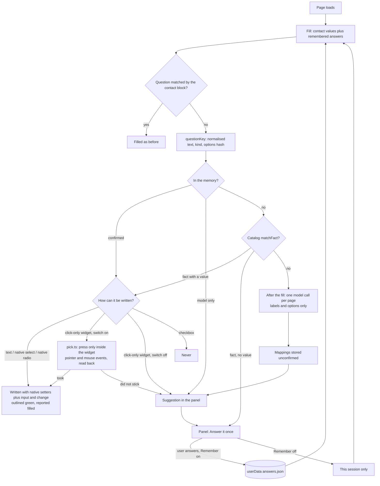

# #71 — Autofill learns: screening and EEO answers, remembered once, filled next time

Issue: [silentashish/huntgry#71](https://github.com/silentashish/huntgry/issues/71) · Builds on #24 (auto-apply),
#63 (adapter registry), #64 / #65 (Ashby, Workday) and the #31 rule that sensitive state lives outside the workspace.

## Context and problem

Autofill filled only the contact block: name, email, phone, location, links and current company. Every other
question went to the user every time:

- **No values.** `FillValues` held 10 contact strings. There was no key for work authorization, sponsorship, age,
  notice period, salary, gender, race, veteran or disability status. The profile's own `contact.workAuthorization`
  was never used.
- **Choices were skipped by design.** Every `select`, `combobox`, `checkbox` and `radio` was reported as
  "A choice; pick it yourself." Textareas were never matched. Labels with "salary" or longer than 80 characters were
  ruled out.
- **Nothing was remembered.** The knowledge graph (#11) is computed from the profile and stores nothing. The
  `.huntgry/apply-answers.json` idea from #24 was never built.

The owner asked for three things: answer these questions, use a small model (Claude Haiku or Antigravity's light
Gemini) when a question is not recognised, and **learn once**: an answer the user gives is reused on the next
application without asking again.

## What changed and why

### Fact catalog (`src/shared/apply-facts.ts`, pure)

- **14 facts:** `workAuthorized`, `needsSponsorship`, `over18`, `willingToRelocate`, `noticePeriod`, `earliestStart`,
  `salaryExpectation`, `currentCity`, `pronouns`, `gender`, `raceEthnicity`, `hispanicLatino`, `veteranStatus`,
  `disabilityStatus`. Each one has a label, a kind (`yesno`, `choice`, `text`) and a `sensitive` flag. The EEO facts
  and pronouns are sensitive.
- **`matchFact(question)`** is deterministic and ordered: sponsorship is checked before authorization, Hispanic before
  race. A question about consent, certification, acknowledgement, arbitration or a signature never matches.
  `over18` needs affirmative wording ("18 or older"): an inverse question such as "Are you under 18?" would flip the
  answer, so it is left to the user.
- **`questionKey(label, kind, options)`** is the memory key. It is built from the normalised text, the kind group
  (typed or chosen) and a hash of the sorted options. Element ids are not used: Workday and Ashby give every posting
  new UUIDs.
- **`resolveAnswer(fact, value, kind, options)`** turns a stored answer into one of the page's own options. It tries
  the same text first, then the page's "decline" option for `decline`, then the single Yes/No-like option ("I am not a
  protected veteran" counts as no), then synonyms (Man/Male, Woman/Female). If no single option fits, it returns null
  and **nothing is written**.
- **`factsFromProfile(workAuthorization)`**: "US citizen", "green card" and "US permanent resident" mean authorized
  with no sponsorship needed. Visa wording (H-1B, OPT, TN…), negations ("Not a US citizen"), pending status and foreign
  or unqualified status ("Indian citizen", "Citizen") give nothing, so the user is asked.
- **Refusals count as "decline"** before any yes/no reading: "I do not want to answer" is a decline, never "no".
- **`boundedOption(text)`**: an option longer than 120 characters is named by a prefix plus a hash of its whole text.
  The page reports that name, and reads and writes options by it, so a long option chosen in the panel is found
  again, and two long options with the same start stay apart.

### Engine (`src/shared/autofill/answers.ts`, `engine.ts`, `dom.ts`)

- `fillPage(doc, values, { answers })` now gives every reported question a `fieldId`, a `question` key, its
  `options` and its `fact`. A question that has a remembered answer is written **only if** the answer is confirmed,
  fits an option, and the control is still empty and untouched by the user. Otherwise the field is reported `kept`,
  or only gets a `suggestion`.
- **`strategyOf(kind, clickOnly)` is the single place that decides how a question is written:**
  - typed fields: `setNativeValue`, as before;
  - native `<select>`: `setSelectValue`, which uses the native `value` setter, then `input` and `change`;
  - native radios: `checkRadio`, which uses the native `checked` setter, then `input` and `change`;
  - checkboxes: **never**;
  - comboboxes, Workday dropdown buttons, Ashby yes/no button groups, adapter `choices` and the new adapter `clickOnly`
    selectors (Ashby's and Workday's React radios and checkboxes): click-only. With the Settings switch on (the
    default), a trusted answer is **picked** by `pick.ts` (see "Picking in click-only widgets" below). Off, the panel
    shows the remembered answer and the user picks it in the
    page.
- **`Adapter.answerRoots`**: containers outside `formRoot` whose questions are only answered or suggested, never
  matched to contact values or uploads. Ashby uses it for its EEO survey, which is a second form container. When a
  fieldset has no legend, its question label names the radio group.
- `verifyFill` also checks the answers it wrote (by `fieldId`) and restores one that the page wiped. A user's edit is
  kept.
- The page's preload passes the answers and the switch through.

### Picking in click-only widgets (owner decision, 2026-10-06)

The owner reversed open question 1: autofill picks remembered answers in widgets that only take a click, on the steps
it already fills.

- **Widgets:** Greenhouse react-select comboboxes, Ashby yes/no button groups (a hidden checkbox between two
  `button[aria-pressed]`, now reported as a radio question with its buttons as options) and Ashby React radios, and
  Workday dropdown buttons (`button[aria-haspopup=listbox]`, now reported as comboboxes) with their popup listbox.
- **Trusted answers only:** a catalog match with a stored fact, or a question mapping the user confirmed. A model-only
  mapping stays a suggestion and is never picked.
- **One switch:** Settings > Saved application answers > "Pick dropdown answers automatically". It is **on by
  default** (the owner asked for it) and stored as `pickDropdowns` in the app settings. Main reads it before every
  fill and sends it as `pick`. Off gives the suggestion-only behaviour.
- **One module:** `src/shared/autofill/pick.ts` is the only code that dispatches synthetic events. `fillPage` queues
  the picks on the report, and `PageSession.fill` runs them through `pickAnswers` before the verify pass: at most 25,
  within 8 s, well inside main's 15 s wait.
- **How a press is bounded** (`refusal`, checked again **before every event** of a press, so a page handler that turns
  the target into a submit button, moves it or disables it mid-sequence stops the press):
  - the target must be inside the field's own widget: its control, its button group or radio group, or a listbox the
    control **demonstrably owns**. Owned means the listbox is named by the control's `aria-controls` / `aria-owns`,
    sits inside the widget, or names the control in `aria-labelledby`. An untied popup is never used: the pick fails
    and stays a suggestion. For Workday this means a dropdown is picked only if its popup names its button. A live
    check of Workday's markup is a follow-up;
  - everything the press reaches or activates is checked, not just the target: every wrapper it bubbles through
    inside the widget, any activatable element around the widget, and a label's control;
  - refused: links, submit / image / reset controls, buttons that would submit their form, checkbox, file and button
    inputs, labels whose control is outside the widget (or is a checkbox or button), buttons enclosing the widget,
    disabled elements, and anything named Submit / Apply / Next / Continue / Save / Review.
- **Events:** pointerdown, mousedown, pointerup, mouseup and click on the control and then on the option element.
  Never a keyboard event, so nothing can press Enter in a form. A menu left open is closed by blurring the control.
- **Read back:** react-select's single value, the Workday button's text, the pressed button (`aria-pressed`) or the
  checked radio. A widget that already shows another answer is `kept`. A pick that did not stick is reported as
  `rejected` ("Needs you"), with the suggestion.
- **Guard:** `guard.test.ts` keeps its scan for every other file. It allowlists exactly `pick.ts` for mouse and pointer
  event constructors; submit, requestSubmit, `.click()`, keyboard and submit events stay forbidden there too. New guard
  tests show that `pick` refuses out-of-widget targets, links, submit buttons, flow-labelled options, a submit button
  posing as an option, and listboxes it cannot tie to the widget. Review round 2 added: a label for an outside image
  submit or a consent checkbox, an option nested in a Next button, a target turned into a submit button or moved
  mid-press, and a single untied listbox. No key or submit event fires in any of them.
- **User edits:** a click-only field the person touched, or a combobox they are typing into, is `kept`. Edits are
  checked again before each press and after the menu opens.
- **After the fill:** the verify pass (and the one after an upload) re-reads every picked widget from the current page.
  A pick that a late re-render wiped goes to the user as `rejected`, with the saved answer as its suggestion; a
  change the user made is `kept`. Nothing is pressed again.
- **Never:** consent, certification, acknowledgement, arbitration and signature questions are refused before any
  memory lookup, for every strategy, even with a remembered answer. A checkbox becomes a yes/no question only in
  Ashby's screening shape: a hidden `tabindex=-1` checkbox in a `yesno` group of exactly a Yes and a No button.
- **Still not filled:** the Workday steps that #65 never fills (Application Questions, Voluntary Disclosures). Picking
  applies only to the steps autofill already fills, and those steps stay a follow-up.

### Memory (`src/main/apply/answers-store.ts`)

- `<userData>/apply-answers/<sha256(workspace)[0..32]>/answers.json`, readable and writable by the owner only
  (`0600`). Writes are atomic (temp file plus rename), one at a time per workspace. A corrupt file reads as empty.
- It holds `facts` (one canonical value per fact) and `questions`. Each question entry maps a question key to a fact,
  an optional direct answer, `source: user | model` and `confirmed`. A confirmed fact question also keeps the exact
  `option` the user chose. That option wins when the same question (same options) comes back: a fact alone cannot pick
  between "Yes, I am" and "Yes, with a visa". Forgetting the fact also drops these options.
- Only a `user` entry is confirmed. A file that claims a model mapping is confirmed is not trusted.
- Up to 1,000 questions are kept; the oldest are dropped first.

### Mapping call (`src/main/apply/map-questions.ts`, `mapper.ts`)

- After a fill, the questions that neither the catalog nor the memory knows are sent in **one call per page and step**,
  made or failed. Questions over the limit, or rendered later on the same page, stay with the user. The call takes up
  to 40 questions, each label at most 300 characters, with up to 30 options of at most 120 characters each.
- The model gets the question text, the options and the fact *names*. **It never gets a stored value.**
- **Claude:** `claude -p --model haiku --output-format json --tools '' --setting-sources '' --strict-mcp-config
  --no-session-persistence [--permission-prompts none] --json-schema … --system-prompt …`. It runs in an empty temp
  folder with the prompt on stdin.
- **Antigravity:** `agy --output-format json --json-schema … --model gemini-3.8-flash-low --sandbox
  --disable-slash-commands "--print=<prompt>"`. agy's `-p` takes the prompt as its value. agy is used first when it
  is the default agent in Settings, and as the fallback when Claude is missing or signed out.
- The reply is checked against the schema and again in main: only known ids and fact keys are kept.
- Each mapping is stored **unconfirmed** and shows only as a suggestion ("AI matched this question to gender; confirm
  it once").
- A missing CLI, a timeout, a 429 or bad output changes nothing: the fill has already completed.
- Questions sent once are not sent again: the session remembers them, and the store remembers the mapping (null
  included).

### Service and IPC

- `ApplyDeps.answers` has four calls: `load`, `remember`, `rememberMappings` and `map`. Each one takes **the
  workspace the session started in**. A workspace switch mid-session can therefore never write one person's answers
  into another's memory, nor show them on the other's application; a mapping that finishes late is stored in the
  session's workspace too. The profile seeds are read from that workspace's own master profile. Every fill sends
  `{ values, answers }`. A session keeps answers given without Remember in `once`.
- `apply:answer(sessionId, fieldId, value, remember)` checks the field against the current report. For a select or
  radio, the value must be one of the reported options; a text answer is at most 500 characters. Main then stores the
  fact (or the direct answer) and refills the page without uploading again. The report keeps its upload lines.
- `validate.ts` limits the new report fields: options only on selects and radios, a known `fact`, bounded strings.
  It **derives the memory key itself** from the label, kind and options it just checked, so a page cannot file one
  question's answer under another question's key.
- `apply:answers:list`, `apply:answers:forget` and `apply:answers:clear` back the Settings card.

### Renderer

- **Apply panel:** every open question gets an **Answer** button. It opens a native select over the page's options,
  or a text box. On sensitive questions, "decline" options are listed first. "Remember for next applications" is on
  by default. Sensitive questions say "Stored on this computer only, outside your workspace; never sent to the AI
  model." Each suggestion line says whether it comes from saved answers or from the AI.
- **Settings → Saved application answers:** facts (sensitive values masked until **Show**) and directly answered
  questions, with **Forget** and **Forget all**.

## Design decisions and alternatives rejected

- **Picking in click-only widgets (open question 1: the default was "no", the owner changed it to "yes").** The first
  version only suggested in these widgets. The owner then decided that autofill picks trusted answers there, behind
  a Settings switch that is on by default. "Never submit" (#24) still holds. All synthetic input goes through one
  bounded module (above); the rest of the engine still never presses anything.
  - *Rejected:* keyboard selection (typing then pressing Enter), because Enter can submit a form.
  - *Rejected:* `new Event('click')` workarounds outside `pick.ts`.
  - *Rejected:* picking model-only mappings.
- **Ashby and Workday radios count as click-only.** React's change event for radios and checkboxes listens to
  `click`. Setting `checked` may look answered while React's state stays empty, so the submission drops the answer.
  Lever (server-rendered) and plain HTML forms listen to `change`, so they are written.
- **The memory is under userData, not "the knowledge graph" (open question 2, default).** The graph is derived from
  the profile and stores nothing. The workspace is every agent's writable sandbox and may be a git repository.
  `master-profile.md` is sent to every tailoring run. The `review/authority.ts` pattern (#31) already solved "state
  agents must not touch".
- **Confirmed EEO answers fill automatically (open question 3, default).** The owner asked for "without filling it out
  again". The decline option is offered first.
- **Haiku first, agy as fallback (open question 4, default).** Haiku takes about 3 s and costs about $0.017 per page.
  agy takes 25–38 s, uses about 16k tokens and saves a conversation in agy's history. No Settings toggle yet (see
  follow-ups).
- **A model's mapping is a suggestion until confirmed (open question 5, default).** A catalog match with a stored fact
  fills directly. A wrong answer to an authorization or sponsorship question has legal weight.
- **Age:** only `over18`, a yes/no fact (open question 6, default). A numeric age or a birth date is never stored as a
  fact. If the user answers such a question with Remember, it is kept as that question's direct answer.
- **The memory is per workspace (open question 7, default).** Each workspace is one person's profile.
- **Workday's question steps stay unfilled (open question 8, default).** The #65 step rule is unchanged.
- **The store keeps both the fact and the exact option.** The fact lets a new wording on another posting resolve. The
  exact option answers the same question with the same options, where the fact alone may fit several options.
- **A native select in the panel,** not a Mantine dropdown. The panel sits next to a native page view, and a dropdown
  could open over it.
- **Rejected:**
  - Sending the whole memory to the model. That breaks the privacy rule.
  - Keying the memory by element id. It changes on every posting.
  - Storing answers in `master-profile.md`. That file is sent to agents.
  - Letting the page supply the memory key. A page could file answers under another question's key.

## Privacy and security notes

- Sensitive values stay in main's store and in the page's isolated preload world. The renderer shows them only on
  request (Settings masks them until **Show**). They never go to a model and never appear in the graph.
- A page can ask for any fact the user has saved, for example through a hidden "gender" select. As with contact
  values, Huntgry only fills on its own on the posting's trusted origins (#24). On other pages, filling still needs
  **Fill form**.
- Page text reaches the model only as data, in a tool-less (Claude) or sandboxed (agy) call in an empty folder. The
  output is schema-constrained and checked again in main.

## How to test

- **Unit:** `npx vitest run src/shared/apply-facts.test.ts src/shared/autofill src/main/apply
  src/renderer/src/pages/browser src/renderer/src/pages/settings e2e/fixtures/fake-agent/agent.test.ts`
  - `autofill.test.ts` checks that the Lever Gender select and the sponsorship radio are filled with no
    click/submit/key event; that "decline" picks the page's own decline option; that nothing is written when no
    option fits; that a Greenhouse react-select and Ashby radios only get a suggestion; that consent is never ticked;
    and that `kept`, textarea answers, model-only suggestions and the verify restore work.
  - `answers.test.ts` covers the store (under userData, `0600`, concurrent writes, forget, clear, corrupt file), the
    mapping call (Haiku, tool-less, prompt without values, agy `--print=`, bad output, errors, timeout, missing CLI)
    and report validation.
  - `apply.test.ts` runs the service: answers sent with the fill, a US-citizen profile answering sponsorship, one model
    call per page, suggest, then confirm, then the next posting fills with no call, `apply:answer` checks, and a
    failing model.
- **Picking (unit):** `autofill.test.ts` picks in the Greenhouse react-select fixture (with the mock's react-select
  behaviour), in Ashby yes/no buttons and React radios, and in a Workday dropdown with a popup listbox. It also checks
  that the switch off gives suggestions, that an unconfirmed model mapping is not picked, and that a pick that does not
  stick is reported. No submit, requestSubmit or key event fires. `guard.test.ts` covers the refusals.
- **E2E (CI):** `e2e/tests/apply-answers.spec.ts`.
  - Answer Gender once on the mock Lever form and check the answer is stored under userData. The second mock Lever
    application fills it with no new model call; Settings shows it masked.
  - Answer the mock Greenhouse react-select Gender once: Huntgry picks it in the page, and the second Greenhouse
    application picks it on its own. The switch is on in Settings.
  - No submission is recorded in either case.
- **Manually:** apply to a Lever posting with an EEO section and answer Gender in the panel with Remember. Apply to
  another Lever posting: Gender is filled and outlined green. On Greenhouse, the authorization dropdown shows "From
  your saved answers: Yes. Pick it in the page."

## Follow-ups

- **Knowledge graph:** show learned non-sensitive facts as read-only `fact` nodes linked to the person, with an "Edit
  in saved answers" link. The graph stays derived and reads the store through a new IPC. Sensitive facts never
  appear there.
- **Live check of picking** on real Greenhouse, Ashby and Workday pages. The behaviour is modelled on captured markup
  and react-select v5. The read-back reports a widget that ignored the pick, but a live run should confirm that the
  sites' state takes it.
- **Workday Application Questions and Voluntary Disclosures steps.** These need a change to #65 decision 3: today only
  the steps autofill already fills are picked in.
- **Model-drafted answers to essay questions** ("Why do you want to work here?"), previewed and never auto-written
  (#24 phase 3).
- **A Settings toggle** "Use AI to match unknown questions" (default on), and showing the mapping call's cost.
- **Date pickers** (earliest start) and **number inputs** (salary as a number). Both are `other` today and never
  answered.
- **Splitting the city out of the location.**
- **Editing a saved fact in Settings.** Today it is Forget, then answer again in the panel.
