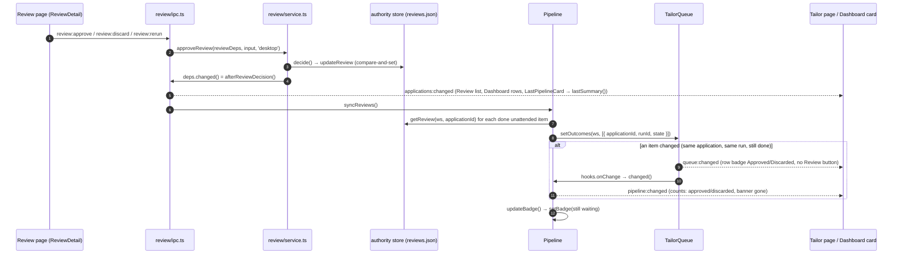
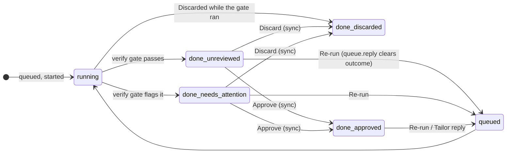

# #72: Tailor page follows Review decisions

Issue: [silentashish/huntgry#72](https://github.com/silentashish/huntgry/issues/72) · Fixes a gap in #31 (unattended pipeline) · Hook point for #42 (review from the phone)

## Context & problem

After the owner approved an unattended result on the **Review** page, the **Tailor** page kept
treating it as waiting for review. The pipeline card still showed `1 UNREVIEWED`, the banner
"1 result ready for your review / Open Review", and the row's `Unreviewed` badge and **Review**
button. Older rows in the **Tailoring queue** showed the same thing. Live updates worked for
everything else (a row going from Working to Needs your reply), so no event was being lost.

The cause was in main, not in the renderer:

- The verify gate copies the review state onto the queue item **once**, when the run settles
  (`queue.ts` `settle()` → `item.outcome`). The type allowed only `unreviewed | needs-attention`.
- Approve, Discard and Re-run (`review/service.ts`) write only the review authority store, then
  call `deps.changed()`. On the desktop that only emitted `applications:changed`. Nothing told
  the queue or the pipeline about it.
- The Tailor page reads `queue:changed` / `pipeline:changed`, and neither was emitted. A later
  emit (any queue tick) carried the same stale `outcome`, because main's copy was stale.
- `Pipeline.counts()` counted every `done` item that was not `needs-attention` as `unreviewed`.
  The dock badge was set once, at finish. The Dashboard's "Last unattended pipeline" card read
  `pipeline-summary.json` (also written once, at finish) and listened only to `pipeline:finished`.
- A Discard made **while the verify gate ran** was kept in the store (#31), but `settle()` still
  returned `unreviewed`/`needs-attention` to the queue, so that row said Unreviewed as well.

## What changed and why

| Area | Files | Why |
| --- | --- | --- |
| Types | `src/shared/queue-types.ts`, `src/shared/pipeline-types.ts` | `QueueItemOutcome` = `unreviewed \| needs-attention \| approved \| discarded` (the review store's states). `PipelineCounts` gets `approved` and `discarded`; `PipelineItemOutcome` gets both too. |
| Queue | `src/main/queue/queue.ts` `setOutcomes()` | Copies review states onto **done unattended** items whose `applicationId` **and** `runId` match. An item that left `done` (a re-run took it back) or whose run differs (an older run's decision) is left alone. Saves and broadcasts only when something changed. A list built for another workspace changes nothing. |
| Pipeline | `src/main/pipeline/pipeline.ts` | `syncReviews()` reads the store for every done unattended item in the whole queue (every pipeline's, not only the current one), passes the result to `setOutcomes()`, then recomputes the dock badge. Calls made while a sync runs are folded into one more pass. It runs on every queue load (`onLoad`: startup, a workspace switch, an import), so items saved with an old state (the owner's current queue.json) are corrected as soon as their workspace opens. `settle()` returns what the store actually kept (`record_()` now returns it), so a Discard made during the gate gives `outcome: 'discarded'`. `counts()` counts `approved` / `discarded` separately. `lastSummary()` replaces each result's outcome with its current state from the store, but only when that review belongs to the result's own run. Summary items now record `runId`; older summaries take it from the queue item if it is still there, and otherwise keep what they say. It then recomputes the four review counts. The file stays as written at finish, and the finish notification is not sent again. |
| Hook | `src/main/review/ipc.ts` `afterReviewDecision()` | The desktop `ReviewDeps.changed`: emits `applications:changed` as before, then `pipeline.syncReviews()`. It is exported so #42's gateway `ReviewDeps` can call the same function. |
| Dock badge | `pipeline.ts` `updateBadge()` | Counts done unattended results in the queue that are still waiting for review (unreviewed or needs attention). Set at finish as before, and after every sync when the number changed. The dock starts without a badge, so a startup with nothing to review sets none. |
| Tailor page | `tailor/status.ts`, `QueuePanel.tsx`, `PipelinePanel.tsx` | `OUTCOME_LABEL` adds **Approved** (green) and **Discarded** (gray). `QueueRow` shows **Review** only while the result waits for review (`awaitsReview`). The pipeline card gets `N approved` / `N discarded` chips. The banner already depended on `unreviewed + needsAttention > 0`, so it now goes away on its own. |
| Progress | `jobs/pipeline-plan.ts` `progress()` | Counts approved and discarded as end states, so a finished pipeline stays at 100 %. |
| Dashboard | `dashboard/LastPipelineCard.tsx` | Fetches `lastSummary()` again on `applications:changed`. Shows `N approved` / `N discarded` chips. "Review N results" counts only what still waits. |
| Remote | (none) | The phone's DTO (`src/shared/remote/protocol.ts`, `dto.ts`) has its own `counts` shape and no pipeline projection yet (`remote/project.ts` sends `pipeline: null`). It is unchanged. The projection for #41 should map `PipelineCounts` to that shape there. |

## Diagrams

## Design decisions

- **Main stays the source of truth.** Patching the badge in the renderer on `applications:changed`
  would not fix it. The stale value is in main's queue, and the phone (#41/#42), the dock badge
  and the next `queue:changed` all read it from there. The queue item follows the store instead.
- **Match on application *and* run.** An application folder can be rebuilt by a later run (a
  re-run, a Tailor reply). A decision recorded for another run never changes the item, so an old
  approval cannot cover a newer result. Only `done` items change: during a Re-run,
  `rerunReview` writes `unreviewed` and `queue.reply()` then moves the item to `queued` with no
  outcome. A sync that runs in between ignores the item.
- **Sync over the whole queue, not only the current pipeline.** The owner's screenshot shows
  rows from earlier pipelines (Wayve, Stripe, CNH) in the Tailoring queue with the same stale
  badge.
- **Keep reviewed rows with a badge (open question 1, default).** Approved and discarded rows stay,
  with **Approved** / **Discarded** badges, no Review button, and Open run still there. "Clear
  finished" removes them as before. Hiding them automatically would make a decision look like a
  lost result.
- **Dock badge and Dashboard card go live (open question 2, default).** Both count only results
  still waiting for review. The summary file and the finish notification are not rewritten or
  sent again. `lastSummary()` puts the live states on top of the file when it reads it.
- **Approved / discarded chips on the pipeline card (open question 3, default).**
- **Keep the remote DTO unchanged.** `PipelineCounts` grows, but the phone protocol has its own
  closed `counts` shape (`rejectUnknownKeys`). The mapping belongs in the future projection, not
  in the wire format.
- **Rejected: emit `queue:changed` / `pipeline:changed` from the review IPC without changing the
  data.** The renderer would only receive the same stale `outcome` again.
- **Rejected: clear `outcome` on approval.** `counts()` treated a missing outcome as unreviewed,
  and the row would lose the information that the result was approved.

## How to test

- Unit
  - `npx vitest run src/main/pipeline/pipeline.test.ts`
    - *follows Approve, Discard and Re-run…*: item outcome, `queue:changed` and `pipeline:changed`
      emits, counts, dock badge `[2, 1, 0]`, `lastSummary()` live counts while the file keeps
      what the pipeline ended with, no second notification, an older run's approval ignored, a
      no-op sync with no broadcast, and a Re-run that leaves `done` and settles again.
    - *fixes items saved with an old review state when the app starts*: stale `queue.json` →
      `init()` → `approved`, persisted. A summary without run ids falls back to the queue item.
    - *fixes stale review states when another workspace's queue is loaded*: start in workspace
      A, then open B → B's item is `approved`.
    - The older-run guard also checks that `lastSummary()` still counts the result as waiting.
    - *keeps a Discard made while the verify gate runs…* (extended): item outcome `discarded`,
      counts, summary, badge `[0]`.
  - `npx vitest run src/main/queue/queue.test.ts`: `setOutcomes` matching rules, a single
    broadcast, persisted, no-op on same state or another workspace.
  - `npx vitest run src/main/review/service.test.ts`: `changed()` after each successful decision
    and never after a refused one.
  - `npx vitest run src/renderer/src/pages/tailor/QueuePanel.test.tsx src/renderer/src/pages/jobs/pipeline-plan.test.ts`:
    Approved/Discarded badges with no Review button, and progress at 100 % after decisions.
- E2E (CI `e2e` workflow): `e2e/tests/tailor-review-refresh.spec.ts` seeds a finished pipeline
  with one Unreviewed result, an earlier pipeline's Unreviewed row, the application folders,
  main's review store and the summary file. It approves one result and discards the other through
  the Review page, then checks the Tailor rows, chips and banner, and the Dashboard card.
- Manual: run a pipeline of one job, wait for it to finish, approve the result on Review, and go
  back to Tailor. The row says Approved, the banner is gone, and the dock badge clears.

## Follow-ups

- **#42 (review from the phone):** the gateway's own `ReviewDeps.changed` must call
  `afterReviewDecision()` from `src/main/review/ipc.ts` (not only `emit('applications:changed')`).
  Otherwise a phone approval updates the store but not the Tailor page or the dock badge until
  the next decision or restart.
- **#41 / #42:** the phone's `review.unreviewed` (`remote/project.ts`) and pipeline `counts`
  projection should read `pipeline.state().counts` (now correct) and map it to the protocol's
  shape.
- The short window in which a queue row says Working while the run list says "waiting for your
  reply" during an unattended nudge (screenshot 1, #31's nudge/settle) is separate and not
  changed here.
