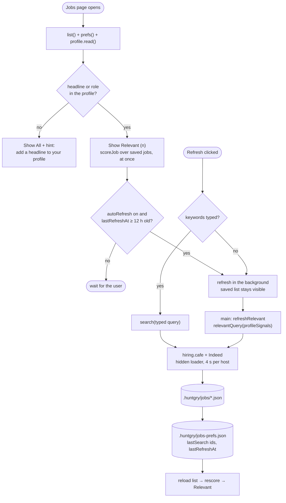
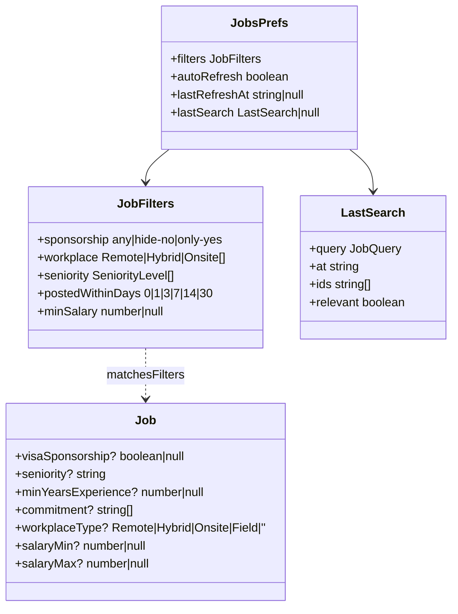

# #73 — Jobs: Relevant view, Refresh, auto-refresh and visa / workplace / seniority / date / salary filters

Issue: [silentashish/huntgry#73](https://github.com/silentashish/huntgry/issues/73) · Builds on #10 (job boards, `10-job-boards.md`)

## Context & problem

The issue was filed as a bug: "the job listing section is not being updated and is missing some major filters". The
owner asked for an H-1B / visa sponsorship filter and more of what hiring.cafe offers (seniority, workplace type, date
posted, salary), for a **Relevant** view built from the master profile, for that view to be the default when Jobs
opens, and for a **Refresh** option.

**Why the list "did not update".** Nothing failed. There was simply no refresh:

- On open the page read the saved jobs (`.huntgry/jobs/*.json`) and nothing else. New board data came in only when
  the user typed keywords and clicked Search (#10 decided "search on demand only").
- "Last search" lived in component state. `JobsPage` unmounts on navigation, so every visit came back to **All**:
  every job ever saved, sorted by posting date. Saved jobs never age out, so it was the same pile each time (the
  issue's screenshot: "63 of 63 saved jobs").

**Why there were no sponsorship or seniority filters.** hiring.cafe's search data already carries
`visa_sponsorship`, `seniority_level`, `min_industry_and_role_yoe`, `commitment`, `workplace_type` and numeric pay.
The parser folded some of these into the description text and dropped the rest. `Job` had no fields for them.

## What changed and why

| Area | Files | Why |
| --- | --- | --- |
| Model | `src/shared/jobs-types.ts` | `Job` gains optional `visaSponsorship`, `seniority`, `minYearsExperience`, `commitment`, `workplaceType`, `salaryMin` and `salaryMax`. They are optional, so the jobs already saved still load. New API methods: `refresh`, `prefs` and `setPrefs`. |
| hiring.cafe parser | `src/main/jobs/sources/hiringcafe.ts` | Fills the new fields from `v5_processed_job_data` (`null` / `''` when the board does not say). The description text is unchanged. |
| Cross-board merge | `src/main/jobs/store.ts` (`canonicalize`, `mergeFacts`) | A job found on both boards keeps every fact either copy knows: the first known value wins, and sponsorship is `true` if any copy says so. Before this, `canonicalize` copied only description, salary, location, tags and tailored state. |
| Filters | `src/shared/job-filters.ts` | `matchesFilters`, a pure function over saved jobs: sponsorship *Any / Hide "no sponsorship" / Only sponsors*, workplace (Remote / Hybrid / Onsite), seniority, posted within 1–30 days, and a minimum yearly salary. `sponsorshipFromText` gives a three-state reading of a posting. Fallbacks cover jobs without the fields: seniority from the title ("Senior", "Staff", "Junior"), workplace from `remote`, pay parsed from the salary text. `matchesLocation` moved here from the hiring.cafe adapter so relevance can use it as well. |
| Relevance | `src/shared/job-relevance.ts` | `profileSignals(profile)` returns the target titles (headline, then the two most recent roles, shortened), the skills with evidence (knowledge graph, gaps excluded), the location, years of experience, and whether the person needs a visa sponsor (from Work authorization and Gaps). `scoreJob` scores a job out of 100 (title 35, skills 35, seniority 10, location 10, recency 10) and returns readable reasons. `relevantJobs` keeps the matched jobs that score at least 40 and are not excluded (dismissed, or "no sponsorship" when a sponsor is needed). `relevantQuery` builds the board search used by Refresh. |
| Preferences | `src/shared/jobs-prefs.ts`, `src/main/jobs/prefs.ts` | `.huntgry/jobs-prefs.json` per workspace holds the filters, the auto-refresh toggle (**on** by default), the last search's ids and the last refresh time. The renderer may change only the filters and the toggle (`normalizePrefsPatch` refuses anything else), and the file is normalized on read. Writes are serialized per workspace, so a filter change and a finishing search cannot overwrite each other. |
| Service / IPC | `src/main/jobs/{service,ipc}.ts`, `src/preload/jobs.ts` | `searchJobs` records the ids it returned, so "Last search" survives leaving the page. `refreshRelevant` reads the master profile in main, runs the profile-derived search and records `lastRefreshAt`, even when a board was blocked (so a blocked board is not retried on every open). One refresh runs per workspace at a time, and a second request joins it. The automatic refresh on open (`auto: true`) is decided in main against the saved preferences and returns `null` when not due, so reopening Jobs during a refresh, or opening a second window, cannot start a second pair of board loads. New channels `jobs:refresh`, `jobs:prefs` and `jobs:set-prefs`, with inputs validated in main (`validateSources`, `normalizePrefsPatch`). |
| Jobs page | `src/renderer/src/pages/jobs/{index.tsx,view.ts,JobFiltersBar.tsx,labels.ts}` | Opens on **Relevant (n)**, scored from the saved jobs at once, with the reasons under each card. With no headline or role it opens on **All** and shows a hint linking to the master profile. A **Refresh** button: with no keywords it searches for the profile's headline near its location, otherwise it re-runs the typed search. A "Relevant jobs updated 5 min ago" line. A filter row with the auto-refresh toggle, shown even when no job is saved yet. "Sponsors visa" / "No sponsorship" badges. A "Last search (n)" segment (or "Last refresh (n)") that survives navigation. |
| e2e | `e2e/tests/jobs.spec.ts`, `e2e/pages/jobs.ts`, `e2e/fixtures/servers/pages.ts`, `e2e/fixtures/workspaces/mocks/.huntgry/jobs-prefs.json` | See *How to test*. The `mocks` workspace turns auto-refresh off, so opening Jobs never loads the mock boards by itself. |

### Opening Jobs, Refresh and auto-refresh

### Data model

## Decisions and alternatives rejected

- **Owner decisions (context §9).** (1) "H-1B filter": when Work authorization or Gaps says a sponsor is needed,
  Relevant hides jobs whose text refuses sponsorship. A separate filter offers *Only sponsors* as an opt-in. (2)
  **Auto-refresh on open is on by default**, which differs from the recommended default. It runs only when the last
  relevant refresh is at least 12 h old, in the background, and the saved relevant jobs show at once. It can be turned
  off with a toggle saved per workspace. This revises #10's "search on demand only" to "on demand, plus at most one
  profile search every 12 h". (3) The Relevant query comes from the headline (or the latest role) and the profile
  location ("Remote" means remote only), on both boards. (4) No model call: scoring is local and deterministic. (5)
  Threshold 40/100: Relevant stays short, and All still lists everything. (6) Preferences are per workspace, in a file.
- **The board's `visa_sponsorship: false` is not treated as "no".** hiring.cafe reports `false` for postings that
  don't mention sponsorship at all; the recorded fixture has `false` on every hit. Treating it as a refusal would hide
  most jobs. So `true` from the board is trusted, while "no" comes only from the posting's own words ("unable to
  sponsor", "without sponsorship", "US citizens only", a clearance). Unknown passes *Hide "no sponsorship"* and fails
  *Only sponsors*.
- **Filters run locally, and no unverified searchState keys are sent.** Third parties describe hiring.cafe keys for
  date, seniority, salary and years of experience, but we have verified only `searchQuery` and `workplaceTypes` (our
  own working code). A wrong key can silently return zero results. Filtering the parsed and saved jobs locally is
  always correct and works the same for Indeed and for jobs added by URL. A unit test asserts that the refresh
  searchState holds only the verified keys.
- **A title match on generic words alone ("Engineer") is not relevant.** Generic title words weigh 0.3. A job also
  needs a specific title word or at least one skill in common, so "Mechanical Engineer" near you this week does not
  pass for a backend profile on location and recency points.
- **Scoring in the renderer, refresh in main.** The renderer already reads the profile, and scoring needs no IPC, so
  the list rescores at once when jobs change. The refresh query is built in main from the profile on disk, so the
  renderer cannot steer it.
- **Rejected: a separate "relevant jobs" store.** Relevant is a view over the saved jobs, and Refresh saves into the
  same store, so tailored and dismissed state, cross-board merges and the phone projection (#40) keep working as they
  did.
- **Rejected: localStorage for the filters.** Workspace files are the app's pattern, and they follow the workspace,
  not the machine.
- **Auto-refresh is decided and deduplicated in main, not per page instance** (review on #75). `lastRefreshAt` is
  written only when the boards finish. A per-page guard would let a reopened page start a second refresh while the
  first one was still loading.
- **A clearance counts as "no sponsorship" only when required.** "Must hold / obtain", "active clearance" and
  "clearance required" count; a sentence that waives it ("no clearance required", "a plus", "preferred") does not.
  For the profile, an explicit "no sponsorship needed" outweighs a bare visa status ("H-4 EAD"), while an explicit
  "needs sponsorship" outweighs both.
- **The last refresh time is recorded even when a board is blocked.** Otherwise a board stuck behind Cloudflare would
  get a new load on every open. The user can still click Refresh.

## How to test

- Unit (`npm test`):
  - `src/shared/job-filters.test.ts`: `sponsorshipFromText` cases from the acceptance criteria, `sponsorshipOf`
    ignoring the board's `false`, the seniority, workplace, posted and salary filters (unknown values, old jobs), and
    `normalizeFilters` rejecting bad values.
  - `src/shared/job-relevance.test.ts`: `needsSponsorshipFrom`, `profileSignals` (headline and roles, gaps, a
    "Remote" location, empty profile), `scoreJob` ordering and reasons, the exclusions, and seniority versus years.
  - `src/shared/jobs-prefs.test.ts`: the 12 h staleness rule, on by default, the preferences file normalized, and
    renderer patches refused or normalized.
  - `src/main/jobs/jobs.test.ts`: parser fields from the recorded fixture plus a `visa_sponsorship: true` hit, the
    canonical merge of the facts, the last search recorded, refresh with the profile query (only verified
    searchState keys, `lastRefreshAt` written even with a blocked board), and serialized preference writes.
  - `src/renderer/src/pages/jobs/view.test.ts`: segments with filters, the default segment, and the `since` label.
- e2e (`e2e/tests/jobs.spec.ts`, CI): Jobs opens on Relevant ranked from the saved jobs with no board request.
  Refresh with an empty keyword box searches "Backend Engineer" near Portland and lists the new jobs. *Only sponsors*
  keeps only the sponsoring mock hit, and the filter and "Last search (4)" survive navigating away. Auto-refresh,
  once turned on, refreshes once on the next open (each board loaded once even when Jobs is left and reopened during the refresh) and not again within 12 h. With no saved job the auto-refresh toggle is still there. A profile without headline or roles opens
  on All with the hint. The existing specs now switch to All.
- In the app: open Jobs with a filled profile. It shows Relevant at once and, if the last refresh is older than 12 h,
  reads the boards in the background ("Refreshing relevant jobs…", then "Relevant jobs updated just now"). Set *Visa
  sponsorship → Only sponsors*, go to Dashboard and back: the filter is still set.

## Follow-ups (separate issues, not this PR)

- **Model-based relevance**: an on-demand "Rank with AI" that has the agent score or rerank the top N against the full
  CV, cached per job. Too slow and costly to be the default.
- **hiring.cafe server-side filters** for date, seniority, visa, salary and years of experience, once their
  searchState keys are verified live (a browser session or a DevTools capture), plus **pagination** (`page=` /
  `ssrTotalCount`) to go past the ~100 hits of the first page.
- **Company size and industry filters** (need `enriched_company_data` fields that our fixture strips).
- **A `jobs.changed` event**, so the list updates live when the pipeline, the phone (#40) or another window changes
  jobs.
- **Age-out or archive of stale saved jobs**, e.g. hide jobs older than 60 days unless tailored.
- **Several saved relevant queries**, e.g. two target titles, or an editable query separate from the headline.
