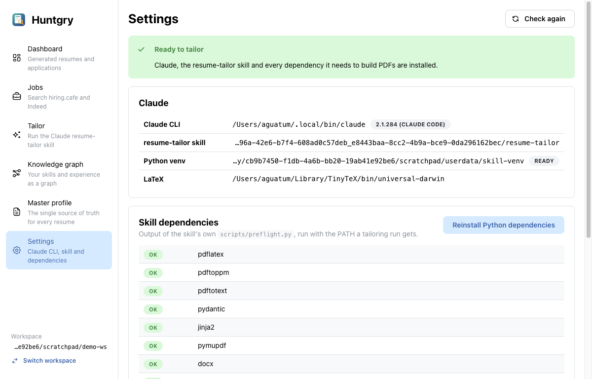
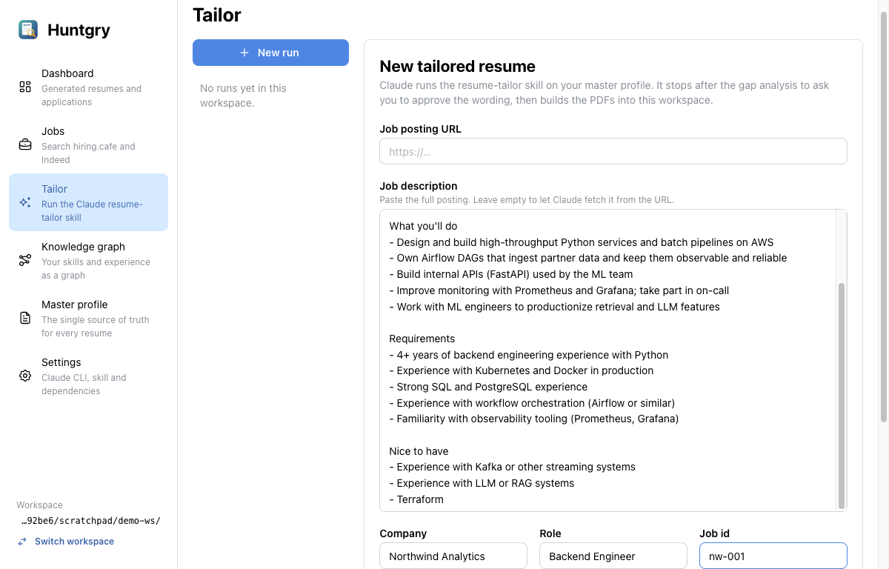
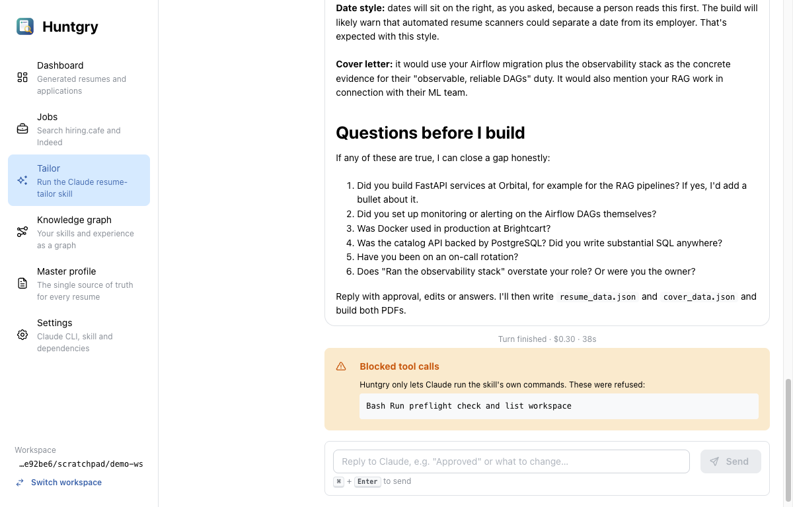
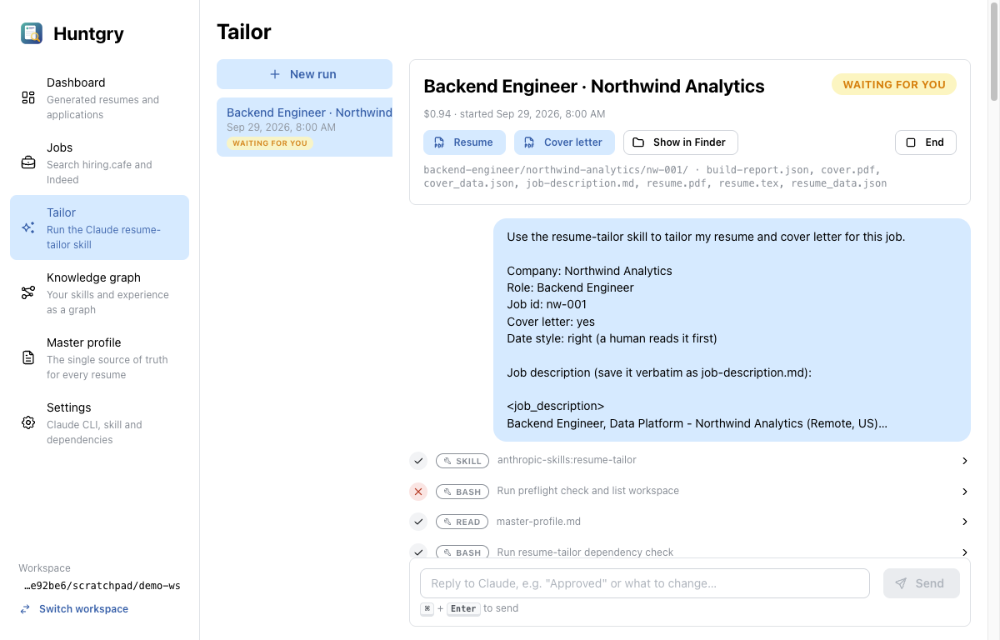
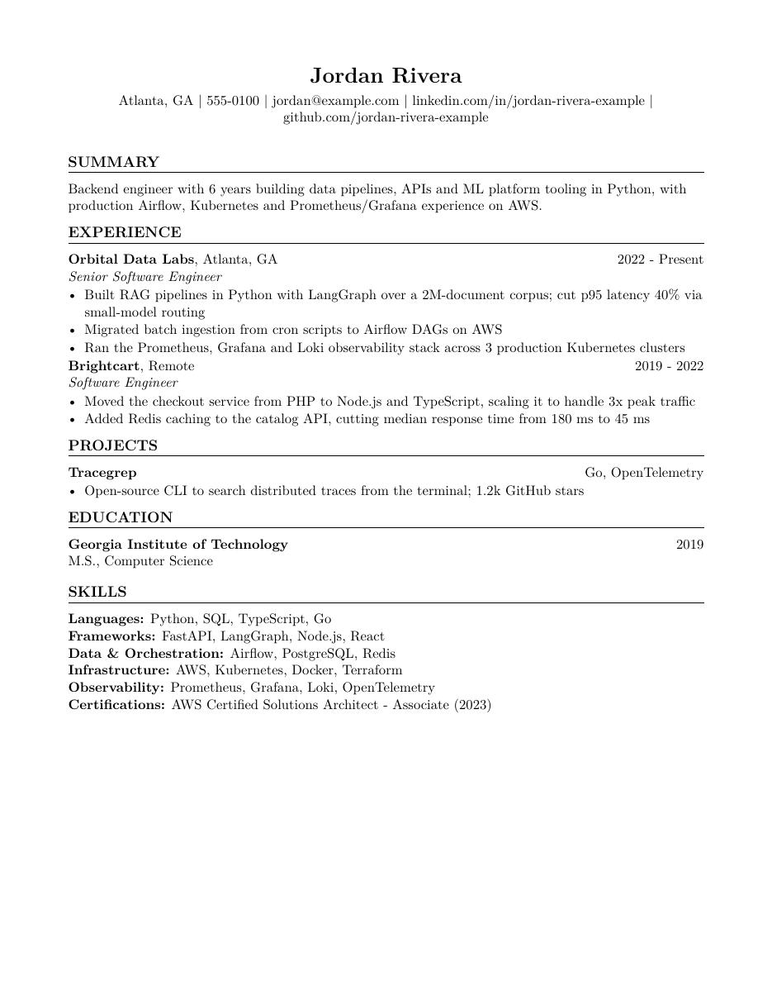

# #8 — Run the resume-tailor Claude skill inside Huntgry

Issue: [silentashish/huntgry#8](https://github.com/silentashish/huntgry/issues/8) · Epic: #1 · Follows #7

## Context & problem

The architecture's core arrow is **claude cli → Resume Generator Skill → custom resume +
cover letter → local storage**. Until now the skill ran only from a terminal, and on the
dev machine it could not build a PDF at all: `pdflatex`, poppler and the Python modules
were missing. Huntgry had to run the skill itself, against the open workspace, as a
conversation the user can follow and answer. The skill stops at step 3 to ask for
approval, so a one-shot `claude -p` is not enough.

## What changed and why

| Area | Files | Why |
| --- | --- | --- |
| Environment | `src/main/cli/env.ts`, `environment.ts` | Finds `claude` (well-known folders, the login-shell PATH, then the app's PATH, since a GUI app starts with a minimal PATH), the installed skill (bounded search under `~/.claude/skills` and `~/.claude/plugins`; personal beats synced), and TeX (TinyTeX, then BasicTeX/MacTeX). Builds the child env: the venv's `python3` first, then TeX and the CLI folders, `CV_HOME` = workspace; nested-session variables (`CLAUDECODE`, `CLAUDE_CODE_*`) removed. Runs the skill's own `scripts/preflight.py` with that env and parses it. Installs the Python modules into `<userData>/skill-venv`. |
| Command | `src/main/cli/command.ts` | `claude -p --input-format stream-json --output-format stream-json --verbose --permission-mode acceptEdits --permission-prompts none --allowedTools … --add-dir <skill>` plus an appended system prompt (Huntgry context, CV_HOME, master profile, "stop at step 3", "end with the output folder"). The first message holds the job and the options. Input validation for the start form lives here so it is unit-tested. |
| Runner | `src/main/cli/runner.ts` | `RunManager`: one `claude` process per run, **kept alive between turns** so replies go straight to stdin. A run whose process is gone (finished, app restarted) is resumed with `--resume <session-id>`. Every stdout line goes to `events.jsonl` and to the renderer. After each turn it looks for the application folder the skill wrote. Stop sends SIGTERM (SIGKILL after 3 s); Finish closes stdin. |
| Storage | `src/main/cli/runs.ts`, `workspace/constants.ts` | `<workspace>/.huntgry/runs/<id>/run.json` (summary, atomic writes) + `events.jsonl` (append-only raw stream). No database; runs travel with the workspace. `.huntgry` is ignored by the workspace scan. |
| IPC / events | `src/main/cli/ipc.ts`, `src/preload/runner.ts`, `src/shared/runner-types.ts`, `events.ts`, `api.ts` | `window.huntgry.runner.*` plus the `runner:event`, `runner:run` and `runner:install-log` events (the per-feature pattern from #7). Main builds every path and command; the renderer sends form fields and run ids (pattern-checked). Output files can be opened only if they are in the run's list and inside the workspace. `before-quit` kills every child. |
| Transcript | `src/shared/transcript.ts` | Pure fold of raw events into chat items (user, assistant Markdown, tool calls with status/output, turn results with cost and **refused tool calls**, notices). The same function renders live runs and past runs read from disk. Unknown event types are ignored. |
| Tailor page | `src/renderer/src/pages/tailor/*` | Start form (URL and/or pasted description, company/role/job id, notes, cover letter, date style; pre-filled from `navigate('tailor', {...})`), run list, and run view: live transcript, reply box (⌘+Enter), status, cost, End (finish / stop), and Resume / Cover letter / Show in Finder once the PDFs exist. Warns before starting when dependencies are missing. |
| Settings page | `src/renderer/src/pages/settings/index.tsx` | Claude path and version, skill path, venv, TeX, the preflight table, **Install Python dependencies** with a live log, and install instructions for TeX/poppler. |

```mermaid
sequenceDiagram
    participant UI as Tailor page
    participant M as main: RunManager
    participant C as claude -p (stream-json)
    participant S as resume-tailor skill
    participant W as workspace
    UI->>M: runner.start(form)
    M->>W: .huntgry/runs/<id>/run.json
    M->>C: spawn (cwd + CV_HOME = workspace, venv/TeX PATH)
    M->>C: stdin: first message (job + options)
    C->>S: Skill → JD, gap analysis
    C-->>M: stdout events (appended to events.jsonl)
    M-->>UI: runner:event / runner:run (status: waiting)
    UI->>M: runner.reply("Approved …")
    M->>C: stdin: reply (same process; --resume if it is gone)
    S->>W: <role>/<company>/<job-id>/resume.pdf, cover.pdf
    C-->>M: result
    M->>W: find output folder → run.json
    M-->>UI: Resume / Cover letter buttons
```

## Decisions and alternatives rejected

- **Headless stream-json, not a terminal.** Embedding the interactive TUI (node-pty +
  xterm) would show everything, but the app could not tell when the run waits for the
  user, what it cost, or where the output went. It would also add a native module to
  build. Stream-json gives structured events, and multi-turn works by keeping stdin open.
- **Deny by default.** `--permission-prompts none` means nothing can hang on a prompt
  nobody sees. The allowlist is the skill's actual needs: file tools, WebFetch/WebSearch
  for the posting and company research, and `python3`/`mkdir`/`ls`/`cat`/`cp`/`cd`/poppler/
  `pdflatex`. `--dangerously-skip-permissions` was rejected. Refused calls appear in the
  transcript, and Claude has recovered from them in testing.
- **Runs in the workspace, the venv in userData.** Runs are records of applications and
  belong with them. The venv is machine-specific and shared by every workspace.
- **Markdown via `react-markdown` + `remark-gfm`** (new dependencies): Claude's gap
  analysis uses headings, lists and tables. The renderer has no `dangerouslySetInnerHTML`.

## How to test

```bash
npm test && npm run typecheck && npm run build
```

Unit and integration tests: `src/main/cli/cli.test.ts` covers preflight parsing, the child
env, skill discovery, the command line, prompts, input validation, the line buffer, the
transcript (including a recorded real `claude` turn) and output-folder detection.
`src/main/cli/runner.test.ts` drives `RunManager` against `fixtures/fake-claude.mjs`, a fake
`claude` that speaks stream-json. It covers the first turn, replies in the same process,
output detection, finish then resume, stop, and a crash with the stderr tail.

Manual, as done for this PR, with a demo workspace (fictional profile) and a pasted
Backend Engineer posting:

1. **Settings** → everything OK (TinyTeX, poppler, venv).
2. **Tailor** → paste the description, company/role/job id → *Start tailoring*.
3. Claude runs the skill, saves `job-description.md`, and stops with the gap analysis,
   the proposed reframings and six questions (≈$0.30, 38 s).
4. Reply "No to 1–5 … approved, build both" → it writes the payloads, compiles and
   verifies: `backend-engineer/northwind-analytics/nw-001/` with `resume.pdf`,
   `cover.pdf`, `build-report.json` (`ok: true`), in ≈$0.94 total. The gaps answered "no"
   stayed open; nothing was invented.
5. Quit the app → no `claude` process is left. Relaunch → open the run → reply → the same
   session (same id) continues with its context.







## Known limitations / follow-ups

- Your global Claude Code hooks still apply to the child. On the dev machine an `rtk` hook
  rewrote `ls` to `rtk ls`, which the allowlist refused; Claude retried with a plain
  command. Adding a wrapper like `rtk` to the allowlist would allow any command, so it is
  left out on purpose.
- On macOS, closing the window keeps the app (and a running `claude`) alive, as macOS apps
  usually do. Quitting kills it.
- #9 (Dashboard) will list the generated applications; #10 (Jobs) will start runs through
  `navigate('tailor', {...})`.
