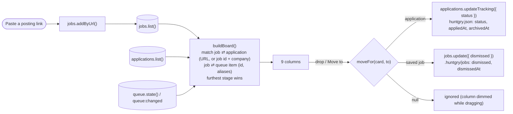

# #85: Board — one Kanban view of every job

Issue: [silentashish/huntgry#85](https://github.com/silentashish/huntgry/issues/85) (epic) · Tasks #86 (data), #87 (page), #88 (e2e and docs)

## Context & problem

A job's state was split across four pages. A saved posting was on **Jobs**, a run in progress on
**Tailor**, an unattended result on **Review**, and an application with its status on the
**Dashboard**. Answering "where does this job stand?" meant opening each page. The owner wanted
one board in the style of a Kanban board, with vertical columns: paste a link into *To do*, follow
the card through the other columns, and have an archived card leave the board after a week.

## What changed and why

| Area | Files | Why |
| --- | --- | --- |
| Tracking | `src/shared/applications-types.ts`, `src/main/applications/tracking.ts` | `archivedAt` (ISO time). `updateTracking` sets it when the status becomes `archived`, keeps it if the card is archived again, and drops it when the status leaves `archived`. It runs inside the existing per-folder lock and works like `appliedAt`. The renderer cannot write it (`requirePatch` does not allow it). |
| Jobs | `src/shared/jobs-types.ts`, `src/main/jobs/service.ts`, `store.ts` | `dismissedAt`, set by `updateJob({ dismissed: true })` (the first time only) and removed on restore. `mergeJob` keeps it when the same URL is added again. Every copy of a job on several boards gets it, the same way as `dismissed`. |
| Board model | `src/shared/board.ts` | `buildBoard({ jobs, applications, queue, now })` returns nine columns, one card per job, newest first. `moveFor(card, to)` returns the write behind a move, or `null`. `moveTargets(card)` lists the allowed columns. The module is pure and runs in the renderer on data the page already loads, so no new IPC or main-process state was needed. |
| Page | `src/renderer/src/pages/board/` | `BoardPage`: horizontally scrolling columns (`<section aria-label>`), with the paste-a-link box and *or paste the description* in To do. Cards can be dragged and dropped (native HTML5) and have a **Move to** menu. The job drawer, application drawer and bulk tailor modal are reused. The page reloads on `applications:changed`, `queue:changed` and window focus. `BoardCardView`: title, company, badges (queue status, build, review, applied date) and the next step (**Tailor**, **Open run** / **Reply**, **Review**). |
| Shell | `navigation.ts`, `AppLayout.tsx`, `App.tsx` | `board` right after `dashboard`. The app still opens on the Dashboard. |
| Jobs page | `src/renderer/src/pages/jobs/handoff.ts`, `index.tsx` | `prepareTailor` (fetch the full posting, mark tailored) moved out of the Jobs page, so the Board's job drawer hands a job to Tailor the same way. |

### Columns

| Column | Cards | Moves in |
| --- | --- | --- |
| To do | saved jobs, not dismissed, with no application and no working queue item | an archived job (restore) |
| Tailoring | queue items `queued` / `preparing` / `running` / `failed` | none (the queue runs it) |
| Waiting for review | queue items `needs-reply`; `generated` applications whose review is Unreviewed or Needs attention | none (Review runs it) |
| Ready to apply | `generated` applications with no review blocker | applications |
| Applied, Interviewing, Offer, Rejected | applications in that status | applications (a result waiting for review may go to Rejected) |
| Archived | `archived` applications, dismissed jobs, results discarded on Review; shown for 7 days | applications, To do jobs (dismiss) |

## Diagrams

Which card a job shows, best first: an application past `generated` › a working queue item › a
`generated` application › a failed queue item › the saved job.

## Decisions

- **Built in the renderer, not in main.** Everything the board needs is already exposed and
  validated: jobs, applications, the queue. A pure `buildBoard` is cheaper to test than a new IPC
  surface. If the phone (#40) wants the board later, the same function can run in the gateway.
- **"Disappears in a week" only hides the card.** Nothing is deleted. The application is still in
  the Dashboard's *Archived* filter, and the job is still under *Dismissed* on Jobs. Items archived
  before this change have no time recorded and fall back to the folder's last change (applications)
  or the time the job was saved (jobs), so old archives leave the board at once.
- **Moves are limited to ones that mean something.** Only the queue can put a card in Tailoring
  or Waiting for review, and those cards cannot be dragged. A result waiting for review may only
  go to Rejected or Archived, because Ready to apply would get past the review gate the Dashboard
  enforces through `reviewBlocker`. A result discarded on Review stays where it is.
- **Matching a job to its application.** First by posting URL, then by the folder's job id
  (`jobIdFor`) together with the company (letters and digits only), because short ids such as
  `demo-1` are not unique across companies.
- **No drag-and-drop library.** Native HTML5 events cover columns that do not change order. The
  **Move to** menu is the keyboard path and the one most tests use.
- **To do → Tailor opens the bulk tailor modal for one job.** The job is queued, so the card moves
  to Tailoring and later to Waiting for review on its own. *Tailor resume* in the job drawer still
  opens the Tailor page the way it does on Jobs.

## How to test

- Unit (`npm test`)
  - `src/shared/board.test.ts`: column per source, one card per job, the precedence rules,
    aliases, the 7-day cut-off (6 d 23 h shown, 7 d hidden, old items without a time) and every
    `moveFor` / `moveTargets` rule.
  - `src/main/applications/applications.test.ts`: `archivedAt` set, kept, cleared, set again;
    a bad value dropped.
  - `src/main/jobs/jobs.test.ts`: `dismissedAt` set once, kept by `mergeJob`, cleared on restore.
  - `src/renderer/src/pages/board/BoardCardView.test.tsx`: Tailor / Reply / Review next steps,
    Move to only on cards that can move, `draggable`.
  - `src/renderer/src/navigation.test.ts`: Board right after Dashboard.
- E2E: `e2e/tests/board.spec.ts` with the `BoardPage` page object. The `demo` workspace is seeded
  with a queued job, a job waiting for a reply, an Unreviewed result, a dismissed job, and results
  archived 2 and 8 days ago. Paste a link uses the mock server's `lever-style` posting. The tests
  cover columns, the hidden archive (still on the Dashboard and Jobs), paste a link, a refused
  link, Move to with `huntgry.json` asserted, drag and drop including a refused drop, dismiss and
  restore, locked cards, and the drawers. **The spec was written and typechecked but not run
  before merge, at the owner's request**; CI's e2e workflow runs it.
- Manual: open **Board**, paste a posting URL into To do, press **Tailor**, and watch the card go
  to Tailoring and then Waiting for review. Drag an application to Applied, then archive it.

## Follow-ups

- A drag between columns is not animated, and the order inside a column cannot be changed by hand.
- Filters on the Board (search, source) once the number of cards calls for it.
- Phone projection (#40): `buildBoard` could feed a board screen.
