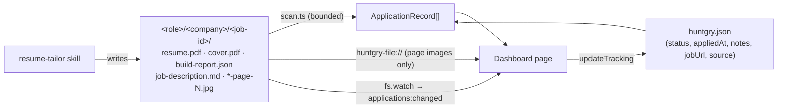
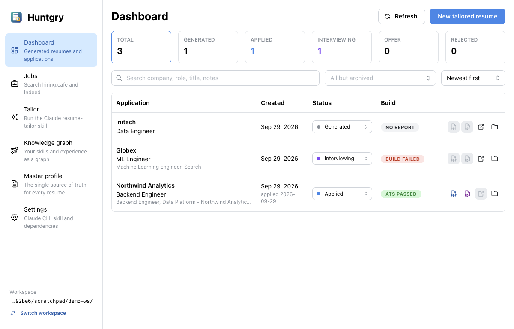
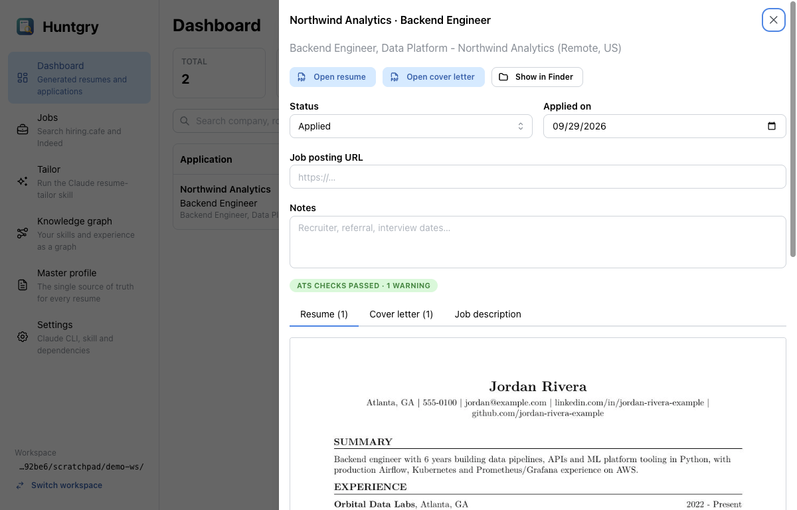

# #9 — Applications dashboard: generated resumes, cover letters and job posting links

Issue: [silentashish/huntgry#9](https://github.com/silentashish/huntgry/issues/9) · Epic: #1 · Follows #7

## Context & problem

The diagram's **Custom Dashboard with all the generated resume + link to job board**.
Every application the resume-tailor skill builds is a `<role>/<company>/<job-id>/` folder
in the workspace (`job-description.md`, `resume.pdf`, `cover.pdf`, `build-report.json`,
page JPEGs, …). The dashboard was a placeholder, and nothing tracked what happened to an
application after it was generated.

## What changed and why

| Area | Files | Why |
| --- | --- | --- |
| Scanner | `src/main/applications/scan.ts` | Bounded walk of the workspace (same entry budget and rules as the workspace inspection: hidden entries and `.huntgry` skipped, symlinked directories not followed, exactly three levels). Each folder becomes an `ApplicationRecord`: role/company from the slugs (`ml-engineer` → `ML Engineer`), job title (first heading/line of `job-description.md`), posting URL (tracking override, else the first URL in the description), files, page images in order, and the build summary from `build-report.json` (`ok`, failed hard checks, warnings, pages). Broken or missing files degrade to defaults. |
| Tracking | `src/main/applications/tracking.ts` | `<job folder>/huntgry.json`: `status` (generated, applied, interviewing, offer, rejected, archived), `appliedAt` (stamped the first time the status becomes *applied*), `notes`, `jobUrl`, `source`. Created lazily, written atomically, and validated on read and write. The skill's own files are never touched. `recordJobSource()` is exported for the Jobs board (#10) and the runner. |
| Preview | `src/main/applications/protocol.ts`, `src/renderer/index.html` | `huntgry-file://app/<role>/<company>/<job-id>/<file>` serves the page images the skill already renders to the sandboxed renderer. Only known file names inside a valid application folder of the **current** workspace are served; anything else is a 404. The CSP allows the scheme for `img-src` only. |
| Live refresh | `src/main/applications/watch.ts` | Recursive `fs.watch` (FSEvents on macOS) on the workspace, debounced 600 ms, hidden paths ignored → `applications:changed`. The page also re-lists on window focus. |
| IPC | `src/main/applications/ipc.ts`, `src/preload/applications.ts`, `src/shared/applications-types.ts` | `window.huntgry.applications.{list, updateTracking, readJobDescription, openFile, reveal, fileUrl}`. Ids are validated to the `<role>/<company>/<job-id>` shape inside the workspace; tracking patches are shape-checked. |
| Dashboard | `src/renderer/src/pages/dashboard/*` | Count cards per status (click to filter), search (company, role, title, job id, notes), status multi-select (archived hidden by default), sort. A table with an inline status select, build badge and actions (resume PDF, cover PDF, job posting, Finder). A drawer with status, applied date, posting URL, notes, build details, and tabs for resume pages, cover pages and the saved job description. An empty state points to Jobs / Tailor. |



## Decisions and alternatives rejected

- **Tracking next to the application, not in a central file or a database.** The folder
  is the record of the application: moving, copying or deleting it carries its status too,
  and it stays readable by hand. A central index would need reconciliation whenever
  folders change outside the app.
- **Preview the skill's page JPEGs, not the PDF.** Showing a PDF in the sandboxed renderer
  would mean Chromium's PDF viewer on a custom scheme (plugin flags, extra privileges).
  The skill already renders every page to JPEG for its own visual check, so the preview
  is just ``. **Open resume** hands the real PDF to the OS viewer.
- **Job description as plain text** in the drawer. It is the posting saved verbatim, and
  rendering it as Markdown would need a dependency this branch does not have. #8 adds
  `react-markdown`, which can be reused later.

## How to test

```bash
npm test && npm run typecheck && npm run build
```

Unit tests: `src/main/applications/applications.test.ts` covers the scan (fields, build
summary, page order, hidden/wrong-depth/symlinked folders, broken files), tracking (merge,
`appliedAt` stamping, clearing, source recording, invalid input), helpers, id confinement,
file URLs and the watcher's hidden-path filter. `src/renderer/src/pages/dashboard/filter.test.ts`
covers search, status filter and sort.

Manual, as done for this PR, on a demo workspace with a real skill-built application
(from #8's end-to-end run) plus two hand-made folders:

1. The dashboard lists all three with role/company, title, build badge (passed / failed:
   `fits_target_pages`) and PDF actions.
2. Setting a status in the table writes `huntgry.json` (applied → `appliedAt` = today);
   the values survive an app restart.
3. Creating a new application folder on disk shows up within ~1 s, without a refresh.
4. The drawer shows the resume page image through `huntgry-file://`. Requests for
   `huntgry.json`, `..` traversal (plain or encoded) and non-application paths are refused.




## Follow-ups

- #10 (Jobs board) calls `recordJobSource()` so applications show where they came from.
- #11 (Knowledge graph) adds a skills/gaps card to this page.
