# #40 / #41 / #42 — Pipeline, jobs, files and review on the phone

Issues: [#41](https://github.com/silentashish/huntgry/issues/41) (pipeline control), [#40](https://github.com/silentashish/huntgry/issues/40) (files and jobs), [#42](https://github.com/silentashish/huntgry/issues/42) (review, revision-bound) · Epic #33 · Spec: [ADR-0001](../adr/0001-mobile-remote-control-relay.md) · Builds on #38 (phone app), [41-phone-pipeline](41-phone-pipeline.md), [40-phone-files-jobs](40-phone-files-jobs.md), [42-phone-review](42-phone-review.md) (desktop gateway) · Design: Figma "📱 Mobile" page

## Context & problem

The desktop gateway answers `pipeline.*`, `jobs.*`, `file.get` and `review.*` and sends
`pipeline.changed`, `pipeline.finished`, `applications.changed` and `review.needed`. The phone
app from #38 still showed "Coming with the next update" on Review and Jobs, and its Home
pipeline card could only pause or stop. This change is the phone side of the three issues:

- **#41:** a Pipeline screen with live progress, the usage-limit wait and its reset time, why
  it paused or failed, Pause / Resume / Stop (offered from the status snapshot too, since the
  desktop sends no `pipeline.changed` until the state changes), the finished summary, and a start sheet for
  selected saved jobs.
- **#40:** a Jobs screen (`jobs.list` paged by 50, dismissed jobs flagged, search, **Add by
  URL**), and application files fetched with `file.get`, reassembled from their chunks,
  checked against the whole-file SHA-256 and opened in the OS viewer. Both refresh on
  `applications.changed`.
- **#42:** a Review list and detail. A decision echoes the revision the phone was served and
  only the reframing ids it listed. Approve unlocks only after page 1 of each preview of that
  revision loaded. `stale` and `denied` reload the result and never unpair.

None of it can approve, apply or submit more than the desktop allows: the desktop rebuilds and
checks everything, and the phone never offers what it would refuse.

## What changed and why

| Area | Files | Why |
| --- | --- | --- |
| Commands | `mobile/src/remote/commands.ts` | Builders for `pipeline.start`, `jobs.list`, `jobs.addUrl`, `review.list` / `get` / `approve` / `rerun` / `discard` and `file.get`, each through the package's `requireCommand`: a malformed id, a private or non-http(s) URL or an over-32-KiB answer throws on the phone, before anything is sealed or counted. Labels for the relay's "queued" list. |
| File reassembly | `mobile/src/remote/files.ts` | `FileDownload` asks for chunks in order and checks that each describes the same file (application, name, index, `of`, `bytes`, `sha256`, exact size). It reassembles the chunks and keeps the result only when its own SHA-256 equals the Mac's, and, for a review preview, the one the `ReviewDetail` listed for that revision. A file regenerated mid-download, a flipped byte or another revision's preview is refused and its bytes dropped. SHA-256 is `@noble/hashes`. |
| Review rules | `mobile/src/remote/review.ts` | `approvalGate`: the result must be Unreviewed or Needs attention, not `truncated`, and every required preview (each `*-page-1.jpg`, else the PDFs) held with the listed hash. `approvalIds`: only ids that detail listed, in its order, no repeats. `keepTicks`: a new revision keeps only ticks whose id (`sha256(fact + "\n" + wording)`) it still lists. |
| Pipeline form | `mobile/src/remote/pipeline.ts` | The start sheet's form → `PipelineStartInput`: saved job ids (≤ 100), an enum agent and a different fallback, concurrency 1–4, an optional budget ($1–$10 000, the desktop's range; runs 1–100), then the package guard. There is no field for a model, flag, path or prompt. The count badges, the ETA and the summary line ("18 built · 4 need review · 1 failed · 1 skipped"). |
| Model | `mobile/src/remote/model.ts` | State for jobs, reviews, review details and files, all in memory only. File downloads run one at a time, one chunk request after the other, which keeps within the relay's frame budget. `review.get` fetches the required previews against the listed hashes, and `review-notes.md` when the notes did not travel inline. Pipeline command results update the pipeline. Events: `applications.changed` refreshes the review list and the result on screen (a new revision says so); `review.needed` refreshes the list; `file.chunk` is handled like a `file.get` answer. A read the relay expired or found too large settles instead of spinning. |
| Relay client | `mobile/src/remote/relay.ts` | **Bug fix (#38 code).** A `denied` result was treated as "pair again" unless the phone still remembered a `review.*` command for it. After an app restart the phone forgets its commands, so a review decision queued at the relay and answered `denied` (the Mac restarted and forgot the served revision) would have wiped the pairing. Now `denied` is fatal for a known non-review command or for this session's own `hello` / `ping`. For a result the client no longer knows, it is acked and dropped: if the pairing really is gone, the next `hello` is denied. Test added. |
| Pipeline screen | `mobile/src/screens/PipelineScreen.tsx`, `src/app/(tabs)/pipeline.tsx` | Figma `19:224` / `19:894`, under the Queue tab as in the frame. The big readout shows the reset time (display/xl) while waiting for a limit and done / total otherwise, with the progress bar and count badges. The desktop's `reason` appears in a warning (limit) or danger (paused by an error) alert, with a failed-jobs alert while running. Pause or Resume, and Stop with a second tap to confirm. A pipeline command queued or expired on the relay says so. The last summary and the offline note are shown too. Without a pipeline: "Choose jobs". |
| Start sheet | `mobile/src/screens/PipelineStartSheet.tsx`, `src/ui/Sheet.tsx` | Opened from Jobs with the selected jobs. Agent and fallback chips (agents that are not ready are disabled), concurrency 1–4, an optional budget. A warning when a pipeline is already running (the desktop refuses a second one). After the start it opens Pipeline. |
| Jobs screen | `mobile/src/screens/JobsScreen.tsx` | Figma `19:444` / `19:1114`. Add by URL (the package's URL refusals in plain words; the desktop's own refusal as the Mac says it), search behind the filter button (`jobs.list` filter, debounced), cards with the tailored ring, "Dismissed on your Mac" flagged and dimmed, **Load 50 more** by cursor. Selected jobs can be queued (`queue.enqueue`, "Queue N selected", pinned under the list) or run unattended (the start sheet). |
| Review screens | `mobile/src/screens/ReviewListScreen.tsx`, `ReviewScreen.tsx`, `src/app/(tabs)/review.tsx`, `result.tsx` | List: state badge, open gaps, age, reason, pull to refresh, "and N more on your Mac". There is no "approve all". Detail (Figma `19:353` / `19:1023`): state and short revision, "ATS passed" / "Checks failed", page-1 previews, the reframings ticked one by one (source fact and wording in full), Approve (+N standing), Re-run with answers (≤ 32 KiB, same run), Discard (second tap: "files are kept"). Below the decisions: open gaps, the review notes, the verify report and the files. The reloaded notice explains `stale`, `denied` or a change on the Mac. A decided result shows its state and offers nothing. `/result?app=…` because application ids are folder paths. |
| Files screen | `mobile/src/screens/FilesScreen.tsx`, `src/app/(tabs)/files.tsx`, `src/state/share.ts`, `src/ui/PagePreview.tsx` | The result's PDFs (and notes when they did not travel inline), each with its size, progress, "checksum verified" or why it failed. **Open** writes the verified bytes to the app's cache and hands them to the OS viewer (`expo-sharing`: Quick Look / "Open in…" on iOS, the chooser on Android). Page previews appear in page order, two per row, with **Load all**. Copies in the cache are deleted at launch, and when the app comes back to the foreground once they are over 5 minutes old (the app that received one may still be reading it). |
| Home, Queue | `mobile/src/screens/HomeScreen.tsx`, `QueueScreen.tsx`, `src/ui/TabBar.tsx` | The Home pipeline card uses the real `PipelineState`: progress, "resumes 14:05" or the ETA, the running count and agent, the reason of a pause, Pause / Resume and Details. Without a state it shows the status's limit time, the last summary or how to start one. Tapping it opens Pipeline. Queue shows a row to the pipeline while one exists. `pipeline` sits under Queue; `result` and `files` sit under Review. |
| UI | `mobile/src/ui/Controls.tsx`, `Icon.tsx`, `theme.ts`, `src/app/_layout.tsx` | Checkbox, Input (`Field`), chips, a two-tap `ConfirmButton` (React Native's `Alert` does nothing on the web), section labels. Tabler icons moon, filter, link, file, file-text, share, search and others. display/xl (Bricolage Grotesque ExtraBold 56/60, loaded). |
| Demo mode | `mobile/src/state/demo.ts`, `demo-content.ts` | Sample jobs from the Jobs frame, three results (one needing attention) with the Figma reframings, SVG stand-ins for the page JPEGs, small PDFs, the Figma pipeline. Answers go through the model's own result handlers, so reassembly, the hash check, the approval gate and `stale` run in the demo too. `?demo=limit` (waiting for Claude's limit until 14:05), `?demo=idle` (no pipeline). |
| Dependencies | `mobile/package.json`, `package-lock.json`, `pnpm-lock.yaml` | `@noble/hashes` ^2.4.0, `expo-file-system` ~57.0.7, `expo-sharing` ~57.0.22 (the SDK 57 versions), in `mobile/` only. Both lockfiles regenerated (pnpm 12.5.1). |

## Decisions and alternatives

- **Previews are bound to the revision, not only to their own hash.** A page whose SHA-256 is
  intact but differs from the hash the `ReviewDetail` listed is a different snapshot (the Mac
  rebuilt it after the detail was served). It is refused, so it cannot unlock Approve for the
  older revision.
- **What Approve waits for.** Every `*-page-1.jpg` the detail lists; when it lists no previews,
  the PDFs. With no artifacts at all, the phone says "approve it on the Mac" rather than
  approving something it could not show.
- **A `truncated` detail is approved on the Mac.** The flag does not say which part was cut (a
  gap, the report, a reframing left out, extra pages). The phone cannot show "the full
  `ReviewDetail`" the issue asks for, so Approve is disabled with that line; Re-run and
  Discard stay. Alternative: allow it when only the report was cut. That needs a finer flag
  from the gateway.
- **`stale` and `denied` reload.** Both mean "decide again on what is shown now". The phone
  fetches `review.get` (which the gateway records as served) and shows why. Ticks are kept only
  for reframings with the same id, that is the same fact and wording. `denied` on `review.*`
  never unpairs; #38's split stays, plus the restart fix above.
- **One download at a time, chunk after chunk.** The relay closes a socket at 60 frames a
  minute. A 300 KB preview is 13 requests (acks ride on them when the client's ack queue
  allows), and the rate limiter in the client keeps room for the owner's commands. The desktop
  also answers at most 30 reads a minute per phone, and each chunk is one, so chunks are paced
  to 24 a minute (a 1 MB PDF takes about two minutes) and a chunk refused as `rate-limited` is
  asked for again 10 s later with the progress kept. A download for a hash a refreshed review
  no longer lists is replaced, and a late chunk of the old one is ignored. Files live in memory (at most 24,
  oldest first out, except the open result's page-1 previews), never in the secure store. A copy
  for the OS viewer lives in the cache until the next launch, or the first return to the
  foreground after 5 minutes.
- **SHA-256 from `@noble/hashes`.** It is pure JavaScript, so the same code runs on Hermes and
  in the Node tests. `expo-crypto` is native and asynchronous and would not run under vitest.
- **"Queue N selected" uses `queue.enqueue`** with cover letter on and dates right-aligned.
  These are the gateway's "Run unattended" defaults; the protocol requires options and the
  phone has no Tailor settings. The pipeline start sends no `options`, so the desktop's
  defaults apply.
- **Stop and Discard ask for a second tap** within 4 s, on the button itself, the same way on
  the phone and on the web.
- **The demo's previews are SVG.** A Mac sends JPEG; the SVG branch of `PagePreview` is only
  taken when `EXPO_PUBLIC_DEMO=1`. This keeps binary images out of the repo while the demo
  still runs through the real hash check.

### Where the design and the data differ

- **Pipeline (`19:224`).** The frame's "$3.20 of $10.00", "Switch waiting jobs to Codex now"
  and "Raise budget…" have no protocol support: `PipelineState` carries no cost or budget,
  there is no switch command, and `pipeline.resume` takes no arguments (41-phone-pipeline,
  "Follow-ups"). They are left out. The meta line is "5 of 20 jobs · started 17:14". The
  "Claude → Codex" eyebrow needs the fallback agent, which `PipelineState` does not carry, so
  it shows the agent only. "2 approved" is not a count the protocol has; failed, need a reply,
  skipped and cancelled badges were added. The frame shows only the waiting state; while
  running, the readout is "5/20" with the ETA. Pause / Resume is added, as the issue asks.
  The offline note says the real TTLs (a day; 2 h for a start), not "15 minutes".
- **Review detail (`19:353`).** "revision 2" became the short revision hash (the protocol has
  a hash, not a counter). The badge is "ATS passed" from `verify.ok` (the desktop's wording),
  else "Checks failed". Below the frame's content: the reason and parse warning, open gaps,
  notes, verify report, files, and the line under Approve saying why it is disabled. The
  source fact is shown in full (the frame cuts it to one line).
- **Jobs (`19:444`).** The frame's relevance score in the ring (92, 81…) is not in `RemoteJob`
  (the DTO is title, company, location, source, tailored, dismissed). The ring shows a check in
  ember for a tailored job and the company's initial otherwise. "18 relevant of 31" became
  "N saved · M tailored" (with "+" while more pages exist). The filter button opens a search.
  "Queue N selected" is pinned under the list, with "Run N unattended…" and Clear next to it.
- **No frames** for the Review list, the Files screen and the start sheet: they are built from
  the existing components (queue-card layout, Input, Checkbox, chips, a bottom sheet).

## How to test

Automated:

```sh
npm test -w mobile          # 90 tests (54 from #38 + 36 new)
npm run typecheck -w mobile
npm test                    # root: lockfiles, desktop, relay, mobile
npm run typecheck && npm run build
node scripts/check-lockfiles.mjs
```

New tests:

- `files.test.ts`: a 60 000-byte file reassembles from 24 576 / 24 576 / 10 848-byte chunks
  that pass the package's `requireFileChunk`; an empty file and an exact multiple; a flipped
  byte is rejected; another revision's hash is refused at the first chunk; a file regenerated
  mid-download stops; chunks out of order, of another file or application, with a wrong `of`
  or size are refused.
- `review.test.ts`: the approval gate (only every page 1 with the listed hash; the PDFs without
  previews; nothing to check; `truncated`; approved / discarded), approved ids (forged and
  repeated ids dropped, the detail's order), ticks across revisions.
- `pipeline.test.ts`: the form → `PipelineStartInput` passes the package guard; the
  refusals (no jobs, 101 jobs, concurrency 0 / 5, fallback = agent, budget out of range or
  text, a path as id), and the builder refuses a model or notes; badges, ETA, summary.
- `model-screens.test.ts` (fake WebSocket, fixture session key, fake desktop): `jobs.list`
  paging by cursor with `ws`, dismissed flagged, an old search's page dropped; add by URL (five
  bad URLs never leave the phone, the saved job is listed first, the desktop's refusal shown);
  `queue.enqueue`; a file fetched chunk by chunk with a 24 h TTL, kept in memory and not in the
  store, not fetched twice; a flipped chunk rejected with its bytes dropped; an expired
  `file.get` fails instead of hanging; `review.get` fetching the page-1 previews one at a time
  against their hashes; a preview of another revision refused; approve with the served
  revision and only listed ids, costly TTL, no double press; `stale` and `denied` reload and
  keep the pairing; `invalid` shows the Mac's message; `applications.changed` and
  `review.needed` refresh; `pipeline.start` (costly TTL, `ws`), `pipeline.changed` with the
  limit, pause, `pipeline.finished`; a desktop refusal shown as it says it.
- `relay.test.ts`: a `denied` for a command sent before a restart is not a re-pair.

Visual check (demo data): `npm run export:web -w mobile`, serve `mobile/dist` with an SPA
fallback, 390 × 844, both colour schemes. Jobs selected and the sheet opened, R1 ticked, all
pages loaded, scripted with Playwright as for #38.

| | Dark | Light |
| --- | --- | --- |
| Home (pipeline card) | 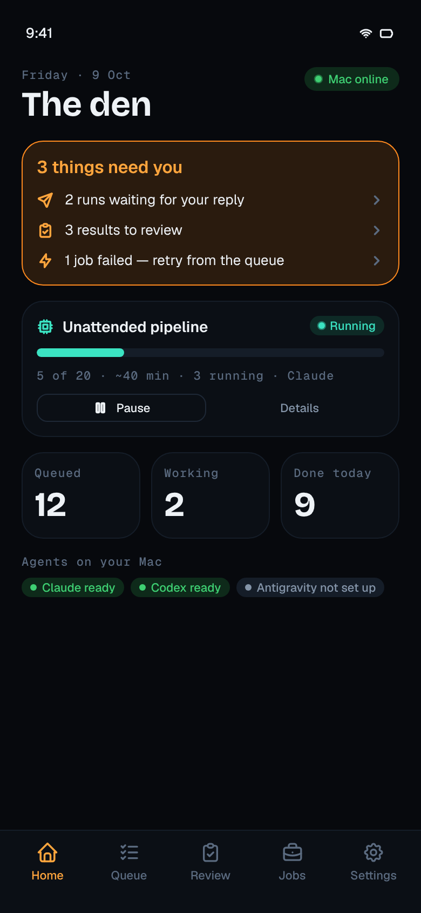 | 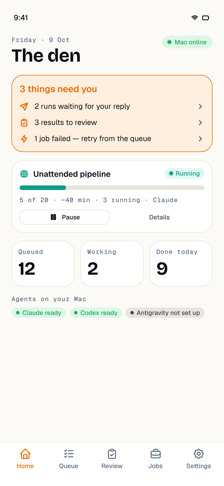 |
| Pipeline · running | 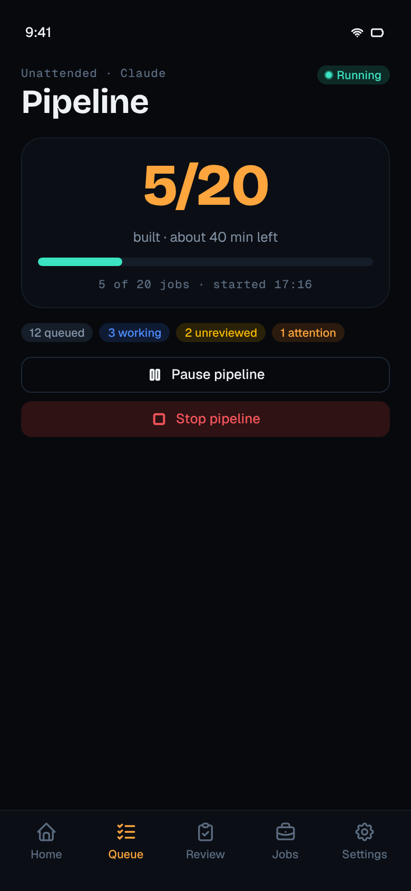 | 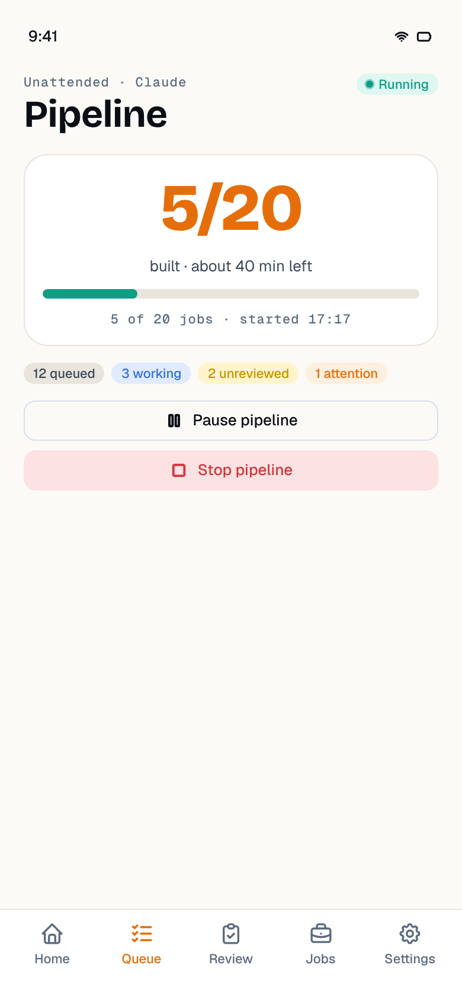 |
| Pipeline · usage limit (`?demo=limit`) | 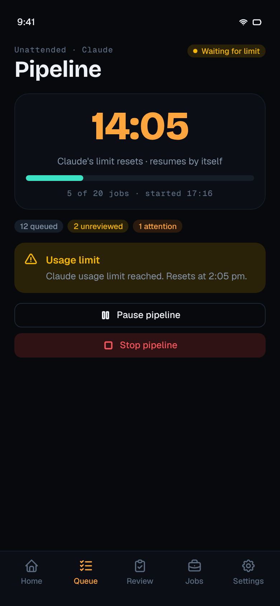 | 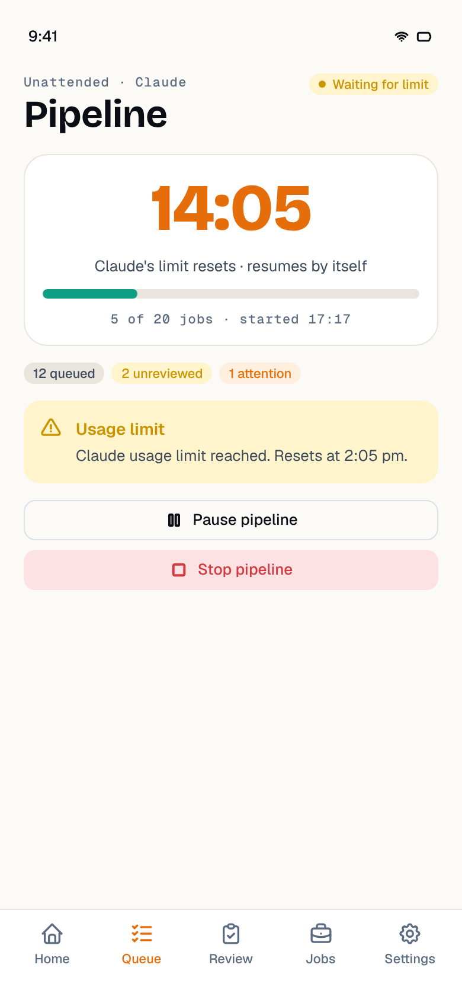 |
| Pipeline · none (`?demo=idle`) | 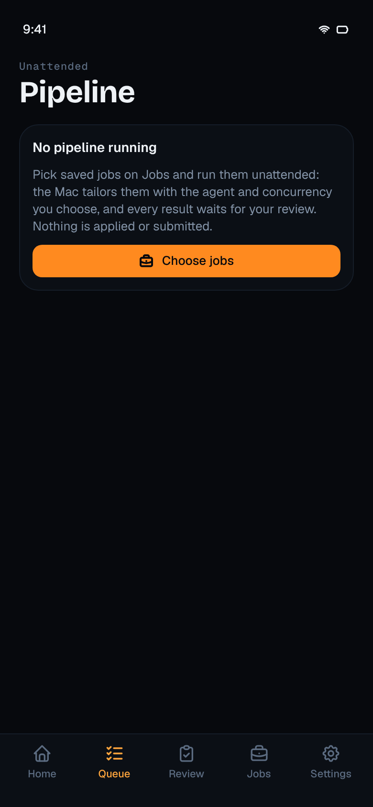 | 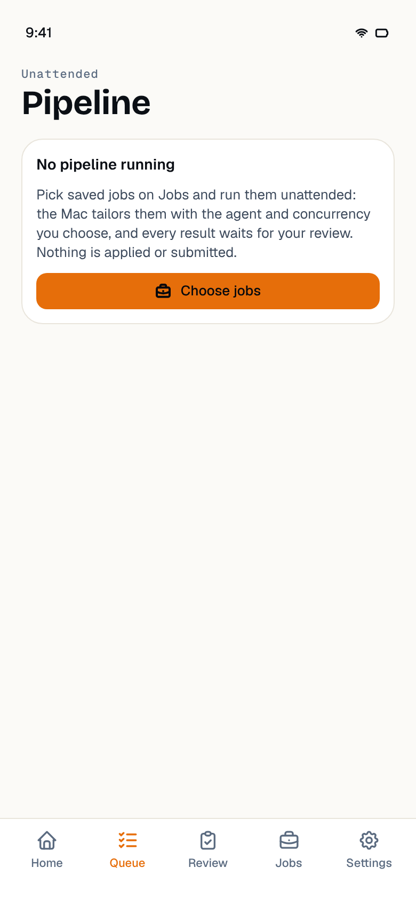 |
| Start sheet | 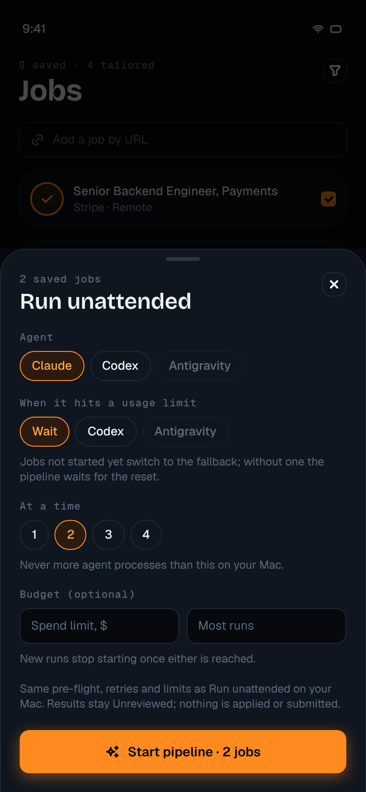 | 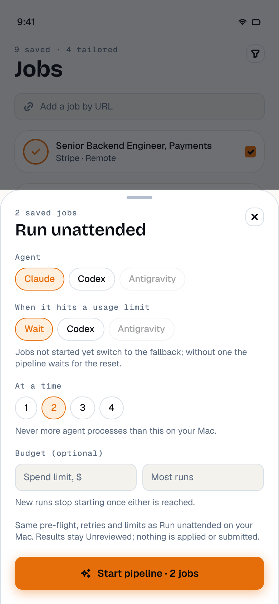 |
| Jobs | 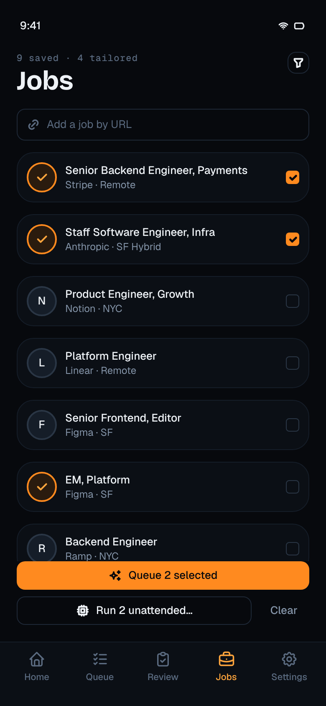 | 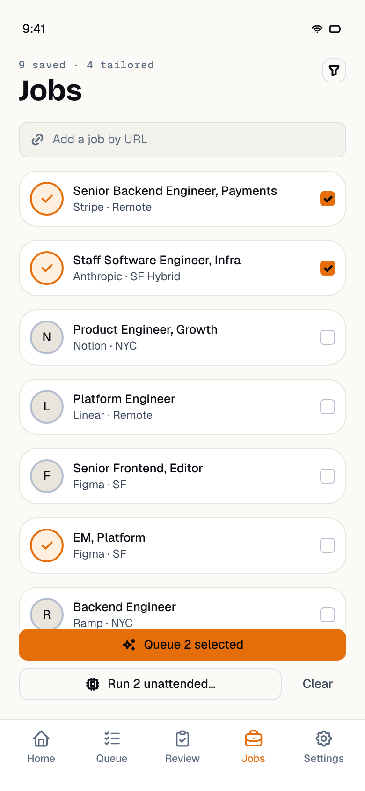 |
| Review | 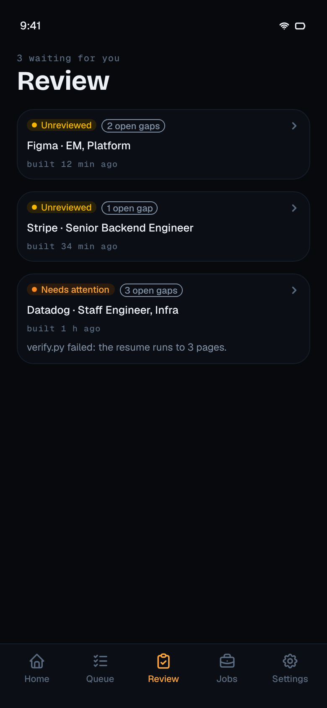 | 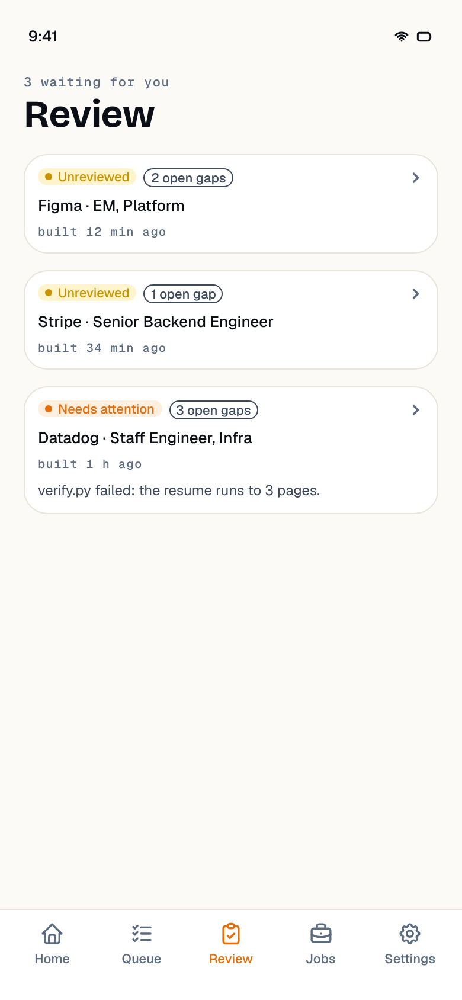 |
| Review detail | 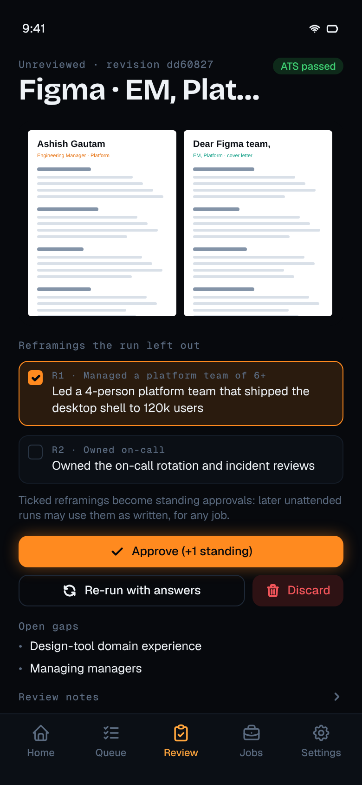 | 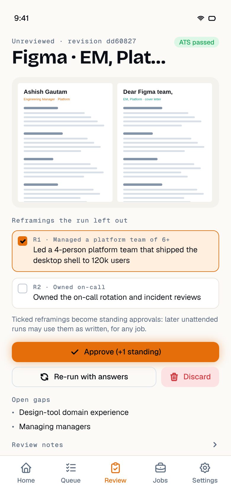 |
| Files | 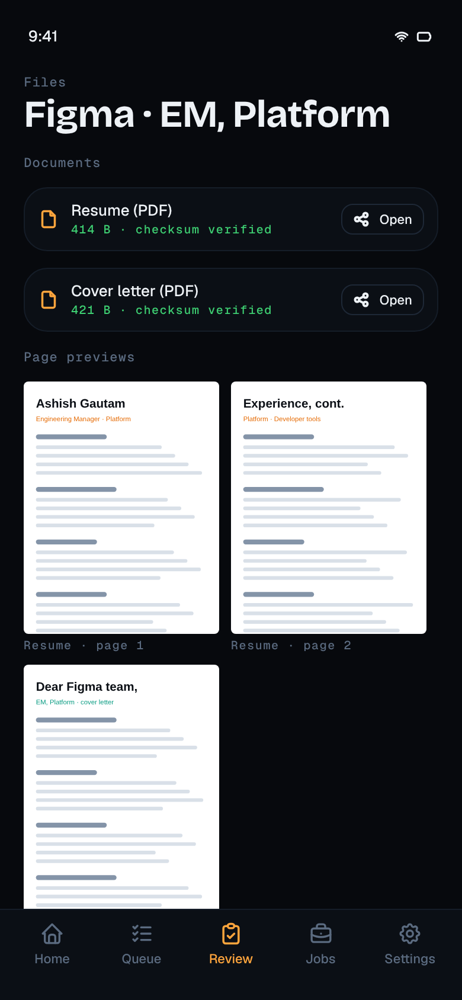 | 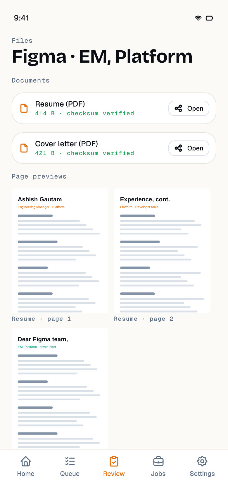 |

On a phone (not possible here: no macOS, Xcode or device). `expo-sharing` and
`expo-file-system` are native modules, so build again with `npx expo run:ios --device`. Then
start a 3-job pipeline from Jobs on the demo workspace, lock the Mac, watch the limit and
summary, and pause / resume. Open a result, wait for both page-1 previews, tick one
reframing, approve, and check `approved-reframings` on the Mac. Rebuild the PDF on the Mac
and approve again from the phone: it must reload with the "changed" notice. Open
`resume.pdf` and compare it with the desktop preview. Add a public posting URL and see it on
the Mac's Jobs page.

## Follow-ups

- A read command `pipeline.get`: after an app restart the phone has only the status
  (`{ status, until }`) until the next `pipeline.changed`. That is usually within a minute,
  but not when the pipeline is paused.
- `PipelineState` could carry the fallback agent and the spend so far (the Figma meta line).
- A finer `truncated` (which parts were cut), so a detail with only a shortened verify report
  could be approved from the phone.
- Manual end-to-end run on a device with the deployed relay.
